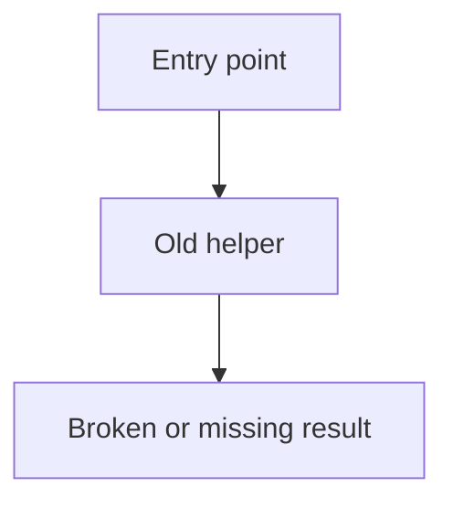
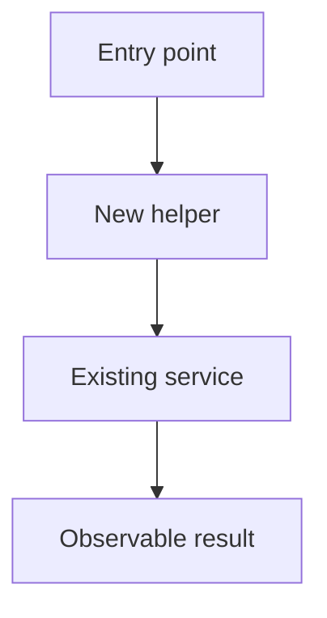
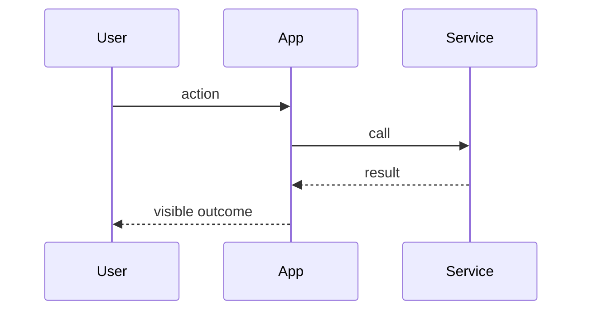

# Walk through landed code

This skill is the counter-equivalent of `$generate-spec-v2`. That skill writes a spec for work that has not happened yet. This skill writes a walkthrough of work that already landed.

Do not plan, spec, or phase future work. Read the diff and the current code, then explain what changed and how it runs now.

## Research the landed change

1. Read the request and repository instructions.
2. Collect the change: `git diff`, `git diff --cached`, `git log`, and the files those commands name. If the user points at a branch, PR, or commit range, use that range.
3. Trace each changed runtime path far enough to show an accurate call stack and code diff. Name real files and symbols.
4. Read external docs only when a dependency or API is part of the landed change. Record the links used.

Use the amount of research the change needs. Do not impose a fixed research process.

## Write the markdown file

Choose a short kebab-case name. Create a temp directory and write one markdown file there. Do not write walkthroughs into `specs/`.

```sh
mkdir -p /tmp/code-walkthrough-<name>
```

Write `/tmp/code-walkthrough-<name>/walkthrough.md`. Use this structure. Interleave chapter prose with Mermaid, call-stack diffs, code diffs, file excerpts, and HTML. Do not dump every artifact into one section at the bottom.

````md
# <Name of the landed change>

## Problem

Explain the problem that existed before the change, in a few plain sentences. Add a Mermaid diagram when it makes the old path clearer.



## Solution

Explain what landed and why that design, in a few plain sentences. Write in the past tense. Add a Mermaid diagram when it makes the new path clearer.



## User flows

After Solution, add a Mermaid `sequenceDiagram` for each main user-visible flow (happy path and the other paths a user actually takes). Name participants that exist in the landed design. Keep node text short. Skip this section only when the change has no user-facing sequence.



## Goals

- State a user-visible or system-level result that is true after the change.

Out of scope:

- State what this walkthrough does not cover.

## <One outcome that is now true>

No `Chapter:` prefix. The heading is the outcome name only.

Explain this slice in one or two sentences. Then show the evidence, in any order the reader needs:

### Important types

Current types, not proposed types. Prefer a file excerpt so the viewer reads the file from disk:

```12:20:path/to/types.ts
```

The fence info string is `start:end:repo-relative-path`. Line numbers are 1-based and inclusive. Leave the body empty to load the current file. Put the excerpt in the body only when the walkthrough must show text that is not on disk.

### Call stack diff

Show how this slice changed the call path. Keep the entry point and enough parents to make ownership clear. Use a `callstack` fence, or a `diff` fence that contains `└──` / `├──`. Call stacks render without a Pierre file header.

Put a `#` comment on a stack line when the symbol name is not enough: why the call is there, what it returns, or a surprising side effect. Trailing `#` on the same line is the usual form. A line that is only `# …` is fine when the note covers the next step, not one symbol. Skip comments on lines that already read as the behavior.

```callstack
 requestHandler
-└── existingService
-    └── dataStore
+└── validateInput  # tagged error, no throw
+    └── existingService
        └── dataStore
# store write is unchanged
```

### Code diff

Show a unified diff of the main edit. Use real file and symbol names. A complete `--- a/` / `+++ b/` patch is best. A generate-spec-v2 preview diff is also valid; the viewer wraps it. Diffs with a file path keep Pierre’s file header. Diffs with no path have no header.

```diff
--- a/path/to/handler.ts
+++ b/path/to/handler.ts
@@ -10,7 +10,9 @@
 async function requestHandler(input: ImportantInput) {
-  return existingService(input);
+  const valid = validateInput(input);
+  return existingService(valid);
 }
```

You may also tag the path in the fence info string: `diff:path/to/handler.ts`.

### HTML

Use an `html` fence, or write HTML in the markdown, for callouts, tables, and small diagrams that are not Mermaid. HTML from this file is trusted local content. tkstack does not sanitize it. Only use it for files you wrote.

```html
<aside>
  <strong>Failure path.</strong> `validateInput` returns a tagged error. The handler returns that error. It does not throw.
</aside>
```
````

Repeat `## <outcome>` for each slice of the change. Put Mermaid in a chapter when a local flow is clearer than the Problem, Solution, or User flows diagrams. Keep each chapter on one outcome. Skip a Mermaid fence in Problem or Solution when prose is enough.

## Fence reference

See [`packages/tkstack/README.md`](../../../packages/tkstack/README.md). Short copy:

| Fence info string | Viewer |
| --- | --- |
| `mermaid` | Beautiful Mermaid ([Craft](https://agents.craft.do/mermaid)) |
| `callstack` or `diff` containing `└──` / `├──` | Pierre patch, no file header |
| `diff` or `diff:path` with a file path | Pierre patch with Pierre’s file header |
| `diff` with no path | Pierre patch, no file header |
| `start:end:path` | Pierre file excerpt with Pierre’s file header |
| `html` | Trusted HTML from this file. tkstack does not sanitize it. |
| other langs | Maui `CodeBlock` |

Walkthroughs are markdown. Curly braces in prose are plain text. See [`packages/tkstack/README.md`](../../../packages/tkstack/README.md) for MDC `::file` / `::html` / `::diff` forms.

## Serve it

This skill’s CLI is tkstack. After the markdown file exists, run it from the repo root:

```sh
pnpm exec tkstack /tmp/code-walkthrough-<name>/walkthrough.md
```

Halo alias:

```sh
pnpm walkthrough /tmp/code-walkthrough-<name>/walkthrough.md
```

Options:

- `--port <n>` — listen port (default `4177`)
- `--root <dir>` — workspace root for file excerpts (default cwd)

The command prints a local URL and keeps running. Open that URL. **Done** in the top right posts `/__tkstack/shutdown` and stops the server.

Tell the user the markdown path and the URL.

## Chapter rules

- After Solution, add a `sequenceDiagram` for each main user-visible flow. Name participants that exist in the landed design.
- Name exact files, symbols, behavior, and commands that exist in the tree.
- Show inputs, outputs, state, events, errors, or unions that the slice actually uses under `Important types`.
- Make the call-stack diff start from the previous path and mark the landed path with unified diff signs. For UI work, a component render or event-handler path counts as the call stack.
- Annotate call-stack lines with `#` comments where the reader needs a reason, return, or side effect that the symbol name does not say. Do not comment every line.
- Make the code diff a real excerpt of the landed edit. Include a file path and enough surrounding control flow to place it.
- Use `Not applicable — no code path changed` only for a true docs, data, or config slice.
- Do not invent types, call paths, or diffs. If a slice has no code path change, skip those fences.
- Interleave explanation with artifacts. Do not collect every diff into one appendix.

## Final check

Confirm that the markdown lives in a temp directory; Problem and Solution match the landed change; User flows has a sequence diagram for each main user path; Mermaid appears only where it helps; each code chapter has the types, call stack, and diff that belong to it; call-stack lines that need a reason use a `#` comment; file excerpt paths and line numbers are real; tkstack is serving the page; and the walkthrough covers the change without turning into a plan for new work.
