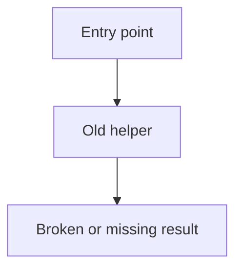
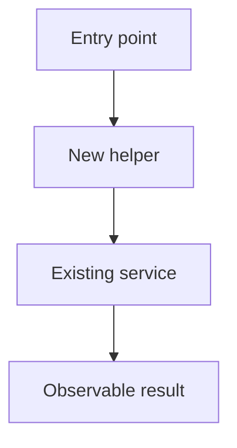

# Walk through landed code

This skill is the counter-equivalent of `$generate-spec-v2`. That skill writes a spec for work that has not happened yet. This skill writes a walkthrough of work that already landed.

Do not plan, spec, or phase future work. Read the diff and the current code, then explain what changed and how it runs now.

## Research the landed change

1. Read the request and repository instructions.
2. Collect the change: `git diff`, `git diff --cached`, `git log`, and the files those commands name. If the user points at a branch, PR, or commit range, use that range.
3. Trace each changed runtime path far enough to show an accurate call stack and code diff. Name real files and symbols.
4. Read external docs only when a dependency or API is part of the landed change. Record the links used.

Use the amount of research the change needs. Do not impose a fixed research process.

## Write the markdown file

Choose a short kebab-case name. Create a temp directory and write one markdown file there. Do not write walkthroughs into `specs/`.

```sh
mkdir -p /tmp/code-walkthrough-<name>
```

Write `/tmp/code-walkthrough-<name>/walkthrough.md`. Use this structure. In each chapter, put the call-stack fence first, then the code (diffs, types, excerpts). Do not title those blocks. Walk through them in prose. Do not dump every artifact into one section at the bottom.

````md
# <Name of the landed change>

## Problem

Explain the problem that existed before the change, in a few plain sentences. Add a Mermaid diagram when it makes the old path clearer.



## Solution

Explain what landed and why that design, in a few plain sentences. Write in the past tense. Add a Mermaid diagram when it makes the new path clearer.



## Goals

- State a user-visible or system-level result that is true after the change.

Out of scope:

- State what this walkthrough does not cover.

## <One outcome that is now true>

No `Chapter:` prefix. The heading is the outcome name only.

The handler now validates before it stores. The call path gained `validateInput`:

```callstack
 requestHandler
-└── existingService
-    └── dataStore
+└── validateInput
+    └── existingService
        └── dataStore
```

`validateInput` returns a tagged error. The handler returns that error. It does not throw.

```diff
--- a/path/to/handler.ts
+++ b/path/to/handler.ts
@@ -10,7 +10,9 @@
 async function requestHandler(input: ImportantInput) {
-  return existingService(input);
+  const valid = validateInput(input);
+  return existingService(valid);
 }
```

The input type is the current `ImportantInput`:

```12:20:path/to/types.ts
```
````

File excerpts use `start:end:repo-relative-path`. Line numbers are 1-based and inclusive. Leave the body empty to load the current file. Use a `callstack` fence, or a `diff` fence that contains `└──` / `├──`. Call stacks render without a Pierre file header. A complete `--- a/` / `+++ b/` patch is best for the code. You may also tag the path as `diff:path/to/handler.ts`. Diffs with a file path keep Pierre’s file header.

Use an `html` fence, or write HTML in the markdown, for callouts. HTML from this file is trusted local content. tkstack does not sanitize it. Only use it for files you wrote.

Repeat `## <outcome>` for each slice of the change. Put Mermaid in a chapter when a local flow is clearer than the Problem or Solution diagram. Keep each chapter on one outcome. Skip a Mermaid fence in Problem or Solution when prose is enough.

## Fence reference

See [`packages/tkstack/README.md`](../../../packages/tkstack/README.md). Short copy:

| Fence info string | Viewer |
| --- | --- |
| `mermaid` | Beautiful Mermaid ([Craft](https://agents.craft.do/mermaid)) |
| `callstack` or `diff` containing `└──` / `├──` | Pierre patch, no file header |
| `diff` or `diff:path` with a file path | Pierre patch with Pierre’s file header |
| `diff` with no path | Pierre patch, no file header |
| `start:end:path` | Pierre file excerpt with Pierre’s file header |
| `html` | Trusted HTML from this file. tkstack does not sanitize it. |
| other langs | Maui `CodeBlock` |

Walkthroughs are markdown. Curly braces in prose are plain text. See [`packages/tkstack/README.md`](../../../packages/tkstack/README.md) for MDC `::file` / `::html` / `::diff` forms.

## Serve it

This skill’s CLI is tkstack. After the markdown file exists, run it from the repo root:

```sh
pnpm exec tkstack /tmp/code-walkthrough-<name>/walkthrough.md
```

Halo alias:

```sh
pnpm walkthrough /tmp/code-walkthrough-<name>/walkthrough.md
```

Options:

- `--port <n>` — listen port (default `4177`)
- `--root <dir>` — workspace root for file excerpts (default cwd)

The command prints a local URL and keeps running. Open that URL. **Done** in the top right posts `/__tkstack/shutdown` and stops the server.

Tell the user the markdown path and the URL.

## Chapter rules

- Name exact files, symbols, behavior, and commands that exist in the tree.
- In each code chapter, include a call-stack fence, then the code (diffs, types, excerpts). Put the call stack first. Do not title those blocks. Do not add a fixed set of subheadings.
- Walk through the fences in prose. Put a sentence or two next to each one. Do not collect every artifact into one appendix.
- Make the call-stack diff start from the previous path and mark the landed path with unified diff signs. For UI work, a component render or event-handler path counts as the call stack.
- Make the code a real excerpt of the landed edit or the current types. Include a file path and enough surrounding control flow to place it.
- Use `Not applicable — no code path changed` only for a true docs, data, or config slice.
- Do not invent types, call paths, or diffs. If a slice has no code path change, skip those fences.

## Final check

Confirm that the markdown lives in a temp directory; Problem and Solution match the landed change; Mermaid appears only where it helps; each code chapter has a call stack and then the code, with prose between the fences and no titles on those blocks; file excerpt paths and line numbers are real; tkstack is serving the page; and the walkthrough covers the change without turning into a plan for new work.
