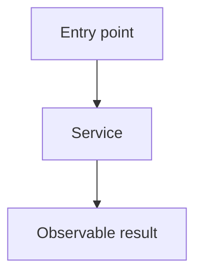

# Generate an implementation spec

Write a spec in `specs/` that an engineer can implement without repeating the research. Keep it lean, grounded in the current code, and focused on the requested result.

## Research the change

1. Read the request and repository instructions.
2. Find the entry points, key types, state boundaries, callers, tests, and commands tied to the change. Trace each changed runtime path far enough to show an accurate diff.
3. Read external docs only when a dependency or API affects the design. Prefer official docs and record the links used.
4. Ask a question only when the answer would change the result and the code cannot answer it. Otherwise, make the narrowest sound assumption and record it.

Use the amount of research the task needs. Do not impose a fixed research process.

## Choose the scope

- Plan the smallest complete change that gives the requested result.
- Do not add abstractions, config, infrastructure, migrations, or cleanup unless the result needs them.
- State goals and non-goals from the request and code. Do not pause for confirmation when the scope is clear.
- Make each phase fit one commit and leave the repository working.
- Use as many phases as the work needs. Do not set a phase or line-count limit.

## Write the file

Choose a short kebab-case name and create `specs/<name>.md`. Use this structure:

````markdown
# <Feature or fix name>

## System flow

Put one or more Mermaid diagrams immediately after the title, before all prose. Show the main runtime flow and changed parts. Label current and proposed paths or use separate diagrams when that is clearer. Keep node text short and use valid Mermaid syntax.



## Problem overview

Explain the current problem and why it matters in a few plain sentences.

## Solution overview

Explain the proposed change and its key design choice in a few plain sentences.

## Goals

- State the user-visible or system-level results that must hold.

## Non-goals

- State what this spec leaves out.

## Important files, docs, and websites

- [`path/to/file.ts`](../path/to/file.ts) — State what the implementer will change or learn here.

List only sources that help implement the change.

## Implementation

### Phase 1: <Commit-sized outcome>

Explain the intent and what becomes true after this phase lands in one or two sentences.

#### Important types

```ts
// path/to/types.ts
type ImportantInput = { id: string };
type ImportantResult =
  | { status: "ok"; value: Value }
  | { status: "error"; reason: FailureReason };
```

#### Call stack diff

Show how this phase changes the current call path. Keep the entry point and enough parents to make ownership clear.

```diff
 requestHandler
-└── existingService
-    └── dataStore
+└── validateInput
+    └── existingService
+        └── dataStore
```

#### Code diff preview

Show a short unified diff of the main edit. Use real file and symbol names, enough surrounding code to place the change, and `...` for parts the implementer will fill in. Do not try to write the full patch.

```diff
 // path/to/handler.ts
 async function requestHandler(input: ImportantInput) {
-  return existingService(input);
+  const valid = validateInput(input);
+  return existingService(valid);
 }
```

- [ ] Make one concrete implementation change, with file and symbol names.
- [ ] Wire the change into its nearest caller or consumer.
- [ ] Cover the main failure case or boundary in a focused test.
- [ ] Run the exact check, test, or command that proves the phase works.
````

## Phase rules

- Give every phase four or five checklist steps, including checks.
- Keep every phase small enough for one clear commit and leave the codebase working.
- Make each phase produce visible or testable progress.
- Name exact files, symbols, behavior, and commands when the codebase provides them.
- Include `Important types`, `Call stack diff`, and `Code diff preview` in every code phase. Keep them inside that phase; do not collect call stacks or code diffs in a global section.
- Show inputs, outputs, state, events, errors, or unions that set the phase contract under `Important types`. Use the project language.
- Make the call-stack diff start from the current path and mark the proposed path with unified diff signs. For UI work, a component render or event-handler path counts as the call stack.
- Make the code diff a short preview of the main edit, not a full patch. Include a file path comment and preserve useful surrounding control flow.
- Use `Not applicable — no code path changes` only for a true docs, data, or config phase. Do not invent types or call paths.
- Test the behavior most likely to make the phase fail or need a revert. Prefer an end-to-end check when the phase changes runtime behavior and the repository supports one.
- Avoid setup-only or refactor-only phases unless later work cannot land safely without them.

## Final check

Confirm that Mermaid diagrams appear only at the top and match the plan; each code phase has key types, an accurate call-stack diff, a code-diff preview, and four or five steps; links and commands are real; and the full plan covers every goal without pulling in a non-goal.
