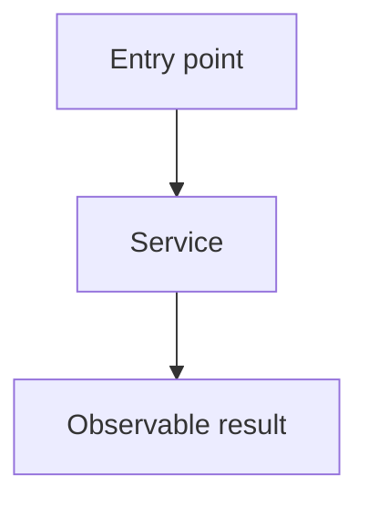

# Generate an implementation spec

Write a spec in `specs/` that an engineer can implement without repeating the research. Keep it lean, grounded in the current code, and focused on the requested result.

## Research the change

1. Read the request and repository instructions.
2. Find the entry points, key types, state boundaries, callers, tests, and commands tied to the change. Trace each changed runtime path far enough to show an accurate diff.
3. Read external docs only when a dependency or API affects the design. Prefer official docs and record the links used.
4. Ask a question only when the answer would change the result and the code cannot answer it. Otherwise, make the narrowest sound assumption and record it.

Use the amount of research the task needs. Do not impose a fixed research process.

## Choose the scope

- Plan the smallest complete change that gives the requested result.
- Do not add abstractions, config, infrastructure, migrations, or cleanup unless the result needs them.
- State goals and non-goals from the request and code. Do not pause for confirmation when the scope is clear.
- Make each phase fit one commit and leave the repository working.
- Use as many phases as the work needs. Do not set a phase or line-count limit.

## Write the file

Choose a short kebab-case name and create `specs/<name>.md`. Use this structure. In each code phase, put the call-stack fence first, then the code (diffs, types, excerpts). Do not title those blocks. Walk through them in prose.

````markdown
# <Feature or fix name>

## System flow

Put one or more Mermaid diagrams immediately after the title, before all prose. Show the main runtime flow and changed parts. Label current and proposed paths or use separate diagrams when that is clearer. Keep node text short and use valid Mermaid syntax.



## Problem overview

Explain the current problem and why it matters in a few plain sentences.

## Solution overview

Explain the proposed change and its key design choice in a few plain sentences.

## Goals

- State the user-visible or system-level results that must hold.

## Non-goals

- State what this spec leaves out.

## Important files, docs, and websites

- [`path/to/file.ts`](../path/to/file.ts) — State what the implementer will change or learn here.

List only sources that help implement the change.

## Implementation

### Phase 1: <Commit-sized outcome>

The handler validates before it stores. The call path gains `validateInput`:

```callstack
 requestHandler
-└── existingService
-    └── dataStore
+└── validateInput
+    └── existingService
        └── dataStore
```

`ImportantInput` is the contract. `validateInput` returns a tagged error. The handler returns that error.

```ts
// path/to/types.ts
type ImportantInput = { id: string };
type ImportantResult =
  | { status: "ok"; value: Value }
  | { status: "error"; reason: FailureReason };
```

The handler calls `validateInput`, then `existingService`. Keep the preview short. Use `...` for parts the implementer will fill in.

```diff
 // path/to/handler.ts
 async function requestHandler(input: ImportantInput) {
-  return existingService(input);
+  const valid = validateInput(input);
+  return existingService(valid);
 }
```

- [ ] Make one concrete implementation change, with file and symbol names.
- [ ] Wire the change into its nearest caller or consumer.
- [ ] Smoke the main failure case or boundary by hand. Do not commit this check until the feature is package-level end-to-end testable.
- [ ] Run the exact command that proves the phase works.
````

Specs are markdown. Curly braces in prose are plain text. Put angle brackets in inline code or fences so markdown does not treat them as HTML. Fenced code uses the table below.

| Fence info string | Viewer |
| --- | --- |
| `mermaid` | Beautiful Mermaid |
| `callstack` or `diff` containing `└──` / `├──` | Pierre patch, no file header |
| `diff` or `diff:path` with a file path | Pierre patch with Pierre’s file header |
| `diff` with no path | Pierre patch, no file header |
| `start:end:path` | Pierre file excerpt of current code |
| `ts`, `rust`, and other langs | Maui `CodeBlock` for proposed types and sketches |
| `html` | Trusted HTML from this spec. tkstack does not sanitize it. Only use it for local files you wrote. |

See [`packages/tkstack/README.md`](../../../packages/tkstack/README.md) for the fence contract and optional MDC `::file` / `::diff` forms.

## Serve it

This skill’s CLI is tkstack. It is the same local page as a code walkthrough. After the spec file exists, run it from the repo root:

```sh
pnpm exec tkstack specs/<name>.md
```

Halo alias:

```sh
pnpm spec specs/<name>.md
```

Options:

- `--port <n>` — listen port (default `4177`)
- `--root <dir>` — workspace root for file excerpts (default cwd)

The command prints a local URL and keeps running. Open that URL. **Done** in the top right posts `/__tkstack/shutdown` and stops the server.

Tell the user the spec path and the URL. Do not write specs into a temp directory.

## Phase rules

- Give every phase four or five checklist steps, including checks.
- Keep every phase small enough for one clear commit and leave the codebase working.
- Make each phase produce visible or testable progress.
- Name exact files, symbols, behavior, and commands when the codebase provides them.
- In every code phase, include a call-stack fence, then the code (diff, types, excerpts). Put the call stack first. Do not title those blocks. Do not add a fixed set of subheadings. Keep them inside that phase.
- Walk through the fences in prose. Put a sentence or two next to each one.
- Show the inputs, outputs, state, events, errors, or unions that set the phase contract in the code that follows the call stack. Use the project language.
- Make the call-stack diff start from the current path and mark the proposed path with unified diff signs. For UI work, a component render or event-handler path counts as the call stack.
- Make the code a short preview of the main edit, not a full patch. Include a file path and preserve useful surrounding control flow.
- Use `Not applicable — no code path changes` only for a true docs, data, or config phase. Do not invent types or call paths.
- Follow [Testing](#testing) for what to check and when to commit tests.
- Avoid setup-only or refactor-only phases unless later work cannot land safely without them. Fixture setup for package-level tests is allowed once the feature is end-to-end testable.

## Testing

Specs commit only package-level end-to-end tests. Act and observe the way a user of that package would:

- Electron / web UI: start the app separately when needed, drive the live renderer with Playwright through `pnpm halo-web`, and assert visible elements, roles, labels, and text.
- Services and other APIs: call the public methods, then read results through the same public API or another real collaborator a user of that package would use.

Do not use mocks such as `vi.fn`, `vi.mock`, or hand-rolled fake collaborators. Do not spec internal unit tests, or assert implementation details such as internal file layouts or exact formatting of private outputs. If a package-level end-to-end test is hard to build and none already exist for the area, do not add a lower-level test instead.

Committed tests must read like end-user code or interactions: short, easy to follow, and free of setup noise. Put shared setup and teardown in Vitest fixtures (`test.extend`), not ad-hoc helpers or manual cleanup. See the [Vitest fixtures documentation](https://vitest.dev/guide/test-context.html#test-extend).

Until the feature is end-to-end testable at the package, each phase still includes a check. Write that check as a smoke step the implementer runs by hand and does not commit:

- [ ] Smoke the main failure case or boundary by hand. Do not commit this check.

Once the feature is end-to-end testable, add the fixtures needed for those high-level tests, then commit the tests. Make fixture setup its own phase when it is more than a small add-on; fold it into the phase that first makes the feature testable when it is small:

- [ ] Add Vitest fixtures that set up the package the way a user would.
- [ ] Commit a short high-level test that acts and observes through the public API or live UI.

## Final check

Confirm that Mermaid diagrams appear only at the top and match the plan; each code phase has a call stack and then the code, with prose between the fences, no titles on those blocks, and four or five steps; links and commands are real; committed tests are package-level end-to-end and earlier phases use uncommitted smoke checks; tkstack is serving the page; and the full plan covers every goal without pulling in a non-goal.
