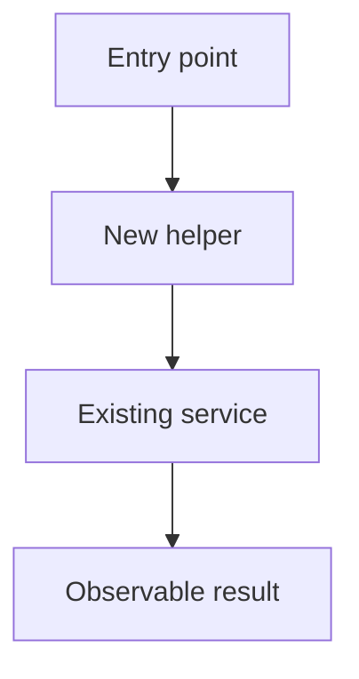

# Walk through landed code

This skill is the counter-equivalent of `$generate-spec-v2`. That skill writes a spec for work that has not happened yet. This skill writes a walkthrough of work that already landed.

Do not plan, spec, or phase future work. Read the diff and the current code, then explain what changed and how it runs now.

## Research the landed change

1. Read the request and repository instructions.
2. Collect the change: `git diff`, `git diff --cached`, `git log`, and the files those commands name. If the user points at a branch, PR, or commit range, use that range.
3. Trace each changed runtime path far enough to show an accurate call stack and code diff. Name real files and symbols.
4. Read external docs only when a dependency or API is part of the landed change. Record the links used.

Use the amount of research the change needs. Do not impose a fixed research process.

## Write the MDX file

Choose a short kebab-case name. Create a temp directory and write one MDX file there. Do not write walkthroughs into `specs/`.

```sh
mkdir -p /tmp/walkthrough-<name>
```

Write `/tmp/walkthrough-<name>/walkthrough.mdx`. Use this structure. Interleave chapters of prose with Mermaid, call-stack diffs, code diffs, file excerpts, HTML, and the changed-file tree. Do not dump every artifact into one section at the bottom.

````mdx
# <Name of the landed change>

## System flow

Put one or more Mermaid diagrams immediately after the title. Show the runtime flow as it exists after the change. Label removed and added paths when that is clearer. Keep node text short and use valid Mermaid syntax.



## What landed

Explain the change and why it matters in a few plain sentences. Write in the past tense: this already shipped in the working tree or the named commits.

## Goals that now hold

- State the user-visible or system-level results that are true after the change.

## Out of scope

- State what this walkthrough does not cover.

## Important files, docs, and websites

- [`path/to/file.ts`](../../path/to/file.ts) — State what the reader should learn here.

List only sources that help read the change. Paths in this list are repo-relative.

## Chapter: <One outcome that is now true>

Explain the intent of this slice of the change in one or two sentences. Then show the evidence, in any order the reader needs:

### Important types

Current types, not proposed types. Prefer a file excerpt so the viewer reads the file from disk:

```12:20:path/to/types.ts
```

The fence info string is `start:end:repo-relative-path`. Line numbers are 1-based and inclusive. Leave the body empty to load the current file. Put the excerpt in the body only when the walkthrough must show text that is not on disk.

### Call stack diff

Show how this slice changed the call path. Keep the entry point and enough parents to make ownership clear. Use a `callstack` fence, or a `diff` fence that contains `└──` / `├──`.

```callstack
 requestHandler
-└── existingService
-    └── dataStore
+└── validateInput
+    └── existingService
        └── dataStore
```

### Code diff

Show a unified diff of the main edit. Use real file and symbol names. A complete `--- a/` / `+++ b/` patch is best. A generate-spec-v2 preview diff is also valid; the viewer wraps it.

```diff
--- a/path/to/handler.ts
+++ b/path/to/handler.ts
@@ -10,7 +10,9 @@
 async function requestHandler(input: ImportantInput) {
-  return existingService(input);
+  const valid = validateInput(input);
+  return existingService(valid);
 }
```

You may also tag the path in the fence info string: `diff:path/to/handler.ts`.

### HTML

Use JSX HTML in the MDX, or an `html` fence, for callouts, tables, and small diagrams that are not Mermaid.

```html
<aside>
  <strong>Failure path.</strong> `validateInput` returns a tagged error. The handler returns that error. It does not throw.
</aside>
```

### Changed files

A `tree` fence lists repo-relative paths. The viewer renders them with Pierre Trees and Git status.

```tree
path/to/handler.ts
path/to/types.ts
```
````

Repeat `## Chapter:` for each slice of the change. Put Mermaid in a chapter when a local flow is clearer than the top-level diagram. Keep each chapter on one outcome.

## Fence reference

| Fence info string | Viewer |
| --- | --- |
| `mermaid` | Mermaid diagram |
| `callstack` or `diff` containing `└──` / `├──` | Call-stack diff |
| `diff` or `diff:path` | Pierre Diffs patch |
| `start:end:path` | Pierre Diffs file excerpt |
| `html` | Trusted HTML from this walkthrough |
| `tree` | Pierre Trees file list |
| other langs | Maui `CodeBlock` |

Fenced code is not JSX. `{` inside fences is safe. In prose, write `\{` if you need a literal brace.

## Serve it

This skill's CLI is `pnpm walkthrough`. After the MDX file exists:

```sh
pnpm walkthrough /tmp/walkthrough-<name>/walkthrough.mdx
```

Options:

- `--port <n>` — listen port (default `4177`)
- `--root <dir>` — workspace root for file excerpts (default cwd)
- `--base <ref>` — Git ref for the file-tree diff, e.g. `main`

The command prints a local URL and keeps running. Open that URL. The page uses Maui, Pierre Diffs, and Pierre Trees. The close button in the top right posts `/__walkthrough/shutdown` and stops the server.

Tell the user the MDX path and the URL.

## Chapter rules

- Name exact files, symbols, behavior, and commands that exist in the tree.
- Show inputs, outputs, state, events, errors, or unions that the slice actually uses under `Important types`.
- Make the call-stack diff start from the previous path and mark the landed path with unified diff signs. For UI work, a component render or event-handler path counts as the call stack.
- Make the code diff a real excerpt of the landed edit. Include a file path and enough surrounding control flow to place it.
- Use `Not applicable — no code path changed` only for a true docs, data, or config slice.
- Do not invent types, call paths, or diffs. If a slice has no code path change, skip those fences.
- Interleave explanation with artifacts. Do not collect every diff into one appendix.

## Final check

Confirm that the MDX lives in a temp directory; Mermaid at the top matches the landed flow; each code chapter has the types, call stack, and diff that belong to it; file excerpt paths and line numbers are real; the CLI is serving the page; and the walkthrough covers the change without turning into a plan for new work.
