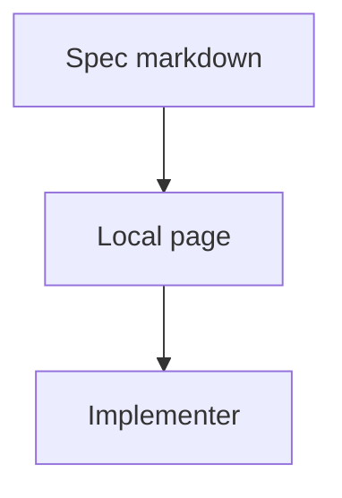

# Spec fixture

## System flow



## Problem overview

Specs lived as markdown files with no local page, so mermaid, call stacks, and diff previews were hard to read. Prose may name paths such as `{workspace}/.halo/plugins/<id>/`.

## Solution overview

`pnpm exec tkstack` serves the spec with the same Maui page as a code walkthrough. The spec keeps its own section shape.

## Goals

- A spec file in `specs/` opens as a local page.
- Mermaid, types, call stacks, and diff previews render on that page.

## Non-goals

- Changing the spec section order.

## Important files, docs, and websites

- [`src/cli.ts`](../src/cli.ts) — Starts the local server for both specs and walkthroughs.

## Implementation

### Phase 1: Serve the spec file

The CLI already compiles markdown. Point it at a spec path.

#### Important types

```ts
// src/serve.ts
type StartServerInput = {
  filePath: string;
  workspaceRoot: string;
  port: number;
};
```

#### Call stack diff

```callstack
 startServer
-└── readWalkthroughOnly
+└── createViteServer
    └── handleTkstackRequest
```

#### Code diff preview

```diff
 // src/cli.ts
 Cli.create("tkstack", {
-  description: "Serve a walkthrough",
+  description: "Serve a spec or code walkthrough markdown file as a local page",
```

- [ ] Add a `pnpm spec` alias that runs the same CLI.
- [ ] Teach generate-spec-v2 to serve `specs/<name>.md` after writing it.
- [ ] Smoke that mermaid and diffs render. Do not commit this check until the feature is package-level end-to-end testable.
- [ ] Run `pnpm --filter tkstack test`.
