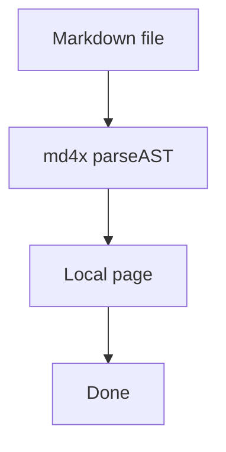

# tkstack fixture

tkstack parses markdown with md4x and serves a Maui page. Curly braces in prose are plain text, so a path like `{workspace}/.halo/plugins/<id>/` does not need escaping. Put angle brackets in inline code: `{workspace}/plugins/<id>/`.

[cli.ts](../src/cli.ts) starts the local server. **Done** in the top right stops it.

## System flow



## Markdown

Paragraphs, **bold**, _italic_, ~~strikethrough~~, and a [relative link](../src/parseFence.ts).

- Unordered item
- Another item

1. Ordered item
2. Next item

- [x] Task done
- [ ] Task open

> [!NOTE]
> GFM alerts render as a blockquote.

| Fence            | View                     |
| ---------------- | ------------------------ |
| `mermaid`        | Beautiful Mermaid        |
| `callstack`      | Pierre, no file header   |
| `diff:path`      | Pierre, with file header |
| `start:end:path` | Pierre file excerpt      |

---

Raw HTML in the file is trusted local content:

<aside>
  <strong>Raw HTML.</strong> md4x keeps this as an <code>html</code> node.
  tkstack does not sanitize it.
</aside>

## Code

A language fence uses Maui `CodeBlock`.

```ts
type StartServerInput = {
  filePath: string;
  workspaceRoot: string;
  port: number;
};
```

## File excerpt

Fence info `start:end:path` loads the current file. Line numbers are 1-based and inclusive. Pierre shows its file header.

```1:10:src/parseFence.ts

```

## Call stack

A `callstack` fence is a Pierre patch with no file header.

```callstack
 startServer
-└── writeStaticHtml
+└── createViteServer
    └── handleTkstackRequest
```

A `diff` fence that contains `└──` / `├──` is also a call stack, still with no header.

```diff
 requestHandler
-└── existingService
+└── validateInput
    └── existingService
```

## Diff with a path

A complete `--- a/` / `+++ b/` patch keeps Pierre’s file header.

```diff
--- a/src/parseFence.ts
+++ b/src/parseFence.ts
@@ -1,3 +1,4 @@
 export type Fence =
   | { kind: "mermaid"; source: string }
+  | { kind: "html"; source: string }
   | { kind: "callstack"; source: string }
```

Tag the path on the info string instead: `diff:src/cli.ts`.

```diff:src/cli.ts
 Cli.create("tkstack", {
-  description: "Serve a walkthrough",
+  description: "Serve a spec or code walkthrough as a local page",
```

## Diff with no path

No `--- a/` path and no `diff:path` info string: Pierre patch, no file header.

```diff
-old helper
+new helper
```

## HTML fence

An `html` fence is trusted local content. tkstack does not sanitize it.

```html
<aside>
  <strong>HTML fence.</strong> Done in the top right stops the local server.
</aside>
```

## MDC components

md4x Comark `::name` blocks map to the same views. Fences keep whitespace; use them for mermaid, call stacks, and diffs. MDC is useful for `::file` props.

::file{path="src/cli.ts" start="7" end="20"}
::

::html

<aside>
  <strong>MDC html.</strong> Same trusted-HTML view as an <code>html</code>{" "}
  fence.
</aside>
::

::diff{path="src/parseViewer.ts"}
--- a/src/parseViewer.ts
+++ b/src/parseViewer.ts
@@ -1,3 +1,4 @@
import { parseAST } from "md4x/napi";
+import { parseFence } from "./parseFence.js";
::

::callstack
parseViewerDocument
-└── compileMdx
+└── parseAST
└── fromNode
::
