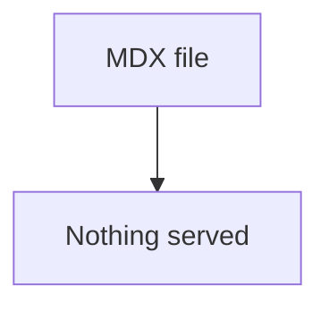
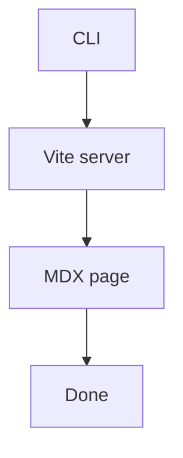

# Walkthrough fixture

## Problem

The CLI had no way to show a landed change as a page.



## Solution

`pnpm exec tkstack` parses the markdown with md4x and serves a Maui page. Done stops the server.



## Goals

- A local page renders mermaid, diffs, call stacks, and excerpts.
- Done in the top right stops the server.

## Parse fences

`parseFence` classifies mermaid, diffs, call stacks, and file excerpts.

```12:20:src/parseFence.ts

```

```callstack
 startServer
-└── writeStaticHtml
+└── createViteServer
    └── handleTkstackRequest
```

```diff
--- a/src/parseFence.ts
+++ b/src/parseFence.ts
@@ -1,3 +1,4 @@
 export type Fence =
   | { kind: "mermaid"; source: string }
+  | { kind: "html"; source: string }
   | { kind: "callstack"; source: string }
```

```diff
-old helper
+new helper
```

```html
<aside>
  <strong>Note.</strong> Done in the top right stops the local server. An `html`
  fence is trusted local content. tkstack does not sanitize it.
</aside>
```

::file{path="src/cli.ts" start="1" end="8"}
::
