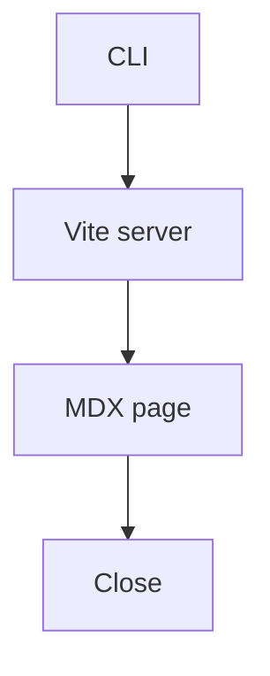

# Walkthrough fixture

Opening flow after the change.



## Chapter: Parse fences

`parseFence` classifies mermaid, diffs, call stacks, and file excerpts.

```12:20:src/parseFence.ts

```

```callstack
 startWalkthroughServer
-└── writeStaticHtml
+└── createViteServer
    └── handleWalkthroughRequest
```

```diff
--- a/src/parseFence.ts
+++ b/src/parseFence.ts
@@ -1,3 +1,4 @@
 export type Fence =
   | { kind: "mermaid"; source: string }
+  | { kind: "html"; source: string }
   | { kind: "callstack"; source: string }
```

```html
<aside>
  <strong>Note.</strong> Close in the top right stops the local server.
</aside>
```

```tree
src/parseFence.ts
src/serve.ts
src/cli.ts
```
