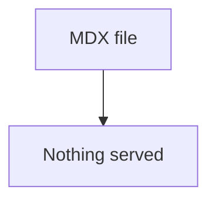
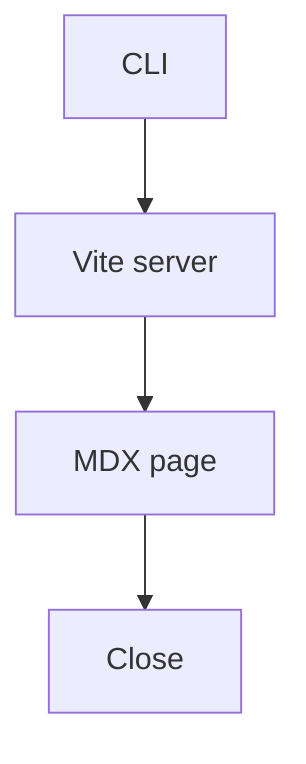

# Walkthrough fixture

## Problem

The CLI had no way to show a landed change as a page.



## Solution

`pnpm walkthrough` compiles the MDX and serves a Maui page. Close stops the server.



## Goals

- A local page renders mermaid, diffs, call stacks, and excerpts.
- Close in the top right stops the server.

Out of scope:

- A file sidebar.

## Parse fences

`parseFence` classifies mermaid, diffs, call stacks, and file excerpts.

```12:20:src/parseFence.ts

```

```callstack
 startWalkthroughServer
-└── writeStaticHtml
+└── createViteServer
    └── handleWalkthroughRequest
```

```diff
--- a/src/parseFence.ts
+++ b/src/parseFence.ts
@@ -1,3 +1,4 @@
 export type Fence =
   | { kind: "mermaid"; source: string }
+  | { kind: "html"; source: string }
   | { kind: "callstack"; source: string }
```

```html
<aside>
  <strong>Note.</strong> Close in the top right stops the local server.
</aside>
```
