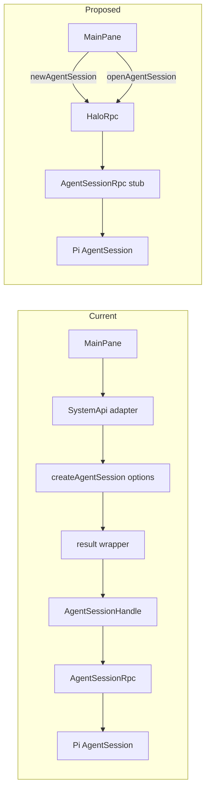
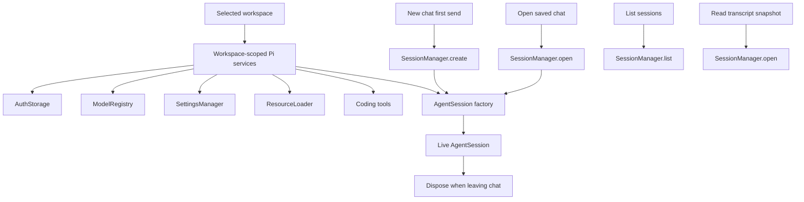

# Direct Pi session stubs

## System flow





## Problem overview

The current branch keeps the right live-session lifetime but adds wrappers on both sides of Cap'n Web. `HaloRpc.createAgentSession()` returns an object containing a stub, then `systemApiFromHaloRpc()` wraps that stub in `AgentSessionHandle`. The UI also uses one factory name for two different actions: creating a new chat and opening a saved chat.

`PiService` creates `AuthStorage` and `ModelRegistry` for every live chat. Pi 0.60's TUI instead creates workspace/process-scoped services once, opens or creates one `SessionManager`, and gives that manager to one `AgentSession` for the full interactive run. `SessionManager.list()` remains a separate catalog read.

## Solution overview

Keep `PiService` free of live-session maps, but cache the Pi services that belong to the selected workspace. Create one `SessionManager` for each live `AgentSession`; keep both alive until the renderer leaves that chat and disposes the Cap'n Web stub.

Expose `newAgentSession()` and `openAgentSession(sessionId)` from `HaloRpc`. Each method returns `AgentSessionRpc` directly. Let Cap'n Web turn that `RpcTarget` into an `RpcStub`, and use the stub directly in renderer hooks. Keep only the adapter that Pi requires: `AgentSessionRpc` maps Pi events to the retained renderer callback and disposes the real `AgentSession`.

## Goals

- Hold workspace-scoped Pi services once after workspace selection instead of rebuilding them for every chat.
- Create or open exactly one `SessionManager` for each live chat runtime.
- Keep one live Pi `AgentSession` across all prompts for the selected chat.
- Use `newAgentSession` for a draft's first send and `openAgentSession` for a saved chat.
- Return `AgentSessionRpc` directly and use Cap'n Web's `RpcStub` in the renderer without `AgentSessionHandle` or a result wrapper.
- Retain renderer callbacks with Cap'n Web's required `dup()` ownership rule and release them when the session stub is disposed.
- Keep session listing and transcript snapshots independent of live-session ownership.

## Non-goals

- Do not add Halo-owned running-session, busy-session, draft-session, or live-session maps.
- Do not keep chats alive after the renderer leaves them.
- Do not replace callback subscriptions with `ReadableStream` or redesign the MessagePort transport.
- Do not add session switching, forking, compaction, steering, or follow-up APIs.
- Do not change Pi's JSONL format or parse transcripts outside `SessionManager`.
- Do not upgrade Pi or Cap'n Web as part of this refactor.

## Important files, docs, and websites

- [`apps/electron/src/main/pi-service.ts`](../apps/electron/src/main/pi-service.ts) — Own workspace-scoped Pi services and create/open per-chat managers.
- [`apps/electron/src/main/pi-service.test.ts`](../apps/electron/src/main/pi-service.test.ts) — Prove service reuse, manager ownership, durable reopen, and caller-owned disposal.
- [`apps/electron/src/main/rpc.ts`](../apps/electron/src/main/rpc.ts) — Return `AgentSessionRpc` directly and keep the one required Pi-to-Cap'n-Web adapter.
- [`apps/electron/src/renderer/api/SystemApi.ts`](../apps/electron/src/renderer/api/SystemApi.ts) — Remove `AgentSessionHandle`, `CreateAgentSessionResult`, and the duplicate RPC interface.
- [`apps/electron/src/renderer/api/HaloRpcClient.ts`](../apps/electron/src/renderer/api/HaloRpcClient.ts) — Return the root `RpcStub<HaloRpc>` without wrapping its methods.
- [`apps/electron/src/renderer/api/electron.ts`](../apps/electron/src/renderer/api/electron.ts) — Cache the root Cap'n Web stub.
- [`apps/electron/src/renderer/api/ApiProvider.tsx`](../apps/electron/src/renderer/api/ApiProvider.tsx) — Own direct session stubs for draft and saved-chat lifetimes.
- [`apps/electron/src/renderer/MainPane.tsx`](../apps/electron/src/renderer/MainPane.tsx) — Send prompts through the direct session stub.
- [Pi 0.60 `main.ts`](https://github.com/badlogic/pi-mono/blob/v0.60.0/packages/coding-agent/src/main.ts) — Shows TUI ownership: shared services, one manager, and one session for the interactive run.
- [Pi 0.60 SDK documentation](https://github.com/badlogic/pi-mono/blob/v0.60.0/packages/coding-agent/docs/sdk.md) — Defines `createAgentSession`, `SessionManager`, subscriptions, and disposal.
- [Cap'n Web README](https://github.com/cloudflare/capnweb/blob/main/README.md) — Defines `RpcTarget`, direct `RpcStub` returns, promise pipelining, callback duplication, and disposal.

## Implementation

### Phase 1: Reuse workspace-scoped Pi services

Make `PiService` a session factory without session state. Lazily initialize and retain the services tied to the selected workspace, while creating or opening one `SessionManager` per requested live chat. Keep the current public factory method during this phase so the repository remains working.

#### Important types

```ts
// apps/electron/src/main/pi-service.ts
type PiWorkspaceServices = {
  layout: WorkspaceLayout;
  authStorage: AuthStorage;
  modelRegistry: ModelRegistry;
  settingsManager: SettingsManager;
  resourceLoader: DefaultResourceLoader;
  tools: Tool[];
};

type AgentSessionFactory = typeof createAgentSession;

class PiService {
  private services: Promise<PiWorkspaceServices | InitializePiError> | null;

  createAgentSession(
    options?: { sessionId?: string },
  ): Promise<AgentSession | Error>;
}
```

The cached object contains only workspace-scoped dependencies. It must not contain `SessionManager` or `AgentSession`. `DefaultResourceLoader.reload()` is an external async boundary and returns a tagged `InitializePiError` through `.catch()`.

#### Call stack diff

```diff
 renderer requests a live chat
 └── PiService.createAgentSession(options)
     ├── WorkspaceService.getLayout()
-    ├── AuthStorage.create()
-    ├── new ModelRegistry()
-    ├── createCodingTools()
+    ├── PiService.getServices()
+    │   ├── AuthStorage.create()
+    │   ├── new ModelRegistry()
+    │   ├── SettingsManager.create()
+    │   ├── new DefaultResourceLoader()
+    │   ├── DefaultResourceLoader.reload()
+    │   └── createCodingTools()
     ├── options.sessionId absent
     │   └── SessionManager.create()
     ├── options.sessionId set
     │   ├── SessionManager.list()
     │   └── SessionManager.open()
     └── createAgentSession({ services, sessionManager })
         └── live AgentSession returned to caller
```

#### Code diff preview

```diff
 // apps/electron/src/main/pi-service.ts
 export class PiService {
+  private services: Promise<PiWorkspaceServices | InitializePiError> | null =
+    null;
+
   async createAgentSession(options: CreateAgentSessionOptions = {}) {
     const layout = this.workspace.getLayout();
     if (layout instanceof Error) return layout;
+
+    const services = await this.getServices(layout);
+    if (services instanceof Error) return services;
 
     const manager =
       options.sessionId === undefined
         ? SessionManager.create(layout.root, layout.sessionDir)
         : await this.openSessionManager(layout, options.sessionId);
     if (manager instanceof Error) return manager;
 
-    const authStorage = AuthStorage.create(join(layout.agentDir, "auth.json"));
-    const modelRegistry = new ModelRegistry(...);
     const created = await this.createSession({
       cwd: layout.root,
       agentDir: layout.agentDir,
-      authStorage,
-      modelRegistry,
+      authStorage: services.authStorage,
+      modelRegistry: services.modelRegistry,
+      settingsManager: services.settingsManager,
+      resourceLoader: services.resourceLoader,
       sessionManager: manager,
-      tools: createCodingTools(layout.root),
+      tools: services.tools,
     }).catch((e) => new CreateAgentSessionError({ cause: e }));
     if (created instanceof Error) return created;
     return created.session;
   }
 }
```

- [ ] Add `PiWorkspaceServices`, `InitializePiError`, and lazy `PiService.getServices()` in `apps/electron/src/main/pi-service.ts`; initialize `AuthStorage`, `ModelRegistry`, `SettingsManager`, `DefaultResourceLoader`, and coding tools once for the selected workspace.
- [ ] Keep `SessionManager.create/open` local to each `createAgentSession()` call and keep `listSessions()` / `readTranscript()` outside the cached services.
- [ ] Update `apps/electron/src/main/pi-service.test.ts` to assert that two live chats receive distinct managers but the same workspace-scoped service instances, and that repeated prompts still use one `AgentSession`.
- [ ] Cover `DefaultResourceLoader.reload()` and Pi factory rejection with tagged errors at their external boundaries.
- [ ] Run `pnpm --filter @halo/desktop test`, `pnpm --filter @halo/desktop typecheck`, then commit this phase.

### Phase 2: Return direct Cap'n Web session stubs

Replace the option-shaped RPC factory and renderer handle with two clear operations. `HaloRpc` converts returned service errors to throws only at the Cap'n Web edge, allowing each method to return `AgentSessionRpc` rather than `AgentSessionRpc | Error`; Cap'n Web can then infer and return a direct `RpcStub<AgentSessionRpc>`.

Simplify `AgentSessionRpc` to one retained renderer subscriber because each renderer hook subscribes once. Keep a single delivery chain so prompt completion cannot overtake queued callback delivery. Disposing the session stub unsubscribes from Pi, disposes the retained callback, aborts active work, and disposes the real Pi session.

#### Important types

```ts
// apps/electron/src/main/rpc.ts
class HaloRpc extends RpcTarget {
  newAgentSession(): Promise<AgentSessionRpc>;
  openAgentSession(sessionId: string): Promise<AgentSessionRpc>;
}

type PromptListener = PromptEventHandler & {
  dup(): PromptListener;
  [Symbol.dispose](): void;
};

class AgentSessionRpc extends RpcTarget {
  getSessionId(): string;
  subscribe(callback: PromptListener): void;
  prompt(text: string): Promise<void>;
  [Symbol.dispose](): void;
}

// Renderer types are inferred from the server targets.
type HaloApi = RpcStub<HaloRpc>;
type LiveAgentSession = RpcStub<AgentSessionRpc>;
```

`newAgentSession()` and `openAgentSession()` use a private helper in `HaloRpc` or `PiService`; they do not duplicate SDK setup. The methods throw only after an `instanceof Error` check at the RPC boundary, as required by the repository's legacy-boundary rule.

#### Call stack diff

```diff
 new draft, first send
 MainPane.DraftPane.submit
-└── useDraftAgentSession.ensureSession
-    └── SystemApi.createAgentSession({})
-        └── HaloRpc.createAgentSession({})
-            └── { sessionId, session: AgentSessionRpc }
-                └── AgentSessionHandle
+└── useDraftAgentSession.ensureSession
+    └── HaloRpc stub.newAgentSession()
+        └── AgentSessionRpc stub
             ├── subscribe(renderer callback)
             └── prompt(text)

 open saved chat
 MainPane.SavedPane
 └── useOpenAgentSession(sessionId)
-    └── SystemApi.createAgentSession({ sessionId })
+    └── HaloRpc stub.openAgentSession(sessionId)
         └── AgentSessionRpc stub
             ├── subscribe(renderer callback)
             ├── prompt(text) across later sends
             └── Symbol.dispose when selection changes
```

#### Code diff preview

```diff
 // apps/electron/src/main/rpc.ts
 export class HaloRpc extends RpcTarget {
-  async createAgentSession(options: CreateAgentSessionOptions = {}) {
-    const session = await this.pi.createAgentSession(options);
+  async newAgentSession() {
+    return this.createSession();
+  }
+
+  async openAgentSession(sessionId: string) {
+    return this.createSession(sessionId);
+  }
+
+  private async createSession(sessionId?: string) {
+    const session = await this.pi.createAgentSession({ sessionId });
     if (session instanceof Error) throw session;
-    return {
-      sessionId: session.sessionId,
-      session: new AgentSessionRpc(session),
-    };
+    return new AgentSessionRpc(session);
   }
 }

 // apps/electron/src/renderer/api/HaloRpcClient.ts
-export function systemApiFromHaloRpc(halo: RpcStub<HaloRpcApi>): SystemApi {
-  return {
-    ...
-    async createAgentSession(options = {}) {
-      const value = await halo.createAgentSession(options);
-      ...
-      return handle;
-    },
-  };
-}
-
-export async function connectHaloRpc(): Promise<RpcStub<HaloRpcApi>> {
+export async function connectHaloRpc(): Promise<RpcStub<HaloRpc>> {
   const port = await requestRpcPort();
-  return newMessagePortRpcSession<HaloRpcApi>(port);
+  return newMessagePortRpcSession<HaloRpc>(port);
 }
```

- [ ] Replace `HaloRpc.createAgentSession()` with `newAgentSession()` and `openAgentSession(sessionId)`, return `AgentSessionRpc` directly, and throw returned service errors only at this RPC boundary.
- [ ] Simplify `AgentSessionRpc` to one duplicated callback, one ordered delivery chain, and one disposer; remove the listener set, result wrapper, and `send()` alias.
- [ ] Delete `AgentSessionHandle`, `CreateAgentSessionResult`, `HaloRpcApi`, and `systemApiFromHaloRpc()`; make `createElectronApi()` and `ApiProvider` use `RpcStub<HaloRpc>` and `RpcStub<AgentSessionRpc>` directly.
- [ ] Update `useDraftAgentSession`, `useOpenAgentSession`, `useSendPromptMutation`, and `MainPane` so drafts call `newAgentSession()` only on first send, saved chats call `openAgentSession()`, later prompts reuse the same stub, and cleanup disposes it.
- [ ] Add focused RPC lifecycle tests where practical, run `pnpm run check-affected`, verify first-send/reuse/open/dispose with `pnpm halo-web`, then commit and push this phase.

## Final check

- [ ] Confirm the diagrams appear only at the top and match the implemented ownership and RPC paths.
- [ ] Confirm `PiService` caches no `SessionManager`, `AgentSession`, draft, running, or busy state.
- [ ] Confirm each live chat owns one manager, one Pi session, and one direct Cap'n Web session stub until the renderer leaves.
- [ ] Confirm no `AgentSessionHandle`, result wrapper, `systemApiFromHaloRpc`, or option-shaped renderer call remains.
- [ ] Confirm `pnpm run check-affected` passes and the Halo UI proves draft first-send, follow-up reuse, saved-chat open, and disposal on leave.
