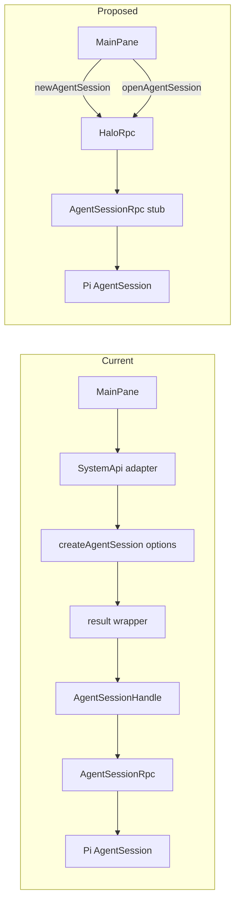
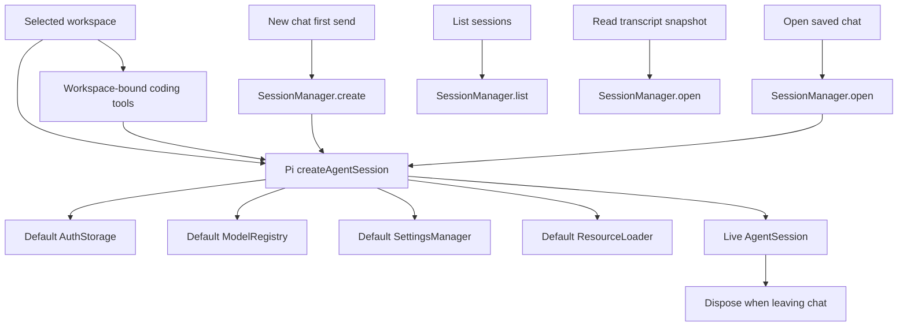

# Direct Pi session stubs

## System flow





## Problem overview

The current branch keeps the right live-session lifetime but adds wrappers on both sides of Cap'n Web. `HaloRpc.createAgentSession()` returns an object containing a stub, then `systemApiFromHaloRpc()` wraps that stub in `AgentSessionHandle`. The UI also uses one factory name for two different actions: creating a new chat and opening a saved chat.

`PiService` creates `AuthStorage` and `ModelRegistry` explicitly even though Halo does not configure or use either object. Pi's `createAgentSession()` already creates those objects from `agentDir`, creates settings from `cwd` and `agentDir`, and loads resources. The TUI keeps them for its one process-long session, but that is not a reusable ownership contract for Halo.

## Solution overview

Keep `PiService` free of live-session maps and let each Pi `AgentSession` own its SDK-default auth, model, settings, and resource services. Halo supplies only the selected `cwd`, `agentDir`, one durable `SessionManager`, and `createCodingTools(cwd)`. The explicit tools remain necessary because Pi 0.60's default tools bind to `process.cwd()` rather than Halo's selected workspace.

Expose `newAgentSession()` and `openAgentSession(sessionId)` from `HaloRpc`. Each method returns `AgentSessionRpc` directly. Let Cap'n Web turn that `RpcTarget` into an `RpcStub`, and use the stub directly in renderer hooks. Keep only the adapter that Pi requires: `AgentSessionRpc` maps Pi events to the retained renderer callback and disposes the real `AgentSession`.

## Goals

- Rely on Pi's defaults for auth storage, model registry, settings, and resources.
- Keep Halo's explicit `cwd`, `agentDir`, durable manager, and workspace-bound tools.
- Create or open exactly one `SessionManager` for each live chat runtime.
- Keep one live Pi `AgentSession` across all prompts for the selected chat.
- Use `newAgentSession` for a draft's first send and `openAgentSession` for a saved chat.
- Return `AgentSessionRpc` directly and use Cap'n Web's `RpcStub` in the renderer without `AgentSessionHandle` or a result wrapper.
- Retain renderer callbacks with Cap'n Web's required `dup()` ownership rule and release them when the session stub is disposed.
- Keep session listing and transcript snapshots independent of live-session ownership.

## Non-goals

- Do not add Halo-owned running-session, busy-session, draft-session, or live-session maps.
- Do not keep chats alive after the renderer leaves them.
- Do not replace callback subscriptions with `ReadableStream` or redesign the MessagePort transport.
- Do not add session switching, forking, compaction, steering, or follow-up APIs.
- Do not change Pi's JSONL format or parse transcripts outside `SessionManager`.
- Do not upgrade Pi or Cap'n Web as part of this refactor.

## Important files, docs, and websites

- [`apps/electron/src/main/pi-service.ts`](../apps/electron/src/main/pi-service.ts) — Delegate SDK-owned services to Pi and create/open per-chat managers.
- [`apps/electron/src/main/rpc.ts`](../apps/electron/src/main/rpc.ts) — Return `AgentSessionRpc` directly and keep the one required Pi-to-Cap'n-Web adapter.
- [`apps/electron/src/shared/rpc.ts`](../apps/electron/src/shared/rpc.ts) — Define shared Cap'n Web target classes and serializable values without importing Electron main code into the renderer.
- [`apps/electron/src/renderer/api/HaloRpcClient.ts`](../apps/electron/src/renderer/api/HaloRpcClient.ts) — Return the root `RpcStub<HaloApi>` without wrapping its methods.
- [`apps/electron/src/renderer/api/electron.ts`](../apps/electron/src/renderer/api/electron.ts) — Cache the root Cap'n Web stub.
- [`apps/electron/src/renderer/api/ApiProvider.tsx`](../apps/electron/src/renderer/api/ApiProvider.tsx) — Own direct session stubs for draft and saved-chat lifetimes.
- [`apps/electron/src/renderer/MainPane.tsx`](../apps/electron/src/renderer/MainPane.tsx) — Send prompts through the direct session stub.
- [Pi 0.60 `main.ts`](https://github.com/badlogic/pi-mono/blob/v0.60.0/packages/coding-agent/src/main.ts) — Shows the TUI's one process-long session lifetime.
- [Pi 0.60 SDK implementation](https://github.com/badlogic/pi-mono/blob/v0.60.0/packages/coding-agent/src/core/sdk.ts) — Defines the default auth, model, settings, resource, cwd, and agent-dir behavior.
- [Pi 0.60 SDK documentation](https://github.com/badlogic/pi-mono/blob/v0.60.0/packages/coding-agent/docs/sdk.md) — Defines `createAgentSession`, `SessionManager`, subscriptions, and disposal.
- [Cap'n Web README](https://github.com/cloudflare/capnweb/blob/main/README.md) — Defines `RpcTarget`, direct `RpcStub` returns, promise pipelining, callback duplication, and disposal.

## Implementation

### Phase 1: Delegate session services to Pi defaults

Make `PiService` pass only the values Halo owns: workspace paths, a per-chat manager, and cwd-bound coding tools. Let `createAgentSession()` construct auth, model, settings, and resource services from those paths. Keep the current public factory method during this phase so the repository remains working.

#### Important types

```ts
// @mariozechner/pi-coding-agent createAgentSession input from Halo
type CreateLiveAgentSessionOptions = {
  cwd: string;
  agentDir: string;
  sessionManager: SessionManager;
  tools: Tool[];
};

// apps/electron/src/main/pi-service.ts
class PiService {
  createAgentSession(
    options?: { sessionId?: string },
  ): Promise<AgentSession | Error>;
}
```

The options passed to Pi omit `authStorage`, `modelRegistry`, `settingsManager`, and `resourceLoader`. Because `agentDir` is present, Pi resolves auth from `<agentDir>/auth.json` and models from `<agentDir>/models.json`; it also creates settings and reloads resources for the selected workspace. `createCodingTools(layout.root)` stays explicit because Pi 0.60's default tool instances use the Electron process working directory.

#### Call stack diff

```diff
 renderer requests a live chat
 └── PiService.createAgentSession(options)
     ├── WorkspaceService.getLayout()
-    ├── AuthStorage.create()
-    ├── new ModelRegistry()
     ├── createCodingTools(layout.root)
     ├── options.sessionId absent
     │   └── SessionManager.create()
     ├── options.sessionId set
     │   ├── SessionManager.list()
     │   └── SessionManager.open()
     └── Pi createAgentSession({ cwd, agentDir, sessionManager, tools })
-        ├── Halo-provided AuthStorage
-        └── Halo-provided ModelRegistry
+        ├── Pi default AuthStorage
+        ├── Pi default ModelRegistry
+        ├── Pi default SettingsManager
+        ├── Pi default ResourceLoader
+        └── live AgentSession returned to caller
```

#### Code diff preview

```diff
 // apps/electron/src/main/pi-service.ts
 export class PiService {
   async createAgentSession(options: CreateAgentSessionOptions = {}) {
     const layout = this.workspace.getLayout();
     if (layout instanceof Error) return layout;
 
     const manager =
       options.sessionId === undefined
         ? SessionManager.create(layout.root, layout.sessionDir)
         : await this.openSessionManager(layout, options.sessionId);
     if (manager instanceof Error) return manager;
 
-    const authStorage = AuthStorage.create(join(layout.agentDir, "auth.json"));
-    const modelRegistry = new ModelRegistry(...);
     const created = await this.createSession({
       cwd: layout.root,
       agentDir: layout.agentDir,
-      authStorage,
-      modelRegistry,
       sessionManager: manager,
       tools: createCodingTools(layout.root),
     }).catch((e) => new CreateAgentSessionError({ cause: e }));
     if (created instanceof Error) return created;
     return created.session;
   }
 }
```

- [x] Remove explicit `AuthStorage` and `ModelRegistry` construction and imports from `apps/electron/src/main/pi-service.ts`; do not add explicit settings or resource-loader objects.
- [x] Delete the injected `AgentSessionFactory` seam and call Pi's `createAgentSession()` directly with only `cwd`, `agentDir`, `sessionManager`, and `createCodingTools(layout.root)`.
- [x] Keep `SessionManager.create/open` local to each live-session request and keep `listSessions()` / `readTranscript()` as separate durable catalog operations.
- [x] Delete `apps/electron/src/main/pi-service.test.ts`; prove the supported behavior through the live Cap'n Web/UI path instead of a second fake Pi implementation.
- [x] Keep Pi factory rejection wrapped as `CreateAgentSessionError`; run `pnpm run check-affected` and verify the draft first-send and saved-chat reopen flows with `pnpm halo-web`, then commit this phase.

### Phase 2: Return direct Cap'n Web session stubs

Replace the option-shaped RPC factory and renderer handle with two clear operations. `HaloRpc` converts returned service errors to throws only at the Cap'n Web edge, allowing each method to return `AgentSessionRpc` rather than `AgentSessionRpc | Error`; Cap'n Web can then infer and return a direct `RpcStub<AgentSessionRpc>`.

Simplify `AgentSessionRpc` to one retained renderer subscriber because each renderer hook subscribes once. Keep a single delivery chain so prompt completion cannot overtake queued callback delivery. Disposing the session stub unsubscribes from Pi, disposes the retained callback, aborts active work, and disposes the real Pi session.

#### Important types

```ts
// apps/electron/src/shared/rpc.ts
abstract class HaloApi extends RpcTarget {
  abstract newAgentSession(): Promise<AgentSessionApi>;
  abstract openAgentSession(sessionId: string): Promise<AgentSessionApi>;
}

abstract class AgentSessionApi extends RpcTarget {
  abstract getSessionId(): string;
  abstract subscribe(callback: PromptEventHandler): void;
  abstract prompt(text: string): Promise<void>;
}

// apps/electron/src/main/rpc.ts
type PromptListener = PromptEventHandler & {
  dup(): PromptListener;
  [Symbol.dispose](): void;
};

class AgentSessionRpc extends RpcTarget {
  getSessionId(): string;
  subscribe(callback: PromptListener): void;
  prompt(text: string): Promise<void>;
  [Symbol.dispose](): void;
}

// Renderer types are inferred from the server targets.
type HaloApiStub = RpcStub<HaloApi>;
type LiveAgentSession = RpcStub<AgentSessionApi>;
```

`newAgentSession()` and `openAgentSession()` use a private helper in `HaloRpc` or `PiService`; they do not duplicate SDK setup. The methods throw only after an `instanceof Error` check at the RPC boundary, as required by the repository's legacy-boundary rule.

#### Call stack diff

```diff
 new draft, first send
 MainPane.DraftPane.submit
-└── useDraftAgentSession.ensureSession
-    └── SystemApi.createAgentSession({})
-        └── HaloRpc.createAgentSession({})
-            └── { sessionId, session: AgentSessionRpc }
-                └── AgentSessionHandle
+└── useDraftAgentSession.ensureSession
+    └── HaloRpc stub.newAgentSession()
+        └── AgentSessionRpc stub
             ├── subscribe(renderer callback)
             └── prompt(text)

 open saved chat
 MainPane.SavedPane
 └── useOpenAgentSession(sessionId)
-    └── SystemApi.createAgentSession({ sessionId })
+    └── HaloRpc stub.openAgentSession(sessionId)
         └── AgentSessionRpc stub
             ├── subscribe(renderer callback)
             ├── prompt(text) across later sends
             └── Symbol.dispose when selection changes
```

#### Code diff preview

```diff
 // apps/electron/src/main/rpc.ts
 export class HaloRpc extends RpcTarget {
-  async createAgentSession(options: CreateAgentSessionOptions = {}) {
-    const session = await this.pi.createAgentSession(options);
+  async newAgentSession() {
+    return this.createSession();
+  }
+
+  async openAgentSession(sessionId: string) {
+    return this.createSession(sessionId);
+  }
+
+  private async createSession(sessionId?: string) {
+    const session = await this.pi.createAgentSession({ sessionId });
     if (session instanceof Error) throw session;
-    return {
-      sessionId: session.sessionId,
-      session: new AgentSessionRpc(session),
-    };
+    return new AgentSessionRpc(session);
   }
 }

 // apps/electron/src/renderer/api/HaloRpcClient.ts
-export function systemApiFromHaloRpc(halo: RpcStub<HaloRpcApi>): SystemApi {
-  return {
-    ...
-    async createAgentSession(options = {}) {
-      const value = await halo.createAgentSession(options);
-      ...
-      return handle;
-    },
-  };
-}
-
-export async function connectHaloRpc(): Promise<RpcStub<HaloRpcApi>> {
+export async function connectHaloRpc(): Promise<RpcStub<HaloApi>> {
   const port = await requestRpcPort();
-  return newMessagePortRpcSession<HaloRpcApi>(port);
+  return newMessagePortRpcSession<HaloApi>(port);
 }
```

- [x] Replace `HaloRpc.createAgentSession()` with `newAgentSession()` and `openAgentSession(sessionId)`, return `AgentSessionRpc` directly, and throw returned service errors only at this RPC boundary.
- [x] Simplify `AgentSessionRpc` to one duplicated callback, one ordered delivery chain, and one disposer; remove the listener set, result wrapper, and `send()` alias.
- [x] Delete `AgentSessionHandle`, `CreateAgentSessionResult`, `HaloRpcApi`, `SystemApi`, and `systemApiFromHaloRpc()`; make `createElectronApi()` and `ApiProvider` use `RpcStub<HaloApi>` and `RpcStub<AgentSessionApi>` directly.
- [x] Update `useDraftAgentSession`, `useOpenAgentSession`, `useSendPromptMutation`, and `MainPane` so drafts call `newAgentSession()` only on first send, saved chats call `openAgentSession()`, later prompts reuse the same stub, and cleanup disposes it.
- [x] Add focused RPC lifecycle tests where practical, run `pnpm run check-affected`, verify first-send/reuse/open/dispose with `pnpm halo-web`, then commit and push this phase.

## Final check

- [x] Confirm the diagrams appear only at the top and match the implemented ownership and RPC paths.
- [x] Confirm `PiService` caches no SDK services, `SessionManager`, `AgentSession`, draft, running, or busy state.
- [x] Confirm each live chat owns one manager, one Pi session, and one direct Cap'n Web session stub until the renderer leaves.
- [x] Confirm no `AgentSessionHandle`, result wrapper, `systemApiFromHaloRpc`, or option-shaped renderer call remains.
- [x] Confirm `pnpm run check-affected` passes and the Halo UI proves draft first-send, follow-up reuse, saved-chat open, and disposal on leave.
- [x] Drop leftover live `SessionState` / `running` from durable session summaries and the sidebar; rename the renderer Cap'n Web query key off the old `SystemApi` name.
