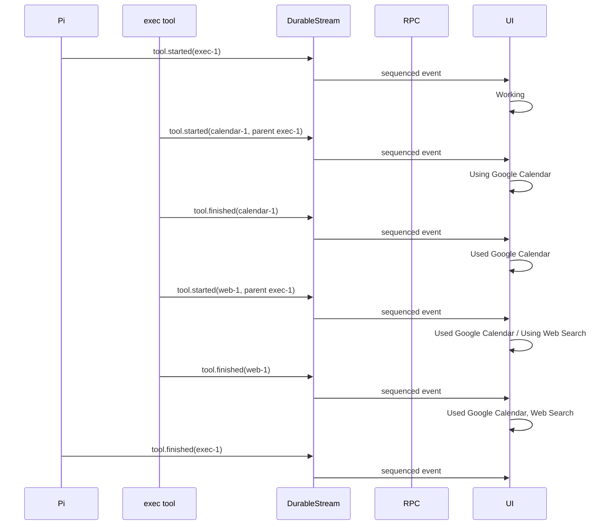
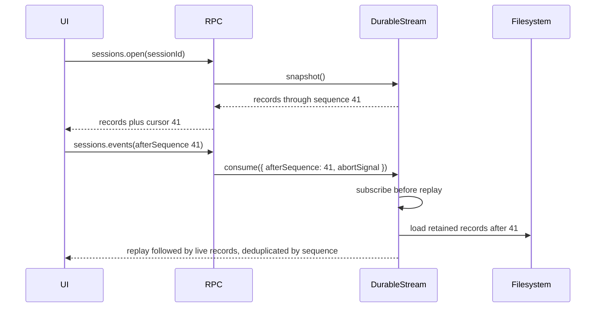

# Durable session activity stream

## System flow

```mermaid
flowchart TD
    subgraph Current
        P1[Pi session messages and events] --> S1[HaloAgentSession event Stream]
        S1 --> R1[sessions.open state plus sessions.events]
        R1 --> C1[useAgentSession mutates AgentSessionState]
        C1 --> V1[sessionViewItems derives Used Exec]
        E1[Executor nested tools] --> X1[One final exec result]
        X1 --> P1
    end

    subgraph Proposed
        P2[Pi lifecycle events] --> A[Halo session-event adapter]
        E2[Executor nested-tool lifecycle] --> A
        A --> D[DurableStream of sequenced SessionLogEvents]
        D --> F[Filesystem JSONL store]
        D --> R2[snapshot plus cursor-safe consume]
        R2 --> C2[Client append-only event log]
        C2 --> P3[Pure session projector]
        P3 --> V2[Messages, active rows, deduplicated summaries]
    end
```







## Problem overview

Halo currently exposes a reduced `AgentSessionState` containing durable messages, a separate streaming message, an error, and a working flag. The renderer reconstructs tool activity from completed Pi tool calls, so every nested Executor invocation is hidden behind the one outer tool name `exec`. Tool summaries are also hard-coded around counts rather than the resources used, so repeated reads of one path count as multiple reads.

The current `Stream` is a hot, non-replaying publisher. `sessions.open` reads a snapshot before `sessions.events` subscribes, which leaves separate snapshot and live paths and permits a race between them. Its `consume(signal)` signature also differs from the requested optional options-object API.

## Solution overview

Introduce a filesystem-backed `DurableStream<T>` that wraps the existing live `Stream`, assigns monotonic sequence numbers, persists records before publishing them, replays retained records, and supports cursor-safe consumption. Change all streams to `consume({ abortSignal }?)`; `DurableStream.consume` additionally accepts `afterSequence`.

Replace `AgentSessionState` with a flat append-only `SessionLogEvent` history. Adapt direct Pi activity and nested Executor activity into the same tool lifecycle events, using `parentId` to attach nested calls to `exec`. The client retains the event array and uses pure projectors to reconstruct messages, active work, errors, and completed summaries. Tool presenters remain entirely client-side and receive the full relevant invocation list, allowing reads to deduplicate by normalized path without a shared deduplication-key abstraction.

### External Durable Streams decision

Do not adopt `@durable-streams/client`, `@durable-streams/server`, or the HTTP protocol in this change. The upstream project targets URL-addressable streams over HTTP, remote and multi-writer clients, SSE/long-poll tailing, CDN fan-out, producer fencing, and general byte-stream framing. Its Node reference server also adds LMDB. Halo currently has a single local writer, a typed loopback oRPC transport, and an explicit requirement to keep state in the selected workspace filesystem; replacing those boundaries would substantially expand this feature without improving its current user-visible behavior.

Borrow four protocol ideas in the local `DurableStream`: offset-based catch-up followed by live tailing, persistence before records become observable, automatic batching of concurrent appends, and explicit recovery of an unfinished stream tail. Keep Halo's offsets as monotonic numeric sequence values because the log has one writer and one filesystem ordering authority. The internal class is not protocol-compatible. Reconsider the upstream protocol if Halo later needs remote viewers, multi-device continuation, multiple writers, or public URL-addressable streams.

## Goals

- Make the session UI consume one ordered, append-only event history for initial load, live updates, and reconnects.
- Persist session UI events under the selected workspace so they survive app restarts.
- Prevent gaps and duplicates between the initial snapshot and live consumption with monotonic sequence cursors.
- Stream nested Executor tool starts and finishes while the outer `exec` is running.
- Represent direct Pi tools and nested Executor tools with the same invocation contract.
- Keep summary grammar, grouping, path display, ordering, and deduplication on the client.
- Show `Working`, `Using Google Calendar`, mixed completed/active rows, and the final `Used Google Calendar, Web Search` state.
- Deduplicate completed reads by normalized file path, so repeated reads of one path produce `Read 1 file`.
- Recover unfinished runs and invocations as interrupted after an unclean shutdown.

## Non-goals

- Backward compatibility or migration for existing pre-launch Halo session UI logs.
- Changing the model-facing Pi transcript, compaction, or branching semantics.
- Adding arbitrary reactive operators to `Stream` without an immediate caller; `scan` can follow when a server-side aggregate is needed.
- Implementing or claiming compatibility with the external Durable Streams HTTP protocol.
- Showing every Executor discovery helper such as `tools.search` or `tools.describe.tool` as user-facing integration activity.
- Designing failure-specific prose such as “Google Calendar failed”; this change records the outcome but keeps the existing completed/errored turn treatment.

## Important files, docs, and websites

- [`packages/server/src/Stream.ts`](../packages/server/src/Stream.ts) — Existing hot stream implementation to retain and wrap.
- [`packages/server/src/filesystem/FilesystemService.ts`](../packages/server/src/filesystem/FilesystemService.ts) — Filesystem error boundary that will gain append support for the JSONL store.
- [`packages/server/src/agent/HaloAgentSession.ts`](../packages/server/src/agent/HaloAgentSession.ts) — Adapts Pi events, owns the session stream, and opens the durable log.
- [`packages/server/src/agent/tools/execTool.ts`](../packages/server/src/agent/tools/execTool.ts) — Existing Pi `onUpdate` boundary for nested-tool lifecycle updates.
- [`packages/server/src/agent/runtime/ToolRuntime.ts`](../packages/server/src/agent/runtime/ToolRuntime.ts) — Executor invocation boundary where nested starts, finishes, identities, and outcomes are observable.
- [`packages/server/src/sessions/sessionsRouter.ts`](../packages/server/src/sessions/sessionsRouter.ts) — Snapshot and cursor-based live session RPC boundary.
- [`packages/shared/src/contract.ts`](../packages/shared/src/contract.ts) — Shared session log, cursor, and RPC contracts.
- [`packages/shared/src/AgentSessionState.ts`](../packages/shared/src/AgentSessionState.ts) — Current reduced state to replace with pure projections over the log.
- [`apps/electron/src/renderer/main/agent/useAgentSession.ts`](../apps/electron/src/renderer/main/agent/useAgentSession.ts) — Client owner of the append-only event array and reconnect loop.
- [`apps/electron/src/renderer/main/agent/sessionView.ts`](../apps/electron/src/renderer/main/agent/sessionView.ts) — Current message projection and summary logic to split into event projection and presenters.
- [`apps/electron/src/renderer/main/agent/ToolActivity.tsx`](../apps/electron/src/renderer/main/agent/ToolActivity.tsx) — Renders completed and active summary rows.
- [`apps/electron/e2e/basic.e2e.test.ts`](../apps/electron/e2e/basic.e2e.test.ts) — Contains the failing end-user regression for `Used Google Calendar, Web Search`.
- [`node_modules/@earendil-works/pi-agent-core/dist/types.d.ts`](../node_modules/@earendil-works/pi-agent-core/dist/types.d.ts) — Installed Pi contract for `onUpdate` and `tool_execution_update`.
- [Durable Streams repository](https://github.com/durable-streams/durable-streams) — Upstream durable-stream design and package inventory; informs the adopt-versus-borrow decision.
- [Durable Streams protocol](https://github.com/durable-streams/durable-streams/blob/main/PROTOCOL.md) — Defines offset-based catch-up/live reads, persistence semantics, closure, and multi-writer behavior that the local design selectively borrows.

## Implementation

### Phase 1: Stream options API and durable replay primitive

Update the base stream consumption API and add a tested filesystem-backed durable stream without changing session behavior yet.

```callstack
 sessionsRouter.events / workspaceRouter.events
-└── stream.consume(signal)
+└── stream.consume({ abortSignal: signal })
     └── consumeStream

+createDurableStream
+└── storage.load
+    └── DurableStream
+        ├── append → storage.append → liveStream.append
+        ├── snapshot
+        └── consume({ abortSignal, afterSequence })
```

Use an options object consistently:

```diff:packages/server/src/Stream.ts
 export type StreamConsumeOptions = {
   abortSignal?: AbortSignal;
 };

 export type ReadonlyStream<T> = {
-  consume(signal?: AbortSignal): AsyncGenerator<T, void, void>;
+  consume(options?: StreamConsumeOptions): AsyncGenerator<T, void, void>;
   map<U>(transform: (value: T) => U): ReadonlyStream<U>;
   filter(predicate: (value: T) => boolean): ReadonlyStream<T>;
 };
```

Define durable records and storage separately from their filesystem encoding:

```ts
type DurableStreamRecord<T> = {
  sequence: number
  value: T
}

type DurableStreamConsumeOptions = StreamConsumeOptions & {
  afterSequence?: number
}

type DurableStreamStorage<T> = {
  load(): Promise<readonly DurableStreamRecord<T>[] | Error>
  append(
    records: readonly DurableStreamRecord<T>[],
  ): Promise<void | Error>
}
```

`DurableStream.append` is asynchronous and returns the assigned record or a tagged persistence error. It serializes concurrent appends, batches records already waiting on the same filesystem write, and publishes them to its internal `Stream` only after storage succeeds. `consume` subscribes to the live stream before selecting replay records, then suppresses replay/live overlap by sequence. This makes snapshot-followed-by-consume gap-free.

Add `FilesystemService.appendFile` and a JSONL storage adapter. Parsing malformed records fails `createDurableStream` with a tagged error rather than silently skipping history.

- [x] Change `ReadonlyStream.consume`, `Stream`, `MappedStream`, `FilteredStream`, and `consumeStream` in `packages/server/src/Stream.ts` to accept `consume({ abortSignal }?)`; update `sessionsRouter.ts` and `workspaceRouter.ts` call sites.
- [x] Add `packages/server/src/DurableStream.ts` with sequenced records, serialized durable append, `snapshot()`, and cursor-safe `consume({ abortSignal, afterSequence }?)` built on `Stream`.
- [x] Add `FilesystemService.appendFile` and `packages/server/src/JsonlDurableStreamStorage.ts`, following the repository’s `errore` boundary conventions.
- [x] Add focused tests covering optional consumption options, abort cleanup, persistence-before-publish, concurrent append order, replay/live overlap, restart reload, and malformed JSONL.
- [x] Run the focused stream tests and `pnpm run check-affected`. The server suite passes; the affected check stops at the intentionally failing tool-label E2E committed before Phase 1.

### Phase 2: Shared append-only session log and pure client projector

Introduce the new event vocabulary and projector while adapting the current `AgentSessionState` into events at the renderer boundary. This phase preserves current UI behavior and provides a safe seam for the transport switch.

```callstack
 AgentPane
-└── useAgentSession → AgentSessionState
-    └── sessionViewItems(state)
+└── useAgentSession → current AgentSessionState
+    └── legacyStateToSessionLog(state)
+        └── projectSession(events)
+            └── sessionViewItems(projectedSession)
```

Define stable facts rather than presentation sentences:

```ts
type ToolIdentity = {
  path: string
  displayName: string
  integrationId?: string
}

type ToolInvocation = {
  id: string
  parentId?: string
  tool: ToolIdentity
  arguments: unknown
}

type SessionLogEvent =
  | { type: "run.started"; runId: string }
  | { type: "run.finished"; runId: string }
  | { type: "message.committed"; message: AgentMessage }
  | { type: "assistant.updated"; runId: string; update: AssistantMessageEvent }
  | { type: "tool.started"; invocation: ToolInvocation }
  | { type: "tool.updated"; invocationId: string; update: unknown }
  | {
      type: "tool.finished"
      invocationId: string
      result: AgentToolResult<unknown>
      isError: boolean
    }
  | HaloConnectionEvent
```

`assistant.updated` stores Pi’s delta/update object, not the repeatedly growing assistant-message snapshot. `message.committed` is the durable final message. The pure projector folds event prefixes into the current transcript, active invocations, working state, and error; none of those derived fields remain canonical state.

- [ ] Define `SessionLogEvent`, `ToolIdentity`, and `ToolInvocation` in `packages/shared/src/sessionLog.ts`, including helpers for stable run and invocation relationships.
- [ ] Replace reducer-centric tests in `packages/shared/src/AgentSessionState.test.ts` with `projectSession` prefix tests for messages, streaming deltas, errors, aborts, direct tool lifecycles, and interrupted runs.
- [ ] Add `legacyStateToSessionLog` temporarily and route `AgentPane.tsx` plus `sessionView.ts` through `projectSession` without changing visible output.
- [ ] Keep summaries behaviorally identical in this phase; move only state reconstruction into the projector.
- [ ] Run `pnpm --filter @get-halo/shared test` and `pnpm --filter @halo/desktop typecheck`, then `pnpm run check-affected`.

### Phase 3: Make DurableStream the session transport and filesystem source

Give every Halo session a durable event log at `.pi/agent/sessions/<sessionId>.halo-events.jsonl`, remove the reduced RPC state, and make snapshot plus cursor consumption the only renderer data path.

```callstack
 HaloAgentSession.create / open
-└── new Stream<HaloSessionEvent>
-    └── Pi subscribe → append live event
+└── createDurableStream(sessionLogPath)
+    ├── recoverInterruptedActivity
+    └── Pi subscribe → adaptPiEvent → durable append

 sessions.open
-└── session.getState()
+└── session.events.snapshot()
     └── { sessionId, records, cursor }

 sessions.events
-└── stream.consume({ abortSignal })
+└── durableStream.consume({ abortSignal, afterSequence })
```

Change the RPC boundary:

```diff:packages/shared/src/contract.ts
 sessions: {
   open: oc
     .input(type<{ sessionId: string }>())
-    .output(type<{ sessionId: string; state: AgentSessionState }>()),
+    .output(type<{
+      sessionId: string;
+      records: DurableStreamRecord<SessionLogEvent>[];
+      cursor: number;
+    }>()),
   events: oc
-    .input(type<{ sessionId: string }>())
-    .output(asyncIteratorObject(type<HaloSessionEvent>())),
+    .input(type<{ sessionId: string; afterSequence?: number }>())
+    .output(asyncIteratorObject(
+      type<DurableStreamRecord<SessionLogEvent>>(),
+    )),
 }
```

The Pi subscription adapter appends semantic events in received order. Append failures are retained as a session error and propagated when `prompt`, `open`, or `close` drains the pending writes; they are never swallowed. On open, find runs and tools with starts but no terminal event and append deterministic interrupted terminal events before returning the snapshot.

Update the E2E harness to seed the Halo event log instead of writing only Pi messages. Because Halo is unreleased, do not add a fallback that rebuilds missing logs from legacy sessions.

- [ ] Add the session log path to `WorkspaceLayout` and open/close a `DurableStream<SessionLogEvent>` in `HaloAgentSession.ts`.
- [ ] Add `adaptPiEvent` for run, message, assistant-delta, direct-tool, and connection events; queue and propagate durable append errors.
- [ ] Replace `sessions.open` and `sessions.events` contracts and handlers with records plus sequence cursors.
- [ ] Change `useAgentSession.ts` to retain only `DurableStreamRecord<SessionLogEvent>[]`, subscribe after the returned cursor, and project the event values; remove `AgentSessionState.ts` and the temporary legacy adapter.
- [ ] Update `SessionDescription.ts` to seed durable events, run focused server/shared/desktop tests, then run `pnpm run check-affected`.

### Phase 4: Publish nested Executor tools as ordinary child invocations

Instrument the sandbox tool invoker and use Pi’s existing `onUpdate` callback to publish nested start and finish facts while `exec` is active. Resolve tool identities from Executor catalog metadata at the runtime boundary; do not generate UI sentences there.

```callstack
 createExecTool.execute
-└── runtime.executeCode(code)
-    └── engine.execute → sandbox tool invoker
+└── runtime.executeCode(code, onToolEvent)
+    └── recordingCodeExecutor
+        └── sandbox tool invoker
+            ├── onToolEvent(tool.started)
+            ├── actualInvoker.invoke
+            └── onExit → onToolEvent(tool.finished)
                 └── Pi onUpdate
                     └── tool_execution_update
                         └── adaptPiEvent → SessionLogEvent
```

The partial-result detail is a transport envelope only:

```ts
type ExecActivityUpdate = {
  type: "halo.exec.tool"
  event:
    | { type: "started"; invocation: ToolInvocation }
    | {
        type: "finished"
        invocationId: string
        result: unknown
        isError: boolean
      }
}
```

Use a fresh nested invocation ID for every call and the outer Pi `toolCallId` as `parentId`. Preserve actual start/settlement order. Resolve connected-tool display names from Executor integration metadata; resolve static tool names from their registered integration and operation metadata. Filter Executor discovery helpers by their catalog classification rather than renderer path checks. Always emit the finish event with `Effect.onExit`, including tool failures and interruption.

- [ ] Pass the outer tool-call ID and an `onToolEvent` callback from `createExecTool` into `ToolRuntime.executeCode`; call Pi `onUpdate` with typed `ExecActivityUpdate` details.
- [ ] Wrap the QuickJS `CodeExecutor` invoker in `ToolRuntime.ts` to emit one started and one terminal update per actual invocation, including parallel calls and errors.
- [ ] Build tool identities from Executor tool/integration catalog records and exclude non-user-facing discovery helpers using metadata owned by the runtime.
- [ ] Extend `adaptPiEvent` to unpack `ExecActivityUpdate` into normal child `tool.started` and `tool.finished` session events; ignore unrelated partial-result details.
- [ ] Add focused runtime/session tests for sequential, parallel, repeated-integration, failure, and interruption events; run `pnpm --filter @get-halo/server test` and `pnpm run check-affected`.

### Phase 5: Client-owned grouping, deduplication, and progressive summaries

Replace the current counters and `integrationLabel` special case with presenters over reduced invocations. Render completed and active summaries as separate structured rows and make the existing failing E2E pass.

```callstack
 SessionView
-└── sessionViewItems
-    └── activitySummary
-        ├── count reads and writes
-        └── exec → Exec
+└── projectSession(eventLog)
+    └── reduceToolInvocations
+        └── summarizeToolActivities
+            ├── readPresenter.completedSummary(all reads)
+            ├── writePresenter.completedSummary(all writes)
+            ├── shellPresenter.completedSummary(all commands)
+            └── integrationPresenter.completedSummary(all integrations)
+                └── ToolActivity(completed rows, active rows)
```

Keep presenters simple and local:

```ts
type ToolActivityPresenter = {
  activeLabel(activity: ReducedToolInvocation): string
  completedSummary(
    activities: readonly ReducedToolInvocation[],
  ): string | undefined
}
```

The read presenter normalizes workspace paths and creates its own `Set` inside `completedSummary`; there is no shared `dedupeKey`. Integration summaries deduplicate by stable integration/tool identity while retaining first-use order. The outer `exec` is hidden when it has visible children and falls back to `Using Exec` or `Used Exec` only when it ran no user-facing nested tool.

`ToolActivitySummary` remains structured:

```ts
type ToolActivitySummary = {
  completed: string[]
  active: string[]
}
```

Render the joined completed sentence on the primary row and each active sentence on an indented row with its own `Thinking` indicator. This supports the required transitions without encoding whitespace in summary strings.

- [ ] Extract `reduceToolInvocations` and presenter-based `summarizeToolActivities` from `sessionView.ts`; deduplicate reads/writes by normalized path and integrations by stable identity inside each presenter.
- [ ] Change `SessionViewPart` and `ToolActivity.tsx` to render structured completed and active rows, including the empty `Working` state and outer-`exec` fallback.
- [ ] Add projector/presenter tests for repeated paths, distinct paths, repeated integrations, mixed direct/nested activity, parallel calls, and every required intermediate prefix.
- [ ] Update the E2E fixture to express structured invocation facts, make `shows tools used inside exec` pass, and add a live-progress E2E covering `Using` to `Used` transitions through the user-visible renderer.
- [ ] Run `pnpm --filter @halo/desktop exec playwright test --grep "tools used inside exec|streams tool activity"` and `pnpm run check-affected`.

## Final verification

- [ ] Confirm `consume()`, `consume({})`, and `consume({ abortSignal })` work on `Stream`, and cursor consumption works on `DurableStream`.
- [ ] Confirm a restarted app reconstructs the same completed transcript and summaries from the filesystem log.
- [ ] Confirm an interrupted process produces terminal interrupted events on the next open rather than permanent active work.
- [ ] Confirm two reads of one normalized path render `Read 1 file`, while two different paths render `Read 2 files`.
- [ ] Confirm nested calls stream the exact visible progression: `Working` → `Using Google Calendar` → `Used Google Calendar` plus `Using Web Search` → `Used Google Calendar, Web Search`.
- [ ] Confirm repeated integration calls are preserved in the log but deduplicated only in the client summary.
- [ ] Confirm every phase passes `pnpm run check-affected` before landing.
