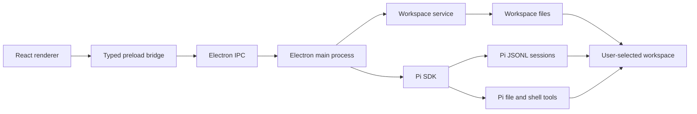
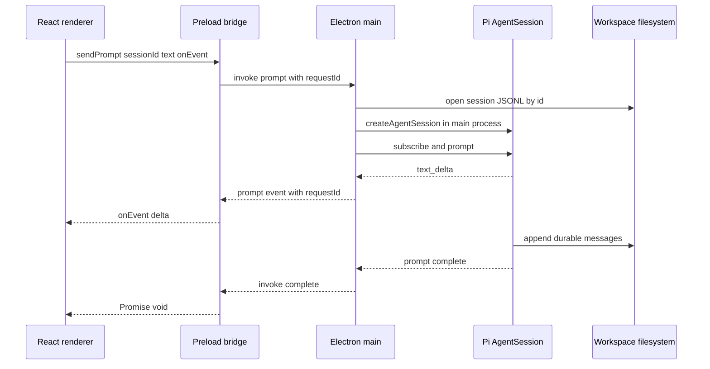

# Electron shell with Pi in the main process





## Problem overview

Halo now uses Tauri and a Rust AgentOS service. Rust starts a native sidecar, mounts a SQLite-backed VM, installs Pi as an AgentOS package, forwards session events through Tauri channels, and exposes commands to the React webview. This makes a local Node agent depend on Rust, a sidecar, a VM, generated AgentOS bindings, and one opaque `agentos.sqlite` file.

The current branch also has unfinished AgentOS code-mode work under `apps/halo/src-tauri`. That work depends on the VM and the `agentos-halo` binding, so it cannot serve the requested Electron design.

## Solution overview

Replace the desktop host with Electron Forge. Run `@mariozechner/pi-coding-agent` in Electron's main process through its SDK, and expose only Halo's typed methods through a context-isolated preload bridge. The renderer keeps its `SystemApi` boundary and does not gain Node or Electron access.

Replace username entry with a native folder picker at app startup. Use the selected directory as Pi's `cwd`, keep Pi config under `.pi/agent`, and pass `.pi/agent/sessions` as Pi's session directory. Halo, Pi, and a person inspecting the workspace then read the same files. Do not store a last username or silently reopen a prior folder: each new app process starts without a workspace and asks the user to choose one. A renderer reload may reuse the directory already selected in that process.

Use Pi's normal coding tools bound to the workspace `cwd`. Remove the AgentOS TypeScript evaluator and its `exec` extension. Pi and its shell commands will have the same host permissions as Halo's Electron process; this plan does not claim a VM or process sandbox.

## Goals

- Start, package, and run Halo with Electron instead of Tauri.
- Create and own Pi `AgentSession` objects in Electron's main process.
- Preserve durable session listing, transcript reading, first-send creation, and streamed assistant text in the current UI.
- Keep renderer privileges narrow with `contextIsolation`, sandboxing, no Node integration, and one typed preload method per operation.
- Store workspace files, Pi settings, and Pi JSONL sessions in one ordinary directory tree.
- Ask the user to choose an existing folder through Electron's native directory picker before any workspace or session request can run.
- Keep model credentials in the main-process environment and out of renderer messages, logs, and workspace files.
- Keep `pnpm halo-web` able to inspect and drive the running debug app.
- Remove Rust, Tauri, AgentOS, the sidecar, VM packages, generated bindings, and AgentOS-specific checks and docs.

## Non-goals

- Do not migrate or read existing `agentos.sqlite` databases. The Electron workspace starts from the new filesystem layout.
- Do not preserve the AgentOS VM, network permission model, code-mode evaluator, `halo-exec.js`, or `halo-tools.mjs`.
- Do not isolate Pi from the host OS. Pi's file and shell tools run with the Electron app user's rights.
- Do not add workspace switching after one directory has been selected in the current app process.
- Do not remember or reopen the last workspace across app launches.
- Do not add credential entry, OAuth, provider selection, model selection, session branching, deletion, or pagination UI.
- Do not add auto-update, signing, notarization, publishing, crash reporting, or a background utility process.
- Do not expose raw `ipcRenderer`, filesystem, shell, Electron, or Pi objects to the renderer.

## Important files, docs, and websites

- [`apps/halo/src-tauri/src/lib.rs`](../apps/halo/src-tauri/src/lib.rs) — Current window lifecycle, app-data resolution, command registration, prompt channel, menu, and shutdown path that Electron replaces.
- [`apps/halo/src-tauri/src/agentos_service/`](../apps/halo/src-tauri/src/agentos_service/) — Current workspace, provider, session, transcript, streaming, and sidecar behavior to replace in TypeScript.
- [`apps/halo/src/api/SystemApi.ts`](../apps/halo/src/api/SystemApi.ts) — Renderer-facing contract to keep transport-neutral and trim once the Electron bridge lands.
- [`apps/halo/src/api/tauri.ts`](../apps/halo/src/api/tauri.ts) — Current Tauri transport; replace it with a thin `window.halo` adapter.
- [`apps/halo/src/api/ApiProvider.tsx`](../apps/halo/src/api/ApiProvider.tsx) — Workspace restore, session queries, prompt streaming, and durable refresh behavior that must keep working.
- [`apps/halo/src/Onboarding.tsx`](../apps/halo/src/Onboarding.tsx) — Replace the username form with startup folder selection and a retry button after picker cancellation.
- [`apps/halo/package.json`](../apps/halo/package.json) — Replace Tauri, AgentOS, Rust, and packed package dependencies and scripts with Electron Forge and the direct Pi SDK.
- [`apps/halo/vite.config.ts`](../apps/halo/vite.config.ts) — Current renderer Vite config; split it into Forge's main, preload, and renderer builds.
- [`packages/halo-web-cli/src/webdriver.ts`](../packages/halo-web-cli/src/webdriver.ts) — Current Tauri WebDriver attachment; replace it with an Electron debug CDP attachment.
- [`packages/halo-web-cli/src/cli.ts`](../packages/halo-web-cli/src/cli.ts) — Keep the small `status` and `exec` surface while changing the script object from WebdriverIO `browser` to Playwright `page`.
- [`README.md`](../README.md) — Rewrite the runtime, storage, development, automation, credential, and check sections.
- `@mariozechner/pi-coding-agent 0.60.0/docs/sdk.md` in the installed package — Defines `createAgentSession`, `SessionManager`, event subscriptions, explicit `cwd`, tools, auth, and cleanup.
- `@mariozechner/pi-coding-agent 0.60.0/dist/core/session-manager.d.ts` in the installed package — Defines JSONL session headers and entries, `list`, `open`, `create`, `getBranch`, and custom session directories.
- [Electron process model](https://www.electronjs.org/docs/latest/tutorial/process-model) — Defines main, renderer, and preload ownership.
- [Electron context isolation](https://www.electronjs.org/docs/latest/tutorial/context-isolation) — Requires a narrow method-per-message preload bridge instead of exposing `ipcRenderer`.
- [Electron IPC](https://www.electronjs.org/docs/latest/tutorial/ipc) — Defines renderer-to-main invokes and main-to-renderer events.
- [Electron native dialogs](https://www.electronjs.org/docs/latest/api/dialog) — Defines the main-process `showOpenDialog` directory picker and its cancel result.
- [Electron Forge Vite plugin](https://www.electronforge.io/config/plugins/vite) — Defines separate main, preload, and renderer Vite builds. Its experimental status means the lockfile must pin the chosen Forge minor.
- [Electron Forge TypeScript config](https://www.electronforge.io/config/typescript-configuration) — Defines typed `forge.config.ts` support in Forge 7.8.1 and later.
- [Electron Forge makers](https://www.electronforge.io/config/makers) — Defines platform packages and installer makers.

## Implementation

### Phase 1: Add the selected-folder workspace service

Add a main-process service that accepts one absolute directory selected by Electron, verifies it, and creates Pi's state directories inside it. This phase leaves Tauri as the active shell but proves the new storage boundary without AgentOS.

#### Important types

```ts
// apps/halo/electron/workspace-service.ts
export type WorkspaceLayout = {
  root: string;
  agentDir: string;
  sessionDir: string;
};

export type WorkspaceInfo = {
  name: string;
  workspaceRoot: string;
};

type WorkspaceState =
  { status: "notStarted" } | { status: "ready"; layout: WorkspaceLayout };
```

#### Call stack diff

```diff
 future Electron app startup
+└── new WorkspaceService
+    ├── getWorkspace -> null
+    └── select(directory)
+        ├── resolve absolute real path
+        ├── verify selected path is a directory
+        ├── mkdir directory/.pi/agent/sessions
+        └── retain layout for this app process
```

#### Code diff preview

```diff
 // apps/halo/electron/workspace-service.ts
+export class WorkspaceService {
+  private state: WorkspaceState = { status: "notStarted" };
+
+  async select(directory: string): Promise<WorkspaceInfo> {
+    const layout = await workspaceLayout(directory);
+    await mkdir(layout.sessionDir, { recursive: true, mode: 0o700 });
+    this.state = { status: "ready", layout };
+    return { name: basename(layout.root), workspaceRoot: layout.root };
+  }
+}
```

- [x] Add `apps/halo/electron/workspace-service.ts`; resolve the selected directory with `realpath`, verify it is a directory, and derive `<selected>/.pi/agent/sessions` with `node:path`.
- [x] Create only `.pi/agent/sessions` on selection and leave all other workspace files alone; surface filesystem errors from the owning operation instead of substituting another directory.
- [x] Keep one explicit `notStarted | ready` state, reject selection of a second different directory, and expose the active layout to main-process consumers without a workspace switch or remembered-workspace path.
- [x] Add `apps/halo/electron/workspace-service.test.ts` coverage for a valid directory, a missing path, a file path, symlink resolution, layout paths, and repeat selection; run `pnpm --filter @halo/desktop test` and `pnpm --filter @halo/desktop typecheck`.

### Phase 2: Run durable Pi sessions directly in Node

Add a Pi service that uses the ready workspace as `cwd`, `agentDir`, and explicit session storage. It creates no child backend or VM: `createAgentSession` runs in whichever process constructs this service, which the next phase makes Electron main.

#### Important types

```ts
// apps/halo/electron/pi-service.ts
export type PiSessionSummary = {
  sessionId: string;
  cwd: string;
  state: "idle" | "running";
  title?: string;
  createdAt: string;
  updatedAt: string;
};

export type PiTranscript = {
  messages: Array<{
    id: string;
    role: "user" | "assistant";
    text: string;
    timestamp: string;
  }>;
};

export type PromptEvent = { type: "delta"; sessionId: string; text: string };
export type PromptEventSink = (event: PromptEvent) => void;
```

#### Call stack diff

```diff
 create session
-└── Rust create_or_reopen_session
-    └── AgentOS open_session(agent = "pi")
+└── PiService.createSession
+    └── SessionManager.create(workspaceRoot, sessionDir)
+        └── append JSONL header under workspace/.pi/agent/sessions

 send prompt
-└── AgentOS sidecar -> Pi package in VM -> Tauri Channel
+└── PiService.sendPrompt(sessionId, text, onEvent)
+    ├── find SessionInfo by exact id
+    ├── SessionManager.open(path, sessionDir)
+    ├── createAgentSession({ cwd, agentDir, sessionManager, tools })
+    ├── AgentSession.subscribe -> text_delta -> onEvent
+    ├── AgentSession.prompt
+    └── unsubscribe and dispose
```

#### Code diff preview

```diff
 // apps/halo/electron/pi-service.ts
+const manager = SessionManager.open(info.path, layout.sessionDir);
+const { session } = await createAgentSession({
+  cwd: layout.root,
+  agentDir: layout.agentDir,
+  sessionManager: manager,
+  tools: createCodingTools(layout.root),
+});
+const unsubscribe = session.subscribe((event) => {
+  if (
+    event.type === "message_update" &&
+    event.assistantMessageEvent.type === "text_delta"
+  ) {
+    onEvent({ type: "delta", sessionId, text: event.assistantMessageEvent.delta });
+  }
+});
+await session.prompt(prompt);
+unsubscribe();
+session.dispose();
```

- [x] Add direct production dependencies on `@mariozechner/pi-coding-agent` `0.60.0`; construct `AuthStorage` and `ModelRegistry` in `PiService` so Pi resolves API keys from the main-process environment and reads optional settings from the workspace `agentDir`.
- [x] Implement create, exact-ID lookup, newest-first list, current-branch transcript mapping, and text-only assistant streaming with `SessionManager.create`, `list`, `open`, and `getBranch`; do not parse JSONL by hand.
- [x] Bind `createCodingTools(layout.root)` and Pi resource discovery to the same root; exclude tool results and thinking from the UI transcript, use session entry IDs and timestamps, and use the first user text as the row title.
- [x] Track active `AgentSession` objects by session ID, reject a second prompt for the same session, remove and dispose them after completion, and abort and dispose any active sessions during app shutdown.
- [x] Add Vitest tests with a small injected Pi session factory for ordered deltas, prompt failure, concurrent-send rejection, cleanup, shutdown, transcript filtering, and persistence across a new service instance; use real `SessionManager` files but no paid model call, then run `pnpm --filter @halo/desktop test`.

### Phase 3: Switch the running app to a secure Electron bridge

Add the Electron entry point, BrowserWindow, preload, IPC handlers, and renderer adapter, then make Forge the development command. After this phase, `pnpm dev` opens Electron and every workspace and Pi request executes in its main process.

#### Important types

```ts
// apps/halo/src/api/SystemApi.ts
export type WorkspaceInfo = {
  name: string;
  workspaceRoot: string;
};

export type PromptStreamEvent = {
  type: "delta";
  sessionId: string;
  text: string;
};

export type SystemApi = {
  getWorkspace: () => Promise<WorkspaceInfo | null>;
  chooseWorkspace: () => Promise<WorkspaceInfo | null>;
  listSessions: () => Promise<SessionSummary[]>;
  readSessionTranscript: (sessionId: string) => Promise<SessionTranscript>;
  createSession: () => Promise<SessionSummary>;
  sendPrompt: (
    sessionId: string,
    prompt: string,
    onEvent: PromptEventHandler,
  ) => Promise<void>;
};

// apps/halo/electron/ipc.ts
export type PromptEventEnvelope = {
  requestId: string;
  event: PromptStreamEvent;
};
```

#### Call stack diff

```diff
 pnpm dev
-└── tauri dev
-    ├── Rust setup HaloState
-    └── WKWebView -> @tauri-apps/api invoke and Channel
+└── electron-forge start
+    ├── Electron main -> WorkspaceService + PiService
+    ├── BrowserWindow
+    │   └── sandboxed renderer -> React
+    └── preload contextBridge.exposeInMainWorld("halo", SystemApi)
+        ├── chooseWorkspace -> dialog.showOpenDialog(openDirectory)
+        ├── ipcRenderer.invoke -> ipcMain.handle -> services
+        └── prompt event envelope -> request-scoped renderer callback
```

#### Code diff preview

```diff
 // apps/halo/src/main.tsx
 import { ApiProvider } from "./api/ApiProvider.js";
-import { tauriApi } from "./api/tauri.ts";
+import { electronApi } from "./api/electron.js";
 ...
-    <ApiProvider api={tauriApi}>
+    <ApiProvider api={electronApi}>

 // apps/halo/electron/preload.ts
+contextBridge.exposeInMainWorld("halo", {
+  getWorkspace: () => ipcRenderer.invoke(IPC.getWorkspace),
+  chooseWorkspace: () => ipcRenderer.invoke(IPC.chooseWorkspace),
+  createSession: () => ipcRenderer.invoke(IPC.createSession),
+  sendPrompt: (sessionId, prompt, onEvent) =>
+    invokePrompt(sessionId, prompt, onEvent),
+  ...
+} satisfies SystemApi);

 // apps/halo/electron/main.ts
+ipcMain.handle(IPC.chooseWorkspace, async (event) => {
+  const parent = BrowserWindow.fromWebContents(event.sender)!;
+  const selection = await dialog.showOpenDialog(parent, {
+    properties: ["openDirectory"],
+  });
+  if (selection.canceled) return null;
+  return workspaceService.select(selection.filePaths[0]!);
+});
```

- [x] Add `electron/main.ts`, `preload.ts`, and `ipc.ts`; build one 1100×720 window with the current minimum size and macOS traffic lights at `{ x: 11, y: 11 }`, recreate the reload menu, implement `chooseWorkspace` with a parented `showOpenDialog({ properties: ["openDirectory"] })`, and call `PiService.shutdown()` from `before-quit`.
- [x] Set `contextIsolation: true`, `sandbox: true`, and `nodeIntegration: false`; expose one typed method per `SystemApi` operation and use a generated request ID plus one fixed event channel for prompt deltas. Never expose raw IPC or accept a path from the renderer.
- [x] Replace username onboarding with a **Choose workspace** gate in `Onboarding.tsx`; on a fresh process, have `ApiProvider` open the picker once, show the gate after cancel, and let its button reopen the picker. Remove startup preferences, owner-slug input, Tauri health, sidecar, file, prompt-response, resync, and unused pagination fields, then add the `window.halo` adapter and declaration.
- [x] Add `forge.config.ts`, main/preload/renderer Vite configs, Electron Forge, the Vite and native-unpack plugins, platform makers, Electron, and `electron-squirrel-startup`; bundle the main-process Pi SDK so Forge packages it in the app.
- [x] Change `@halo/desktop` scripts to `electron-forge start`, `package`, and `make`; run its tests and checks, then smoke-test picker cancel, folder selection, reload reuse, new-process re-prompt, session restore, first send, streaming, failure, and retry in Electron.

### Phase 4: Move live-app automation to Electron's debug endpoint

Expose Chromium's DevTools Protocol only in Forge development, then attach the existing `halo-web` CLI to the already-running renderer with Libretto Browser Tools. The CLI inspects Halo but does not launch or stop it.

#### Important types

```ts
// packages/halo-web-cli/src/browser-tools.ts
type DebuggerVersion = { webSocketDebuggerUrl: string };
type ConnectedTools = { sessionId: string; toolkit: BrowserToolkit };
```

#### Call stack diff

```diff
 pnpm halo-web exec
-└── webdriverio.remote(127.0.0.1:4445)
-    └── Tauri embedded WebDriver -> WKWebView
+└── GET http://127.0.0.1:4445/json/version
+    └── createBrowserTools(LocalBrowserProvider)
+        └── browser_connect(webSocketDebuggerUrl)
+            └── browser_exec(code) -> Halo Page
```

#### Code diff preview

```diff
 // packages/halo-web-cli/src/browser-tools.ts
-const browser = await remote({ hostname, port, capabilities: {} });
+const toolkit = createBrowserTools(new LocalBrowserProvider());
+const connection = await toolkit.tools.browser_connect.execute({ cdpUrl });
 try {
-  return await new AsyncFunction("browser", source)(browser);
+  return await toolkit.tools.browser_exec.execute({
+    sessionId: connection.sessionId,
+    code: source,
+  });
 } finally {
-  await browser.deleteSession();
+  await toolkit.dispose();
 }
```

- [x] In `electron/main.ts`, set `remote-debugging-address=127.0.0.1` and port `4445` before `app.ready` only when the Forge renderer dev-server global is present; release packages must not open the port.
- [x] Replace `webdriverio` with `libretto-browser-tools` in `@halo/web-cli`, rename `webdriver.ts` to `browser-tools.ts`, read `/json/version`, and attach Libretto's local provider to Halo's CDP WebSocket without closing the app.
- [x] Add `status`, `snapshot`, and `exec` commands with Playwright `page` code through Libretto Browser Tools; keep argument/stdin handling, TOON output, localhost-only attachment, and the rule that the CLI does not own app startup.
- [x] Update CLI text, examples, tests, and `.agents/skills/halo-web/SKILL.md`; run all CLI checks and verify `status`, `snapshot`, and `exec` against the running Electron app.

### Phase 5: Remove Tauri and AgentOS and finish the package

Delete the unused host after Electron covers the full runtime. Clean package metadata, workspace policy, checks, and docs in the same commit so no command or file still suggests that Rust, a sidecar, or `agentos.sqlite` participates in Halo.

#### Important types

```diff
 // Removed with apps/halo/src-tauri/src/lib.rs
-struct HaloState {
-    agentos: Arc<AgentOsService>,
-    startup: StartupConfig,
-    device_settings_path: PathBuf,
-}

 // Sole runtime state after this phase
 // apps/halo/electron/main.ts
+const workspaceService = new WorkspaceService(dataRoot);
+const piService = new PiService(workspaceService);
```

#### Call stack diff

```diff
-Tauri run
-├── Rust HaloState
-├── AgentOS sidecar and VM
-├── agentos.sqlite
-└── packed Pi and coreutils packages
 Electron main
 ├── WorkspaceService -> ordinary workspace directory
 ├── PiService -> Pi JSONL sessions
 └── BrowserWindow -> preload -> React renderer
```

#### Code diff preview

```diff
 // apps/halo/package.json
-"build": "vite build && cargo check --manifest-path src-tauri/Cargo.toml",
-"check:rust": "cargo fmt ... && cargo clippy ... && cargo test ...",
-"dev": "tauri dev",
+"build": "electron-forge package",
+"dev": "electron-forge start",
+"make": "electron-forge make",
 ...
-"@tauri-apps/api": "^2.11.1",
-"@agentos-software/pi": "0.2.7",
-"@rivet-dev/agentos-sidecar": "0.2.15",
+"@mariozechner/pi-coding-agent": "0.60.0",
```

- [x] Delete `apps/halo/src-tauri`, `src/api/tauri.ts`, Tauri capabilities, AgentOS assets, Rust manifests and locks, sidecar build logic, and the unfinished AgentOS code-mode files; do not port the binding or evaluator.
- [x] Remove Tauri, AgentOS, coreutils, sidecar, Rust, and WebdriverIO dependencies plus the sidecar release-age exceptions; refresh `pnpm-lock.yaml` and confirm no active runtime, script, or dependency references remain.
- [x] Remove `check:rust` from root scripts and Turbo tasks, add Electron `.vite` and `out` build outputs where needed, and keep `pnpm check` as the full repository check.
- [x] Rewrite `README.md` with Electron development, main-process Pi, host permission scope, filesystem workspace layout, credentials, Libretto `halo-web` examples, packaging, and checks; state plainly that old AgentOS databases are not imported.
- [x] Run `pnpm run check-affected`, build the packaged app, run all `@halo/web-cli` tests, inspect the live app through Libretto Browser Tools, and prove Pi session persistence with real `SessionManager` files in tests.
