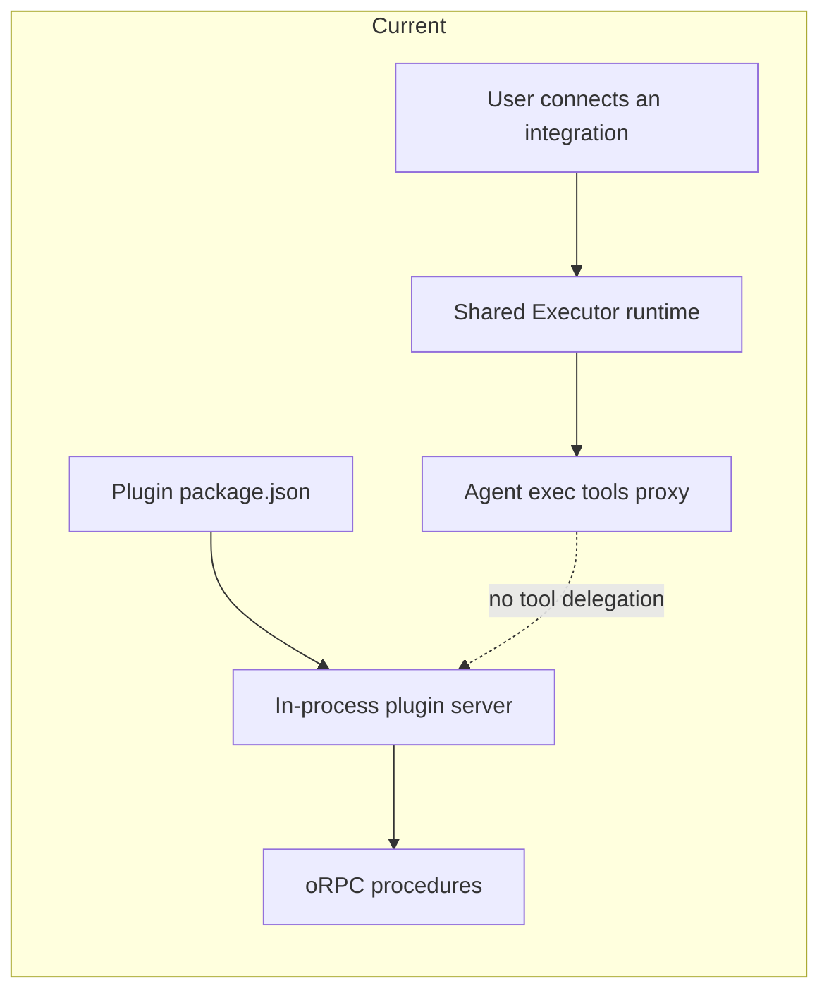
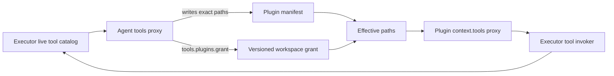
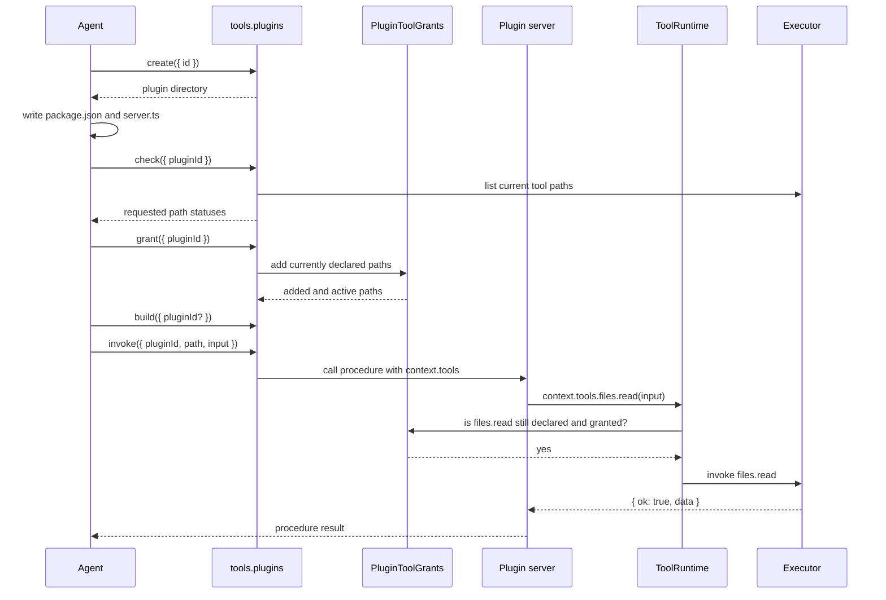
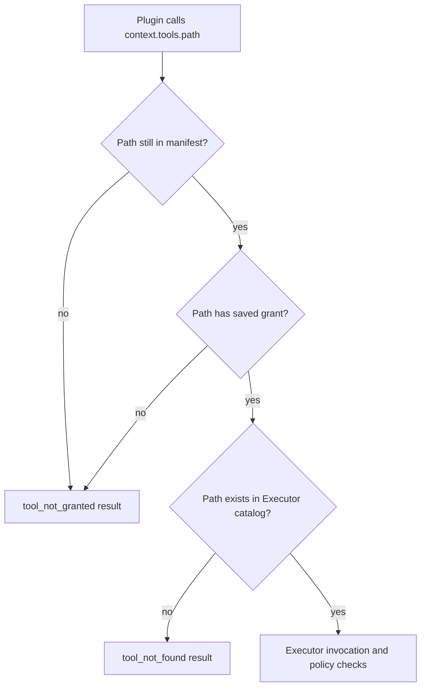

# Executor tool capabilities for plugins

## System flow









## Problem overview

Agents can use Halo files, Bash, web, and connected Google tools through Executor's lazy `tools` proxy. Plugin servers cannot use that tool surface: their context only contains `pluginId` and `workspaceRoot`. Halo also has no dynamic plugin grant format, so adding future MCP servers would otherwise require a growing app-owned capability list.

## Solution overview

Treat an Executor sandbox path as the plugin capability. A manifest lists exact paths such as `files.read` or `google_calendar.user.calendar.calendar.events.list`; Halo never enumerates those values in an application schema. The agent explicitly adds the declared paths to a saved plugin grant with `tools.plugins.grant({ pluginId })`. Removing a path from the manifest revokes and prunes it. Plugin handlers receive the same lazy `context.tools.<path>(input)` form and the same `{ ok, data/error }` result envelope as `exec`.

One app-owned `ToolRuntimeService` supplies the catalog and invoker to sessions, plugin management, renderer calls, and future MCP integrations. Existing plugin server code remains trusted and in-process for now; the proxy and invoker boundary must remain data-only so it can cross QuickJS or a worker later.

## Goals

- Use Executor sandbox paths as dynamic plugin capability IDs, with no Halo enum of integrations or tools.
- Add optional exact requested tool paths to manifest v1 without invalidating existing plugins.
- Add `tools.plugins.list`, `create`, `build`, `types`, `check`, `grant`, and non-streaming `invoke` to the agent's Executor surface.
- Make each explicit grant add the manifest's currently declared paths without replacing other active grants.
- Revoke and prune a path when it leaves the manifest; adding it again requires another explicit grant after reconciliation.
- Give plugin server handlers a lazy `context.tools` proxy that uses Executor's path syntax and result envelopes.
- Enforce the complete exact path before every plugin tool invocation.
- Share the same Executor instance, connections, policies, and future dynamic catalog between agents and plugins.
- Keep plugin state in the chosen workspace and make checks useful to both agents and humans.

## Non-goals

- Adding or configuring MCP servers in this work. Later MCP plugins should appear through the same Executor catalog without a capability redesign.
- Supporting portable connection aliases. Initial paths may bind workspace plugins to connection names such as `google_calendar.user.calendar`.
- Granting a path that the creating agent cannot use, or adding a user approval flow for that mismatch.
- Giving plugin code OAuth tokens, credential-provider access, or Executor core objects.
- Running plugin servers in QuickJS, a worker, or another sandbox. Current Jiti-loaded server code remains trusted workspace code.
- Streaming through `tools.plugins.invoke`; async iterable procedures return a clear unsupported error.
- Generated per-tool TypeScript clients or autocomplete. Agents can use Executor search and describe before writing exact paths.
- A new `tools.catalog` facade.

## Important files, docs, and websites

- [`apps/electron/src/main/agent/runtime/ToolRuntime.ts`](../apps/electron/src/main/agent/runtime/ToolRuntime.ts) — Owns Executor, QuickJS execution, catalog reads, direct invocation, OAuth, and Halo static tools.
- [`apps/electron/src/main/agent/runtime/ToolRuntimeService.ts`](../apps/electron/src/main/agent/runtime/ToolRuntimeService.ts) — Must become the app-owned lifecycle for the one shared runtime.
- [`apps/electron/src/main/sessions/SessionRegistry.ts`](../apps/electron/src/main/sessions/SessionRegistry.ts) — Currently constructs and closes `ToolRuntimeService` itself.
- [`apps/electron/src/main/agent/tools/HaloToolPlugin.ts`](../apps/electron/src/main/agent/tools/HaloToolPlugin.ts) — Defines host tools and the execution context used by `tools.plugins`.
- [`apps/electron/src/main/plugins/PluginService.ts`](../apps/electron/src/main/plugins/PluginService.ts) — Existing plugin create, build, typecheck, list, server load, and invoke paths.
- [`apps/electron/src/main/plugins/loadPluginServer.ts`](../apps/electron/src/main/plugins/loadPluginServer.ts) — Loads trusted server routers through Jiti.
- [`apps/electron/src/main/plugins/readPluginManifest.ts`](../apps/electron/src/main/plugins/readPluginManifest.ts) — Parses manifests and resolves entries.
- [`apps/electron/src/main/plugins/haloPluginSkill.md`](../apps/electron/src/main/plugins/haloPluginSkill.md) — Agent authoring workflow to update after the direct management tools exist.
- [`packages/plugin-sdk/src/schema.ts`](../packages/plugin-sdk/src/schema.ts) — Owns the manifest schema.
- [`packages/plugin-sdk/src/server.ts`](../packages/plugin-sdk/src/server.ts) — Owns the public plugin server context and must type the lazy tools proxy.
- [`apps/electron/src/main/plugins/PluginService.test.ts`](../apps/electron/src/main/plugins/PluginService.test.ts) — Public service tests for manifests, builds, types, and server invocation.
- [`apps/electron/src/main/HaloRpcHttp.test.ts`](../apps/electron/src/main/HaloRpcHttp.test.ts) — Real oRPC boundary for plugin lifecycle and procedure invocation.
- [`@executor-js/execution` tool invoker](https://github.com/UsefulSoftwareCo/executor/blob/v1.6.0/packages/core/execution/src/tool-invoker.ts#L289-L375) — Public `makeExecutorToolInvoker` behavior and result normalization.
- [`@executor-js/runtime-quickjs` tools proxy](https://github.com/UsefulSoftwareCo/executor/blob/v1.6.0/packages/kernel/runtime-quickjs/src/index.ts#L226-L251) — Path-collecting proxy behavior to mirror for plugin servers.
- [`@executor-js/sdk` canonical addresses](https://github.com/UsefulSoftwareCo/executor/blob/v1.6.0/packages/core/sdk/src/executor.ts#L203-L256) — Dynamic address shape and parser.
- [`@executor-js/sdk` dynamic tool catalog](https://github.com/UsefulSoftwareCo/executor/blob/v1.6.0/packages/core/sdk/src/executor.ts#L3680-L3775) — Live `tools.list()` behavior that future MCP tools use.

## Implementation

### Phase 1: Make the runtime an app-owned service

Move `ToolRuntimeService` ownership to the main composition root and inject it into `SessionRegistry`. Configure it with workspace, user, host tool factories, and agent authority so any host caller can lazily open the same runtime. Session shutdown closes sessions; workspace switch and app shutdown close the shared runtime after callers stop.

```callstack
 main.ts
-├── new SessionRegistry(options)
-│   └── new ToolRuntimeService()
+├── new ToolRuntimeService(runtimeOptions)
+├── new SessionRegistry({ ...options, toolRuntime })
+└── app/workspace shutdown
+    ├── sessionRegistry.shutdown()
+    └── toolRuntime.close()
```

```diff:apps/electron/src/main/sessions/SessionRegistry.ts
 type SessionRegistryOptions = {
   workspace: WorkspaceService;
   user: UserService;
   toolPluginFactories: readonly HaloToolPluginFactory[];
   authority: AgentAuthority;
+  toolRuntime: ToolRuntimeService;
 };

 export class SessionRegistry {
-  private readonly toolRuntime = new ToolRuntimeService();
-
   private sessionOptions(): HaloAgentSessionOptions {
     return {
       ...this.options,
-      toolRuntime: this.toolRuntime,
+      toolRuntime: this.options.toolRuntime,
     };
   }
 }
```

```diff:apps/electron/src/main/main.ts
+const toolRuntime = new ToolRuntimeService();
 const sessionRegistry = new SessionRegistry({
   workspace: workspaceService,
   user: userService,
   toolPluginFactories,
   authority,
+  toolRuntime,
 });
```

- [ ] Inject one `ToolRuntimeService` through `SessionRegistryOptions` and remove its private construction in `apps/electron/src/main/sessions/SessionRegistry.ts`.
- [ ] Move runtime close calls to `closeAppServices` and `switchWorkspace` in `apps/electron/src/main/main.ts`, after open sessions close.
- [ ] Keep OAuth redirect, completion, cancellation, and connection cards routed through the same injected service.
- [ ] Update real `HaloRpcHttp` fixtures and session tests for the new construction path, then run `pnpm --filter @halo/desktop test`.
- [ ] Run `pnpm run check-affected`.

### Phase 2: Add optional manifest capabilities and versioned incremental grants

Add optional `capabilities: string[]` to manifest v1. Paths omit the root `tools.` because that is how Executor search results and sandbox dispatch identify them. A missing field normalizes to an empty request, so existing and newly scaffolded plugins remain unchanged.

Add `PluginToolGrants` as the one owner of `{workspace}/.halo/pluginGrants.json`. Store both the last observed manifest paths and saved grants. Reconciliation removes grants for paths no longer declared before checks or calls. `grant(pluginId)` unions all currently declared paths into the saved set.

```callstack
 PluginService manifest read
-└── haloManifestV1
+├── haloManifestV1 → capabilities ?? []
+└── PluginToolGrants.reconcile(pluginId, currentPaths)
+    ├── remove no-longer-declared paths
+    └── persist observed and granted sets
```

```diff:packages/plugin-sdk/src/schema.ts
 export const haloManifestV1 = Type.Object({
   version: Type.Literal(1),
   name: Type.String({ minLength: 1 }),
   description: Type.Optional(Type.String()),
   view: Type.Optional(Type.String({ minLength: 1 })),
   server: Type.Optional(Type.String({ minLength: 1 })),
+  capabilities: Type.Optional(
+    Type.Array(Type.String({ minLength: 1 }), { uniqueItems: true }),
+  ),
 });
```

```ts
// apps/electron/src/main/plugins/PluginToolGrants.ts
export type PluginToolGrantState = {
  version: 1;
  plugins: Record<
    string,
    {
      observed: string[];
      granted: string[];
    }
  >;
};
```

- [x] Add optional `capabilities` to `haloManifestV1` and normalize a missing field to no requested paths in `packages/plugin-sdk/src/schema.ts` and `readPluginManifest.ts`.
- [x] Add `PluginToolGrants.ts` with versioned TypeBox parsing, ENOENT-as-empty handling, incremental `grant`, reconciliation, and tagged file/parse errors.
- [x] Test manifests with missing and declared capabilities, duplicate paths, incremental grants, removal pruning, and remove-then-readd requiring a new grant through public grant methods.
- [x] Run `pnpm --filter @halo/plugin-sdk test` and `pnpm --filter @halo/desktop test`.

### Phase 3: Add Executor-equivalent host invocation and proxy

Expose Executor's sandbox path view from `ToolRuntime`: list paths by stripping the leading `tools.` from dynamic addresses while preserving static fully qualified IDs. Wrap `makeExecutorToolInvoker` so plugin calls receive the same policy, credential resolution, expected-error handling, and `{ ok, data/error }` envelope as `exec`.

Add a host-side recursive proxy that mirrors QuickJS property accumulation. It authorizes the complete path through `PluginToolGrants` before invoking. It must handle symbol and `then` reads the same way as Executor's runtimes so a namespace is not treated as a Promise.

```callstack
 PluginToolsFacade.apply(path, input)
+├── PluginToolGrants.authorize({ pluginId, path })
+│   ├── reconcile current manifest paths
+│   └── exact granted-path membership
+├── ToolRuntime.invokePath({ path, args, signal })
+│   └── makeExecutorToolInvoker.invoke({ path, args })
+└── ToolResult { ok, data | error }
```

```diff:apps/electron/src/main/agent/runtime/ToolRuntime.ts
+async listToolPaths() {
+  const tools = await Effect.runPromise(this.executor.tools.list());
+  return tools.map(({ address }) => sandboxPath(String(address)));
+}
+
+async invokePath(input: {
+  path: string;
+  args: unknown;
+  signal?: AbortSignal;
+}) {
+  return this.executionContext.run(
+    { signal: input.signal, modelId: undefined },
+    () => Effect.runPromise(this.toolInvoker.invoke(input)),
+  );
+}
```

```ts
// packages/plugin-sdk/src/PluginToolsFacade.ts
export type PluginToolResult =
  | { ok: true; data: unknown }
  | {
      ok: false;
      error: {
        code: string;
        message: string;
        status?: number;
        details?: unknown;
        retryable?: boolean;
      };
    };

export type PluginToolsFacade = {
  readonly [segment: string]: PluginToolsFacade;
} & ((input: unknown) => Promise<PluginToolResult>);
```

- [x] Add `listToolPaths` and `invokePath` to `ToolRuntime`, using Executor's exported invoker rather than duplicating its error conversion.
- [x] Add `PluginToolsFacade`, its implementation, and its result contracts together in `packages/plugin-sdk/src/PluginToolsFacade.ts`.
- [x] Add a host proxy beside plugin runtime code that collects exact segments and accepts one object argument.
- [x] Return a safe `tool_not_granted` envelope before Executor sees a denied path; do not expose raw causes, tokens, URLs, or headers.
- [x] Prove path accumulation, exact-path denial, and direct result shape through the real plugin invocation flow added in phase 4.

### Phase 4: Give plugin server handlers their granted tools

Extend `PluginServerContext` with `tools`. At every renderer, CLI, or agent procedure invocation, create a proxy bound to the plugin ID, current manifest, saved grant, and shared runtime. Do not put Executor, its credential provider, or tokens in context.

Keep ordinary and streaming plugin procedure behavior unchanged at the existing oRPC boundary. Only `tools.plugins.invoke` will reject streaming results in phase 5.

```callstack
 pluginsRouter.invoke / PluginService.invoke
-└── call(procedure, input, { context: { pluginId, workspaceRoot } })
+└── toolRuntime.get()
+    └── createPluginToolsFacade({ authorize, invoke })
+        └── call(procedure, input, {
+              context: { pluginId, workspaceRoot, tools }
+            })
```

```diff:packages/plugin-sdk/src/server.ts
 export type PluginServerContext = {
   pluginId: string;
   workspaceRoot: string;
+  tools: PluginToolsFacade;
 };
```

```diff:apps/electron/src/main/plugins/PluginService.ts
 const result = await call(procedure, args.input, {
   context: {
     pluginId: args.pluginId,
     workspaceRoot: workspace.workspaceRoot,
+    tools: args.tools,
   },
   signal: args.signal,
 });
```

- [x] Extend the SDK server context without changing existing handler APIs.
- [ ] Pass a plugin-bound proxy into `PluginService.invoke` from both `pluginsRouter` and the later management tool path.
- [x] Preserve abort signals for Halo static tools called by plugins and let Executor remain the owner of integration transport behavior.
- [x] Add a real service/RPC test in which a granted test plugin calls `files.read`; prove an undeclared or ungranted exact path returns `tool_not_granted`.
- [x] Run `pnpm --filter @halo/desktop test` and `pnpm run check-affected`.

### Phase 5: Expose the full `tools.plugins` management surface

Create a Halo static tool plugin with `list`, `create`, `build`, `types`, `check`, `grant`, and `invoke`. Reuse `PluginService` and `PluginToolGrants`; do not create a second plugin-management implementation. Add the factory to the app's runtime tool factories and grant the agent its host management capability.

`check` compares manifest paths with the saved grant and the live `ToolRuntime.listToolPaths()` result. Missing catalog paths are diagnostics, not a static-schema error. `grant` reconciles removals, validates currently declared paths against the live catalog, and adds all valid declared paths. Per the agreed scope, it need not support paths the current agent cannot call.

`invoke` calls a mounted plugin procedure with its granted `context.tools`. It returns ordinary serializable values and a `PluginToolStreamingUnsupportedError` for `AsyncIterable` results.

```callstack
 Agent exec
+└── tools.plugins.<operation>
+    ├── list/create/build/types → PluginService
+    ├── check/grant → PluginService + PluginToolGrants + live catalog
+    └── invoke
+        ├── PluginService.invoke
+        ├── reject AsyncIterable
+        └── serializable procedure result
```

```diff:apps/electron/src/main/main.ts
 const toolPluginFactories = [
   createWorkspaceFilesPlugin,
   createWorkspaceBashPlugin,
   createParallelSearchPlugin,
+  createPluginManagementPlugin({
+    plugins: pluginService,
+    grants: pluginToolGrants,
+  }),
 ];
```

```ts
// apps/electron/src/main/agent/tools/plugins/PluginManagementPlugin.ts
// Public paths inside exec:
tools.plugins.list({});
tools.plugins.create({ id: "calendar-summary" });
tools.plugins.types({});
tools.plugins.build({});
tools.plugins.check({ pluginId: "calendar-summary" });
tools.plugins.grant({ pluginId: "calendar-summary" });
tools.plugins.invoke({
  pluginId: "calendar-summary",
  path: ["upcoming"],
  input: {},
});
```

- [ ] Add `PluginManagementPlugin.ts` with narrow TypeBox inputs and direct delegation to existing services.
- [ ] Add `PluginService.check` and `grant` outputs that report requested, existing, granted, newly granted, and missing paths without dumping schemas unless requested later.
- [ ] Detect `AsyncIterable` results in `tools.plugins.invoke` and return the tagged unsupported error; preserve streams through renderer/CLI oRPC.
- [ ] Register the plugin factory and its internal agent management capability in `apps/electron/src/main/main.ts`.
- [ ] Exercise all seven operations through the public Halo tool plugin or a live `exec` session, then run `pnpm run check-affected`.

### Phase 6: Update agent guidance and prove the complete flow

Update the seeded Halo plugin skill to prefer `tools.plugins` over shelling out to the CLI during agent work. Show exact Executor discovery paths in manifest capabilities and the same path under `context.tools`. Keep the CLI documented for humans and fallback debugging.

Run one live flow against the Halo app: create a plugin, add `files.read` plus one connected Google Calendar read path, typecheck, check, grant, build, invoke its procedure, reload, and invoke from the renderer. Also prove a manifest removal revokes the path and re-adding it does not restore access before another explicit grant.

```callstack
 Agent plugin authoring loop
-halo plugin new/types/build + hand-written server without tools
+tools.plugins.create
+└── edit manifest capabilities and server
+    ├── tools.plugins.types
+    ├── tools.plugins.check
+    ├── tools.plugins.grant
+    ├── tools.plugins.build
+    └── tools.plugins.invoke
```

```diff:apps/electron/src/main/plugins/haloPluginSkill.md
-1. `halo plugin new <id>`
-2. Edit sources
-3. `halo plugin types`
-4. `halo plugin build`
+1. `tools.plugins.create({ id })`
+2. Edit sources and list exact Executor paths in `halo.capabilities`
+3. `tools.plugins.types({})`
+4. `tools.plugins.check({ pluginId: id })`
+5. `tools.plugins.grant({ pluginId: id })`
+6. `tools.plugins.build({})`
+7. `tools.plugins.invoke(...)` for a non-streaming server check
```

- [ ] Update `apps/electron/src/main/plugins/haloPluginSkill.md`, its seeded copy test, and examples to manifest capabilities and `context.tools`.
- [ ] Run the end-to-end authoring flow in a fresh workspace through live `exec`; use real files and the existing Google connection without mocks.
- [ ] Verify grant addition, removal pruning, exact-path denial, normal plugin invocation, renderer invocation, session reload, workspace switch, and app restart.
- [ ] Run `pnpm run check-affected`, `pnpm --filter @halo/desktop build`, and `git diff --check`.
- [ ] Record a short demo video because this changes the agent-driven plugin workflow and show it in the implementation walkthrough.
