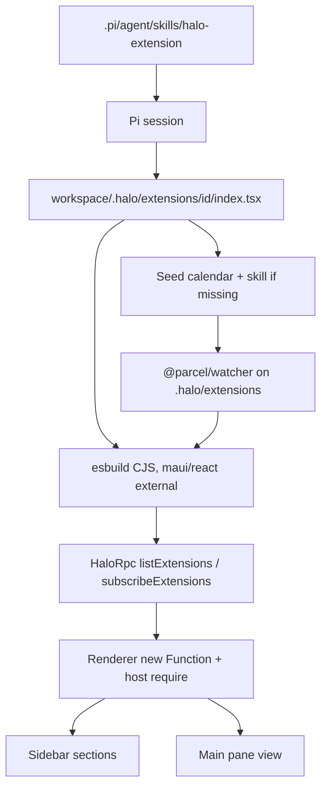
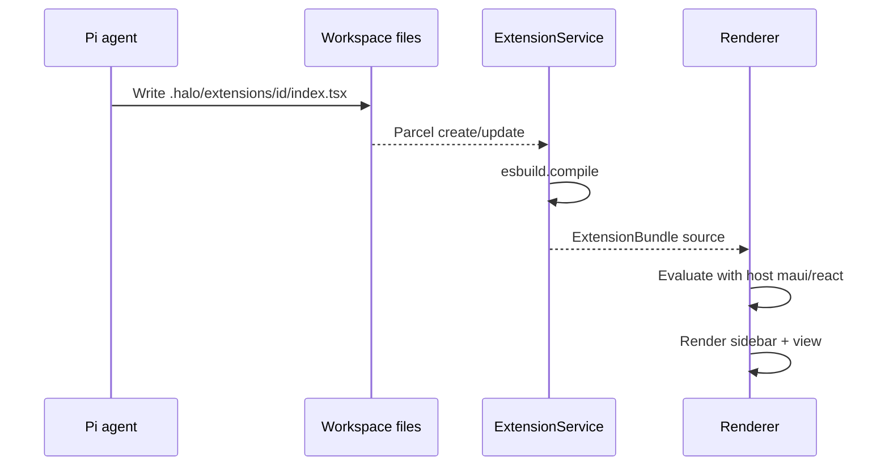

# Extension system

## System flow





## Problem overview

Halo's sidebar and main pane are fixed in the renderer. A user who asks the in-app agent to "build me a calendar view" has no place to put that UI, and the sandboxed renderer cannot `import()` TypeScript from the workspace.

## Solution overview

Treat `{workspace}/.halo/extensions/<id>/index.tsx` as the extension format. Main compiles each entry with esbuild to CommonJS, leaving `react`, `maui`, and `purse-styles` external. The renderer evaluates the source with a host `require` so extensions share the app's React and Maui. A seeded calendar extension and a `halo-extension` skill make the first "add a view" loop work. Hot reload is a dedicated Parcel watch on `.halo/extensions` (the workspace tree watch ignores dot folders).

Electron cannot ESM-import workspace files from a sandboxed renderer. Compile in main and evaluate in the renderer.

## Goals

- A ready workspace gets a Calendar sidebar section and month view from a seeded extension.
- Adding or editing `{workspace}/.halo/extensions/<id>/index.tsx` updates the sidebar and views without restarting Halo.
- Pi can read `.pi/agent/skills/halo-extension/SKILL.md` and write new extensions the same way.
- Compile and evaluate failures show in the sidebar and do not crash the shell.
- Extensions use Maui. They do not ship their own React.

## Non-goals

- No Tandem or tuple-database subspace. Extension state stays in React or files the agent already writes.
- No Google Calendar plugin.
- No replacing built-in Files, Sessions, or Develop chrome from an extension. Edit a seeded extension (or add a new one) to change contribution UI.
- No extension npm installs, Node APIs, or custom protocols.
- No Maui redesign. The existing design system is what extensions import.

## Important files, docs, and websites

- [`apps/electron/src/main/ExtensionService.ts`](../apps/electron/src/main/ExtensionService.ts) — Seed, watch, compile, bundle.
- [`apps/electron/src/main/compileExtension.ts`](../apps/electron/src/main/compileExtension.ts) — esbuild CJS compile.
- [`apps/electron/src/shared/evaluateExtensionSource.ts`](../apps/electron/src/shared/evaluateExtensionSource.ts) — Evaluate compiled CJS and parse `{ sidebarEntries, views }`.
- [`apps/electron/src/renderer/loadExtensionModule.ts`](../apps/electron/src/renderer/loadExtensionModule.ts) — Host `require` for maui/react.
- [`apps/electron/src/main/bundled/calendar.tsx`](../apps/electron/src/main/bundled/calendar.tsx) — Seeded month view.
- [`.agents/skills/halo-extension/SKILL.md`](../.agents/skills/halo-extension/SKILL.md) — Agent instructions; seeded into the workspace.
- [esbuild JS API](https://esbuild.github.io/api/) — Compile workspace TSX in main.
- [Pi skills](https://github.com/badlogic/pi-mono/blob/main/packages/coding-agent/docs/skills.md) — Loads `skills/` under `agentDir`.

## Implementation

### Phase 1: Compile and evaluate workspace TSX

Main turns an extension folder into a CJS string. Shared code evaluates that string with a `require` map and reads `{ sidebarEntries, views }`.

#### Important types

```ts
// apps/electron/src/shared/extension.ts
type SidebarItem = { id: string; label: string; viewId: string };
type SidebarSection = { id: string; label: string; items: SidebarItem[] };
type CompiledExtension = { id: string; source: string };
type ExtensionBundle = {
  extensions: CompiledExtension[];
  errors: { id: string; message: string }[];
};
```

#### Call stack diff

```diff
 WorkspaceService.select
-└── mkdir .pi/agent/sessions
+└── mkdir .pi/agent/sessions
+ExtensionService.sync
+├── seed calendar + skill if missing
+├── compileExtensionDirectory (esbuild)
+└── evaluateExtensionSource (tests / renderer)
```

#### Code diff preview

```diff
 // apps/electron/src/main/compileExtension.ts
+const result = await esbuild.build({
+  entryPoints: [entryPath],
+  bundle: true,
+  write: false,
+  format: "cjs",
+  platform: "browser",
+  jsx: "automatic",
+  external: [...extensionHostModules],
+});
```

- [ ] Add `compileExtensionDirectory` and `evaluateExtensionSource` with tagged compile/evaluate errors.
- [ ] Seed `calendar/index.tsx` and the halo-extension skill when missing.
- [ ] Watch `.halo/extensions` and rebuild the bundle on change.
- [ ] Cover compile success, compile failure, seed-once, and evaluate shape in Vitest.
- [ ] Run `pnpm --filter @halo/desktop test`.

### Phase 2: Sidebar entries and views in the renderer

RPC ships compiled source. The renderer evaluates it with host modules and appends sections to the sidebar. Selecting an item renders that view in the main pane.

#### Important types

```ts
// apps/electron/src/renderer/App.tsx
type SessionSelection =
  | { kind: "draft"; draftId: string }
  | { kind: "saved"; sessionId: string }
  | { kind: "uikit" }
  | { kind: "extension"; extensionId: string; viewId: string };
```

#### Call stack diff

```diff
 App
 ├── Sidebar
 │   ├── Files / Sessions / Develop
+│   └── extension.sidebarEntries
 └── MainPane
     ├── UiKitPage / DraftPane / SavedPane
+    └── ExtensionView (loaded.views[viewId])
```

#### Code diff preview

```diff
 // apps/electron/src/shared/rpc.ts
 export abstract class HaloApi extends RpcTarget {
   abstract subscribeWorkspaceTree(callback: WorkspaceTreeEventHandler): void;
+  abstract listExtensions(): Promise<ExtensionBundle>;
+  abstract subscribeExtensions(callback: ExtensionBundleHandler): void;
 }
```

- [ ] Add list/subscribe RPC using the same Cap'n Web `dup()` pattern as the workspace tree.
- [ ] Load host modules (`react`, `maui`, `purse-styles`) in the renderer and evaluate each compiled extension.
- [ ] Render extension sections in the sidebar and the selected view in the main pane.
- [ ] Show compile/evaluate errors in the sidebar without breaking sessions.
- [ ] Prove with `pnpm halo-web` that Calendar appears, opens, and hot-reloads after an edit.
