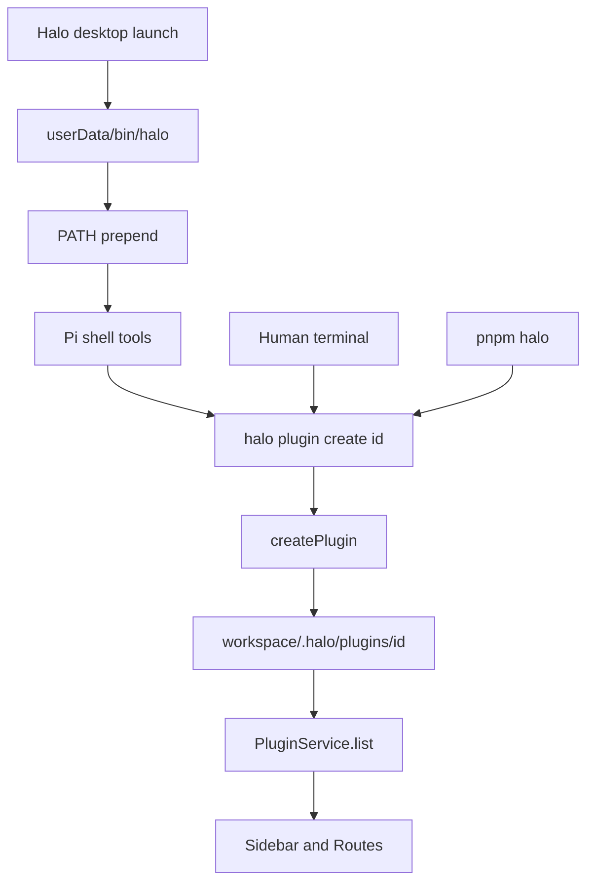
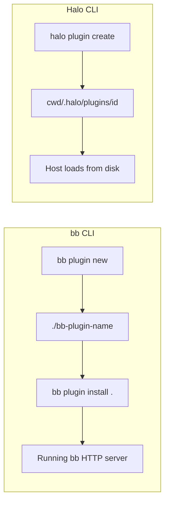

# Halo CLI

## System flow





## Problem overview

Agents can write Halo plugins by hand from the `halo-plugin` skill, but there is no `halo` command on PATH. The skill is the only contract, so each agent invents files and often gets the layout wrong. The desktop app also has no product CLI for humans or for Pi's shell.

## Solution overview

Ship a local `halo` CLI with the desktop app. bb's CLI talks to a running server for almost every command (`thread`, `project`, `machine`, `plugin install`). Halo is a local Electron app: plugins are folders on disk, and the host compiles them. The Halo CLI reads and writes that disk. It does not call a Halo HTTP API.

The one bb command that matches is `bb plugin new`, which writes files with no server. Halo's first command is the same idea: `halo plugin create <id>` writes `{cwd}/.halo/plugins/<id>/` in the shape `PluginService` already loads.

Use [incur](https://github.com/tanishqkancharla/incur), already used by `halo-web`. Keep `halo-web` as the debug driver. `halo` is the product CLI.

bb's full command set, from [`apps/cli/src/index.ts`](https://github.com/get-bb/bb/blob/main/apps/cli/src/index.ts) and `apps/cli/src/commands/`:

| Group | Commands | Halo v1 |
| --- | --- | --- |
| `plugin` | `search`, `list`, `source`, `install`, `outdated`, `update`, `new`, `types`, `migrate`, `build`, `dev`, `reload`, `enable`, `disable`, `config`, `token`, `run`, `logs`, `remove` | `create` only (`new` analog). No install or build: the host loads folders and compiles views. |
| `status` | current project/thread | Skip. Halo has no bb project/thread ids. |
| `thread` | `spawn`, `fork`, `list`, `show`, `log`, `output`, `wait`, `open`, `pane`, `tell`, `stop`, archive/pin/queue/tabs/sections, interactions | Skip. Halo sessions are Pi JSONL, not bb threads. |
| `project` | list/create/update/delete, sources, attachments, files | Skip. Halo has one workspace folder. |
| `skill` | list/show/install from skills.sh | Skip. Pi already reads `{workspace}/.pi/agent/skills`. |
| `marketplace` | add/list/refresh/remove | Skip. No catalog. |
| `machine` / `terminal` / `file` / `environment` | remote hosts, PTY, git worktrees | Skip. Halo runs on the local machine. |
| `settings` / `theme` / `updates` / `provider` / `voice` / `guide` | app prefs and extras | Skip. |
| plugin-contributed top-level commands | proxy to plugin CLIs | Skip. Halo plugins have no CLI surface yet. |

Put `halo` on PATH from the app so Pi's shell finds it. Also expose `pnpm halo` in the repo, matching `pnpm halo-web`.

## Goals

- A `halo` binary exists. `halo plugin create <id>` writes a valid plugin under `{cwd}/.halo/plugins/<id>/`.
- The scaffold matches the current plugin contract: `package.json` with `halo.version` `1`, `view.tsx` with `Sidebar` and `Routes`, `server.ts` with an `RpcTarget` class. No `npm install`.
- Creating over an existing folder fails and writes nothing extra.
- After Halo launches, Pi's shell can run `halo` without a global npm install.
- `pnpm halo` runs the same CLI from a source checkout.
- The `halo-plugin` skill tells agents to use `halo plugin create`.

## Non-goals

- No HTTP API, daemon, or calls into a running Halo window (`halo-web` stays the debug CLI).
- No marketplace, git/npm install, enable/disable, reload, logs, or plugin settings.
- No `plugin list`, `plugin build`, or SDK pin/migrate commands.
- No thread, session, skill, or settings commands.
- No `sudo` PATH install into `/usr/local/bin`.
- No extra plugin npm dependencies. The host still aliases `@halo/plugin-sdk`.
- No file watch. Reload the window to pick up a new plugin, as today.
- No merge of `halo-web` into `halo`.

## Important files, docs, and websites

- [`packages/halo-web-cli/src/cli.ts`](../packages/halo-web-cli/src/cli.ts) — incur `Cli.create`, `.command()`, `c.ok` / `c.error`, and `.serve()`. Copy this shape.
- [`packages/halo-web-cli/package.json`](../packages/halo-web-cli/package.json) — `bin`, scripts, incur, errore, vitest. Copy for `@halo/cli`.
- `packages/cli/` — New private workspace package (`@halo/cli`) for the product CLI.
- [`package.json`](../package.json) — Add `pnpm halo` next to `pnpm halo-web`.
- [`apps/electron/src/main/plugins/PluginService.ts`](../apps/electron/src/main/plugins/PluginService.ts) — Loads `{workspace}/.halo/plugins/<id>/`. The CLI must write that layout.
- [`apps/electron/src/main/plugins/readPluginManifest.ts`](../apps/electron/src/main/plugins/readPluginManifest.ts) — Manifest and view/server file names the scaffold must satisfy.
- [`packages/plugin-sdk/src/schema.ts`](../packages/plugin-sdk/src/schema.ts) — `pluginPackageJsonSchema` / `parseVersioned` for tests.
- [`apps/electron/src/main/bundled/haloPluginSkill.md`](../apps/electron/src/main/bundled/haloPluginSkill.md) — Seeded skill. Point it at `halo plugin create`.
- [`.agents/skills/halo-plugin/SKILL.md`](../.agents/skills/halo-plugin/SKILL.md) — Same skill in the repo. Keep the two files in sync.
- [`apps/electron/src/main/pi-service.ts`](../apps/electron/src/main/pi-service.ts) — `createAgentSession({ cwd: layout.root })`. Pi inherits `process.env.PATH`.
- [`apps/electron/src/main/main.ts`](../apps/electron/src/main/main.ts) — `app.whenReady` is where PATH install runs.
- [`apps/electron/src/main/ApplicationConfig.ts`](../apps/electron/src/main/ApplicationConfig.ts) — `dataDir` is Electron userData (`.halo/` in dev).
- [`apps/electron/forge.config.ts`](../apps/electron/forge.config.ts) — `extraResource` for the packaged CLI bundle.
- [`apps/electron/package.json`](../apps/electron/package.json) — Depend on `@halo/cli` so Forge builds it first.
- [bb `apps/cli/src/commands/plugin.ts`](https://github.com/get-bb/bb/blob/main/apps/cli/src/commands/plugin.ts) — `plugin new` scaffolds locally, then tells you to `bb plugin install .`. Halo skips install.
- [incur README](https://github.com/tanishqkancharla/incur) — Nested groups via `Cli.create('plugin').command(...)` then `halo.command(plugin)`.
- [errore.org](https://errore.org) — Return tagged errors from `createPlugin`; map them to `c.error` at the CLI edge.

## Implementation

### Phase 1: Add `@halo/cli` and `halo plugin create`

Add a workspace package that agents and humans can run with Node. `halo plugin create <id>` writes a plugin Halo can load. Cwd is the workspace root. Do not talk to Electron.

#### Important types

```ts
// packages/cli/src/CreatePlugin.ts
export class InvalidPluginIdError extends errore.createTaggedError({
  name: "InvalidPluginIdError",
  message: "Plugin id '$id' is not a single folder name",
}) {}

export class PluginExistsError extends errore.createTaggedError({
  name: "PluginExistsError",
  message: "Plugin '$id' already exists at $directory",
}) {}

export class PluginCreateError extends errore.createTaggedError({
  name: "PluginCreateError",
  message: "Failed to create plugin '$id'",
}) {}

export type CreatedPlugin = {
  id: string;
  directory: string;
  name: string;
};

export function createPlugin(args: {
  workspaceRoot: string;
  id: string;
  name: string | undefined;
}): Promise<
  CreatedPlugin | InvalidPluginIdError | PluginExistsError | PluginCreateError
>;
```

#### Call stack diff

```diff
 (agents write plugin files by hand from the skill)
+halo
+└── plugin create <id> [--name]
+    └── createPlugin
+        └── mkdir workspace/.halo/plugins/<id>
+            └── write package.json, view.tsx, server.ts
```

#### Code diff preview

```diff
 // packages/cli/src/cli.ts
 import { Cli, z } from "incur";
 import { createPlugin } from "./CreatePlugin.js";

+const plugin = Cli.create("plugin", {
+  description: "Create Halo plugins",
+}).command("create", {
+  description: "Scaffold a plugin in .halo/plugins/<id>",
+  args: z.object({
+    id: z.string().describe("Plugin folder name and id"),
+  }),
+  options: z.object({
+    name: z.string().optional().describe("Label in the sidebar"),
+  }),
+  output: z.object({
+    id: z.string(),
+    directory: z.string(),
+    name: z.string(),
+  }),
+  async run(c) {
+    const created = await createPlugin({
+      workspaceRoot: process.cwd(),
+      id: c.args.id,
+      name: c.options.name,
+    });
+    if (created instanceof Error) {
+      return c.error({ code: created.name, message: created.message });
+    }
+    return c.ok(created);
+  },
+});
+
+Cli.create("halo", {
+  description: "Halo CLI",
+  version: "0.1.0",
+})
+  .command(plugin)
+  .serve();
```

- [ ] Add `packages/cli` (`@halo/cli`) with incur, errore, `@halo/plugin-sdk`, and scripts matching `@halo/web-cli`. The `cli` script is `node --import tsx src/cli.ts`.
- [ ] Implement `createPlugin`. Reject ids that are empty, `.` / `..`, start with `.`, or contain a path separator. If the target directory exists, return `PluginExistsError` before writing. Default `halo.name` to `--name`, or to `id` when `--name` is omitted. Package name is `halo-plugin-<id>`. Write `package.json`, `view.tsx` (Sidebar + Routes), and `server.ts` (RpcTarget with a `ping` method), matching the examples in the halo-plugin skill. Do not run npm.
- [ ] Add `"halo": "pnpm --silent --filter @halo/cli cli"` to the root `package.json`.
- [ ] Smoke by hand: `mkdir /tmp/halo-cli-smoke && cd /tmp/halo-cli-smoke && pnpm halo plugin create notes --name Notes`, then confirm `.halo/plugins/notes/package.json` parses as a Halo plugin. Run create again and confirm it fails. Do not commit this check.
- [ ] Run `pnpm --filter @halo/cli typecheck lint format:check`.

### Phase 2: Package-level tests for `plugin create`

Act through the public CLI the way an agent would: run `halo plugin create` in a temp workspace, then read the files back through `pluginPackageJsonSchema`.

#### Important types

```ts
// packages/cli/src/cli.test.ts
const haloCli = test.extend<{
  workspaceRoot: string;
  runHalo: (
    args: string[],
  ) => Promise<{ exitCode: number; stdout: string; stderr: string }>;
}>({
  workspaceRoot: async ({}, use) => {
    /* mkdtemp, use, rm */
  },
  runHalo: async ({ workspaceRoot }, use) => {
    await use(async (args) => {
      /* spawn the halo bin with cwd: workspaceRoot */
    });
  },
});
```

#### Call stack diff

```diff
 pnpm --filter @halo/cli test
+└── spawn halo plugin create
+    └── createPlugin
+        └── read package.json with parseVersioned(pluginPackageJsonSchema)
```

#### Code diff preview

```diff
 // packages/cli/src/cli.test.ts
+haloCli("creates a plugin the host schema accepts", async ({ runHalo, workspaceRoot }) => {
+  const result = await runHalo(["plugin", "create", "notes", "--name", "Notes"]);
+  expect(result.exitCode).toBe(0);
+  const raw = await readFile(
+    join(workspaceRoot, ".halo", "plugins", "notes", "package.json"),
+    "utf8",
+  );
+  const parsed = parseVersioned({
+    name: "package.json",
+    schema: pluginPackageJsonSchema,
+    value: JSON.parse(raw) as unknown,
+  });
+  expect(parsed instanceof Error).toBe(false);
+});
+
+haloCli("refuses to overwrite an existing plugin", async ({ runHalo }) => {
+  await runHalo(["plugin", "create", "notes"]);
+  const second = await runHalo(["plugin", "create", "notes"]);
+  expect(second.exitCode).not.toBe(0);
+});
```

- [ ] Add Vitest fixtures that give a temp workspace and a `runHalo` spawn helper. Put shared setup in `test.extend`, not ad-hoc helpers.
- [ ] Commit the two tests above. Also spawn `plugin create notes/foo` and expect a non-zero exit with no extra files written.
- [ ] Do not assert exact `view.tsx` or `server.ts` text. The schema parse, overwrite failure, and invalid id are the checks.
- [ ] Run `pnpm --filter @halo/cli test typecheck lint format:check`.

### Phase 3: Install `halo` on PATH from the desktop app

Pi sessions inherit Electron's `process.env.PATH`. On launch, write a `halo` shim into userData and prepend that directory so agents inside Halo can run the CLI. Copy a single-file CLI bundle into the packaged app so the shim works without a source checkout.

#### Important types

```ts
// apps/electron/src/main/InstallHaloCli.ts
export type HaloCliInstall = {
  binDir: string;
  haloPath: string;
};

export function installHaloCli(args: {
  dataDir: string;
  isDevelopment: boolean;
  execPath: string;
  cliScriptPath: string;
}): HaloCliInstall | HaloCliInstallError;
```

#### Call stack diff

```diff
 app.whenReady
 └── workspaceService.restore
+└── installHaloCli
+    ├── write dataDir/bin/halo
+    └── process.env.PATH = binDir + PATH
 └── PiService.createAgentSession
     └── createCodingTools(workspaceRoot)
```

#### Code diff preview

```diff
 // apps/electron/src/main/main.ts
 app.whenReady().then(async () => {
   await workspaceService.restore();
+  const cliInstall = installHaloCli({
+    dataDir: applicationConfig.dataDir,
+    isDevelopment,
+    execPath: process.execPath,
+    cliScriptPath: haloCliScriptPath(isDevelopment),
+  });
+  if (cliInstall instanceof Error) {
+    logger.error({ event: "halo-cli-install-failed", err: cliInstall });
+  }
   registerLogBridge();
   ...
 });
```

The shim in development runs `node --import tsx` against `packages/cli/src/cli.ts`. The packaged shim sets `ELECTRON_RUN_AS_NODE=1` and execs `process.execPath` with the bundled CLI script from `process.resourcesPath`. Bundle `@halo/cli` to one file with esbuild so the packaged script does not need `node_modules`. Add that file to Forge `extraResource`. Depend on `@halo/cli` from `@halo/desktop`. Also write `~/.local/bin/halo` so a human terminal can find it; if that write fails, log and continue. On Windows write `halo.cmd` next to `halo`.

- [ ] Add `installHaloCli` and call it from `app.whenReady` before Pi sessions start. Prepend `binDir` to `process.env.PATH`.
- [ ] Bundle the CLI for packaged builds and register it in `forge.config.ts` `packagerConfig.extraResource`. Resolve the script path with `process.resourcesPath` in production and the repo `packages/cli/src/cli.ts` in development.
- [ ] Smoke by hand after `pnpm --filter @halo/desktop dev`: run `$HALO_USERDATA/bin/halo --help` (dev userData is `/workspace/.halo`) and `halo plugin create` from a Pi session or a shell that has the prepended PATH. Do not commit this check.
- [ ] Run `pnpm run check-affected`.

### Phase 4: Point the halo-plugin skill at `halo plugin create`

Agents should create plugins with the CLI, then edit the files. Keep the layout docs; lead with the command.

#### Important types

Not applicable — no code path changes.

#### Call stack diff

Not applicable — no code path changes.

#### Code diff preview

```diff
 // .agents/skills/halo-plugin/SKILL.md
 // apps/electron/src/main/bundled/haloPluginSkill.md
-Plugins live in `{workspace}/.halo/plugins/<id>/`. The folder name is the plugin id.
+Create a plugin with `halo plugin create <id>`. That writes `{workspace}/.halo/plugins/<id>/`.
+The folder name is the plugin id. `halo.name` is the label in the UI.
```

- [ ] Update both skill copies so the first step is `halo plugin create <id>` (optional `--name`). Keep the layout, view, and server examples for edits after create.
- [ ] Keep the two skill files identical.
- [ ] Smoke by hand: read the seeded `{workspace}/.pi/agent/skills/halo-plugin/SKILL.md` after choosing a fresh workspace (seed still writes when missing; existing files stay). Do not commit this check.
- [ ] Run `pnpm run check-affected`.
