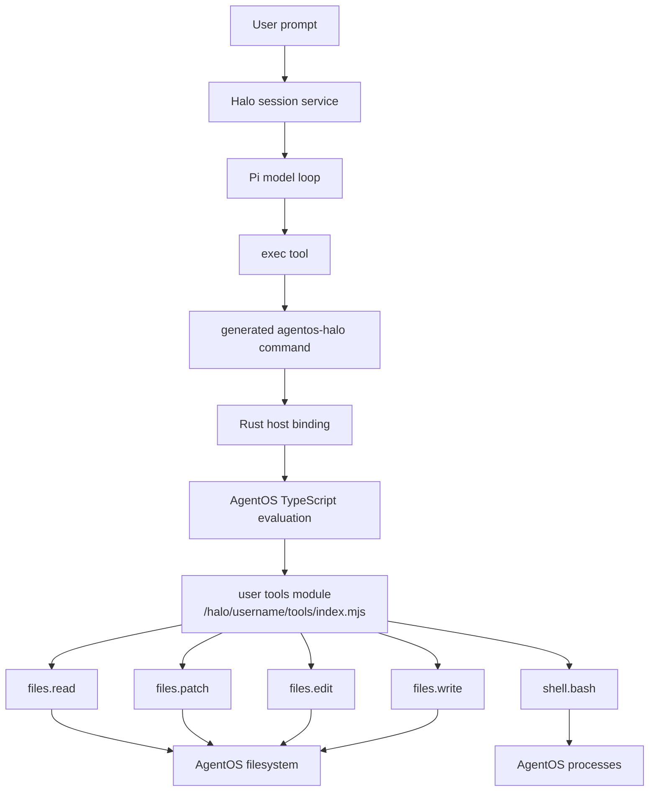
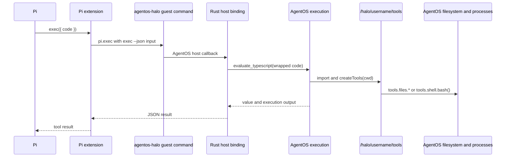

# Pi code mode on AgentOS execution





## Problem overview

Halo runs Pi with its built-in file and Bash tools. Each operation takes a model tool call, so a task that reads several files, transforms data, and runs a command spends several round trips on work that one TypeScript program could do.

The existing `pi-code-mode` extension proves the desired Pi interface, but it adds QuickJS and implements a second execution runtime. Halo already embeds AgentOS and already uses its JavaScript execution API. AgentOS should run the model-written TypeScript too.

## Solution overview

Keep Pi as the model loop, session owner, and transcript source. Install one Halo-owned Pi extension in the workspace. The extension registers `exec`, makes it Pi's only active tool, and sends the TypeScript source to a Rust host binding through AgentOS's generated binding command.

Register the binding collection under the name `halo`. AgentOS projects that collection into the guest as the command `agentos-halo`; Halo does not build or bundle that command as a binary. Calling `agentos-halo exec --json <input>` from Pi makes AgentOS parse the JSON and dispatch the `halo:exec` callback in Rust. Pass the JSON as one argv value through `pi.exec`, without a shell or temporary file.

The binding calls `AgentOs::evaluate_typescript`. The evaluated program imports `/halo/<username>/tools/index.mjs` and receives one `tools` object with `files.read`, `files.patch`, `files.edit`, `files.write`, and `shell.bash`. The tools run inside the same AgentOS VM, so they see the same filesystem and processes as Pi and Halo. The current workspace may be a private or shared space; the tool implementation still belongs to the user running Pi. Copy the patch and edit behavior from the user's existing Pi extensions into this self-contained module. Do not add Executor or another JavaScript runtime.

The tool layer will not restrict paths, commands, environment values, or source. AgentOS permissions remain the execution boundary. Patch parsing and edit matching still report their normal operation errors.

## Goals

- Keep the current Pi package, AgentOS durable sessions, transcript handling, and prompt streaming.
- Give Pi one model-facing tool named `exec` that runs TypeScript through the AgentOS execution API.
- Expose exactly `tools.files.read`, `tools.files.patch`, `tools.files.edit`, `tools.files.write`, and `tools.shell.bash` to model-written code.
- Preserve the patch behavior from `pi-apply-patch` and the edit behavior from `simple-edit.ts`.
- Read and change files through the shared AgentOS filesystem without reading or changing AgentOS SQLite tables.
- Install the extension and tool module under `/halo/<username>` before Halo opens that user's Pi session.

## Non-goals

- Executor, QuickJS, Deno, MCP, or a second sidecar.
- Python execution or a choice of execution language.
- Path checks, command checks, approvals, environment filtering, output limits, retries, or compatibility aliases.
- A code-mode toggle or continued access to Pi's built-in tools.
- Persistent AgentOS execution contexts between `exec` calls.
- UI changes or new Tauri commands.

## Important files, docs, and websites

- [`apps/halo/src-tauri/src/agentos_service/mod.rs`](../apps/halo/src-tauri/src/agentos_service/mod.rs) — Creates the AgentOS runtime, owns its lifecycle, and will register the execution binding.
- [`apps/halo/src-tauri/src/agentos_service/sessions.rs`](../apps/halo/src-tauri/src/agentos_service/sessions.rs) — Opens Pi sessions after workspace setup and remains the prompt and transcript path.
- [`apps/halo/src-tauri/src/agentos_service/workspace.rs`](../apps/halo/src-tauri/src/agentos_service/workspace.rs) — Owns workspace paths and writes files as the AgentOS user.
- [`apps/halo/src-tauri/src/agentos_service/providers.rs`](../apps/halo/src-tauri/src/agentos_service/providers.rs) — Writes Pi settings into the same AgentOS home.
- [`simple-edit.ts`](/Users/tanishqkancharla/.pi/agent/extensions/simple-edit.ts) — Source behavior for `tools.files.edit`, including line-ending and BOM handling.
- [`patch.ts`](/Users/tanishqkancharla/Documents/Projects/pi-apply-patch/src/patch.ts) — Source parser, planner, and applier for `tools.files.patch`.
- [`pi-code-mode/src/index.ts`](/Users/tanishqkancharla/Documents/Projects/pi-code-mode/src/index.ts) — Reference for the one-tool Pi interface and TypeScript wrapper; do not copy its QuickJS runtime.
- [AgentOS JavaScript and TypeScript execution](https://agentos-sdk.dev/docs/javascript/) — Defines evaluation, execution results, Node built-ins, inputs, and execution lifetime.
- [AgentOS Pi extensions](https://agentos-sdk.dev/docs/agents/pi/) — Defines where Pi loads extension files inside the VM.
- [Pi extension API](https://github.com/badlogic/pi-mono/blob/main/packages/coding-agent/docs/extensions.md) — Defines `registerTool` and `setActiveTools`.
- `agentos-client 0.2.15/src/config.rs` in the local Cargo registry — Defines `Binding`, `Bindings`, and host callback signatures.
- `agentos-client 0.2.15/src/agent_os.rs` in the local Cargo registry — Generates `agentos-<collection>` guest commands and dispatches `--json` input to host callbacks.
- `agentos-client 0.2.15/src/language_execution.rs` in the local Cargo registry — Defines `evaluate_typescript`, `TypeScriptExecutionOptions`, output capture, and evaluation results.

## Implementation

### Phase 1: Route a guest binding back into AgentOS TypeScript evaluation

Add a host binding that accepts TypeScript source and a working directory, then evaluates the source in the existing AgentOS VM. Prove that a binding callback can submit an execution request to the same VM while its guest command waits for the callback.

#### Important types

```rust
// apps/halo/src-tauri/src/agentos_service/execution.rs
#[derive(Deserialize)]
#[serde(rename_all = "camelCase")]
struct ExecBindingInput {
    source: String,
    cwd: String,
}

#[derive(Serialize)]
#[serde(rename_all = "camelCase")]
struct ExecBindingOutput {
    value: Option<serde_json::Value>,
    execution: serde_json::Value,
}

#[derive(Clone)]
struct ExecutionBridge {
    os: Arc<RwLock<Option<AgentOs>>>,
}
```

#### Call stack diff

```diff
 AgentOsService::start
-└── AgentOs::create(config)
+├── ExecutionBridge::new
+├── AgentOs::create(config.bindings(execution_bridge.bindings()))
+└── ExecutionBridge::attach(os)

 guest agentos-halo exec --json <input>
-└── unavailable
+└── ExecutionBridge::execute
+    └── AgentOs::evaluate_typescript
+        └── existing AgentOS VM
```

#### Code diff preview

```diff
 // apps/halo/src-tauri/src/agentos_service/mod.rs
+mod execution;
+
+use execution::ExecutionBridge;
 
 async fn start(
     &self,
     layout: &WorkspaceLayout,
     config: StartupConfig,
 ) -> Result<AgentOs, String> {
+    let execution = ExecutionBridge::new();
     let os = AgentOs::create(AgentOsConfig {
+        bindings: execution.bindings(),
         database: Some(VmSqliteDescriptor::SqliteFile {
             path: self.database_path.to_string_lossy().into_owned(),
         }),
         ...
     })
     .await
     .map_err(|error| format!("AgentOS failed to start: {error}"))?;
+    execution.attach(os.clone()).await;
     ...
 }
```

- [ ] Add `apps/halo/src-tauri/src/agentos_service/execution.rs` with the `halo` binding collection and its `exec` binding; use a JSON schema with required `source` and `cwd` strings.
- [ ] Wrap the supplied source as an async TypeScript expression, call `AgentOs::evaluate_typescript`, capture all output, and return its value and execution record as JSON.
- [ ] Create and attach the bridge in `AgentOsService::start`; keep the callback inactive until the same `AgentOs` value has finished starting.
- [ ] Add a sidecar-locked Rust test that invokes `agentos-halo exec --json '{"source":"return 40 + 2","cwd":"/halo/test-user"}'` and asserts that a reentrant evaluation returns `42` without a model call.
- [ ] Run `cargo test --manifest-path apps/halo/src-tauri/Cargo.toml execution_binding_evaluates_typescript`.

### Phase 2: Install the user-level code-mode tools

Add a self-contained JavaScript module at `/halo/<username>/tools/index.mjs` and make the execution binding inject it as `tools`. Store one copy for each user, not in each workspace or shared space. Keep the user-requested interface small and copy the existing patch and edit behavior without adding an access-policy layer.

#### Important types

```ts
// apps/halo/src-tauri/agentos/halo-tools.mjs
export type ShellResult = {
  stdout: string;
  stderr: string;
  exitCode: number | null;
};

export type HaloTools = {
  files: {
    read(path: string): Promise<string>;
    patch(patchText: string): Promise<string>;
    edit(
      path: string,
      oldText: string,
      newText: string,
      replaceAll?: boolean,
    ): Promise<void>;
    write(path: string, content: string): Promise<void>;
  };
  shell: {
    bash(command: string): Promise<ShellResult>;
  };
};

export function createTools(cwd: string): HaloTools;
```

#### Call stack diff

```diff
 ExecutionBridge::execute(input)
-└── AgentOs::evaluate_typescript(async user source)
+├── build_expression(layout.tools_module_path, input)
+└── AgentOs::evaluate_typescript
+    └── createTools(input.cwd)
+        ├── tools.files.read/edit/write/patch
+        │   └── node:fs in the AgentOS filesystem
+        └── tools.shell.bash
+            └── node:child_process in AgentOS
```

#### Code diff preview

```diff
 // apps/halo/src-tauri/src/agentos_service/execution.rs
-let expression = format!("(async () => {{ {} }})()", input.source);
+let module_path = serde_json::to_string(&layout.tools_module_path)
+    .expect("tools module path is valid JSON");
+let expression = format!(
+    "(async () => {{ const {{ createTools }} = await import({module_path}); const tools = createTools({cwd}); return await (async () => {{ {source} }})(); }})()",
+    cwd = serde_json::to_string(&input.cwd).expect("cwd is valid JSON"),
+    source = input.source,
+);
```

- [ ] Add `apps/halo/src-tauri/agentos/halo-tools.mjs` with the five requested methods; use `node:fs` for files and `node:child_process` with `bash -lc` for the shell method.
- [ ] Copy the patch parser, planner, and mutation behavior from `/Users/tanishqkancharla/Documents/Projects/pi-apply-patch/src/patch.ts`, and extract the non-UI edit behavior from `/Users/tanishqkancharla/.pi/agent/extensions/simple-edit.ts` into the module.
- [ ] Extend the user layout with `/halo/<username>/tools/index.mjs` and install the module through `write_text_file_as_vm_user` during user startup, before any session can open. Pass this user-owned path to the execution bridge separately from the workspace `cwd`.
- [ ] Extend the execution test to call every method, then read the resulting files through `AgentOsService` and assert the Bash result contains its stdout and exit code.
- [ ] Run `cargo test --manifest-path apps/halo/src-tauri/Cargo.toml code_mode_tools_share_workspace`.

### Phase 3: Replace Pi's active tools with `exec`

Install a small Pi extension in the user's Pi home under `/halo/<username>`. It forwards model-written TypeScript through the `agentos-halo` binding command and makes `exec` Pi's only active tool for every Halo session, including sessions whose `cwd` points at a shared space.

#### Important types

```ts
// apps/halo/src-tauri/agentos/halo-exec.js
type ExecInput = {
  code: string;
};

type BindingInput = {
  source: string;
  cwd: string;
};

type BindingResult = {
  value: unknown;
  execution: unknown;
};
```

#### Call stack diff

```diff
 ReadyWorkspace::create_or_reopen_session
 └── AgentOs::open_session(agent = "pi")
-    └── Pi built-in read/edit/write/bash tools
+    └── /halo/<username>/.pi/agent/extensions/halo-exec.js
+        ├── pi.registerTool("exec")
+        └── pi.setActiveTools(["exec"])

 exec.execute({ code })
-└── unavailable
+├── JSON.stringify({ source: code, cwd: ctx.cwd })
+├── pi.exec("agentos-halo", ["exec", "--json", input])
+│   └── halo:exec callback
+│       └── AgentOS TypeScript execution and tools
+└── return binding JSON to Pi
```

#### Code diff preview

```diff
 // apps/halo/src-tauri/agentos/halo-exec.js
+export default function haloExec(pi) {
+  pi.registerTool({
+    name: "exec",
+    label: "Exec",
+    description: "Run TypeScript with the Halo tools object.",
+    parameters: Type.Object({ code: Type.String() }),
+    async execute(_toolCallId, { code }, signal, _onUpdate, ctx) {
+      const input = JSON.stringify({ source: code, cwd: ctx.cwd });
+      const result = await pi.exec(
+        "agentos-halo",
+        ["exec", "--json", input],
+        { cwd: ctx.cwd, signal },
+      );
+      return bindingToolResult(result);
+    },
+  });
+
+  pi.on("session_start", () => pi.setActiveTools(["exec"]));
+}
```

- [ ] Add `apps/halo/src-tauri/agentos/halo-exec.js`; register one `exec` tool whose prompt text documents `tools.files.read`, `tools.files.patch`, `tools.files.edit`, `tools.files.write`, and `tools.shell.bash` with their exact signatures.
- [ ] Have the extension serialize `{ source, cwd }`, call `agentos-halo exec --json <input>` through `pi.exec`, and return the binding result without a shell or temporary file.
- [ ] Extend the user layout with `/halo/<username>/.pi/agent/extensions/halo-exec.js` and install the extension during user startup beside that user's Pi settings.
- [ ] Update the session restart integration test to assert both code-mode files survive restart, a Pi session opens with the extension present, and a direct binding call still changes a file after restart without a model call.
- [ ] Run `pnpm run check-affected`.
