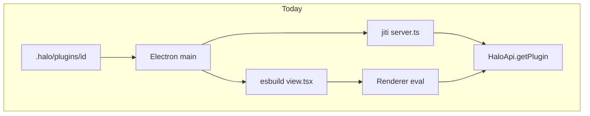
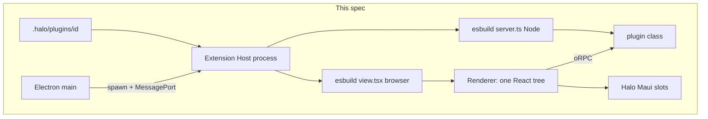
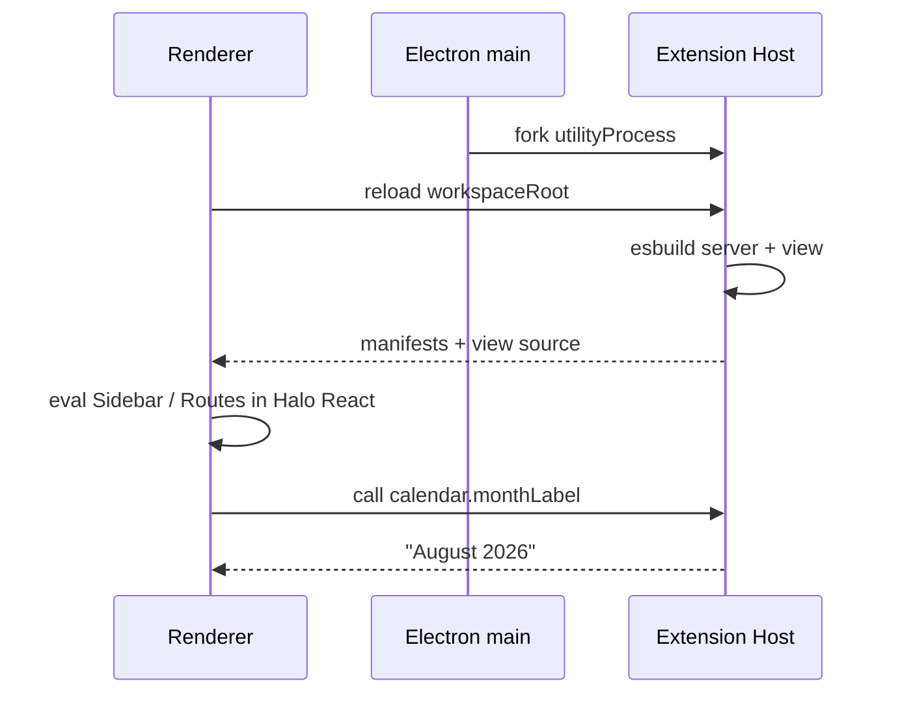

# Plugin apps

## System flow







## Problem overview

Plugin servers run inside Electron main and share Cap'n Web with `HaloApi`. A bad plugin can take down the app. Views compile in main and evaluate in the renderer as a second pipeline, with jiti for TypeScript servers. That split is accidental, not a design. The next step is a VS Code-style host: the plugin is one program, the window is slots.

## Solution overview

Spawn one Extension Host process. That process owns the plugin: it esbuilds `server.ts` for Node and `view.tsx` for the browser, instantiates the server class, and speaks oRPC. The renderer still paints `Sidebar` / `Routes` in Halo's React tree (shared Maui, no webview). Electron main only forks the host and hands over a MessagePort. Cap'n Web stays on `HaloApi`. No schema, store, or Tandem in this work.

The VS Code move we copy is **ownership**: the workbench does not load plugin JS except to eval a host-compiled view bundle into existing slots. The move we do not copy is **webviews**. A Halo sidebar is Maui in the app shell, not an iframe the server fills with HTML.

jiti goes away. The host compiles the server the same way it already compiles the view.

## Goals

- Plugin server JS does not run in Electron main.
- One Extension Host child process loads every plugin. If it crashes, the window stays up.
- Plugin RPC is oRPC. `usePluginServer` is an oRPC client, not a Cap'n Web stub.
- The host compiles both `server.ts` and `view.tsx`. Main does not jiti and does not esbuild plugin views.
- Seeded calendar keeps its month view and gains a `server.ts` that the view calls (for example `monthLabel`).

## Non-goals

- No migrations or backfills.
- No replacing Cap'n Web on `HaloApi` or `AgentSessionApi`.
- No one-process-per-plugin.
- No React Server Components, webviews, custom reconciler, or native/mobile map.
- No Tandem, InstantDB, `collection()`, `useQuery`, or plugin state files.
- No Google Calendar or OAuth.
- No plugin source file watch. Reload the window to pick up edits.
- No HTTP listener.
- No rewrite of [`specs/plugin-host-runtime.md`](plugin-host-runtime.md). If that spec lands first, the host runs `npm install` before esbuild.

## Assumptions

- Plugin id stays the folder name. Layout stays `view.tsx` + `server.ts`. They stay two files because one targets the browser and one targets Node. Both load in the host.
- A plugin server default-exports a class. It does not extend `RpcTarget`. The constructor takes `{ pluginId, workspaceRoot }`.
- `usePluginServer` is a proxy: `server.monthLabel()` becomes `call({ pluginId, method: "monthLabel", args: [] })`.
- If a server method returns an `Error`, the host fails the oRPC call. The renderer sees a rejected promise.
- Electron production uses `utilityProcess.fork`. Vitest uses `node:worker_threads` `Worker`. Both upgrade a MessagePort with `@orpc/server/message-port`.
- Plugin code is trusted workspace code.

## Important files, docs, and websites

- [`apps/electron/src/main/plugins/PluginService.ts`](../apps/electron/src/main/plugins/PluginService.ts) — today's list/compile/jiti in main. Becomes a thin scan or a pass-through to the host.
- [`apps/electron/src/main/plugins/loadPluginServer.ts`](../apps/electron/src/main/plugins/loadPluginServer.ts) — delete with jiti.
- [`apps/electron/src/main/plugins/compilePluginView.ts`](../apps/electron/src/main/plugins/compilePluginView.ts) — moves into the host; add a Node compile for `server.ts`.
- [`apps/electron/src/main/plugins/PluginService.test.ts`](../apps/electron/src/main/plugins/PluginService.test.ts) — replace the Cap'n Web ping case with oRPC.
- [`apps/electron/src/main/rpc.ts`](../apps/electron/src/main/rpc.ts) — drop `getPlugin`. `listPlugins` may proxy the host.
- [`apps/electron/src/shared/rpc.ts`](../apps/electron/src/shared/rpc.ts) — `HaloApi.getPlugin` goes away.
- [`apps/electron/src/shared/channels.ts`](../apps/electron/src/shared/channels.ts) — host port channels.
- [`apps/electron/src/main/main.ts`](../apps/electron/src/main/main.ts) — spawn the host, broker the renderer port.
- [`apps/electron/src/main/preload.ts`](../apps/electron/src/main/preload.ts) — forward the host port.
- [`apps/electron/src/renderer/api/ApiProvider.tsx`](../apps/electron/src/renderer/api/ApiProvider.tsx) — oRPC client instead of `api.getPlugin`.
- [`packages/plugin-sdk/src/server.ts`](../packages/plugin-sdk/src/server.ts) — drop `RpcTarget`.
- [`packages/plugin-sdk/src/view.ts`](../packages/plugin-sdk/src/view.ts) — `usePluginServer` over oRPC.
- [`apps/electron/src/main/bundled/calendar/`](../apps/electron/src/main/bundled/calendar/) — add `server.ts`; view calls it.
- [`apps/electron/src/main/plugins/haloPluginSkill.md`](../apps/electron/src/main/plugins/haloPluginSkill.md) — author contract.
- [`specs/plugin-system.md`](plugin-system.md) — shipped plugin format.
- [oRPC Message Port adapter](https://orpc.dev/docs/adapters/message-port)
- [oRPC Electron adapter](https://orpc.dev/docs/adapters/electron)
- [oRPC worker threads](https://orpc.dev/docs/adapters/worker-threads)
- [Electron `utilityProcess`](https://www.electronjs.org/docs/latest/api/utility-process)

## Implementation

### Phase 1: oRPC host router with ping

Add `@orpc/server` and `@orpc/client` to `@halo/desktop`. `createExtensionHostRouter` answers `ping`. No Electron spawn. Calendar still uses Cap'n Web.

#### Important types

```ts
// apps/electron/src/main/plugins/extensionHostRouter.ts
export type ExtensionHostRouter = {
  ping: { output: { ok: true } };
};

export function createExtensionHostRouter(): ExtensionHostRouter;
```

#### Call stack diff

```diff
 (none — new module)
+createExtensionHostRouter
+└── ping → { ok: true }
+RPCHandler.upgrade(MessagePort)
+RPCLink({ port }).ping()
```

#### Code diff preview

```diff
 // apps/electron/src/main/plugins/extensionHostRouter.ts
+import { os } from "@orpc/server";
+
+export function createExtensionHostRouter() {
+  return {
+    ping: os.handler(async () => ({ ok: true as const })),
+  };
+}
```

- [x] Add `@orpc/server` and `@orpc/client`. Export `createExtensionHostRouter` with `ping`.
- [x] Add `extensionHostRouter.test.ts`: `MessageChannel`, `RPCHandler` on one port, `RPCLink.ping` on the other.
- [x] Smoke: existing Cap'n Web calendar ping still passes. Do not commit that as a new test.
- [x] Run `pnpm --filter @halo/desktop test src/main/plugins/extensionHostRouter.test.ts`.

### Phase 2: Extension Host process and renderer port

Run the router in a child process. Main forks `utilityProcess`. The renderer asks preload for a host port, same pattern as `halo:request-rpc`. Forge/Vite emits `extensionHost.cjs`. Do not load plugins yet. `ping` from the renderer is enough.

#### Important types

```ts
// apps/electron/src/shared/channels.ts
export const RPC_CHANNELS = {
  requestRpc: "halo:request-rpc",
  provideRpc: "halo:provide-rpc",
  requestExtensionHost: "halo:request-extension-host",
  provideExtensionHost: "halo:provide-extension-host",
} as const;
```

#### Call stack diff

```diff
 main.ts registerRpcBridge
 └── halo:request-rpc → HaloRpc Cap'n Web
+main.ts startExtensionHost
+└── utilityProcess.fork(extensionHost.cjs)
+halo:request-extension-host
+└── transfer MessagePort to the child
+preload → window provideExtensionHost
+renderer connectExtensionHostRpc → ping
```

#### Code diff preview

```diff
 // apps/electron/src/main/main.ts
+const extensionHost = utilityProcess.fork(
+  join(currentDirectory, "extensionHost.cjs"),
+);
+
+ipcMain.on(RPC_CHANNELS.requestExtensionHost, (event) => {
+  assertTrustedSender(event);
+  const { port1, port2 } = new MessageChannelMain();
+  extensionHost.postMessage("orpc", [port1]);
+  event.senderFrame.postMessage(
+    RPC_CHANNELS.provideExtensionHost,
+    null,
+    [port2],
+  );
+});
```

- [x] Add `extensionHostMain.ts` and a Vite/Forge entry that emits `extensionHost.cjs`. Fork it from `main.ts` after `app.whenReady`.
- [x] Add channels, preload forward, and `connectExtensionHostRpc`. Call `ping` once from `ApiProvider` when the workspace is ready.
- [x] In Vitest, spawn the same entry with `new Worker(...)`. Do not use `utilityProcess` in Vitest.
- [x] Smoke: Halo still opens and Calendar still mounts on the old path. Do not commit this check.
- [x] Run `pnpm --filter @halo/desktop test src/main/plugins/extensionHostRouter.test.ts`.

### Phase 3: Host loads servers over oRPC, drop jiti

The host esbuilds `server.ts` to Node CJS and instantiates the class. `HaloApi.getPlugin` goes away. `usePluginServer` is a proxy over `call`. Delete `loadPluginServer.ts` and the jiti dependency if nothing else imports it.

#### Important types

```ts
// packages/plugin-sdk/src/server.ts
export type PluginServerContext = {
  pluginId: string;
  workspaceRoot: string;
};

// apps/electron/src/main/plugins/extensionHostRouter.ts
type PluginCallInput = {
  pluginId: string;
  method: string;
  args: unknown[];
};

type ExtensionHostRouter = {
  ping: { output: { ok: true } };
  reload: {
    input: {
      workspaceRoot: string;
      plugins: { id: string; directory: string; serverPath?: string }[];
    };
  };
  call: { input: PluginCallInput; output: unknown };
};
```

#### Call stack diff

```diff
 PluginService.list
 ├── readPluginManifest
 ├── compilePluginView
-└── loadPluginServer jiti → wrapPluginRpc
+└── (views still in main this phase)

 HaloRpc.getPlugin
-└── RpcTarget on Cap'n Web
+extensionHost.reload
+└── esbuild server.ts (platform node)
+    └── instantiate class
+extensionHost.call({ pluginId, method, args })

 usePluginsQuery
-└── api.getPlugin(id)
+└── oRPC client.usePluginServer → call
```

#### Code diff preview

```diff
 // apps/electron/src/main/plugins/compilePluginServer.ts
+await esbuild.build({
+  absWorkingDir: directory,
+  entryPoints: [serverPath],
+  bundle: true,
+  write: false,
+  format: "cjs",
+  platform: "node",
+  external: ["@halo/plugin-sdk/server", "@halo/plugin-sdk/schema"],
+});

 // packages/plugin-sdk/src/view.ts
-export function usePluginServer<S extends RpcTarget>(): RpcStub<S> {
+export function usePluginServer<S>(): S {
```

- [ ] Host `reload` compiles each `serverPath` with esbuild (`platform: "node"`) and instantiates the default export. Reflect methods the way `wrapPluginRpc` does. No `RpcTarget`.
- [ ] `call` runs `server[method](...args)`. If the result is `instanceof Error`, fail the oRPC call.
- [ ] Delete `getPlugin` from `HaloApi` / `HaloRpc`. Delete `loadPluginServer.ts`. Remove `jiti` from `@halo/desktop` if unused.
- [ ] Rewrite the Cap'n Web ping test to oRPC `call` for `ping` / `fail` and a missing plugin id.
- [ ] Run `pnpm --filter @halo/desktop test src/main/plugins/PluginService.test.ts src/main/plugins/extensionHostRouter.test.ts`.

### Phase 4: Host compiles views

Move `compilePluginView` into the host. `reload` returns manifests, compiled view sources, and load errors. Main no longer esbuilds plugin views. The renderer still evaluates CJS in Halo's React tree.

#### Important types

```ts
type ExtensionHostReloadResult = {
  plugins: PluginManifest[];
  compiledViews: CompiledPluginView[];
  errors: PluginLoadError[];
};

type ExtensionHostRouter = {
  ping: { output: { ok: true } };
  reload: {
    input: { workspaceRoot: string };
    output: ExtensionHostReloadResult;
  };
  call: { input: PluginCallInput; output: unknown };
};
```

#### Call stack diff

```diff
 PluginService.list
-├── readdir .halo/plugins
-├── compilePluginView
-└── (servers already on host)
+HaloRpc.listPlugins
+└── extensionHost.reload({ workspaceRoot })
+    ├── readdir .halo/plugins
+    ├── esbuild view.tsx (browser)
+    └── esbuild server.ts (node)
 renderer loadPluginViews
 └── evaluatePluginView (unchanged)
```

#### Code diff preview

```diff
 // apps/electron/src/main/rpc.ts
   async listPlugins() {
-    const listed = await this.plugins.list();
+    const listed = await this.extensionHost.reload({
+      workspaceRoot: this.workspace.getLayout().root,
+    });
     if (listed instanceof Error) throw listed;
     return listed;
   }
```

- [ ] Host `reload` takes `workspaceRoot`, scans `.halo/plugins`, compiles views and servers, returns the same `PluginList` shape the renderer already consumes.
- [ ] `PluginService.list` in main either calls the host or goes away. Seed still runs from `WorkspaceService.select` in main (writes files, does not load JS).
- [ ] Keep `evaluatePluginView` in the renderer. Do not add a webview.
- [ ] Listing tests go through the host `reload` + `loadPluginViews`, not in-process `new PluginService().list()` compile. Use the existing `writePlugin` fixture.
- [ ] Run `pnpm --filter @halo/desktop test src/main/plugins/PluginService.test.ts`.

### Phase 5: Calendar server + skill

Seed `server.ts` next to the existing month view. The view calls `monthLabel`. Update the skill: host-owned view and server, no `RpcTarget`, no schema.

#### Important types

```ts
// apps/electron/src/main/bundled/calendar/server.ts
export default class CalendarServer {
  constructor(private readonly ctx: PluginServerContext) {}
  monthLabel() {
    return new Intl.DateTimeFormat("en", {
      month: "long",
      year: "numeric",
    }).format(new Date());
  }
}
```

#### Call stack diff

```diff
 seedPluginWorkspace
 ├── calendar/package.json
 ├── calendar/view.tsx
+└── calendar/server.ts
 Calendar MonthView
-└── Intl in the view
+└── usePluginServer().monthLabel()
```

#### Code diff preview

```diff
 // apps/electron/src/main/bundled/calendar/view.tsx
 function MonthView() {
-  const label = new Intl.DateTimeFormat("en", {
-    month: "long",
-    year: "numeric",
-  }).format(new Date());
+  const server = usePluginServer<CalendarServer>();
+  const [label, setLabel] = useState("");
+  useEffect(() => {
+    void server.monthLabel().then(setLabel);
+  }, [server]);
   return (
     <div data-testid="calendar-month">
       <Flex column gap={4}>
         <H1>{label}</H1>
```

- [ ] Seed `server.ts` only when missing. Existing workspaces that already have calendar keep the old view-only files.
- [ ] Month view keeps `data-testid="calendar-month"` and reads the label from the server.
- [ ] Host test: seeded calendar `call` `monthLabel` returns a non-empty string. Renderer listing still evaluates `Sidebar` / `Routes`.
- [ ] Edit `haloPluginSkill.md`: drop `RpcTarget`; say the host compiles view and server; view uses `usePluginServer`.
- [ ] Run `pnpm --filter @halo/desktop test src/main/plugins/PluginService.test.ts`.
- [ ] Prove with `pnpm halo-web` that Calendar still opens from the sidebar and shows a month heading. Record a short demo.
- [ ] Run `pnpm run check-affected`.
