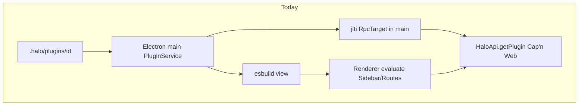
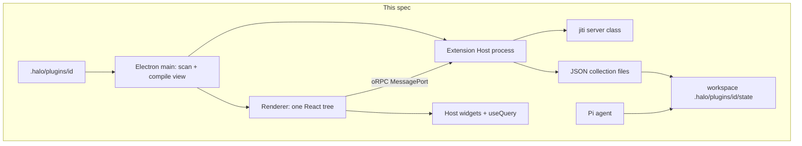
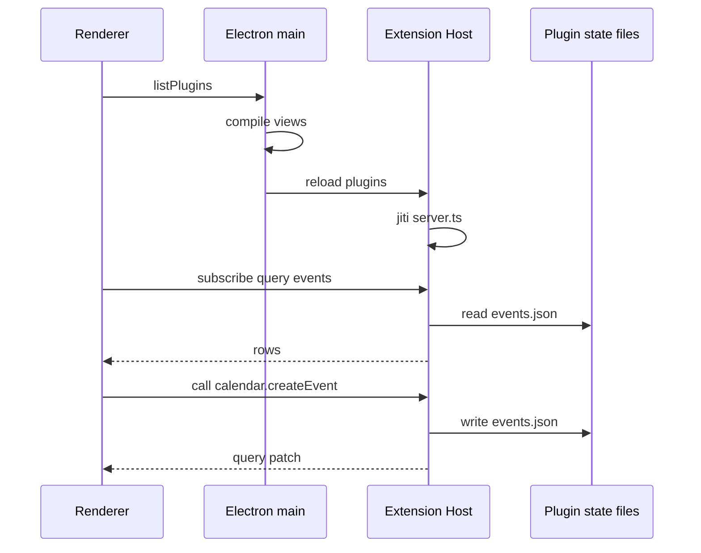

# Plugin apps

## System flow







## Problem overview

Plugin servers load inside Electron main and speak Cap'n Web on the same port as `HaloApi`. A bad plugin can take down the app. Plugin state is whatever the server keeps in memory. The seeded calendar has no events, no store, and no way for the agent and the UI to share a list. The next plugins are meant to be small apps: a server, workspace state, and a view that stays on Halo's widgets.

## Solution overview

Spawn one Extension Host process, independent of the renderer and of Electron main, the way VS Code isolates its extension host. Load every plugin server there. Talk to that process with oRPC over a MessagePort. Keep Cap'n Web on `HaloApi` for sessions and workspace. Give each plugin a file-backed collection store in its folder so the UI can `useQuery` and the agent can read the same JSON. Prove it with calendar: create an event, see it in the sidebar, keep the month route.

## Goals

- Plugin JavaScript for servers does not run in Electron main or in the renderer.
- One Extension Host child process loads all plugin servers. If it crashes, the Halo window stays up.
- Plugin RPC is oRPC. `usePluginServer` is an oRPC client, not a Cap'n Web stub.
- Each plugin may declare collections. Rows live as JSON under `{workspace}/.halo/plugins/<id>/state/`. Queries subscribe. Writes are visible to the agent as files.
- Plugin views still evaluate in Halo's React tree and may only use `@halo/plugin-sdk/view` widgets plus `useQuery` / `usePluginServer`.
- Seeded calendar has `schema.ts`, `server.ts` with `createEvent`, and a sidebar that lists events from the store.

## Non-goals

- No migrations or backfills.
- No replacing Cap'n Web on `HaloApi` or `AgentSessionApi`. That is a later spec.
- No one-process-per-plugin. One host, like VS Code's local extension host.
- No React Server Components, no custom reconciler, no native/mobile map.
- No Google Calendar, OAuth, or other network calendars.
- No Tandem/InstantDB dependency. The store API is small enough to sit on Tandem later.
- No plugin file watch for source edits. Reload the window to pick up `view.tsx` / `server.ts` changes. State file watches are for live queries only.
- No HTTP listener and no extra oRPC port on localhost.
- No rewrite of [`specs/plugin-host-runtime.md`](plugin-host-runtime.md). View compile stays in the workbench. If that spec lands first, the host runs `npm install` before jiti, not Electron main.

## Assumptions

- Plugin id stays the folder name.
- A plugin server default-exports a class. It does not extend `RpcTarget`. The constructor still takes `PluginServerContext`.
- `usePluginServer` is a proxy: `server.createEvent(args)` becomes oRPC `call({ pluginId, method: "createEvent", args: [args] })`.
- If a server method returns an `Error`, the host turns it into an oRPC failure. The renderer sees a rejected promise, same as today's Cap'n Web edge.
- Collection `where` supports equality and `{ gte, lt }` on numbers. No joins in v1.
- Electron production uses `utilityProcess.fork`. Vitest uses `node:worker_threads` `Worker` with the same host entry. Both upgrade a MessagePort with `@orpc/server/message-port`.
- Plugin code is trusted workspace code.

## Important files, docs, and websites

- [`apps/electron/src/main/plugins/PluginService.ts`](../apps/electron/src/main/plugins/PluginService.ts) — today's list/compile/jiti in main. Stops loading servers.
- [`apps/electron/src/main/plugins/loadPluginServer.ts`](../apps/electron/src/main/plugins/loadPluginServer.ts) — moves into the host.
- [`apps/electron/src/main/plugins/PluginService.test.ts`](../apps/electron/src/main/plugins/PluginService.test.ts) — package-level tests; replace the Cap'n Web ping case.
- [`apps/electron/src/main/rpc.ts`](../apps/electron/src/main/rpc.ts) — drop `getPlugin`.
- [`apps/electron/src/shared/rpc.ts`](../apps/electron/src/shared/rpc.ts) — `HaloApi.getPlugin` goes away.
- [`apps/electron/src/shared/channels.ts`](../apps/electron/src/shared/channels.ts) — add host port channels next to `halo:request-rpc`.
- [`apps/electron/src/main/main.ts`](../apps/electron/src/main/main.ts) — spawn the host, broker the renderer MessagePort.
- [`apps/electron/src/main/preload.ts`](../apps/electron/src/main/preload.ts) — forward the host port, same pattern as HaloApi.
- [`apps/electron/src/renderer/api/ApiProvider.tsx`](../apps/electron/src/renderer/api/ApiProvider.tsx) — stop `api.getPlugin`; hold an oRPC client.
- [`packages/plugin-sdk/src/server.ts`](../packages/plugin-sdk/src/server.ts) — drop `RpcTarget`.
- [`packages/plugin-sdk/src/view.ts`](../packages/plugin-sdk/src/view.ts) — `usePluginServer` + `useQuery`.
- [`packages/plugin-sdk/src/schema.ts`](../packages/plugin-sdk/src/schema.ts) — add `collection`.
- [`apps/electron/src/main/bundled/calendar/`](../apps/electron/src/main/bundled/calendar/) — seed schema, server, live sidebar.
- [`apps/electron/src/main/plugins/haloPluginSkill.md`](../apps/electron/src/main/plugins/haloPluginSkill.md) — author contract.
- [`specs/plugin-system.md`](plugin-system.md) — shipped plugin format this spec extends.
- [oRPC Message Port adapter](https://orpc.dev/docs/adapters/message-port) — `RPCHandler.upgrade(port)` / `RPCLink({ port })`.
- [oRPC Electron adapter](https://orpc.dev/docs/adapters/electron) — preload forwards a transferred port.
- [oRPC event iterator](https://orpc.dev/docs/event-iterator) — live query stream.
- [oRPC worker threads](https://orpc.dev/docs/adapters/worker-threads) — same MessagePort pattern Vitest will use.
- [Electron `utilityProcess`](https://www.electronjs.org/docs/latest/api/utility-process) — child process with MessagePort, not `worker_threads` in production.

## Implementation

### Phase 1: oRPC host router with ping

Add `@orpc/server` and `@orpc/client` to `@halo/desktop`. Put `createExtensionHostRouter` in main-process code. A MessagePort client can call `ping`. No Electron spawn yet. Calendar and Cap'n Web plugins stay as they are.

#### Important types

```ts
// apps/electron/src/main/plugins/extensionHostRouter.ts
import { os } from "@orpc/server";

export type ExtensionHostRouter = {
  ping: { output: { ok: true } };
};

export function createExtensionHostRouter(): ExtensionHostRouter;
```

#### Call stack diff

```diff
 (none — new module)
+createExtensionHostRouter
+└── os.handler ping → { ok: true }
+RPCHandler.upgrade(MessagePort)
+RPCLink({ port }).ping()
```

#### Code diff preview

```diff
 // apps/electron/src/main/plugins/extensionHostRouter.ts
+import { os } from "@orpc/server";
+
+export function createExtensionHostRouter() {
+  return {
+    ping: os.handler(async () => ({ ok: true as const })),
+  };
+}
```

- [ ] Add `@orpc/server` and `@orpc/client` to `@halo/desktop`. Export `createExtensionHostRouter` with `ping`.
- [ ] Add `apps/electron/src/main/plugins/extensionHostRouter.test.ts` that opens a `MessageChannel`, upgrades one port with `RPCHandler`, and calls `ping` through `RPCLink`.
- [ ] Smoke: the existing Cap'n Web calendar ping test still passes. Do not commit this check as a new assertion on Cap'n Web.
- [ ] Run `pnpm --filter @halo/desktop test src/main/plugins/extensionHostRouter.test.ts`.

### Phase 2: Extension Host process and renderer oRPC port

Run the router in a child process. Electron main forks it with `utilityProcess`. The renderer asks preload for a host port, same as `halo:request-rpc`. Add a Forge/Vite entry so the host file ships next to `main.cjs`. Do not move plugin servers yet. `ping` from the renderer is enough.

#### Important types

```ts
// apps/electron/src/shared/channels.ts
export const RPC_CHANNELS = {
  requestRpc: "halo:request-rpc",
  provideRpc: "halo:provide-rpc",
  requestExtensionHost: "halo:request-extension-host",
  provideExtensionHost: "halo:provide-extension-host",
} as const;

// apps/electron/src/main/plugins/extensionHostMain.ts
// listens on parent port, RPCHandler.upgrade(received MessagePort)
```

#### Call stack diff

```diff
 main.ts registerRpcBridge
 └── halo:request-rpc → HaloRpc Cap'n Web
+main.ts startExtensionHost
+└── utilityProcess.fork(extensionHost.cjs)
+registerExtensionHostBridge
+└── halo:request-extension-host
+    └── transfer MessagePort to the child
+preload
+└── forward provideExtensionHost to window
+renderer connectExtensionHostRpc
+└── RPCLink ping
```

#### Code diff preview

```diff
 // apps/electron/src/main/main.ts
+const extensionHost = utilityProcess.fork(join(currentDirectory, "extensionHost.cjs"));
+
+ipcMain.on(RPC_CHANNELS.requestExtensionHost, (event) => {
+  assertTrustedSender(event);
+  const { port1, port2 } = new MessageChannelMain();
+  extensionHost.postMessage("orpc", [port1]);
+  event.senderFrame.postMessage(RPC_CHANNELS.provideExtensionHost, null, [port2]);
+});
```

- [ ] Add `extensionHostMain.ts` and a Vite/Forge entry that emits `extensionHost.cjs`. Fork it from `main.ts` after `app.whenReady`.
- [ ] Add channels, preload forward, and `connectExtensionHostRpc` in the renderer. Call `ping` once from `ApiProvider` when the workspace is ready so a missing host fails early.
- [ ] In Vitest, spawn the same entry with `new Worker(...)` and the worker-threads adapter. Do not use `utilityProcess` in Vitest.
- [ ] Smoke: Halo still opens and Calendar still mounts (old Cap'n Web path). Do not commit this check.
- [ ] Run `pnpm --filter @halo/desktop test src/main/plugins/extensionHostRouter.test.ts`.

### Phase 3: Load plugin servers in the host

Move `loadPluginServer` into the host. `PluginService.list` still scans and compiles views. It no longer jiti-imports servers. `HaloApi.getPlugin` goes away. The renderer calls oRPC `call`. `usePluginServer` is a proxy over that. Drop `RpcTarget` from `@halo/plugin-sdk/server`.

#### Important types

```ts
// packages/plugin-sdk/src/server.ts
export type PluginServerContext = {
  pluginId: string;
  workspaceRoot: string;
};

// apps/electron/src/main/plugins/extensionHostRouter.ts
type PluginCallInput = {
  pluginId: string;
  method: string;
  args: unknown[];
};

type ExtensionHostRouter = {
  ping: { output: { ok: true } };
  reload: {
    input: {
      workspaceRoot: string;
      plugins: { id: string; directory: string; serverPath?: string }[];
    };
  };
  call: { input: PluginCallInput; output: unknown };
};
```

#### Call stack diff

```diff
 PluginService.list
 ├── readPluginManifest
 ├── compilePluginView
-└── loadPluginServer → wrapPluginRpc → this.servers[id]
+└── (views only)

 HaloRpc
-└── getPlugin(id) → RpcTarget
+└── listPlugins → compiled views
+    └── extensionHost.reload({ workspaceRoot, plugins })

 usePluginsQuery
-└── api.getPlugin(id) Cap'n Web stub
+└── extensionHost client (one RPCLink)
     └── usePluginServer → call({ pluginId, method, args })
```

#### Code diff preview

```diff
 // apps/electron/src/main/plugins/PluginService.ts
-      if (manifest.serverPath !== undefined) {
-        const server = await loadPluginServer({ ... });
-        this.servers[id] = wrapPluginRpc(server);
-      }

 // packages/plugin-sdk/src/view.ts
-export function usePluginServer<S extends RpcTarget>(): RpcStub<S> {
-  return runtime.server as RpcStub<S>;
+export function usePluginServer<S extends object>(): S {
+  return runtime.call as S;
 }
```

- [ ] Host `reload` loads each `serverPath` with the existing jiti helper. Reflect prototype methods the way `wrapPluginRpc` does. No `RpcTarget` `instanceof`.
- [ ] `call` runs `server[method](...args)`. If the result is `instanceof Error`, throw at this oRPC edge.
- [ ] `PluginService.list` returns manifests and compiled views only. `HaloRpc.getPlugin` and `HaloApi.getPlugin` are deleted. `usePluginsQuery` does not fetch per-plugin Cap'n Web stubs.
- [ ] Rewrite the Cap'n Web ping test to oRPC `call` for `ping` / `fail` and a missing plugin id. Keep listing tests on `PluginService.list`.
- [ ] Run `pnpm --filter @halo/desktop test src/main/plugins/PluginService.test.ts src/main/plugins/extensionHostRouter.test.ts`.

### Phase 4: File-backed collections

Add `collection` to `@halo/plugin-sdk/schema`. The host opens `{pluginDir}/state/<collection>.json` as an array of rows. `insert` / `query` / `subscribe` are oRPC procedures. `PluginServerContext` includes a `db` the server uses. No extra database package.

#### Important types

```ts
// packages/plugin-sdk/src/schema.ts
export type Collection<N extends string, Row> = {
  name: N;
  fields: TSchema;
};

export function collection<N extends string, S extends TSchema>(args: {
  name: N;
  fields: S;
}): Collection<N, Static<S>>;

// query input
type CollectionQuery = {
  pluginId: string;
  collection: string;
  where?: Record<string, unknown | { gte?: number; lt?: number }>;
  orderBy?: { field: string; direction: "asc" | "desc" };
};
```

#### Call stack diff

```diff
 extensionHostRouter.call
+extensionHostRouter.query
+extensionHostRouter.insert
+extensionHostRouter.subscribe  // async generator, event iterator
     └── PluginStore
         ├── read pluginDir/state/<name>.json
         ├── filter where / orderBy
         └── write + notify subscribers
 plugin server method
+└── ctx.db.insert({ collection, row })
```

#### Code diff preview

```diff
 // apps/electron/src/main/plugins/PluginStore.ts
+export class PluginStore {
+  async query(input: CollectionQuery): Promise<unknown[]> { ... }
+  async insert(input: { pluginId: string; collection: string; row: unknown }) { ... }
+  subscribe(input: CollectionQuery, signal: AbortSignal): AsyncIterable<unknown[]> { ... }
+}
```

- [ ] Implement `collection()` and a `PluginStore` that writes pretty-printed JSON arrays. Missing file is `[]`. `insert` assigns no id; the caller passes `id`.
- [ ] `subscribe` yields the full row list on start and after each write. Watch the JSON file so an agent rewrite also yields.
- [ ] Give `PluginServerContext` a `db` with `insert` and `query` for that plugin id only. A server cannot write another plugin's collections.
- [ ] Add a `PluginService` / host test: insert two rows, `query` with `gte`/`lt`, subscribe, insert a third, observe the next yield. Use `writePlugin` for the folder.
- [ ] Run `pnpm --filter @halo/desktop test src/main/plugins/PluginService.test.ts`.

### Phase 5: `useQuery` in the view SDK

Views subscribe through the host client. `useQuery(collection, { where, orderBy })` returns rows and re-renders on each yield. Keep `usePluginServer` for mutations that are not a raw insert.

#### Important types

```ts
// packages/plugin-sdk/src/view.ts
export function useQuery<N extends string, Row>(
  collection: Collection<N, Row>,
  options?: {
    where?: Record<string, unknown | { gte?: number; lt?: number }>;
    orderBy?: { field: string; direction: "asc" | "desc" };
  },
): Row[];
```

#### Call stack diff

```diff
 PluginRuntimeProvider
-├── pluginId
-└── server RpcStub
+├── pluginId
+└── extensionHost oRPC client
     ├── usePluginServer → call
     └── useQuery → subscribe → setState(rows)
 Sidebar / Routes
+└── useQuery(events, { where, orderBy })
```

#### Code diff preview

```diff
 // packages/plugin-sdk/src/view.ts
+export function useQuery(collection, options) {
+  const runtime = useContext(PluginRuntimeContext);
+  const [rows, setRows] = useState([]);
+  useEffect(() => {
+    const iterator = runtime.client.subscribe({
+      pluginId: runtime.pluginId,
+      collection: collection.name,
+      where: options?.where,
+      orderBy: options?.orderBy,
+    });
+    void (async () => {
+      for await (const next of iterator) setRows(next);
+    })();
+    return () => iterator.return?.();
+  }, [runtime.pluginId, collection.name]);
+  return rows;
+}
```

- [ ] Implement `useQuery` on the host client. Abort the iterator on unmount.
- [ ] Thread the oRPC client through `PluginRuntimeProvider` from `usePluginsQuery`. Views do not import `@orpc/client`.
- [ ] Add `schema` to the view compile host slots if `view.tsx` imports `collection` objects from `./schema.ts` (inlined) — do not add `@halo/plugin-sdk/schema` as a slot unless a test needs the live module. Prefer the plugin bundling `./schema.ts`.
- [ ] Smoke: a fixture view that calls `useQuery` without a provider still throws `PluginRuntimeMissingError`. Do not commit this check.
- [ ] Run `pnpm --filter @halo/plugin-sdk test` and `pnpm --filter @halo/desktop test src/main/plugins/PluginService.test.ts`.

### Phase 6: Seeded calendar as a plugin app

Replace the month-only seed with schema, server, and a live list. `createEvent` writes a row. The sidebar lists events. The month route still shows the heading and an Add control. No Google.

#### Important types

```ts
// apps/electron/src/main/bundled/calendar/schema.ts
export const events = collection({
  name: "events",
  fields: Type.Object({
    id: Type.String(),
    title: Type.String(),
    startsAt: Type.Number(),
    endsAt: Type.Number(),
  }),
});

// apps/electron/src/main/bundled/calendar/server.ts
export default class CalendarServer {
  constructor(private readonly ctx: PluginServerContext) {}
  createEvent(args: { title: string; startsAt: number; endsAt: number }) {
    return this.ctx.db.insert({
      collection: "events",
      row: { id: crypto.randomUUID(), ...args },
    });
  }
}
```

#### Call stack diff

```diff
 seedPluginWorkspace
 ├── calendar/package.json
 ├── calendar/view.tsx
+├── calendar/schema.ts
+└── calendar/server.ts
 Calendar Sidebar
-└── static SidebarItem Month
+└── useQuery(events) → SidebarItem per row
 Calendar Month view
 └── H1 month label
+└── Button Add event → usePluginServer().createEvent
```

#### Code diff preview

```diff
 // apps/electron/src/main/bundled/calendar/view.tsx
 export function Sidebar() {
+  const rows = useQuery(events, { orderBy: { field: "startsAt", direction: "asc" } });
   return (
     <SidebarSection label="Calendar">
       <SidebarItem href="/">Month</SidebarItem>
+      {rows.map((event) => (
+        <SidebarItem key={event.id} href="/">
+          {event.title}
+        </SidebarItem>
+      ))}
     </SidebarSection>
   );
 }
```

- [ ] Seed `schema.ts` and `server.ts` only when missing, same as today's view seed. Existing workspaces that already have calendar keep the old files (no migration).
- [ ] Month view keeps `data-testid="calendar-month"`. Add a button named "Add event" that inserts a titled row with `startsAt` now.
- [ ] Extend `PluginService` tests: after seed, `call` `createEvent`, then `query` `events` returns the row.
- [ ] Run `pnpm --filter @halo/desktop test src/main/plugins/PluginService.test.ts`.
- [ ] Prove with `pnpm halo-web`: open Calendar, click Add event, the new title shows in the sidebar. Record a short demo for the UI change.

### Phase 7: Skill and author contract

Update the seeded skill so an agent writes schema, a class server (no `RpcTarget`), `useQuery`, and host widgets. Mention reload for code, and that state files are the source of truth for humans and the agent.

#### Important types

Not applicable — no code path changes.

#### Call stack diff

Not applicable — no code path changes.

#### Code diff preview

```diff
 // apps/electron/src/main/plugins/haloPluginSkill.md
- `server.ts` with a default `RpcTarget` class
+ `schema.ts` with `collection(...)`
+ `server.ts` with a default class. Constructor `{ pluginId, workspaceRoot, db }`.
+ View: import UI from `@halo/plugin-sdk/view`. Use `useQuery` for rows and
+ `usePluginServer` for methods. Do not import `react-dom`. State lives in
+ `.halo/plugins/<id>/state/<collection>.json`.
```

- [ ] Edit `haloPluginSkill.md` and the example in it. Drop Cap'n Web / `RpcTarget`.
- [ ] Assert the seeded skill contains `useQuery` and `collection` in the existing seed test.
- [ ] Run `pnpm --filter @halo/desktop test src/main/plugins/PluginService.test.ts`.
- [ ] Run `pnpm run check-affected`.
