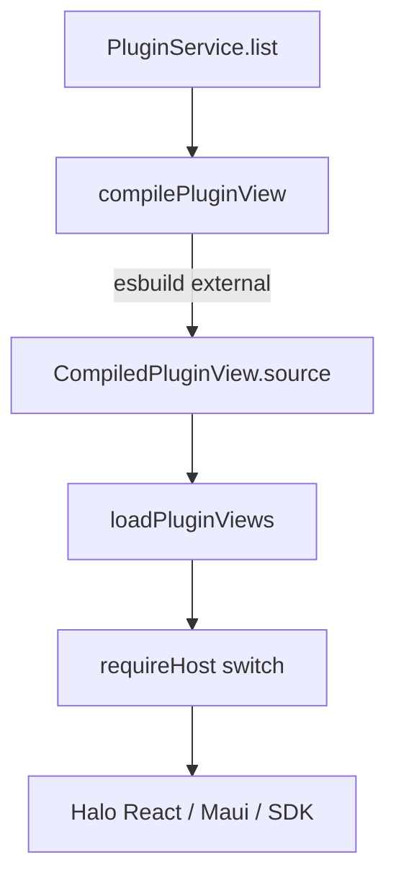
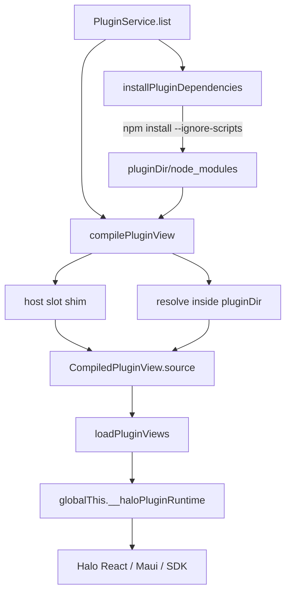

# Plugin host runtime





## Problem overview

Plugin views compile with esbuild and leave React, Maui, purse-styles, wouter, and `@halo/plugin-sdk/view` as `external`. The renderer then `require`s Halo's copies through `requireHost`. That keeps one React and one Maui. It does not own the rest of the graph.

esbuild still walks `node_modules` from the plugin folder up to the filesystem root. A plugin that imports `zod` can pick Halo's copy. A plugin that `npm install`s a UI kit can pick a second React from a parent `node_modules` if that specifier is not in `external`. Halo never runs `npm install` in the plugin folder, so agents who follow the skill still need a private `node_modules` that the loader will not confuse with the app.

bb splits this the other way: the plugin owns `node_modules`, the bundler inlines those packages, and a short host list is rewritten to shims that read `globalThis.__bbPluginRuntime`. Halo should take that split, without bb's Tailwind, marketplace, ESM `dist/`, or server bundling.

## Solution overview

Keep CJS and `new Function`. Put Halo's host modules on `globalThis.__haloPluginRuntime`. Replace `external` with an esbuild plugin that rewrites those specifiers to CJS shims. Resolve every other file only inside the plugin directory. Run `npm install --ignore-scripts --prefix <pluginDir>` before compile and server load when the plugin declares packages.

Do not use `peerDependencies` for the singleton. Plugins are not installed into Halo. The host slot list is the singleton.

## Goals

- Plugin views get Halo's React, Maui, purse-styles, wouter, and `@halo/plugin-sdk/view` as the same module objects they get today.
- Bare imports that are not host slots resolve from `{pluginDir}/node_modules` and inline into the view bundle.
- A package in a parent `node_modules` (including Halo's) does not enter the view bundle.
- `PluginService.list` installs the plugin's declared packages with `npm install --ignore-scripts` before it compiles the view or loads the server.
- Existing `PluginService` tests keep passing. New tests cover an inlined local package, a missing package, a parent `node_modules` decoy, and host Maui still loading.
- The seeded plugin skill describes host slots versus plugin packages, and that Halo runs the install on load.

## Non-goals

- Tailwind, scoped CSS, or writing `dist/app.js`.
- ESM blob import, or dropping `new Function`.
- Bundling plugin servers off jiti. Servers keep loading from disk. Host install still fills `node_modules` for them.
- Marketplace, signed plugins, or native addons.
- Extra host slots (Radix, sonner, clsx, and the rest of bb's size list).
- A generated named-export manifest. CJS `module.exports = namespace` matches today's `requireHost`.
- Bundling `npm` into the packaged app. `npm` must be on `PATH`. If it is missing, that plugin records an install error and other plugins still load.
- Caching or skipping install when `node_modules` looks fresh.

## Important files, docs, and websites

- [`apps/electron/src/main/plugins/compilePluginView.ts`](../apps/electron/src/main/plugins/compilePluginView.ts) — today's `viewExternals` and esbuild `external` list.
- [`apps/electron/src/renderer/evaluatePluginView.ts`](../apps/electron/src/renderer/evaluatePluginView.ts) — `requireHost` and `new Function`.
- [`apps/electron/src/main/plugins/PluginService.ts`](../apps/electron/src/main/plugins/PluginService.ts) — `list()` compiles views and loads servers.
- [`apps/electron/src/main/plugins/loadPluginServer.ts`](../apps/electron/src/main/plugins/loadPluginServer.ts) — jiti from disk; unchanged except that install runs first.
- [`apps/electron/src/main/plugins/PluginService.test.ts`](../apps/electron/src/main/plugins/PluginService.test.ts) — package-level tests via `writePlugin`, `list()`, `loadPluginViews`.
- [`apps/electron/src/main/plugins/haloPluginSkill.md`](../apps/electron/src/main/plugins/haloPluginSkill.md) — seeded skill template.
- [bb `build-plugin-app.ts` runtime shims](https://github.com/get-bb/bb/blob/main/packages/plugin-build/src/build-plugin-app.ts) — `RUNTIME_SLOT_BY_SPECIFIER`, `runtimeShimPlugin`, `globalThis.__bbPluginRuntime`. Take the slot-shim idea only.
- [esbuild plugin API](https://esbuild.github.io/plugins/) — `onResolve` / `onLoad` / `build.resolve`.
- [npm `install --ignore-scripts`](https://docs.npmjs.com/cli/v11/commands/npm-install) — no lifecycle scripts in plugin folders.

## Implementation

### Phase 1: Host runtime object

`evaluatePluginView` fills `globalThis.__haloPluginRuntime` with the modules `requireHost` already returns. `requireHost` reads that object. Compile still uses `external`. Behavior stays the same.

#### Important types

```ts
// apps/electron/src/shared/pluginViewHost.ts
export const pluginViewHostSlots = [
  "react",
  "react/jsx-runtime",
  "react/jsx-dev-runtime",
  "react-dom",
  "maui",
  "purse-styles",
  "wouter",
  "@halo/plugin-sdk/view",
] as const;

export type PluginViewHostSlot = (typeof pluginViewHostSlots)[number];

export type PluginViewHostRuntime = Record<PluginViewHostSlot, object>;

export function isPluginViewHostSlot(
  specifier: string,
): specifier is PluginViewHostSlot {
  return (pluginViewHostSlots as readonly string[]).includes(specifier);
}
```

```ts
// apps/electron/src/renderer/evaluatePluginView.ts
declare global {
  var __haloPluginRuntime: PluginViewHostRuntime | undefined;
}
```

#### Call stack diff

```diff
 loadPluginViews
 └── evaluatePluginView
     └── new Function(..., requireHost, ...)
-        └── requireHost switch on specifier
+        └── requireHost
+            └── globalThis.__haloPluginRuntime[specifier]
```

#### Code diff preview

```diff
 // apps/electron/src/renderer/evaluatePluginView.ts
+globalThis.__haloPluginRuntime = {
+  react,
+  "react/jsx-runtime": jsxRuntime,
+  "react/jsx-dev-runtime": jsxDevRuntime,
+  "react-dom": reactDom,
+  maui,
+  "purse-styles": purseStyles,
+  wouter,
+  "@halo/plugin-sdk/view": pluginSdkView,
+};

 function requireHost(specifier: string) {
-  switch (specifier) {
-    case "react":
-      return react;
-    // ...
-    default:
-      throw new Error(`plugin view cannot require '${specifier}'`);
-  }
+  const runtime = globalThis.__haloPluginRuntime;
+  if (runtime === undefined) {
+    throw new Error("plugin view runtime is missing");
+  }
+  if (!isPluginViewHostSlot(specifier)) {
+    throw new Error(`plugin view cannot require '${specifier}'`);
+  }
+  return runtime[specifier];
 }
```

- [ ] Add `pluginViewHostSlots` in `apps/electron/src/shared/pluginViewHost.ts` and use that list from `compilePluginView.ts` instead of a local `viewExternals` array.
- [ ] Assign `globalThis.__haloPluginRuntime` in `evaluatePluginView.ts` and point `requireHost` at it.
- [ ] Smoke: `pnpm --filter @halo/desktop test src/main/plugins/PluginService.test.ts`. The calendar SDK import test still loads `Sidebar` and `Routes`. Do not commit this check.
- [ ] Run `pnpm --filter @halo/desktop test src/main/plugins/PluginService.test.ts`.

### Phase 2: Slot shims replace `external`

`compilePluginView` drops `external`. An esbuild plugin resolves each host slot to namespace `halo-host` and loads a CJS shim that reads `globalThis.__haloPluginRuntime`. If the specifier has no slot, the plugin does not claim it. Keep `requireHost` for any leftover CJS `require`.

Do not copy bb's named-export manifest. Halo's shims assign the whole namespace to `module.exports`, which is what `requireHost` returns today.

#### Important types

```ts
// apps/electron/src/main/plugins/compilePluginView.ts
import type { Plugin } from "esbuild";

function hostSlotShimPlugin(): Plugin {
  return {
    name: "halo-plugin-host-slots",
    setup(build) {
      // onResolve SHIM_FILTER -> { path, namespace: "halo-host" }
      // onLoad namespace "halo-host" -> CJS shim source
    },
  };
}
```

#### Call stack diff

```diff
 PluginService.list
 └── compilePluginView
     └── esbuild.build
-        └── external: viewExternals
+        └── plugins: [hostSlotShimPlugin()]
+            ├── onResolve host specifier -> namespace halo-host
+            └── onLoad halo-host -> module.exports = runtime[specifier]
 └── loadPluginViews
     └── evaluatePluginView
         └── new Function
             ├── shim reads globalThis.__haloPluginRuntime
             └── requireHost still reads the same object
```

#### Code diff preview

```diff
 // apps/electron/src/main/plugins/compilePluginView.ts
 const built = await esbuild
   .build({
     absWorkingDir: args.directory,
     entryPoints: [args.viewPath],
     bundle: true,
     write: false,
     format: "cjs",
     platform: "browser",
     jsx: "automatic",
     logLevel: "silent",
-    external: [...viewExternals],
+    plugins: [hostSlotShimPlugin()],
   })
```

Shim source (CJS, not bb's ESM re-exports):

```js
const runtime = globalThis.__haloPluginRuntime;
if (runtime === undefined) {
  throw new Error("plugin view runtime is missing");
}
const mod = runtime["react"];
if (mod === undefined) {
  throw new Error('plugin view runtime has no slot for "react"');
}
module.exports = mod;
```

Build `SHIM_FILTER` from `pluginViewHostSlots` so the resolve filter and the runtime object cannot drift. Escape `/`, `@`, and `.` in the regex, as bb does.

- [ ] Add `hostSlotShimPlugin` in `compilePluginView.ts` and remove `external`.
- [ ] Throw from the shim when the runtime object or the slot is missing. Do not silently bind `undefined`.
- [ ] Smoke: calendar and `@halo/plugin-sdk/view` tests still evaluate. Compiled source for a SDK import contains `__haloPluginRuntime` and does not leave `require("@halo/plugin-sdk/view")` as the load path. Do not commit this check.
- [ ] Run `pnpm --filter @halo/desktop test src/main/plugins/PluginService.test.ts`.

### Phase 3: Resolve only inside the plugin directory

The same esbuild plugin resolves every non-slot import, then rejects a file whose path is outside the plugin directory. Nested `node_modules` inside the plugin stay allowed. Halo's `node_modules` and a workspace parent `node_modules` do not.

Use `build.resolve` with `pluginData` so this plugin does not recurse into itself. Compare with `node:path` `relative` after `realpath` so a symlink that leaves the plugin folder fails.

#### Important types

```ts
// apps/electron/src/main/plugins/compilePluginView.ts
function pathInsidePluginDir(args: {
  pluginDir: string;
  filePath: string;
}): boolean {
  // realpath both sides, then relative(pluginDir, filePath)
  // false when relative is empty, absolute, or starts with ".."
}
```

#### Call stack diff

```diff
 compilePluginView
 └── esbuild.build
     └── hostSlotShimPlugin
         ├── onResolve host specifier -> halo-host shim
-        └── default node_modules walk (pluginDir -> fs root)
+        └── onResolve other specifiers
+            └── build.resolve(..., pluginData: { skipHalo: true })
+                └── reject path outside pluginDir
```

#### Code diff preview

```diff
 // apps/electron/src/main/plugins/compilePluginView.ts
  setup(build) {
    build.onResolve({ filter: SHIM_FILTER }, (args) => ({
      path: args.path,
      namespace: "halo-host",
    }));
+   build.onResolve({ filter: /.*/ }, async (args) => {
+     if (args.pluginData?.skipHalo === true) return undefined;
+     if (args.namespace === "halo-host") return undefined;
+     const resolved = await build.resolve(args.path, {
+       importer: args.importer,
+       namespace: args.namespace,
+       resolveDir: args.resolveDir,
+       kind: args.kind,
+       pluginData: { skipHalo: true },
+     });
+     if (resolved.errors.length > 0) return resolved;
+     if (
+       resolved.path !== "" &&
+       pathInsidePluginDir({
+         pluginDir: argsDirectory,
+         filePath: resolved.path,
+       }) !== true
+     ) {
+       return {
+         errors: [
+           {
+             text: `plugin '${id}' resolved '${args.path}' outside the plugin folder`,
+           },
+         ],
+       };
+     }
+     return resolved;
+   });
  }
```

Host-slot `onResolve` must run for those specifiers so `react` never resolves as a file under Halo or the plugin. Keep the `SHIM_FILTER` handler; do not wait for the catch-all.

- [ ] Reject resolved files outside `args.directory` in `compilePluginView`.
- [ ] Add `PluginService` tests that write through the existing `writePlugin` fixture and observe `list()` plus `loadPluginViews`:
  - Inlined local package: `node_modules/tiny-hello` inside the plugin, `view.tsx` imports `marker`, throws at evaluate if `marker !== "tiny-ok"`, otherwise exports `Sidebar`. Expect no errors and a function `Sidebar`.
  - Parent decoy: `{workspaceRoot}/node_modules/decoy` with a unique export; plugin `view.tsx` imports `decoy`. Expect that plugin in `listed.errors` with a compile message.
  - Missing package: `import "missing-halo-pkg"` with no `node_modules` entry. Expect a compile error. Other plugins in the same `list()` still load.
- [ ] Keep the existing `@halo/plugin-sdk/view` test as the host-Maui check.
- [ ] Run `pnpm --filter @halo/desktop test src/main/plugins/PluginService.test.ts`.

### Phase 4: Host `npm install`

`PluginService.list` runs `npm install --ignore-scripts --prefix <pluginDir>` after a valid manifest and before `compilePluginView` / `loadPluginServer`, when `package.json` has any names under `dependencies`, `devDependencies`, or `optionalDependencies`. Calendar has none, so it does not spawn npm.

Read `package.json` in the install helper. Do not extend `pluginPackageJsonSchema` for this. JSON `null` stays at that parse boundary.

Use `execFile` from `node:child_process/promises`. Do not add an npm wrapper package. On failure, return a tagged error; `list()` records it on that plugin and continues.

#### Important types

```ts
// apps/electron/src/main/plugins/installPluginDependencies.ts
export class PluginInstallError extends errore.createTaggedError({
  name: "PluginInstallError",
  message: "Plugin '$id' npm install failed: $detail",
}) {}

export async function installPluginDependencies(args: {
  id: string;
  directory: string;
}): Promise<PluginInstallError | undefined>
```

#### Call stack diff

```diff
 PluginService.list
 └── readPluginManifest
+└── installPluginDependencies
+    └── execFile("npm", ["install", "--ignore-scripts", "--prefix", directory])
 └── compilePluginView
 └── loadPluginServer
```

#### Code diff preview

```diff
 // apps/electron/src/main/plugins/PluginService.ts
       if (manifest instanceof Error) {
         errors.push({ id, message: manifest.message });
         continue;
       }
+
+      const installed = await installPluginDependencies({
+        id,
+        directory: manifest.directory,
+      });
+      if (installed instanceof Error) {
+        errors.push({ id, message: installed.message });
+        continue;
+      }

       let compiled: PluginList["compiledViews"][number] | undefined;
       if (manifest.viewPath !== undefined) {
         const view = await compilePluginView({
```

Skip spawn when those three dependency maps are missing or empty. An empty `dependencies: {}` does not install.

- [ ] Add `installPluginDependencies.ts` and call it from `PluginService.list`.
- [ ] Convert `execFile` failure with `.catch((e) => new PluginInstallError({ id, detail: String(e), cause: e }))`. Put npm stderr in `detail` when the child returns a non-zero status.
- [ ] Add a `PluginService` test that does not pre-create `node_modules`: plugin `package.json` has `"tiny-hello": "file:vendor/tiny-hello"`, vendor package exports `marker`, view imports it the same way as the phase 3 inlined test. `list()` then `loadPluginViews` succeed. Use a `file:` package so CI does not need the npm registry.
- [ ] Run `pnpm --filter @halo/desktop test src/main/plugins/PluginService.test.ts`.

### Phase 5: Skill matches the loader

Update `haloPluginSkill.md` so agents do not think they must run npm themselves for Halo to see packages, and so they still do not install host-slot packages.

#### Important types

Not applicable — no code path changes.

#### Call stack diff

Not applicable — no code path changes.

#### Code diff preview

```diff
 // apps/electron/src/main/plugins/haloPluginSkill.md
-Other packages are allowed. Add them to that plugin's `package.json`, run `npm install` in the plugin folder, then reload. esbuild inlines them. A missing package fails compile.
+Halo runs `npm install --ignore-scripts` in the plugin folder on load when `package.json` lists dependencies. Add packages there, then reload. esbuild inlines anything that is not a host slot. A missing package or an install failure records an error for that plugin.
+
+Do not add `react`, `react-dom`, `maui`, `purse-styles`, `wouter`, or `@halo/plugin-sdk` to the plugin's dependencies. Those resolve to Halo's copies through `globalThis.__haloPluginRuntime`.
```

Keep the instruction to read `{{HALO_COMPILE_PLUGIN_VIEW}}`. After phase 2 that file shows the shim plugin, not `external`.

- [ ] Edit `haloPluginSkill.md` View bundle section to describe host slots, plugin `node_modules`, and host install.
- [ ] Extend the existing seed test only if the template string it already reads needs a new assertion that the skill names `__haloPluginRuntime` or `npm install --ignore-scripts`. Prefer one `expect(seededSkill).toContain(...)` over snapshot formatting.
- [ ] Run `pnpm --filter @halo/desktop test src/main/plugins/PluginService.test.ts`.
- [ ] Run `pnpm run check-affected`.
