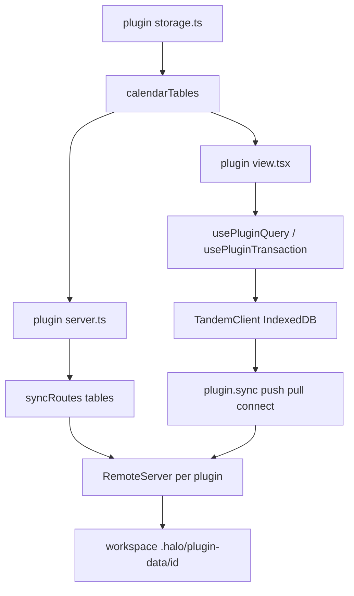
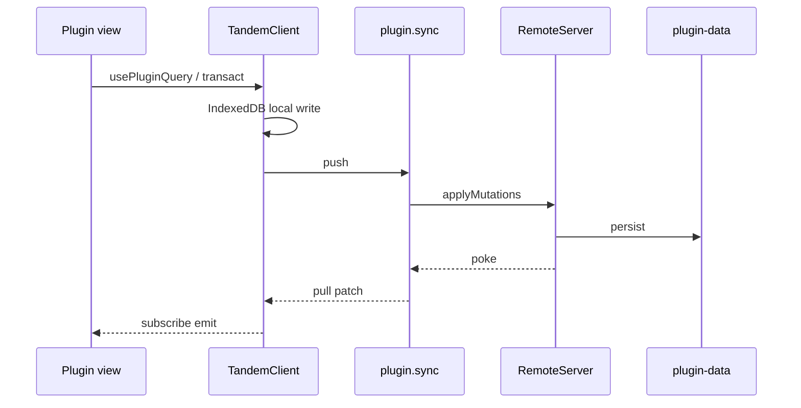

# Plugin storage

## System flow





## Problem overview

Plugins persist with ad hoc files and oRPC methods. There is no shared local-first store, no typed queries, and no way for a view to read the same records the server holds. The plugin-system spec left a database out on purpose. Calendar-shaped plugins cannot keep events across reloads without each author inventing a store.

## Solution overview

Give each plugin its own Tandem engine. The author defines collections in `storage.ts`, mounts `syncRoutes(tables)` on the plugin oRPC router, and reads and writes through `usePluginQuery` and `usePluginTransaction`. Halo embeds Tandem `RemoteServer` in the plugin server (self-serve, same process). The renderer holds a `TandemClient` that syncs over existing plugin oRPC. Plugins stay separate Tandem instances. A later change can nest those collections under plugin ids in one engine so plugins can share access and run distributed transactions.

Tandem is private and unpublished. Halo depends on it with git path deps in `package.json`, not npm.

## Goals

- A plugin may export collections from `storage.ts` using Tandem `collection` / `defineSchema` / `t` re-exported by `@halo/plugin-sdk/storage`.
- `server.ts` mounts `syncRoutes(tables)` from `@halo/plugin-sdk/server`. That nested router exposes Tandem `push`, `pull`, and `connect`.
- The SDK view exports `usePluginQuery` and `usePluginTransaction`. They talk to a renderer `TandemClient` that syncs through `plugin.sync`.
- Each plugin has its own Tandem client and remote. Durable remote state lives under `{workspace}/.halo/plugin-data/<pluginId>/`.
- Agents and humans see the same durable records on the workspace filesystem.
- Plugins without `storage.ts` keep working. A plugin that omits `syncRoutes` still loads; storage hooks fail with a tagged error.

## Non-goals

- No merging of plugin schemas. No cross-plugin reads. No distributed transactions.
- No HTTP listener. Sync rides the existing oRPC MessagePort.
- No Tandem drizzle / SQL adapters. Halo sets `allowBuilds.better-sqlite3` to false.
- No Turso, libSQL, or `usePluginState`.
- No schema migrations or backfills.
- No publishing Tandem to npm. Git deps only.
- No host auto-load of `storage.ts`. The author imports it from `server.ts` and the view.
- No extra view exports beyond `Sidebar` and `Routes`. `storage.ts` is a file convention, not a named view export.
- No marketplace, watch, or auto-reload. Reload the window to pick up plugin edits.

## Assumptions

- Tandem packages are `@tandem/core`, `@tandem/server`, and `@tandem/types` at `github.com/tanishqkancharla/tandem`. Dist is gitignored, so Halo points `main` / `types` at `src` through `packageExtensions`.
- "Tandem tables" means `defineSchema` collections. "Nested dynamically" means each plugin load creates that plugin's collections and nests `sync` on its router. It does not mean one host-wide SQL schema.
- Remote durability is a JSON snapshot of the in-memory `RemoteStore`, not SQLite.
- Renderer local store is Tandem `IndexedDbTupleStorage` named `halo-plugin-<pluginId>`.
- `syncRoutes(tables)` returns `{ sync: { push, pull, connect } }` so authors spread it into the default router.
- Hooks take `tables` as the first argument so the view types and the server schema stay the same object.
- `.cursor/environment.json` lists `github.com/tanishqkancharla/tandem` in `repositoryDependencies` so Cloud Agent tokens can fetch the private git deps.

## Important files, docs, and websites

- [`packages/plugin-sdk/package.json`](../packages/plugin-sdk/package.json) — Add git deps and a `./storage` export.
- [`packages/plugin-sdk/src/server.ts`](../packages/plugin-sdk/src/server.ts) — Add `syncRoutes`.
- [`packages/plugin-sdk/src/view.ts`](../packages/plugin-sdk/src/view.ts) — Add `usePluginQuery` and `usePluginTransaction`.
- [`packages/plugin-sdk/src/schema.ts`](../packages/plugin-sdk/src/schema.ts) — Manifest stays as it is. Do not add a `storage` field.
- [`apps/electron/src/main/plugins/loadPluginServer.ts`](../apps/electron/src/main/plugins/loadPluginServer.ts) — jiti aliases for Tandem.
- [`apps/electron/src/main/plugins/compilePluginView.ts`](../apps/electron/src/main/plugins/compilePluginView.ts) — Mark `@halo/plugin-sdk/storage` external.
- [`apps/electron/src/renderer/evaluatePluginView.ts`](../apps/electron/src/renderer/evaluatePluginView.ts) — `requireHost` for the storage subpath.
- [`apps/electron/mainExternals.ts`](../apps/electron/mainExternals.ts) — Copy Tandem into the packaged app for jiti.
- [`apps/electron/src/main/plugins/haloPluginSkill.md`](../apps/electron/src/main/plugins/haloPluginSkill.md) — Author docs for `storage.ts` and hooks.
- [`apps/electron/copyMainProcessExternals.ts`](../apps/electron/copyMainProcessExternals.ts) — Disk copy of Tandem with the SDK.
- [`pnpm-workspace.yaml`](../pnpm-workspace.yaml) — Overrides / `packageExtensions` for Tandem source entry and `@tandem/types`.
- [`apps/electron/vite.renderer.config.ts`](../apps/electron/vite.renderer.config.ts) — Let Vite compile Tandem TypeScript from `node_modules`.
- [Tandem repo](https://github.com/tanishqkancharla/tandem) — `TandemClient`, `RemoteServer`, `RemoteApi` (`push` / `pull` / `connect`), `collection`, `defineSchema`.
- [Tandem remote guide](https://github.com/tanishqkancharla/tandem/blob/main/docs/how_to_implement_remote.md) — Shape of `push`, `pull`, `connect`.
- [pnpm git subdirectory installs](https://pnpm.io/git#install-from-a-subdirectory) — `github:user/repo#path:packages/foo`.

## Implementation

### Phase 1: Git-depend on Tandem and export storage helpers

Add private git deps so plugin-sdk can import Tandem. Point package entry at `src` because Tandem does not commit `dist`. Widen the Cloud Agent token. Re-export schema helpers on a subpath that both view and server can import.

#### Important types

```ts
// packages/plugin-sdk/src/storage.ts
export { collection, defineSchema, defineRelations, t } from "@tandem/core";
export type { RelationalQuery, RelationalQueryResult } from "@tandem/core";
```

#### Call stack diff

```callstack
 pnpm install
-└── @halo/plugin-sdk deps (typebox, orpc, maui)
+└── git github.com/tanishqkancharla/tandem path packages/core
+    └── @tandem/core src
+└── git path packages/server
+└── git path packages/types
```

#### Code diff preview

```diff
 // packages/plugin-sdk/package.json
  "exports": {
    "./view": "./src/view.ts",
    "./server": "./src/server.ts",
    "./schema": "./src/schema.ts"
+   ,"./storage": "./src/storage.ts"
  },
  "dependencies": {
+   "@tandem/core": "github:tanishqkancharla/tandem#path:packages/core",
+   "@tandem/server": "github:tanishqkancharla/tandem#path:packages/server",
+   "@tandem/types": "github:tanishqkancharla/tandem#path:packages/types",
    "@orpc/server": "2.0.0-beta.29",
```

- [ ] Add `repositoryDependencies: ["github.com/tanishqkancharla/tandem"]` to `.cursor/environment.json`.
- [ ] Add the three git path deps to `@halo/plugin-sdk`. Override `@tandem/types` in `pnpm-workspace.yaml` so Tandem's `workspace:*` resolves. Set `packageExtensions` `main` / `types` to `./src/index.ts` for the three packages.
- [ ] Add `packages/plugin-sdk/src/storage.ts` re-exports and the `./storage` export.
- [ ] Run `pnpm install` and `pnpm --filter @halo/plugin-sdk typecheck`. Smoke that `@tandem/core` resolves to source. Do not commit this check.

### Phase 2: `syncRoutes(tables)` embeds Tandem remote in the plugin server

`syncRoutes` builds a per-plugin `RemoteServer` from the author's collections and returns oRPC procedures for `push`, `pull`, and `connect`. The remote is created lazily from `PluginServerContext` so `server.ts` can spread the routes at module load.

#### Important types

```ts
// packages/plugin-sdk/src/server.ts
import type { RuntimeSchemaDefinition } from "@tandem/core";
import type { RemoteApi } from "@tandem/server";

export function syncRoutes<Schema extends Record<string, { id: string | number }>>(
  tables: RuntimeSchemaDefinition<Schema>,
): {
  sync: {
    push: unknown;
    pull: unknown;
    connect: unknown;
  };
};

function pluginRemote(args: {
  pluginId: string;
  workspaceRoot: string;
  tables: RuntimeSchemaDefinition<Schema>;
}): RemoteApi<Schema>;
```

#### Call stack diff

```callstack
 loadPluginServer
 └── jiti import server.ts
     └── export default router
+        └── syncRoutes(calendarTables)
+            └── pluginOs.handler
+                └── RemoteServer.push / pull / connect
+                    └── FileRemoteStore
 PluginService.list
 └── mountPluginRouter
     └── context.pluginId + workspaceRoot
```

#### Code diff preview

```diff
 // packages/plugin-sdk/src/server.ts
 export const pluginOs = os.$context<PluginServerContext>();
 export { os, type };
+
+export function syncRoutes(tables) {
+  return {
+    sync: {
+      push: pluginOs.handler(async ({ input, context }) => {
+        const remote = pluginRemote({ ...context, tables });
+        await remote.push(input);
+      }),
+      pull: pluginOs.handler(async ({ input, context }) => {
+        return pluginRemote({ ...context, tables }).pull(input);
+      }),
+      connect: pluginOs.handler(({ input, context, signal }) => {
+        // yield a poke event whenever RemoteServer calls poke()
+      }),
+    },
+  };
+}
```

- [ ] Implement `syncRoutes` on `@halo/plugin-sdk/server`. Cache one `RemoteServer` per `pluginId`.
- [ ] Persist the remote store at `{workspaceRoot}/.halo/plugin-data/{pluginId}/store.json`. Load on first use.
- [ ] Map `connect` to an async iterator using the same `AsyncEventQueue` pattern as `agentSession.events` in `apps/electron/src/main/router.ts`.
- [ ] Smoke a plugin `server.ts` that spreads `syncRoutes(tables)` and still exports `ping`. Do not commit this check.

### Phase 3: Renderer Tandem client and storage hooks

Give the view a local-first client. First hook call for a plugin creates a `TandemClient` with IndexedDB storage and a `RemoteApi` that calls `usePluginServer().sync`. `usePluginQuery` subscribes. `usePluginTransaction` commits through that client.

#### Important types

```ts
// packages/plugin-sdk/src/view.ts
export function usePluginQuery<
  Schema extends AnySchema,
  Query extends RelationalQuery<Schema, Relations>,
  Relations extends RuntimeRelationsDefinition<Schema> = RuntimeRelationsDefinition<Schema>,
>(
  tables: RuntimeSchemaDefinition<Schema> & { relations?: Relations },
  query: Query,
): RelationalQueryResult<Schema, Relations, Query>;

export function usePluginTransaction<Schema extends AnySchema>(
  tables: RuntimeSchemaDefinition<Schema>,
): {
  transact: () => Transaction<Schema>;
  commit: (tx: Transaction<Schema>) => Promise<void>;
};

export class PluginStorageMissingError extends errore.createTaggedError({
  name: "PluginStorageMissingError",
  message: "plugin server has no sync routes",
}) {}
```

#### Call stack diff

```callstack
 plugin.Routes
 └── PluginRuntimeProvider
     └── usePluginQuery(calendarTables, query)
-        (no storage)
+        └── getPluginClient(pluginId, tables, server.sync)
+            └── TandemClient.subscribe
+                └── remote.pull / remote.connect
+                    └── server.sync.pull / server.sync.connect
     └── usePluginTransaction(calendarTables)
+        └── client.transact / client.commit
+            └── server.sync.push
```

#### Code diff preview

```diff
 // packages/plugin-sdk/src/view.ts
 export function usePluginServer<T extends AnyRouter>(): RouterClient<T> {
   ...
 }
+
+export function usePluginQuery(tables, query) {
+  const server = usePluginServer();
+  const client = getPluginClient({ pluginId, tables, sync: server.sync });
+  return useSyncExternalStore(
+    (onStoreChange) => client.subscribe(query, onStoreChange).destroy,
+    () => client.query(query),
+  );
+}
```

- [ ] Create one `TandemClient` per `pluginId` in the renderer. IndexedDB name `halo-plugin-<pluginId>`. `autoConnect: true`.
- [ ] Implement `RemoteApi` on `server.sync` (`push`, `pull`, `connect` iterator → `poke`).
- [ ] Export `usePluginQuery` and `usePluginTransaction`. Throw `PluginStorageMissingError` when `server.sync` is missing.
- [ ] Smoke a hook that writes a row and reads it back from `query` before pull completes (optimistic local write). Do not commit this check.

### Phase 4: Host slots, jiti aliases, and author skill

The host must resolve the new SDK subpath and Tandem the same way it resolves `@halo/plugin-sdk/server` today. Document `storage.ts` for plugin authors.

#### Important types

```ts
// apps/electron/src/main/plugins/compilePluginView.ts
const viewExternals = [
  "react",
  "maui",
  "wouter",
  "@halo/plugin-sdk/view",
  "@halo/plugin-sdk/storage",
] as const;
```

#### Call stack diff

```callstack
 compilePluginView
 └── esbuild external
     └── @halo/plugin-sdk/view
+    └── @halo/plugin-sdk/storage
 evaluatePluginView
 └── requireHost
     └── @halo/plugin-sdk/view
+    └── @halo/plugin-sdk/storage
 loadPluginServer
 └── jiti alias
     └── @halo/plugin-sdk/server
+    └── @halo/plugin-sdk/storage
+    └── @tandem/core / @tandem/server / @tandem/types
```

#### Code diff preview

```diff
 // apps/electron/src/main/plugins/haloPluginSkill.md
 Optional:
 - view.tsx
 - server.ts
+- storage.ts  (collections; import from @halo/plugin-sdk/storage)
+
+## Storage
+
+```ts
+import { collection, defineSchema, t } from "@halo/plugin-sdk/storage";
+export const calendarTables = defineSchema({
+  events: collection({
+    id: t.id(),
+    title: t.string(),
+  }),
+});
+```
+
+In server.ts: `export default { ...syncRoutes(calendarTables) }`
+In view: `usePluginQuery(calendarTables, { collection: "events" })`
```

- [ ] Add `@halo/plugin-sdk/storage` to `viewExternals`, `requireHost`, and jiti aliases. Alias Tandem packages for jiti. Add them to `pluginSdkJitiDependencies`.
- [ ] Teach `vite.renderer.config.ts` to compile `@tandem/*` TypeScript (include in `optimizeDeps` / allow `node_modules/@tandem`).
- [ ] Update `haloPluginSkill.md` with `storage.ts`, `syncRoutes`, and the two hooks. Keep `usePluginServer` for non-storage RPC.
- [ ] Run `pnpm --filter @halo/desktop typecheck`. Smoke that a plugin view importing `@halo/plugin-sdk/storage` compiles. Do not commit this check.

### Phase 5: Package tests for author-facing storage

Prove a plugin author can define tables, mount `syncRoutes`, push a record from a client, and read it back through query. Use real Tandem and real oRPC handlers. No mocks.

#### Important types

```ts
// packages/plugin-sdk/src/storage.test.ts
const notesTables = defineSchema({
  notes: collection({
    id: t.id(),
    title: t.string(),
  }),
});
```

#### Call stack diff

```callstack
 vitest plugin-sdk
 └── defineSchema + syncRoutes
+    └── TandemClient remote = syncRoutes handlers
+        └── commit set notes
+        └── query collection notes
```

#### Code diff preview

```diff
 // packages/plugin-sdk/src/storage.test.ts
+const notesTest = test.extend({
+  root: async ({ task }, use) => {
+    const directory = await mkdtemp(join(tmpdir(), `halo-store-${task.id}-`));
+    await use(directory);
+    await rm(directory, { recursive: true, force: true });
+  },
+});
+
+notesTest("round-trips a note through syncRoutes", async ({ root }) => {
+  const routes = syncRoutes(notesTables);
+  const client = new TandemClient({
+    schema: notesTables,
+    remote: orpcRemote(routes, { pluginId: "notes", workspaceRoot: root }),
+  });
+  const tx = client.transact();
+  tx.set("notes", { id: "n1", title: "hello" });
+  await client.commit(tx);
+  await client.pullFromRemote();
+  expect(client.query({ collection: "notes" })).toEqual([
+    { id: "n1", title: "hello" },
+  ]);
+});
```

- [ ] Add a Vitest fixture that makes a temp workspace root.
- [ ] Commit a plugin-sdk test that acts like author code: `defineSchema`, `syncRoutes`, `TandemClient` commit, then `query` sees the row.
- [ ] Commit a test that a second client with the same `pluginId` and root pulls the first client's row.
- [ ] Run `pnpm --filter @halo/plugin-sdk test` and `pnpm run check-affected`.
