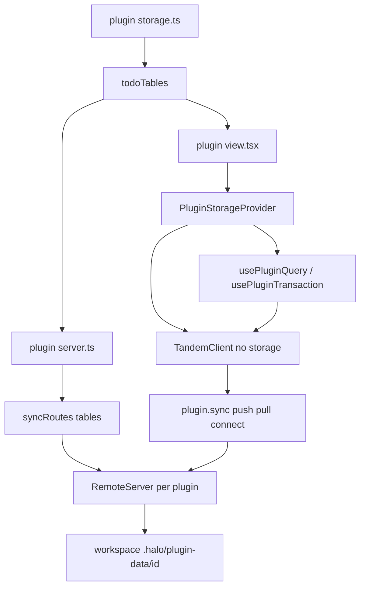
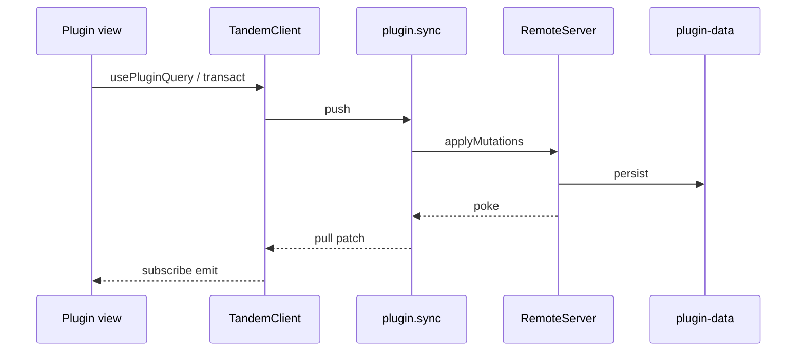

# Plugin storage

## System flow





## Problem overview

Plugins persist with ad hoc files and oRPC methods. There is no typed store, no query API, and no way for a view to read the same records the server holds. The plugin-system spec left a database out on purpose. A todo plugin cannot keep items across reloads without each author inventing a store.

## Solution overview

Give each plugin its own Tandem remote. The author defines collections in `storage.ts`, mounts `syncRoutes(tables)` on the plugin oRPC router, and wraps the view in `PluginStorageProvider`. Hooks read that client from context. Halo embeds Tandem `RemoteServer` in the plugin server (self-serve, same process). The renderer uses a `TandemClient` with no storage adapter: it syncs over existing plugin oRPC and keeps only an in-memory cache. Durable state is the remote on the workspace filesystem. The host does not mount the client. A plugin may omit `syncRoutes` or replace `sync`; only the plugin knows whether to wrap. Plugins stay separate Tandem instances. A later change can nest those collections under plugin ids in one engine so plugins can share access and run distributed transactions.

Halo depends on Tandem with git path deps. Tandem is public and unpublished to npm.

## Goals

- A plugin may export collections from `storage.ts` using Tandem `collection` / `defineSchema` / `t` re-exported by `@halo/plugin-sdk/storage`.
- `server.ts` mounts `syncRoutes(tables)` from `@halo/plugin-sdk/server`. That nested router exposes Tandem `push`, `pull`, and `connect`.
- The SDK view exports `PluginStorageProvider`, `usePluginQuery`, and `usePluginTransaction`. The provider builds a renderer `TandemClient` that has a `remote` and no `storage`. Hooks read that client from context.
- Each plugin has its own Tandem remote. Durable state lives under `{workspace}/.halo/plugin-data/<pluginId>/`.
- Agents and humans see the same durable records on the workspace filesystem.
- Plugins without `storage.ts` keep working. A plugin that omits `syncRoutes` still loads; storage hooks fail with a tagged error.
- An in-app agent following the halo-plugin skill can build a working todo plugin: add an item, reload, the item is still there.

## Non-goals

- No renderer persistence. No IndexedDB. No `IndexedDbTupleStorage`.
- No merging of plugin schemas. No cross-plugin reads. No distributed transactions.
- No HTTP listener. Sync rides the existing oRPC MessagePort.
- No Tandem drizzle / SQL adapters. Halo sets `allowBuilds.better-sqlite3` to false.
- No Turso, libSQL, or `usePluginState`.
- No schema migrations or backfills.
- No publishing Tandem to npm. Git deps only.
- No host auto-load of `storage.ts` or auto-wrap of `PluginStorageProvider`. The skill tells the author (and the in-app agent) to wrap. The host does not guess.
- No extra view exports beyond `Sidebar` and `Routes`. `storage.ts` is a file convention, not a named view export.
- No marketplace, watch, or auto-reload. Reload the window to pick up plugin edits.

## Assumptions

- Tandem packages are `@tandem/core`, `@tandem/server`, and `@tandem/types` at `github.com/tanishqkancharla/tandem`. Dist is gitignored, so Halo points `main` / `types` at `src` through `packageExtensions`.
- "Tandem tables" means `defineSchema` collections. "Nested dynamically" means each plugin load creates that plugin's collections and nests `sync` on its router. It does not mean one host-wide SQL schema.
- Remote durability is a JSON snapshot of the in-memory `RemoteStore`, not SQLite.
- The renderer `TandemClient` omits `storage`. Reload refetches from the remote.
- `syncRoutes(tables)` returns `{ sync: { push, pull, connect } }` so authors spread it into the default router.
- The host cannot tell if `server.sync` exists. `RouterClient<AnyRouter>` is a proxy, so `server.sync` always looks callable. The host also never loads `storage.ts`, so it cannot construct a `TandemClient`.
- The plugin wraps `PluginStorageProvider` with `tables`. That wrap lives in the halo-plugin skill until the host can detect storage on its own. Optional `sync` overrides `server.sync` when the author moved or wrapped the routes.
- `Sidebar` and `Routes` each get their own `PluginRuntimeProvider`. Cache one `TandemClient` per `pluginId` so those trees share a client.

## Important files, docs, and websites

- [`packages/plugin-sdk/package.json`](../packages/plugin-sdk/package.json) — Add git deps and a `./storage` export.
- [`packages/plugin-sdk/src/server.ts`](../packages/plugin-sdk/src/server.ts) — Add `syncRoutes`.
- [`packages/plugin-sdk/src/view.ts`](../packages/plugin-sdk/src/view.ts) — Add `usePluginQuery` and `usePluginTransaction`.
- [`packages/plugin-sdk/src/schema.ts`](../packages/plugin-sdk/src/schema.ts) — Manifest stays as it is. Do not add a `storage` field.
- [`apps/electron/src/main/plugins/loadPluginServer.ts`](../apps/electron/src/main/plugins/loadPluginServer.ts) — jiti aliases for Tandem.
- [`apps/electron/src/main/plugins/compilePluginView.ts`](../apps/electron/src/main/plugins/compilePluginView.ts) — Mark `@halo/plugin-sdk/storage` external.
- [`apps/electron/src/renderer/evaluatePluginView.ts`](../apps/electron/src/renderer/evaluatePluginView.ts) — `requireHost` for the storage subpath.
- [`apps/electron/mainExternals.ts`](../apps/electron/mainExternals.ts) — Copy Tandem into the packaged app for jiti.
- [`apps/electron/src/main/plugins/haloPluginSkill.md`](../apps/electron/src/main/plugins/haloPluginSkill.md) — Author and in-app agent recipe. Storage example is a todo plugin, including `PluginStorageProvider`.
- [`apps/electron/copyMainProcessExternals.ts`](../apps/electron/copyMainProcessExternals.ts) — Disk copy of Tandem with the SDK.
- [`pnpm-workspace.yaml`](../pnpm-workspace.yaml) — Overrides / `packageExtensions` for Tandem source entry and `@tandem/types`.
- [`apps/electron/vite.renderer.config.ts`](../apps/electron/vite.renderer.config.ts) — Let Vite compile Tandem TypeScript from `node_modules`.
- [Tandem repo](https://github.com/tanishqkancharla/tandem) — `TandemClient`, `RemoteServer`, `RemoteApi` (`push` / `pull` / `connect`), `collection`, `defineSchema`.
- [Tandem remote guide](https://github.com/tanishqkancharla/tandem/blob/main/docs/how_to_implement_remote.md) — Shape of `push`, `pull`, `connect`.
- [pnpm git subdirectory installs](https://pnpm.io/git#install-from-a-subdirectory) — `github:user/repo#path:packages/foo`.
- [`.agents/skills/halo-web/SKILL.md`](../.agents/skills/halo-web/SKILL.md) — Drive the live renderer for the todo plugin test.

## Implementation

### Phase 1: Git-depend on Tandem and export storage helpers

Add public git deps so plugin-sdk can import Tandem. Point package entry at `src` because Tandem does not commit `dist`. Re-export schema helpers on a subpath that both view and server can import.

#### Important types

```ts
// packages/plugin-sdk/src/storage.ts
export { collection, defineSchema, defineRelations, t } from "@tandem/core";
export type { RelationalQuery, RelationalQueryResult } from "@tandem/core";
```

#### Call stack diff

```callstack
 pnpm install
-└── @halo/plugin-sdk deps (typebox, orpc, maui)
+└── git github.com/tanishqkancharla/tandem path packages/core
+    └── @tandem/core src
+└── git path packages/server
+└── git path packages/types
```

#### Code diff preview

```diff
 // packages/plugin-sdk/package.json
  "exports": {
    "./view": "./src/view.ts",
    "./server": "./src/server.ts",
    "./schema": "./src/schema.ts"
+   ,"./storage": "./src/storage.ts"
  },
  "dependencies": {
+   "@tandem/core": "github:tanishqkancharla/tandem#path:packages/core",
+   "@tandem/server": "github:tanishqkancharla/tandem#path:packages/server",
+   "@tandem/types": "github:tanishqkancharla/tandem#path:packages/types",
    "@orpc/server": "2.0.0-beta.29",
```

- [ ] Add the three git path deps to `@halo/plugin-sdk`. Override `@tandem/types` in `pnpm-workspace.yaml` so Tandem's `workspace:*` resolves. Set `packageExtensions` `main` / `types` to `./src/index.ts` for the three packages.
- [ ] Add `packages/plugin-sdk/src/storage.ts` re-exports and the `./storage` export.
- [ ] Run `pnpm install` and `pnpm --filter @halo/plugin-sdk typecheck`.
- [ ] Smoke that `@tandem/core` resolves to source. Do not commit this check.

### Phase 2: `syncRoutes(tables)` embeds Tandem remote in the plugin server

`syncRoutes` builds a per-plugin `RemoteServer` from the author's collections and returns oRPC procedures for `push`, `pull`, and `connect`. The remote is created lazily from `PluginServerContext` so `server.ts` can spread the routes at module load.

#### Important types

```ts
// packages/plugin-sdk/src/server.ts
import type { RuntimeSchemaDefinition } from "@tandem/core";
import type { RemoteApi } from "@tandem/server";

export function syncRoutes<Schema extends Record<string, { id: string | number }>>(
  tables: RuntimeSchemaDefinition<Schema>,
): {
  sync: {
    push: unknown;
    pull: unknown;
    connect: unknown;
  };
};

function pluginRemote(args: {
  pluginId: string;
  workspaceRoot: string;
  tables: RuntimeSchemaDefinition<Schema>;
}): RemoteApi<Schema>;
```

#### Call stack diff

```callstack
 loadPluginServer
 └── jiti import server.ts
     └── export default router
+        └── syncRoutes(todoTables)
+            └── pluginOs.handler
+                └── RemoteServer.push / pull / connect
+                    └── FileRemoteStore
 PluginService.list
 └── mountPluginRouter
     └── context.pluginId + workspaceRoot
```

#### Code diff preview

```diff
 // packages/plugin-sdk/src/server.ts
 export const pluginOs = os.$context<PluginServerContext>();
 export { os, type };
+
+export function syncRoutes(tables) {
+  return {
+    sync: {
+      push: pluginOs.handler(async ({ input, context }) => {
+        const remote = pluginRemote({ ...context, tables });
+        await remote.push(input);
+      }),
+      pull: pluginOs.handler(async ({ input, context }) => {
+        return pluginRemote({ ...context, tables }).pull(input);
+      }),
+      connect: pluginOs.handler(({ input, context, signal }) => {
+        // yield a poke event whenever RemoteServer calls poke()
+      }),
+    },
+  };
+}
```

- [ ] Implement `syncRoutes` on `@halo/plugin-sdk/server`. Cache one `RemoteServer` per `pluginId`.
- [ ] Persist the remote store at `{workspaceRoot}/.halo/plugin-data/{pluginId}/store.json`. Load on first use.
- [ ] Map `connect` to an async iterator using the same `AsyncEventQueue` pattern as `agentSession.events` in `apps/electron/src/main/router.ts`.
- [ ] Smoke a plugin `server.ts` that spreads `syncRoutes(tables)` and still exports `ping`. Do not commit this check.

### Phase 3: PluginStorageProvider holds the Tandem client

The plugin wraps its view with `PluginStorageProvider`. That provider builds a `TandemClient` with `remote` set to `server.sync` (or an optional `sync` override) and no `storage`. Hooks read the client from context. The host `PluginRuntimeProvider` does not mount it: it has no tables, and `RouterClient<AnyRouter>` cannot tell whether `syncRoutes` is present.

#### Important types

```ts
// packages/plugin-sdk/src/view.ts
export function PluginStorageProvider<Schema extends AnySchema>(args: {
  tables: RuntimeSchemaDefinition<Schema>;
  sync?: RemoteApi<Schema>;
  children: ReactNode;
}): ReactNode;

export function usePluginQuery<
  Schema extends AnySchema,
  Query extends RelationalQuery<Schema, Relations>,
  Relations extends RuntimeRelationsDefinition<Schema> = RuntimeRelationsDefinition<Schema>,
>(
  query: Query,
): RelationalQueryResult<Schema, Relations, Query>;

export function usePluginTransaction<Schema extends AnySchema>(): {
  transact: () => Transaction<Schema>;
  commit: (tx: Transaction<Schema>) => Promise<void>;
};

export class PluginStorageMissingError extends errore.createTaggedError({
  name: "PluginStorageMissingError",
  message: "usePluginQuery must run inside PluginStorageProvider",
}) {}
```

#### Call stack diff

```callstack
 plugin.Routes
 └── PluginRuntimeProvider
-    └── usePluginQuery
+    └── PluginStorageProvider({ tables: todoTables })
+        └── getPluginClient(pluginId, tables, sync ?? server.sync)
+            └── TandemClient({ remote, schema })
+                └── usePluginQuery(query)
+                    └── client.subscribe
+                        └── server.sync.pull / server.sync.connect
+                └── usePluginTransaction
+                    └── client.transact / client.commit
+                        └── server.sync.push
```

#### Code diff preview

```diff
 // {workspace}/.halo/plugins/todos/view.tsx
 export function Routes() {
-  return <Home />
+  return (
+    <PluginStorageProvider tables={todoTables}>
+      <Home />
+    </PluginStorageProvider>
+  )
 }

 function Home() {
+  const todos = usePluginQuery({ collection: "todos" })
+  const { transact, commit } = usePluginTransaction()
   ...
 }
```

- [ ] Export `PluginStorageProvider`. It reads `pluginId` and `server` from `PluginRuntimeProvider`, builds one `TandemClient` per `pluginId` (shared by Sidebar and Routes), and puts it on context. Pass `remote` only. Do not pass `storage`. `autoConnect: true`.
- [ ] Default `remote` to `server.sync`. Accept optional `sync` when the plugin moved or wrapped those procedures.
- [ ] Export `usePluginQuery` and `usePluginTransaction` with no `tables` argument. Throw `PluginStorageMissingError` outside the provider.
- [ ] Smoke a commit then query after pull: the row comes from the remote. Do not commit this check.

### Phase 4: Host slots, jiti aliases, and author skill

The host must resolve the new SDK subpath and Tandem the same way it resolves `@halo/plugin-sdk/server` today. Document `storage.ts` for plugin authors.

#### Important types

```ts
// apps/electron/src/main/plugins/compilePluginView.ts
const viewExternals = [
  "react",
  "maui",
  "wouter",
  "@halo/plugin-sdk/view",
  "@halo/plugin-sdk/storage",
] as const;
```

#### Call stack diff

```callstack
 compilePluginView
 └── esbuild external
     └── @halo/plugin-sdk/view
+    └── @halo/plugin-sdk/storage
 evaluatePluginView
 └── requireHost
     └── @halo/plugin-sdk/view
+    └── @halo/plugin-sdk/storage
 loadPluginServer
 └── jiti alias
     └── @halo/plugin-sdk/server
+    └── @halo/plugin-sdk/storage
+    └── @tandem/core / @tandem/server / @tandem/types
```

#### Code diff preview

```diff
 // apps/electron/src/main/plugins/haloPluginSkill.md
 Optional:
 - view.tsx
 - server.ts
+- storage.ts
+
+## Storage
+
+The host does not wrap storage. If the plugin uses `syncRoutes`, wrap
+`PluginStorageProvider` in `Routes` and in `Sidebar` if the sidebar queries.
+
+The skill's complete example is a todo plugin at `.halo/plugins/todos`:
+`storage.ts` exports `todoTables` (`todos` with `id`, `title`, `done`).
+`server.ts` default-exports `{ ...syncRoutes(todoTables) }`. `halo.name`
+is `Todos`. `Sidebar` has a `SidebarItem` named `List`. `Routes` wraps
+`PluginStorageProvider tables={todoTables}`, lists todos, and adds items
+with a field labeled `New todo` and a button named `Add`.
```

- [ ] Add `@halo/plugin-sdk/storage` to `viewExternals`, `requireHost`, and jiti aliases. Alias Tandem packages for jiti. Add them to `pluginSdkJitiDependencies`.
- [ ] Teach `vite.renderer.config.ts` to compile `@tandem/*` TypeScript (include in `optimizeDeps` / allow `node_modules/@tandem`).
- [ ] Update `haloPluginSkill.md` with that complete todo plugin, including the `PluginStorageProvider` wrap. Keep `usePluginServer` for non-storage RPC. Do not mention IndexedDB. Do not import `PluginStorageProvider` from `MainPane.tsx` or `Sidebar.tsx`.
- [ ] Run `pnpm --filter @halo/desktop typecheck`. Smoke that a plugin view importing `@halo/plugin-sdk/storage` compiles. Do not commit this check.

### Phase 5: Package tests for author-facing storage

Prove a plugin author can define tables, mount `syncRoutes`, push a record from a client with no storage adapter, and read it back through query after pull. Use real Tandem and real oRPC handlers. No mocks.

#### Important types

```ts
// packages/plugin-sdk/src/storage.test.ts
const todoTables = defineSchema({
  todos: collection({
    id: t.id(),
    title: t.string(),
    done: t.boolean(),
  }),
});
```

#### Call stack diff

```callstack
 vitest plugin-sdk
 └── defineSchema + syncRoutes
+    └── TandemClient({ schema, remote })
+        └── commit set todos
+        └── pullFromRemote
+        └── query collection todos
```

#### Code diff preview

```diff
 // packages/plugin-sdk/src/storage.test.ts
+const todoTest = test.extend({
+  root: async ({ task }, use) => {
+    const directory = await mkdtemp(join(tmpdir(), `halo-store-${task.id}-`));
+    await use(directory);
+    await rm(directory, { recursive: true, force: true });
+  },
+});
+
+todoTest("round-trips a todo through syncRoutes", async ({ root }) => {
+  const routes = syncRoutes(todoTables);
+  const client = new TandemClient({
+    schema: todoTables,
+    remote: orpcRemote(routes, { pluginId: "todos", workspaceRoot: root }),
+  });
+  const tx = client.transact();
+  tx.set("todos", { id: "t1", title: "Buy milk", done: false });
+  await client.commit(tx);
+  await client.pullFromRemote();
+  expect(client.query({ collection: "todos" })).toEqual([
+    { id: "t1", title: "Buy milk", done: false },
+  ]);
+});
```

- [ ] Add a Vitest fixture that makes a temp workspace root.
- [ ] Commit a plugin-sdk test that acts like author code: `defineSchema`, `syncRoutes`, `TandemClient` with `remote` only, commit, pull, then `query` sees the todo.
- [ ] Commit a test that a second client with the same `pluginId` and root, also with no storage, pulls the first client's row.
- [ ] Run `pnpm --filter @halo/plugin-sdk test` and `pnpm run check-affected`.

### Phase 6: Ask the in-app agent to build a todo plugin

The skill is the recipe. Prove a user can ask Pi to build a todo app and then use it. Drive the live renderer with `pnpm halo-web`. No mocks. The host still does not wrap `PluginStorageProvider`; the agent must wrap it because the skill says to.

#### Important types

```ts
// apps/electron/src/main/plugins/todoPlugin.e2e.test.ts
const prompt =
  "Build a todo list plugin. I can add items, mark them done, and they survive a reload.";
```

#### Call stack diff

```callstack
 App
 └── Composer prompt
-    └── (no plugin)
+    └── Pi writes .halo/plugins/todos
+        └── PluginStorageProvider in view.tsx
+    └── page.reload
+    └── plugin-sidebar-todos
+        └── New todo "Buy milk" / Add
+    └── page.reload
+    └── "Buy milk" still visible
```

#### Code diff preview

```diff
 // apps/electron/src/main/plugins/todoPlugin.e2e.test.ts
+todoAgentTest("agent-built todo plugin keeps an item after reload", async () => {
+  await haloWeb.exec(`
+    await page.getByLabel('Message').fill(${JSON.stringify(prompt)});
+    await page.getByRole('button', { name: 'Send' }).click();
+    await page.getByLabel('Thinking').waitFor();
+    await page.getByLabel('Thinking').waitFor({ state: 'hidden', timeout: 180_000 });
+  `);
+  await haloWeb.exec(`await page.reload()`);
+  await haloWeb.exec(`
+    await page.getByTestId('plugin-sidebar-todos').getByRole('link', { name: 'List' }).click();
+    await page.getByLabel('New todo').fill('Buy milk');
+    await page.getByRole('button', { name: 'Add' }).click();
+    await page.getByText('Buy milk').waitFor();
+  `);
+  await haloWeb.exec(`await page.reload()`);
+  await haloWeb.exec(`
+    await page.getByTestId('plugin-sidebar-todos').getByRole('link', { name: 'List' }).click();
+  `);
+  const visible = await haloWeb.exec(
+    `return await page.getByText('Buy milk').isVisible()`,
+  );
+  expect(visible).toBe(true);
+});
```

- [ ] Add Vitest fixtures that skip when `pnpm halo-web status` fails or no provider key is set (`OPENAI_API_KEY`, `ANTHROPIC_API_KEY`, `GEMINI_API_KEY`, or `OPENROUTER_API_KEY`). Start from a workspace with the seeded halo-plugin skill and no todo plugin yet. Do not start Halo from the test.
- [ ] Commit a halo-web test that sends that prompt, waits until Thinking is gone, reloads, adds "Buy milk" through the skill's todo UI, reloads, and asserts "Buy milk" is still visible.
- [ ] Use the skill's todo example as the UI contract: plugin id `todos`, sidebar link `List`, field `New todo`, button `Add`. Do not have the host wrap `PluginStorageProvider`.
- [ ] Run the test against the running Halo debug app (`pnpm --filter @halo/desktop test` for the new file, with `halo-dev` up).
