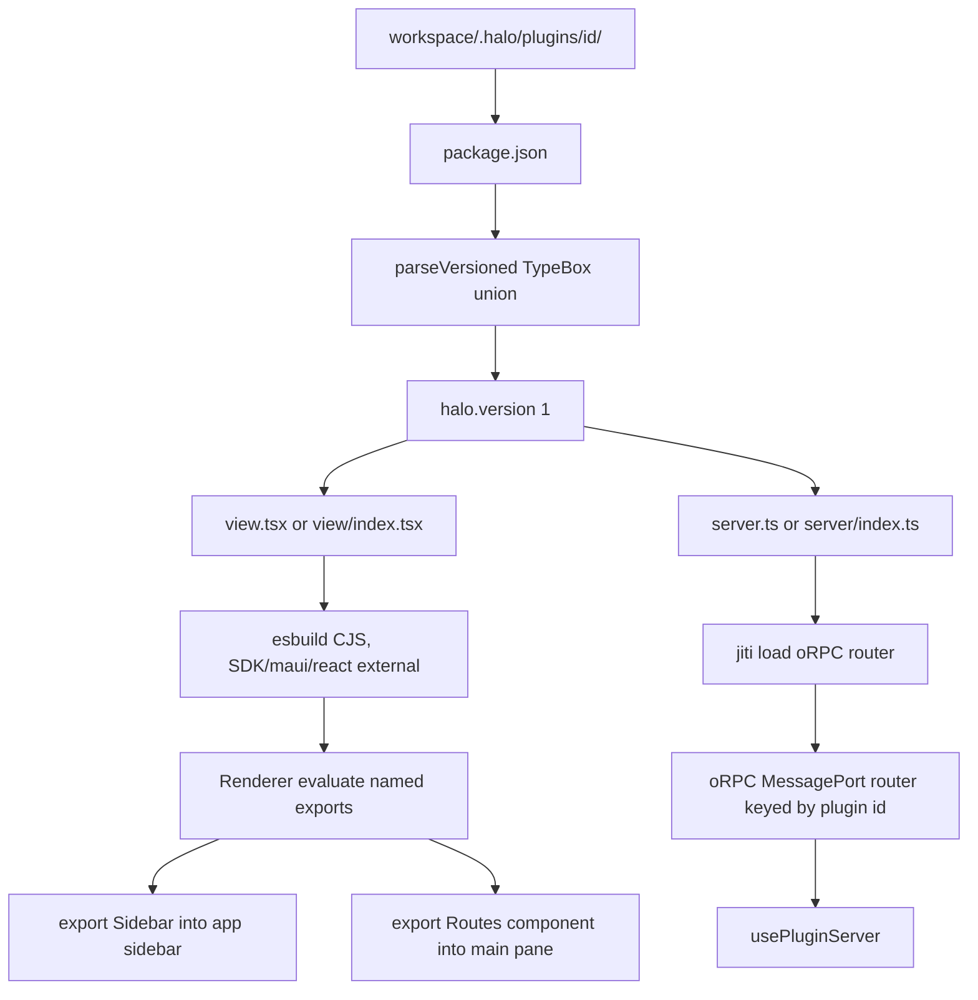
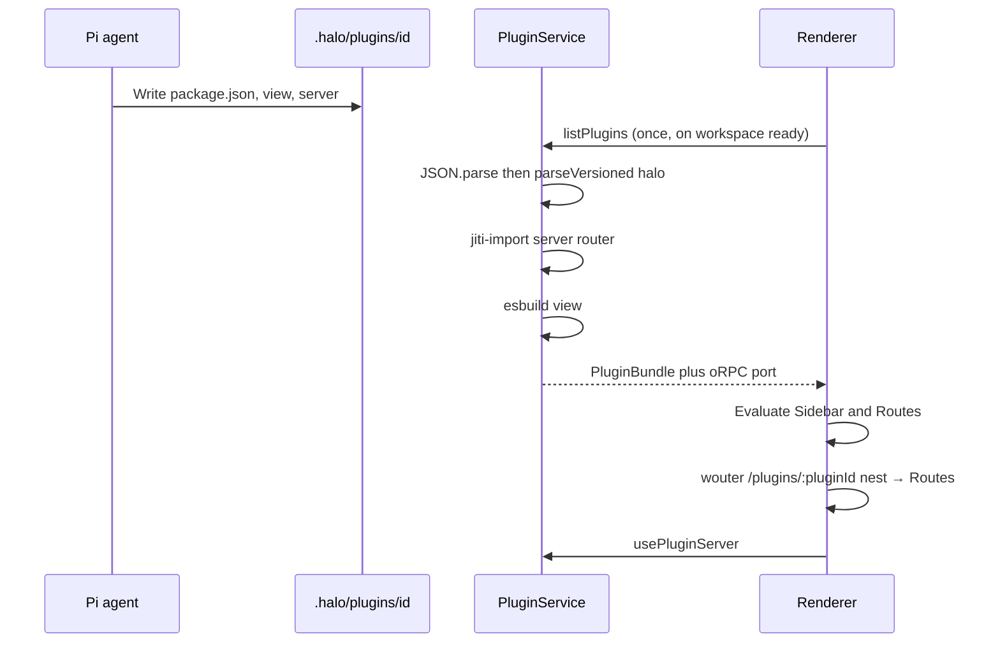

# Plugin system

## System flow





## Problem overview

The sidebar and main pane are fixed in the renderer. A user who asks the in-app agent to add a calendar or notes view has no plugin format and no main-process code. Hand-rolled `JSON.parse` plus field checks (as in `workspace.json` and `user.json`) will not scale once plugins ship versioned manifests.

## Solution overview

Add `{workspace}/.halo/plugins/<id>/` packages. Each plugin has `package.json` with a nested `halo` object, plus optional `view` and `server` files. The view mounts named exports (`Sidebar`, `Routes`), both React components. The app routes with [wouter](https://github.com/molefrog/wouter) and a memory location. Plugin `Routes` is the main pane for `/plugins/:pluginId/*`. The server is an oRPC router in main. Parse every persisted JSON document with a versioned TypeBox union and a shared `parseVersioned` helper that returns an errore tagged error. TypeBox is already in `@halo/desktop`; do not add Zod.

## Goals

- A plugin lives at `{workspace}/.halo/plugins/<id>/` with `package.json` and optional `view` / `server` files.
- `package.json` has a nested `halo` field. `halo.version` is required. V1 is `1`.
- `export const Sidebar` mounts in the app sidebar under Files / Sessions only when the plugin exports it. A plugin with no `Sidebar` does not get a host-drawn row. `export const Routes` is a React component that fills the main pane at `/plugins/:pluginId`. Both use wouter `Link` / `Route`.
- `@halo/plugin-sdk` has `view`, `server`, and `schema` subpaths. Plugins declare it. The host aliases it to one copy.
- `usePluginServer<S>()` is an oRPC client typed as the plugin router.
- Plugins load once when the workspace is ready (`listPlugins`). A load error shows in the sidebar and leaves other plugins up.
- The renderer uses wouter (`memoryLocation`). Host paths are `/draft/:draftId`, `/sessions/:sessionId`, `/uikit`, and `/plugins/:pluginId` (nested). `SessionSelection` goes away.
- New JSON documents (manifest first) parse through `parseVersioned`. Unknown or missing `version` is a parse error.
- Calendar seeds as a plugin. A `halo-plugin` skill seeds under `.pi/agent/skills/`.

## Non-goals

- No Zod. TypeBox covers schema, Standard Schema (oRPC), and version unions.
- No rewrite of existing `workspace.json` / `user.json` parsers in this work. New parses use the helper; old files stay until those call sites change.
- No automatic migrate from unversioned objects. Missing `version` fails.
- No npm/git marketplace, no `pnpm install` in the plugin folder, no extra plugin deps beyond the aliased SDK.
- No replacing Files, Sessions, New session, Develop, or the session composer.
- No view exports beyond `Sidebar` and `Routes`. Unknown named exports are ignored.
- No plugin database, `state.ts`, Turso, libSQL, Drizzle, or `usePluginState`. Server procedures hold any data they need for now.
- No HTTP listener.
- No plugin file watch, auto-reload, or `subscribePlugins`. Restart Halo (or reopen the workspace) to pick up plugin edits.
- No default plugin nav. If the plugin does not export `Sidebar`, the host draws nothing for it in the sidebar.
- No React Router. Wouter is the router.
- No bb-style exclusive thread list, content scripts, or composer slots.

## Assumptions

- Plugin id is the folder name. `halo.name` is the UI label.
- `view` and `server` are each optional.
- View imports of `./server` are type-only.
- esbuild marks `wouter` external so plugin `Link` / `Route` share the app Router context.
- Electron has no useful browser history for this UI. Use `memoryLocation` from `wouter/memory-location`, not `useBrowserLocation`.
- oRPC procedure input uses TypeBox (Standard Schema), same library as manifests.
- A later `halo` version is a new `Type.Object` with `version: Type.Literal(2)` added to the union, plus an explicit `up` in `parseVersioned` if the host should normalize to latest. This work ships only version 1 and returns that object as-is.
- Plugin code is trusted workspace code.
- TypeBox `Type.Object` strips unknown keys by default. Extra `halo` keys are ignored. Do not use `additionalProperties: false` on the manifest.

## Important files, docs, and websites

- [`apps/electron/src/renderer/App.tsx`](../apps/electron/src/renderer/App.tsx) — Replace `SessionSelection` with a wouter `Router` and `memoryLocation`.
- [`apps/electron/src/renderer/MainPane.tsx`](../apps/electron/src/renderer/MainPane.tsx) — Host `Route`s plus nested `/plugins/:pluginId` for plugin `Routes`.
- [`apps/electron/src/renderer/Sidebar.tsx`](../apps/electron/src/renderer/Sidebar.tsx) — `Link` for New session / sessions / UI kit; mount plugin `Sidebar`.
- [`apps/electron/src/shared/rpc.ts`](../apps/electron/src/shared/rpc.ts) — Cap'n Web HaloApi. Add `listPlugins`; procedures use a second MessagePort.
- [`apps/electron/src/shared/channels.ts`](../apps/electron/src/shared/channels.ts) — Existing `halo:request-rpc`. Add a plugin oRPC channel pair.
- [`apps/electron/src/main/preload.ts`](../apps/electron/src/main/preload.ts) — Forward the plugin MessagePort like HaloApi.
- [`apps/electron/src/main/main.ts`](../apps/electron/src/main/main.ts) — Construct `PluginService`.
- [`apps/electron/src/main/plugins/PluginService.ts`](../apps/electron/src/main/plugins/PluginService.ts) — List `.halo/plugins`. Tests live beside it.
- [`apps/electron/src/main/plugins/compilePluginView.ts`](../apps/electron/src/main/plugins/compilePluginView.ts) — esbuild the view to CJS.
- [`apps/electron/src/main/test/fixtures.ts`](../apps/electron/src/main/test/fixtures.ts) — Shared e2e helpers, including `src`.
- [`apps/electron/src/main/workspace-service.ts`](../apps/electron/src/main/workspace-service.ts) — Today's `JSON.parse` + field checks. Do not change yet; the new helper is what new parsers call.
- [`apps/electron/src/main/ParallelSearchTools.ts`](../apps/electron/src/main/ParallelSearchTools.ts) — Existing TypeBox `Type.Object` usage to match.
- [`packages/logger/package.json`](../packages/logger/package.json) — Package export layout to copy for `@halo/plugin-sdk`.
- [`@sinclair/typebox` Value](https://github.com/sinclairzx81/typebox) — `Value.Check` / `Value.Errors` (no throw). Wrap `Value.Parse` with `errore.try` if used.
- [oRPC getting started](https://orpc.dev/docs/getting-started) — Router + client. Any Standard Schema, including TypeBox.
- [oRPC Electron adapter](https://orpc.dev/docs/adapters/electron) — MessagePort between main and renderer.
- [wouter](https://github.com/molefrog/wouter) — Memory location, `Router base`, and `Route nest` for plugin-relative paths.

## Implementation

### Phase 1: Add `@halo/plugin-sdk` with view, server, and schema

Add a workspace package that plugins compile against. `schema` re-exports TypeBox `Type` / `Static` and will own `parseVersioned` in phase 2. Hooks can be stubbed until later phases.

#### Important types

```ts
// packages/plugin-sdk/src/view.ts
export { Route, Switch, Link, Redirect, Router, useLocation, useRoute, useParams } from "wouter";

export function usePluginServer<S>(): RouterClient<S>;
```

#### Call stack diff

```diff
 packages/logger
 (workspace package)
+packages/plugin-sdk
+├── src/view.ts     (@halo/plugin-sdk/view)
+├── src/server.ts   (@halo/plugin-sdk/server)
+└── src/schema.ts   (@halo/plugin-sdk/schema)
```

#### Code diff preview

```diff
 // packages/plugin-sdk/package.json
+{
+  "name": "@halo/plugin-sdk",
+  "version": "0.1.0",
+  "private": true,
+  "type": "module",
+  "exports": {
+    "./view": "./src/view.ts",
+    "./server": "./src/server.ts",
+    "./schema": "./src/schema.ts"
+  }
+}
```

- [x] Create `packages/plugin-sdk` with `package.json`, `tsconfig.json`, and the three entry files. Match `@repo/logger` scripts. Depend on `@sinclair/typebox` (same range as `@halo/desktop`) and `wouter`.
- [x] Re-export Maui components, tokens, and `style` / `useStyles` from `view`. Re-export wouter `Route`, `Switch`, `Link`, `Redirect`, `Router`, `useLocation`, `useRoute`, and `useParams`. Re-export `os` / `ORPCError` from `server`. Re-export `Type` and `Static` from `schema`.
- [x] Export `usePluginServer` from `view`. Until later phases it throws a tagged `PluginRuntimeMissingError` if called outside a host provider. Do not add `usePluginNavigate` or `usePluginState`.
- [x] Dropped the subpath re-export smoke tests (they only checked that imports existed).
- [x] Run `pnpm --filter @halo/plugin-sdk test typecheck lint format:check`.

### Phase 2: Versioned TypeBox parse helper

Add `parseVersioned` so every JSON document is a `version` discriminated union. Use `Value.Check` (boolean, no throw). Convert failures to a tagged error. Do not call `schema.parse`-style throws on the happy path.

#### Important types

```ts
// packages/plugin-sdk/src/schema.ts
import { Type, type Static, type TSchema } from "@sinclair/typebox";
import { Value } from "@sinclair/typebox/value";
import * as errore from "errore";

export class SchemaParseError extends errore.createTaggedError({
  name: "SchemaParseError",
  message: "Failed to parse $name: $detail",
}) {}

export function parseVersioned<S extends TSchema>(args: {
  name: string;
  schema: S;
  value: unknown;
}): SchemaParseError | Static<S> {
  if (Value.Check(args.schema, args.value)) return args.value;
  const first = [...Value.Errors(args.schema, args.value)][0];
  const path = first === undefined ? "" : first.path;
  const message = first === undefined ? "invalid" : first.message;
  return new SchemaParseError({
    name: args.name,
    detail: path.length === 0 ? message : `${path} ${message}`,
  });
}
```

#### Call stack diff

```diff
 JSON.parse (external boundary, errore.try)
-└── typeof checks / in-operator field reads
+└── parseVersioned({ name, schema, value })
+    ├── Value.Check(schema, value)
+    └── Value.Errors → SchemaParseError
```

#### Code diff preview

```diff
 // packages/plugin-sdk/src/schema.ts
+export const haloManifestV1 = Type.Object({
+  version: Type.Literal(1),
+  name: Type.String({ minLength: 1 }),
+  description: Type.Optional(Type.String()),
+  view: Type.Optional(Type.String({ minLength: 1 })),
+  server: Type.Optional(Type.String({ minLength: 1 })),
+});
+
+export const haloManifestSchema = Type.Union([haloManifestV1]);
+export type HaloManifest = Static<typeof haloManifestV1>;
```

- [x] Implement `parseVersioned` with `Value.Check` / `Value.Errors`. Never throw on invalid input.
- [x] Define `haloManifestV1` and `haloManifestSchema` as a one-member union so a later `Type.Literal(2)` object can join it.
- [x] Test: version 1 with `name` succeeds; missing `version` fails; `version: 2` fails; extra keys are stripped/ignored and still succeed.
- [x] Document in a short comment on `haloManifestSchema` that a new version is a new object in the union plus an `up` only when the host must normalize to latest.
- [x] Run `pnpm --filter @halo/plugin-sdk test`.

### Phase 3: Parse the nested `halo` manifest

Read `package.json`, parse JSON with `errore.try`, then `parseVersioned` on `halo`. Resolve `view` / `server` to files, including `view/index.tsx` fallbacks.

#### Important types

```ts
// apps/electron/src/shared/pluginManifest.ts
import type { HaloManifest } from "@halo/plugin-sdk/schema";

type PluginPackageJson = {
  name: string;
  halo: HaloManifest;
};

type PluginManifest = {
  id: string;
  directory: string;
  packageName: string;
  halo: HaloManifest;
  viewPath?: string;
  serverPath?: string;
};

class PluginManifestError extends errore.createTaggedError({
  name: "PluginManifestError",
  message: "Plugin '$id' package.json is not a Halo plugin: $detail",
}) {}
```

#### Call stack diff

```diff
 readdir(.halo/plugins/id)
+└── readPluginManifest
+    ├── readFile package.json
+    ├── errore.try JSON.parse
+    ├── parseVersioned haloManifestSchema on record.halo
+    └── resolve view/server entries
```

#### Code diff preview

```diff
 // apps/electron/src/main/plugins/readPluginManifest.ts
+const parsed = errore.try({
+  try: () => JSON.parse(raw) as unknown,
+  catch: (e) => new PluginManifestError({ id, detail: "invalid JSON", cause: e }),
+});
+if (parsed instanceof Error) return parsed;
+const record = parsed as { name?: unknown; halo?: unknown };
+const halo = parseVersioned({
+  name: `plugin.${id}.halo`,
+  schema: haloManifestSchema,
+  value: record.halo,
+});
+if (halo instanceof Error) {
+  return new PluginManifestError({ id, detail: halo.message, cause: halo });
+}
```

- [x] Add `readPluginManifest({ id, directory })`. Missing file, invalid JSON, or failed `halo` parse returns `PluginManifestError`.
- [x] Require `package.json` `name` as a non-empty string (plain check or a small TypeBox object around `{ name, halo }`). Resolve entries from `halo.view` / `halo.server` when set. Otherwise look for `view.tsx`, `view/index.tsx`, `view.ts`, `view/index.ts` (same pattern for `server`, `.ts` only).
- [x] Do not read `engines` yet.
- [x] Cover listing through `PluginService` tests. Do not add a separate `readPluginManifest` unit test file.
- [x] Run `pnpm --filter @halo/desktop test`.

### Phase 4: Discover `.halo/plugins`

Stand up `PluginService`. List manifests and load errors over a one-shot RPC. Do not watch the folder. The renderer still has no plugin UI.

#### Important types

```ts
// apps/electron/src/shared/plugin.ts
type PluginLoadError = { id: string; message: string };
type PluginList = {
  plugins: PluginManifest[];
  errors: PluginLoadError[];
};

// apps/electron/src/shared/rpc.ts
abstract class HaloApi extends RpcTarget {
  abstract listPlugins(): Promise<PluginList>;
}
```

#### Call stack diff

```diff
 WorkspaceService.select
 └── PiService / tree watch
+HaloRpc.listPlugins
+└── PluginService.list
+    ├── readdir .halo/plugins
+    └── readPluginManifest per folder
```

#### Code diff preview

```diff
 // apps/electron/src/main/main.ts
 const piService = new PiService(workspaceService, userService);
+const pluginService = new PluginService(workspaceService);
 // ...
-  new HaloRpc(workspaceService, piService, getWindow, rpcLogger)
+  new HaloRpc(workspaceService, piService, pluginService, getWindow, rpcLogger)
```

- [x] Add `PluginService` with `list` that reads `.halo/plugins` once per call. No Parcel watch, no listener, no debounce.
- [x] Skip dot-folders. Sort by folder name. A bad `package.json` is an error row, not a crash.
- [x] Add `listPlugins` on `HaloApi` / `HaloRpc`. Do not add `subscribePlugins`.
- [x] Test: not-ready workspace returns `WorkspaceNotReadyError`; a valid plugin folder appears; a broken `package.json` is an error and does not hide the valid one.
- [x] Run `pnpm --filter @halo/desktop test`.

### Phase 5: Put wouter in the renderer

Replace `SessionSelection` with a memory-location wouter router. Host chrome keeps working. Plugin paths are reserved but unused until Routes mount.

#### Important types

```ts
// apps/electron/src/renderer/App.tsx
import { Route, Router, useLocation } from "wouter";
import { memoryLocation } from "wouter/memory-location";

// paths
// /draft/:draftId
// /sessions/:sessionId
// /uikit
// /plugins/:pluginId/*   (nested later)
```

#### Call stack diff

```diff
 App
-├── useState SessionSelection
-├── Sidebar onSelectionChange
-└── MainPane selection
+├── memoryLocation + Router
+├── Sidebar Link href=/draft/:id /sessions/:id /uikit
+└── MainPane
+    ├── Route /uikit → UiKitPage
+    ├── Route /draft/:draftId → DraftPane
+    └── Route /sessions/:sessionId → SavedPane
```

#### Code diff preview

```diff
 // apps/electron/src/renderer/App.tsx
-const [selection, setSelection] = useState<SessionSelection>();
+const { hook, navigate } = memoryLocation({ path: initialPath });
+return (
+  <Router hook={hook}>
+    <Sidebar />
+    <MainPane />
+  </Router>
+);

 // apps/electron/src/renderer/Sidebar.tsx
-<Button onClick={() => onSelectionChange({ kind: "draft", draftId })}>
+<Link href={`/draft/${crypto.randomUUID()}`}>
```

- [x] Add `wouter` to `@halo/desktop`. Wrap the ready shell in `Router` with `memoryLocation`. Drop `SessionSelection` from `App.tsx`.
- [x] Point New session, session rows, and UI kit at `/draft/:draftId`, `/sessions/:sessionId`, and `/uikit`. Use `useRoute` for `aria-current`.
- [x] `MainPane` matches those three routes. After a draft prompt, `navigate` to `/sessions/:sessionId`. Default path: first saved session, else a new draft.
- [x] Skip a renderer Vitest for now. Prove host routes with `pnpm halo-web`.
- [x] Run `pnpm --filter @halo/desktop test`. Prove with `pnpm halo-web` that New session, a saved session, and UI kit still open.

### Phase 6: Compile and evaluate `Sidebar` and `Routes`

Compile the view with esbuild. Evaluate named exports. Host `require` serves `@halo/plugin-sdk/view` plus React/Maui.

#### Important types

```ts
// apps/electron/src/shared/plugin.ts
type CompiledPluginView = { id: string; source: string };
type LoadedPluginView = {
  id: string;
  Sidebar?: ComponentType;
  Routes?: ComponentType;
};

class PluginViewExportError extends errore.createTaggedError({
  name: "PluginViewExportError",
  message: "Plugin '$id' view must export Sidebar and/or Routes",
}) {}
```

#### Call stack diff

```diff
 PluginService.list
 └── readPluginManifest
+compilePluginView
+└── esbuild view.tsx
+    └── external: react, maui, purse-styles, wouter, @halo/plugin-sdk/view
+evaluatePluginView
+└── named Sidebar and Routes (both functions)
```

#### Code diff preview

```diff
 // apps/electron/src/main/plugins/compilePluginView.ts
+const built = await esbuild.build({
+  absWorkingDir: directory,
+  entryPoints: [viewPath],
+  bundle: true,
+  write: false,
+  format: "cjs",
+  platform: "browser",
+  jsx: "automatic",
+  external: ["react", "react/jsx-runtime", "react/jsx-dev-runtime",
+    "react-dom", "maui", "purse-styles", "wouter", "@halo/plugin-sdk/view"],
+});
```

- [x] Compile the resolved view file. Map `@halo/plugin-sdk/view` and `wouter` as external. Keep tagged compile errors.
- [x] Evaluate CJS. Read `Sidebar` and `Routes` if they are functions. Accept `module.exports` wrapping for CJS interop; the author-facing API is named exports.
- [x] Reject a view that exports neither `Sidebar` nor `Routes`. Ignore other names.
- [x] Test: compile a view that imports `Button` and `Route` from `@halo/plugin-sdk/view`; parse both named components; fail on a view with neither.
- [x] Run `pnpm --filter @halo/desktop test`.

### Phase 7: Mount plugin Sidebar and Routes

Put each exported plugin `Sidebar` under Sessions. Skip plugins that do not export `Sidebar`. Wrap it in `Router` with `base={`/plugins/${id}`}` so its `Link href="/month"` writes `/plugins/:id/month`. In the main pane, a nested `/plugins/:pluginId` route renders that plugin's `Routes` with a scoped location.

#### Important types

```ts
// packages/plugin-sdk/src/view.ts
type PluginRuntimeValue = {
  pluginId: string;
};

// plugin view.tsx
export function Sidebar() {
  return <Link href="/">Month</Link>;
}

export function Routes() {
  return (
    <Switch>
      <Route path="/" component={MonthView} />
    </Switch>
  );
}
```

#### Call stack diff

```diff
 App Router (memoryLocation)
 ├── Sidebar
 │   ├── Link /draft /sessions /uikit
+│   └── Router base=/plugins/:id
+       └── plugin.Sidebar
 └── MainPane
     ├── Route /uikit /draft /sessions
+    └── Route path=/plugins/:pluginId nest
+        └── plugin.Routes
```

#### Code diff preview

```diff
 // apps/electron/src/renderer/Sidebar.tsx
+{plugins.map((plugin) => {
+  if (plugin.Sidebar === undefined) return undefined;
+  return (
+    <Router key={plugin.id} base={`/plugins/${plugin.id}`}>
+      <PluginRuntimeProvider pluginId={plugin.id}>
+        <plugin.Sidebar />
+      </PluginRuntimeProvider>
+    </Router>
+  );
+})}

 // apps/electron/src/renderer/MainPane.tsx
+<Route path="/plugins/:pluginId" nest>
+  {(params) => {
+    const plugin = plugins.find((item) => item.id === params.pluginId);
+    if (plugin?.Routes === undefined) return <MissingPlugin />;
+    return (
+      <PluginRuntimeProvider pluginId={plugin.id}>
+        <plugin.Routes />
+      </PluginRuntimeProvider>
+    );
+  }}
+</Route>
```

- [ ] Mount `plugin.Sidebar` only when it is exported. Nested `Router base` so plugin links are relative. Do not invent a fallback row.
- [ ] Render `Routes` only when the location is under `/plugins/:pluginId`. Keep Files / Sessions / Develop as they are.
- [ ] Show plugin load errors in the sidebar (`data-testid="plugin-error"`). Load plugins with a one-shot `listPlugins` query. Do not subscribe.
- [ ] `loadExtensionModule` (or the plugin equivalent) must `require("wouter")` from the host map so plugin `Link` uses the app context.
- [ ] Run `pnpm --filter @halo/desktop test`. Prove with `pnpm halo-web` that a fixture plugin's sidebar link opens its `Routes` in the main pane.

### Phase 8: Plugin server as an oRPC sub-router

Load `server.ts` with jiti. The default export (or `export const router`) is an oRPC router whose procedure inputs are TypeBox schemas. Mount every plugin under `{ [pluginId]: router }` on an Electron MessagePort. `usePluginServer<S>()` is `createORPCClient` scoped to that plugin. Handlers receive `{ pluginId, workspaceRoot }`.

#### Important types

```ts
// packages/plugin-sdk/src/server.ts
export type PluginServerContext = {
  pluginId: string;
  workspaceRoot: string;
};

export { os, ORPCError } from "@orpc/server";

// apps/electron/src/shared/channels.ts
export const PLUGIN_RPC_CHANNELS = {
  requestRpc: "halo:request-plugin-rpc",
  provideRpc: "halo:provide-plugin-rpc",
} as const;
```

#### Call stack diff

```diff
 preload MessagePort
 └── halo:request-rpc → HaloRpc (Cap'n Web)
+preload MessagePort
+└── halo:request-plugin-rpc → oRPC RPCHandler
+    └── { [pluginId]: pluginRouter }
 view component
+└── usePluginServer<typeof router>()
+    └── RPCLink(pluginPort).pluginId.*
```

#### Code diff preview

```diff
 // example plugin server.ts
+const ping = os
+  .input(Type.Object({}))
+  .handler(async ({ context }) => {
+    return { pluginId: context.pluginId };
+  });
+
+export const router = { ping };
+export default router;
```

- [ ] jiti-import the server file. Accept `default` or `router`. Alias `@halo/plugin-sdk/server` to the host package. Load once when `listPlugins` runs; do not swap routers later.
- [ ] Open a second MessagePort beside Cap'n Web (`channels.ts` + `preload.ts` + renderer connect). Follow the oRPC Electron adapter.
- [ ] Convert handler failures at this boundary: if a handler returns an `Error`, map it to `ORPCError` before the port.
- [ ] Implement `usePluginServer<S>()`. Document that `import type { router } from "./server.ts"` is type-only.
- [ ] Test with an in-process MessageChannel: a `ping` procedure round-trips; a missing plugin id does not match. Run `pnpm --filter @halo/desktop test` and `pnpm --filter @halo/plugin-sdk test`.

### Phase 9: Seed Calendar as a plugin

Ship a plugin that uses `Sidebar`, `Routes`, `halo.version: 1`, and the SDK.

#### Important types

```ts
// apps/electron/src/main/bundled/calendar/package.json
type CalendarPackage = {
  name: "halo-plugin-calendar";
  halo: {
    version: 1;
    name: "Calendar";
    description: "Month view.";
    view: "./view.tsx";
  };
};
```

#### Call stack diff

```diff
 WorkspaceService.select
 └── mkdir .pi/agent/sessions
+PluginService.seed
+├── .halo/plugins/calendar/package.json (halo.version 1)
+├── .halo/plugins/calendar/view.tsx
+└── .pi/agent/skills/halo-plugin
 App
+└── /plugins/calendar → Calendar Routes
```

#### Code diff preview

```diff
 // .agents/skills/halo-plugin/SKILL.md
+# Halo plugins
+Plugins live in `{workspace}/.halo/plugins/<id>/`.
+Required: `package.json` with `halo.version` and `halo.name`.
+Optional: `view.tsx` (`Sidebar`, `Routes`), `server.ts` (oRPC router).
+Import UI from `@halo/plugin-sdk/view`. Parse JSON with
+`parseVersioned` from `@halo/plugin-sdk/schema`.
```

- [ ] Seed `calendar` (`package.json` with `halo.version: 1` + `view.tsx`) only when those files are missing. `Sidebar` uses wouter `Link`. `Routes` is a component with `Route path="/"`. Import from `@halo/plugin-sdk/view` only.
- [ ] Add `halo-plugin` skill; seed it under `.pi/agent/skills/halo-plugin/SKILL.md`. Keep a test that the bundled skill matches the repo skill.
- [ ] Update Cursor Cloud notes in `AGENTS.md` if they need the plugin path.
- [ ] Run `pnpm run check-affected`. Prove with `pnpm halo-web` that Calendar opens from the sidebar after a cold workspace seed. Record the UI demo required for this change.
