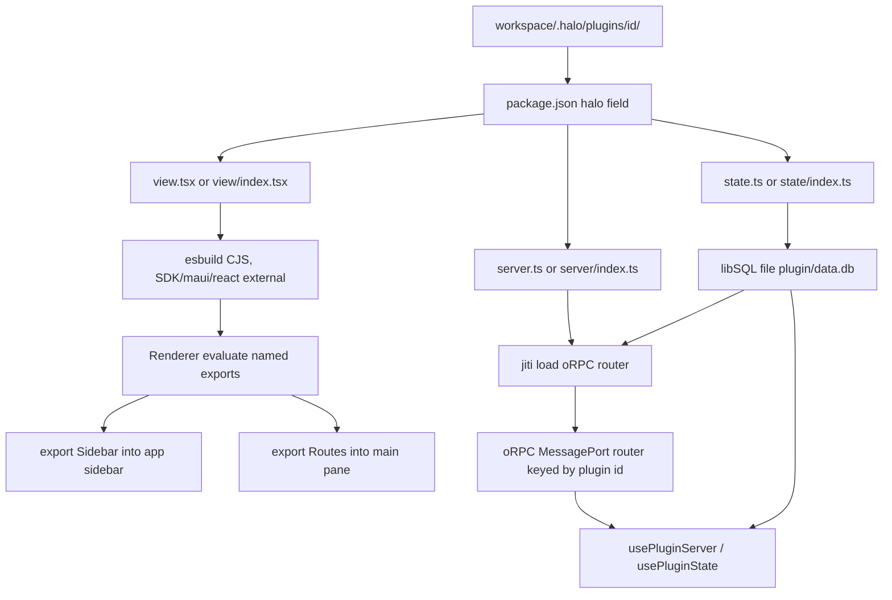
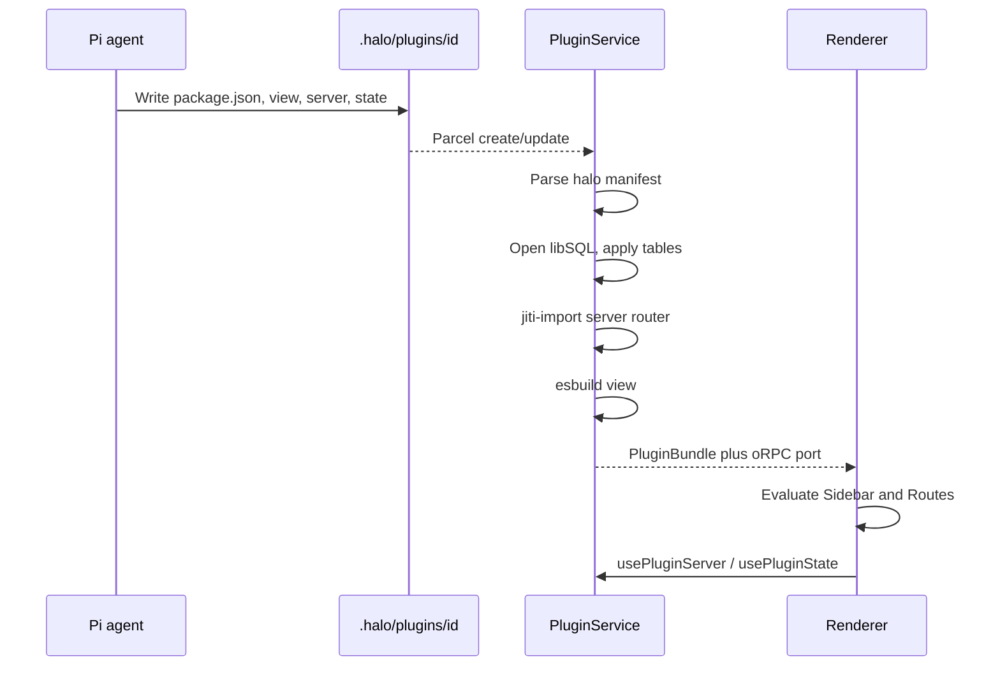

# Plugin system

## System flow





## Problem overview

Workspace UI today is a single compiled `index.tsx` that default-exports `{ sidebarEntries, views }`. There is no plugin identity, no main-process code, and no durable store. An agent can draw a calendar, but it cannot keep rows, expose typed procedures, or ship a `package.json` the host can read. That shape will not grow into installable plugins.

## Solution overview

Replace `.halo/extensions` with `.halo/plugins/<id>/`. Each plugin is a small package: `package.json` with a nested `halo` field (the same idea as bb's `bb` field), plus optional `view`, `server`, and `state` entries. The view mounts named exports into host holes (`Sidebar`, `Routes`). The server is an oRPC router loaded in main. State is Drizzle/Turso `sqliteTable` exports backed by a per-plugin libSQL file in the workspace. The view SDK gives authors `usePluginServer<S>()` and `usePluginState<D>()` so those routers and tables stay typed.

## Goals

- A plugin lives at `{workspace}/.halo/plugins/<id>/` with `package.json` and optional `view` / `server` / `state` files.
- `package.json` has a nested `halo` field for display name, description, and entry paths.
- `export const Sidebar` from the view is mounted in the app sidebar under Files / Sessions. `export const Routes` is a map of main-pane views.
- `@halo/plugin-sdk` is a workspace package with `state`, `server`, and `view` subpaths. Plugins declare it in `package.json`. The host aliases it to one copy.
- `usePluginServer<S>()` is an oRPC client typed as the plugin's router. `usePluginState<D>()` is a Drizzle client typed as the plugin's tables.
- Plugin data is a libSQL file next to the plugin, so agents and humans can both see it.
- Save reloads that plugin. A compile or load error shows in the sidebar and leaves other plugins up.
- Calendar and the agent skill seed in the new layout. The old `.halo/extensions` loader is removed.

## Non-goals

- No npm/git marketplace, no `pnpm install` inside the plugin folder, no extra plugin dependencies beyond the aliased SDK.
- No replacing Files, Sessions, New session, Develop, or the session composer.
- No view exports beyond `Sidebar` and `Routes` in this work. Unknown named exports are ignored so later holes can be added.
- No remote Turso sync, no cross-plugin database, no HTTP listener. oRPC rides a MessagePort, like the existing Cap'n Web RPC.
- No automatic rewrite of existing `.halo/extensions` folders.
- No bb-style exclusive thread list, content scripts, or composer slots.

## Assumptions

- Plugin id is the folder name. `halo.name` is the label shown in the UI.
- `view`, `server`, and `state` are each optional. A plugin can be UI-only, server-only, or both.
- View imports of `./server` and `./state` are type-only. esbuild must not bundle main-process code into the renderer.
- Schema apply on load is create-table-if-missing from the exported tables. No rename/drop migrations in this work.
- Procedure input uses TypeBox (already in `@halo/desktop`) through oRPC's Standard Schema support. Do not add Zod unless TypeBox fails at the oRPC boundary.
- Plugin code is trusted workspace code, same as today's extensions.

## Important files, docs, and websites

- [`apps/electron/src/main/ExtensionService.ts`](../apps/electron/src/main/ExtensionService.ts) — Today's seed/watch/compile. Replace with `PluginService`.
- [`apps/electron/src/main/compileExtension.ts`](../apps/electron/src/main/compileExtension.ts) — esbuild CJS for the view. Keep the approach; change entry names and externals.
- [`apps/electron/src/shared/evaluateExtensionSource.ts`](../apps/electron/src/shared/evaluateExtensionSource.ts) — Today's `{ sidebarEntries, views }` parser. Replace with named `Sidebar` / `Routes`.
- [`apps/electron/src/renderer/loadExtensionModule.ts`](../apps/electron/src/renderer/loadExtensionModule.ts) — Host `require` map. Add `@halo/plugin-sdk/view`.
- [`apps/electron/src/renderer/Sidebar.tsx`](../apps/electron/src/renderer/Sidebar.tsx) — Mount plugin `Sidebar` instead of synthesized sections.
- [`apps/electron/src/renderer/App.tsx`](../apps/electron/src/renderer/App.tsx) — Selection kind `extension` becomes `plugin`.
- [`apps/electron/src/shared/rpc.ts`](../apps/electron/src/shared/rpc.ts) — Cap'n Web HaloApi. Add plugin list/subscribe; plugin procedures use a second MessagePort.
- [`apps/electron/src/shared/channels.ts`](../apps/electron/src/shared/channels.ts) — Existing `halo:request-rpc`. Add a plugin oRPC channel pair.
- [`apps/electron/src/main/preload.ts`](../apps/electron/src/main/preload.ts) — Forward the plugin MessagePort the same way as HaloApi.
- [`packages/logger/package.json`](../packages/logger/package.json) — Package export layout to copy for `@halo/plugin-sdk`.
- [`.agents/skills/halo-extension/SKILL.md`](../.agents/skills/halo-extension/SKILL.md) — Rewrite for the plugin layout.
- [`specs/extension-system.md`](./extension-system.md) — Current system this spec replaces.
- [oRPC getting started](https://orpc.dev/docs/getting-started) — Router + client.
- [oRPC Electron adapter](https://orpc.dev/docs/adapters/electron) — MessagePort between main and renderer.
- [Drizzle + Turso](https://orm.drizzle.team/docs/get-started/turso-new) — `sqliteTable` schema and libSQL.
- [bb composer-customization package.json](https://github.com/get-bb/bb/blob/main/examples/plugins/composer-customization/package.json) — Nested `bb` field this `halo` field copies.

## Implementation

### Phase 1: Add `@halo/plugin-sdk` with three subpaths

Add a workspace package that plugins compile against. `view` re-exports Maui components and purse-styles. `server` re-exports oRPC `os`. `state` re-exports Drizzle `sqliteTable` column helpers. Hooks can be stubbed until later phases.

#### Important types

```ts
// packages/plugin-sdk/src/view.ts
export type PluginRouteMap = Record<string, ComponentType>;
export type PluginNavigate = {
  open: (route: string) => void;
  route: string | undefined;
};

export function usePluginServer<S>(): RouterClient<S>;
export function usePluginState<D>(): PluginDatabase<D>;
export function usePluginNavigate(): PluginNavigate;
```

#### Call stack diff

```diff
 packages/logger
 (workspace package)
+packages/plugin-sdk
+├── src/view.ts     (@halo/plugin-sdk/view)
+├── src/server.ts   (@halo/plugin-sdk/server)
+└── src/state.ts    (@halo/plugin-sdk/state)
```

#### Code diff preview

```diff
 // packages/plugin-sdk/package.json
+{
+  "name": "@halo/plugin-sdk",
+  "version": "0.1.0",
+  "private": true,
+  "type": "module",
+  "exports": {
+    "./view": "./src/view.ts",
+    "./server": "./src/server.ts",
+    "./state": "./src/state.ts"
+  }
+}
```

- [ ] Create `packages/plugin-sdk` with `package.json`, `tsconfig.json`, and `view` / `server` / `state` entry files. Match `@repo/logger` scripts (`lint`, `typecheck`, `test`).
- [ ] Re-export Maui components, tokens, and `style` / `useStyles` from `view`. Re-export `os` / `ORPCError` from `server`. Re-export `sqliteTable`, `text`, `integer`, `real` from `state`.
- [ ] Export `usePluginServer`, `usePluginState`, and `usePluginNavigate` from `view`. Until later phases they throw a tagged `PluginRuntimeMissingError` if called outside a host provider.
- [ ] Add a Vitest that imports each subpath and asserts the Maui `Button` export and `sqliteTable` are functions.
- [ ] Run `pnpm --filter @halo/plugin-sdk test typecheck lint format:check`.

### Phase 2: Parse the nested `halo` manifest

Read `package.json` the way bb reads `bb`. Resolve `view` / `server` / `state` to files, including `view/index.tsx` fallbacks.

#### Important types

```ts
// apps/electron/src/shared/pluginManifest.ts
type HaloManifest = {
  name: string;
  description?: string;
  view?: string;
  server?: string;
  state?: string;
};

type PluginManifest = {
  id: string;
  directory: string;
  packageName: string;
  halo: HaloManifest;
  viewPath?: string;
  serverPath?: string;
  statePath?: string;
};

class PluginManifestError extends errore.createTaggedError({
  name: "PluginManifestError",
  message: "Plugin '$id' package.json is not a Halo plugin: $detail",
}) {}
```

#### Call stack diff

```diff
 readdir(.halo/plugins/id)
-└── findExtensionEntry (index.tsx)
+└── readPluginManifest
+    ├── JSON.parse package.json
+    ├── require halo.name
+    └── resolve view/server/state entries
```

#### Code diff preview

```diff
 // apps/electron/src/main/readPluginManifest.ts
+const halo = record.halo;
+if (!isRecord(halo) || typeof halo.name !== "string") {
+  return new PluginManifestError({ id, detail: "missing halo.name" });
+}
+const viewPath = resolvePluginEntry({
+  directory,
+  specified: readString(halo.view),
+  fallbacks: ["view.tsx", "view.ts", "view/index.tsx", "view/index.ts"],
+});
```

- [ ] Add `readPluginManifest({ id, directory })`. Require `halo.name`. Treat missing `package.json` or missing `halo` as `PluginManifestError`.
- [ ] Resolve entries from `halo.view` / `halo.server` / `halo.state` when set. Otherwise look for `view.tsx`, `view/index.tsx`, `view.ts`, `view/index.ts` (same pattern for `server` and `state`, `.ts` only for those).
- [ ] Ignore unknown `halo` keys. Do not read `engines` yet.
- [ ] Cover happy path, missing `halo.name`, explicit paths, and directory fallbacks in Vitest.
- [ ] Run `pnpm --filter @halo/desktop test`.

### Phase 3: Discover and watch `.halo/plugins`

Stand up `PluginService` next to `ExtensionService`. List manifests and load errors over RPC. Do not switch the renderer yet, so the current Calendar still works.

#### Important types

```ts
// apps/electron/src/shared/plugin.ts
type PluginLoadError = { id: string; message: string };
type PluginList = {
  plugins: PluginManifest[];
  errors: PluginLoadError[];
};

// apps/electron/src/shared/rpc.ts
abstract class HaloApi extends RpcTarget {
  abstract listPlugins(): Promise<PluginList>;
  abstract subscribePlugins(callback: (list: PluginList) => void): void;
}
```

#### Call stack diff

```diff
 WorkspaceService.select
 └── ExtensionService.sync
+HaloRpc.listPlugins
+└── PluginService.list
+    ├── readdir .halo/plugins
+    ├── readPluginManifest per folder
+    └── Parcel watch .halo/plugins (50ms debounce)
```

#### Code diff preview

```diff
 // apps/electron/src/main/main.ts
 const extensionService = new ExtensionService(workspaceService);
+const pluginService = new PluginService(workspaceService);
 // ...
-  new HaloRpc(workspaceService, piService, extensionService, ...)
+  new HaloRpc(workspaceService, piService, extensionService, pluginService, ...)
```

- [ ] Add `PluginService` with `list`, `sync`, Parcel watch on `{workspace}/.halo/plugins`, and the same 50ms debounce as `ExtensionService.scheduleReload`.
- [ ] Skip dot-folders. Sort by folder name. A bad `package.json` is an error row, not a crash.
- [ ] Add `listPlugins` / `subscribePlugins` on `HaloApi` / `HaloRpc` using the Cap'n Web `dup()` pattern already in `subscribeExtensions`.
- [ ] Test: not-ready workspace returns `WorkspaceNotReadyError`; a valid plugin folder appears; a broken `package.json` is an error and does not hide the valid one.
- [ ] Run `pnpm --filter @halo/desktop test`.

### Phase 4: Compile and evaluate `Sidebar` and `Routes`

Compile the view with esbuild. Evaluate named exports. Host `require` serves `@halo/plugin-sdk/view` plus the current React/Maui map.

#### Important types

```ts
// apps/electron/src/shared/plugin.ts
type CompiledPluginView = { id: string; source: string };
type LoadedPluginView = {
  id: string;
  Sidebar?: ComponentType;
  routes: Record<string, ComponentType>;
};

class PluginViewExportError extends errore.createTaggedError({
  name: "PluginViewExportError",
  message: "Plugin '$id' view must export Sidebar and/or Routes",
}) {}
```

#### Call stack diff

```diff
 compileExtensionDirectory
 └── esbuild index.tsx (external maui, react)
+compilePluginView
+└── esbuild view.tsx
+    └── external: react, maui, purse-styles, @halo/plugin-sdk/view
 evaluateExtensionSource
 └── default.sidebarEntries / default.views
+evaluatePluginView
+└── named Sidebar (function) and Routes (component map)
```

#### Code diff preview

```diff
 // apps/electron/src/main/compilePluginView.ts
+const built = await esbuild.build({
+  absWorkingDir: directory,
+  entryPoints: [viewPath],
+  bundle: true,
+  write: false,
+  format: "cjs",
+  platform: "browser",
+  jsx: "automatic",
+  external: [
+    ...extensionHostModules,
+    "@halo/plugin-sdk/view",
+  ],
+});
```

- [ ] Compile the resolved view file. Map `@halo/plugin-sdk/view` as external. Keep tagged compile errors.
- [ ] Evaluate CJS. Read `Sidebar` if it is a function. Read `Routes` if it is a record of functions. Accept `module.exports` or `exports.default` wrapping for CJS interop, but the author-facing API is named exports.
- [ ] Reject a view that exports neither `Sidebar` nor `Routes`. Ignore other names.
- [ ] Test: compile a view that imports `Button` from `@halo/plugin-sdk/view`; parse `Sidebar` + `Routes`; fail on a view with neither.
- [ ] Run `pnpm --filter @halo/desktop test`.

### Phase 5: Mount plugin UI in the sidebar and main pane

Put each plugin `Sidebar` under Sessions. Selecting a route renders `Routes[route]` in the main pane. Wrap both in a runtime provider so navigate (and later server/state hooks) know the plugin id.

#### Important types

```ts
// apps/electron/src/renderer/App.tsx
type SessionSelection =
  | { kind: "draft"; draftId: string }
  | { kind: "saved"; sessionId: string }
  | { kind: "uikit" }
  | { kind: "plugin"; pluginId: string; route: string };

// packages/plugin-sdk/src/view.ts
type PluginRuntimeValue = {
  pluginId: string;
  navigate: PluginNavigate;
};
```

#### Call stack diff

```diff
 App
 ├── Sidebar
 │   ├── Files / Sessions / Develop
-│   └── extension.sidebarEntries → buttons
+│   └── PluginRuntimeProvider
+       └── plugin.Sidebar
 └── MainPane
-    └── ExtensionView views[viewId]
+    └── PluginRuntimeProvider
+        └── plugin.routes[route]
```

#### Code diff preview

```diff
 // apps/electron/src/renderer/Sidebar.tsx
-{extension.sidebarEntries.map((sidebarSection) => (
-  <section>{sidebarSection.items.map(...)}</section>
-))}
+{plugins.map((plugin) => (
+  <PluginRuntimeProvider key={plugin.id} pluginId={plugin.id}>
+    {plugin.Sidebar !== undefined ? (
+      <plugin.Sidebar />
+    ) : (
+      <DefaultPluginNav plugin={plugin} />
+    )}
+  </PluginRuntimeProvider>
+))}
```

- [ ] Change selection to `{ kind: "plugin"; pluginId; route }`. `usePluginNavigate().open(route)` sets it. If `Routes` exists and `Sidebar` does not, render a host section labeled `halo.name` with one row per route key.
- [ ] `MainPane` renders `routes[route]` or a missing-route message. Keep Files / Sessions / Develop as they are.
- [ ] Show plugin load errors in the sidebar (`data-testid="plugin-error"`).
- [ ] Keep `ExtensionService` wired so Calendar still works until Phase 8. Plugin UI is additive.
- [ ] Run `pnpm --filter @halo/desktop test`. Prove with `pnpm halo-web` that a fixture plugin's `Sidebar` appears and its route fills the main pane.

### Phase 6: Plugin state as Turso / libSQL tables

Load `state.ts` in main with jiti. Open `{pluginDir}/data.db` with `@libsql/client`. Apply exported `sqliteTable`s. In the renderer, `usePluginState<D>()` is a Drizzle sqlite-proxy client that runs SQL in main against that file.

#### Important types

```ts
// packages/plugin-sdk/src/state.ts
export { sqliteTable, text, integer, real, blob } from "drizzle-orm/sqlite-core";

// apps/electron/src/main/pluginState.ts
type PluginStateHandle = {
  db: LibSQLDatabase<Record<string, unknown>>;
  schema: Record<string, SQLiteTable>;
};

// packages/plugin-sdk/src/view.ts
type PluginDatabase<D> = DrizzleSqliteProxyDatabase<D>;
```

#### Call stack diff

```diff
 PluginService.reload
 ├── readPluginManifest
 ├── compilePluginView
+├── jiti.import(state.ts)
+├── createClient({ url: "file:…/data.db" })
+├── applySqliteTables(schema)
+└── HaloRpc.executePluginSql({ pluginId, sql, params, method })
 usePluginState<D>
+└── drizzle(sqlite-proxy → executePluginSql)
```

#### Code diff preview

```diff
 // packages/plugin-sdk/src/view.ts
+export function usePluginState<D>(): PluginDatabase<D> {
+  const runtime = usePluginRuntime();
+  return useMemo(
+    () =>
+      drizzle(async (sql, params, method) => {
+        return runtime.executeSql({ sql, params, method });
+      }, { schema: undefined as unknown as D }),
+    [runtime],
+  );
+}
```

- [ ] jiti-import `state.ts` with `@halo/plugin-sdk` aliased to the workspace package. Collect exports that are sqlite tables. Other exports are ignored.
- [ ] Open `data.db` in the plugin directory (`mode: 0o700` on the folder). Create missing tables from the schema. Keep the connection across view reloads; close and reopen on state file change.
- [ ] Add `executePluginSql` on HaloApi. Reject calls whose `pluginId` is not the runtime's plugin. Return rows in the sqlite-proxy shape Drizzle expects.
- [ ] Implement `usePluginState<D>()` on the real runtime. After a write, invalidate so the next read sees new rows (same-process notify is enough).
- [ ] Test: a `notes` table insert in main is visible through `executePluginSql`; a plugin cannot query another plugin's file. Run `pnpm --filter @halo/desktop test`.

### Phase 7: Plugin server as an oRPC sub-router

Load `server.ts` with jiti. The default export (or `export const router`) is an oRPC router. Mount every plugin under `{ [pluginId]: router }` on an Electron MessagePort. `usePluginServer<S>()` is `createORPCClient` scoped to that plugin. Handlers receive `{ pluginId, workspaceRoot, db }`.

#### Important types

```ts
// packages/plugin-sdk/src/server.ts
import type { LibSQLDatabase } from "drizzle-orm/libsql";

export type PluginServerContext = {
  pluginId: string;
  workspaceRoot: string;
  db?: LibSQLDatabase<Record<string, unknown>>;
};

export { os, ORPCError } from "@orpc/server";

// apps/electron/src/shared/channels.ts
export const PLUGIN_RPC_CHANNELS = {
  requestRpc: "halo:request-plugin-rpc",
  provideRpc: "halo:provide-plugin-rpc",
} as const;
```

#### Call stack diff

```diff
 preload MessagePort
 └── halo:request-rpc → HaloRpc (Cap'n Web)
+preload MessagePort
+└── halo:request-plugin-rpc → oRPC RPCHandler
+    └── { [pluginId]: pluginRouter }
 view component
+└── usePluginServer<typeof router>()
+    └── RPCLink(pluginPort).pluginId.*
```

#### Code diff preview

```diff
 // apps/electron/src/main/pluginOrpc.ts
+const handler = new RPCHandler(combinedRouter);
+ipcMain.on(PLUGIN_RPC_CHANNELS.requestRpc, (event) => {
+  const [port] = event.ports;
+  handler.upgrade(port, {
+    context: { /* filled per call from pluginId in path */ },
+  });
+  port.start();
+});

 // packages/plugin-sdk/src/view.ts
+export function usePluginServer<S>(): RouterClient<S> {
+  const { pluginId, client } = usePluginRuntime();
+  return client[pluginId] as RouterClient<S>;
+}
```

- [ ] jiti-import the server file. Accept `default` or `router`. Alias `@halo/plugin-sdk/server` to the host package. On reload, replace that plugin's key in the combined router and dispose the old module cache (jiti `moduleCache: false` for the plugin directory).
- [ ] Open a second MessagePort beside Cap'n Web (`channels.ts` + `preload.ts` + renderer connect). Follow the oRPC Electron adapter.
- [ ] Pass `db` in context when state loaded. Convert handler failures at this boundary: if a handler returns an `Error`, map it to `ORPCError` before the port.
- [ ] Implement `usePluginServer<S>()`. Document that `import type { router } from "./server.ts"` is type-only.
- [ ] Test with `createFake` or an in-process MessageChannel: a `ping` procedure round-trips; a missing plugin id does not match. Run `pnpm --filter @halo/desktop test` and `pnpm --filter @halo/plugin-sdk test`.

### Phase 8: Seed Calendar as a plugin and remove the extension loader

Ship a real plugin that uses `Sidebar`, `Routes`, and the SDK. Stop seeding `.halo/extensions`. Delete the old compile/evaluate path.

#### Important types

```ts
// apps/electron/src/main/bundled/calendar/package.json
type CalendarPackage = {
  name: "halo-plugin-calendar";
  halo: {
    name: "Calendar";
    description: "Month view.";
    view: "./view.tsx";
  };
};

// apps/electron/src/renderer/App.tsx
type SessionSelection =
  | { kind: "draft"; draftId: string }
  | { kind: "saved"; sessionId: string }
  | { kind: "uikit" }
  | { kind: "plugin"; pluginId: string; route: string };
```

#### Call stack diff

```diff
 WorkspaceService.select
-└── ExtensionService.seed
-    ├── .halo/extensions/calendar/index.tsx
-    └── .pi/agent/skills/halo-extension
+└── PluginService.seed
+    ├── .halo/plugins/calendar/package.json
+    ├── .halo/plugins/calendar/view.tsx
+    └── .pi/agent/skills/halo-plugin
 HaloRpc
-├── listExtensions / subscribeExtensions
 └── listPlugins / subscribePlugins
 App
-└── kind: "extension"
+└── kind: "plugin"
```

#### Code diff preview

```diff
 // .agents/skills/halo-plugin/SKILL.md
+# Halo plugins
+Plugins live in `{workspace}/.halo/plugins/<id>/`.
+Required: `package.json` with a `halo.name`.
+Optional: `view.tsx` (`Sidebar`, `Routes`), `server.ts` (oRPC router),
+`state.ts` (sqlite tables).
+Import UI from `@halo/plugin-sdk/view`.
```

- [ ] Seed `calendar` as a plugin (`package.json` + `view.tsx`) only when those files are missing. Sidebar rows use `usePluginNavigate`. One route `month` with the current month grid. Import from `@halo/plugin-sdk/view` only.
- [ ] Replace the halo-extension skill with `halo-plugin`. Seed it under `.pi/agent/skills/halo-plugin/SKILL.md`. Keep a test that bundled skill matches the repo skill.
- [ ] Remove `ExtensionService`, `compileExtension.ts`, `evaluateExtensionSource.ts`, `listExtensions`, `kind: "extension"`, and `.halo/extensions` seeding.
- [ ] Update `AGENTS.md` Cursor Cloud notes if they mention `.halo/extensions`.
- [ ] Run `pnpm run check-affected`. Prove with `pnpm halo-web` that Calendar still opens from the sidebar after a cold workspace seed, and that editing `view.tsx` hot-reloads. Record the UI demo required for this change.
