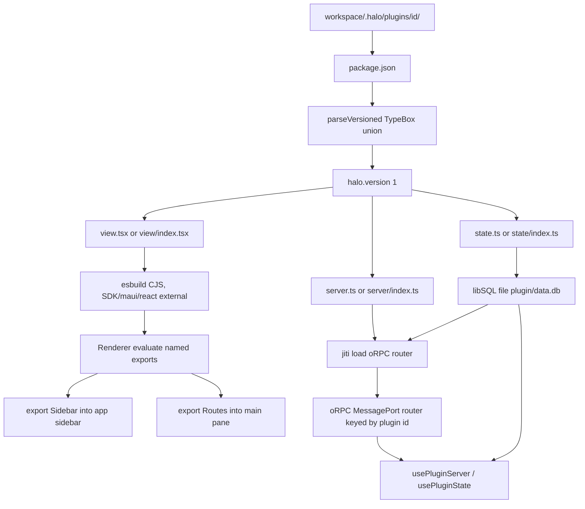
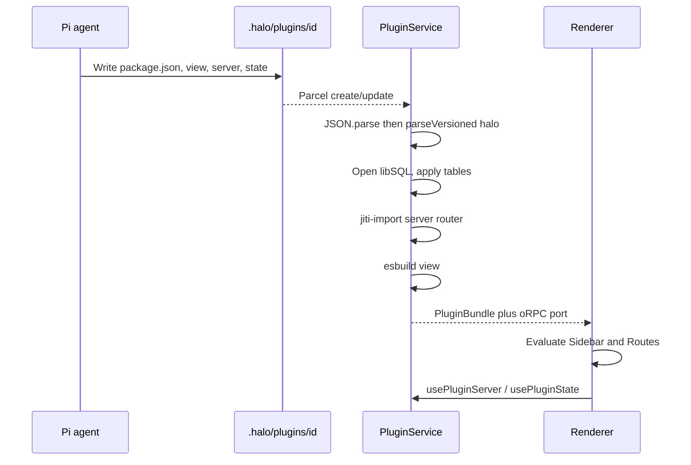

# Plugin system

## System flow





## Problem overview

The sidebar and main pane are fixed in the renderer. A user who asks the in-app agent to add a calendar or notes view has no plugin format, no main-process code, and no durable store. Hand-rolled `JSON.parse` plus field checks (as in `workspace.json` and `user.json`) will not scale once plugins ship versioned manifests.

## Solution overview

Add `{workspace}/.halo/plugins/<id>/` packages. Each plugin has `package.json` with a nested `halo` object, plus optional `view`, `server`, and `state` files. The view mounts named exports (`Sidebar`, `Routes`). The server is an oRPC router in main. State is Drizzle/Turso `sqliteTable`s in a per-plugin libSQL file. Parse every persisted JSON document with a versioned TypeBox union and a shared `parseVersioned` helper that returns an errore tagged error. TypeBox is already in `@halo/desktop`; do not add Zod.

## Goals

- A plugin lives at `{workspace}/.halo/plugins/<id>/` with `package.json` and optional `view` / `server` / `state` files.
- `package.json` has a nested `halo` field. `halo.version` is required. V1 is `1`.
- `export const Sidebar` mounts in the app sidebar under Files / Sessions. `export const Routes` is the main-pane map.
- `@halo/plugin-sdk` has `view`, `server`, `state`, and `schema` subpaths. Plugins declare it. The host aliases it to one copy.
- `usePluginServer<S>()` is an oRPC client typed as the plugin router. `usePluginState<D>()` is a Drizzle client typed as the plugin tables.
- Plugin data is `{pluginDir}/data.db`, so agents and humans can both see it.
- Save reloads that plugin. A load error shows in the sidebar and leaves other plugins up.
- New JSON documents (manifest first) parse through `parseVersioned`. Unknown or missing `version` is a parse error.
- Calendar seeds as a plugin. A `halo-plugin` skill seeds under `.pi/agent/skills/`.

## Non-goals

- No Zod. TypeBox covers schema, Standard Schema (oRPC), and version unions.
- No rewrite of existing `workspace.json` / `user.json` parsers in this work. New parses use the helper; old files stay until those call sites change.
- No automatic migrate from unversioned objects. Missing `version` fails.
- No npm/git marketplace, no `pnpm install` in the plugin folder, no extra plugin deps beyond the aliased SDK.
- No replacing Files, Sessions, New session, Develop, or the session composer.
- No view exports beyond `Sidebar` and `Routes`. Unknown named exports are ignored.
- No remote Turso sync, no cross-plugin database, no HTTP listener.
- No bb-style exclusive thread list, content scripts, or composer slots.

## Assumptions

- Plugin id is the folder name. `halo.name` is the UI label.
- `view`, `server`, and `state` are each optional.
- View imports of `./server` and `./state` are type-only.
- Schema apply on load is create-table-if-missing. No rename/drop migrations.
- oRPC procedure input uses TypeBox (Standard Schema), same library as manifests.
- A later `halo` version is a new `Type.Object` with `version: Type.Literal(2)` added to the union, plus an explicit `up` in `parseVersioned` if the host should normalize to latest. This work ships only version 1 and returns that object as-is.
- Plugin code is trusted workspace code.
- TypeBox `Type.Object` strips unknown keys by default. Extra `halo` keys are ignored. Do not use `additionalProperties: false` on the manifest.

## Important files, docs, and websites

- [`apps/electron/src/renderer/Sidebar.tsx`](../apps/electron/src/renderer/Sidebar.tsx) — Mount plugin `Sidebar` under Sessions.
- [`apps/electron/src/renderer/App.tsx`](../apps/electron/src/renderer/App.tsx) — Add `{ kind: "plugin"; pluginId; route }`.
- [`apps/electron/src/renderer/MainPane.tsx`](../apps/electron/src/renderer/MainPane.tsx) — Render `Routes[route]`.
- [`apps/electron/src/shared/rpc.ts`](../apps/electron/src/shared/rpc.ts) — Cap'n Web HaloApi. Add plugin list/subscribe; procedures use a second MessagePort.
- [`apps/electron/src/shared/channels.ts`](../apps/electron/src/shared/channels.ts) — Existing `halo:request-rpc`. Add a plugin oRPC channel pair.
- [`apps/electron/src/main/preload.ts`](../apps/electron/src/main/preload.ts) — Forward the plugin MessagePort like HaloApi.
- [`apps/electron/src/main/main.ts`](../apps/electron/src/main/main.ts) — Construct `PluginService`.
- [`apps/electron/src/main/workspace-service.ts`](../apps/electron/src/main/workspace-service.ts) — Today's `JSON.parse` + field checks. Do not change yet; the new helper is what new parsers call.
- [`apps/electron/src/main/ParallelSearchTools.ts`](../apps/electron/src/main/ParallelSearchTools.ts) — Existing TypeBox `Type.Object` usage to match.
- [`packages/logger/package.json`](../packages/logger/package.json) — Package export layout to copy for `@halo/plugin-sdk`.
- [`@sinclair/typebox` Value](https://github.com/sinclairzx81/typebox) — `Value.Check` / `Value.Errors` (no throw). Wrap `Value.Parse` with `errore.try` if used.
- [oRPC getting started](https://orpc.dev/docs/getting-started) — Router + client. Any Standard Schema, including TypeBox.
- [oRPC Electron adapter](https://orpc.dev/docs/adapters/electron) — MessagePort between main and renderer.
- [Drizzle + Turso](https://orm.drizzle.team/docs/get-started/turso-new) — `sqliteTable` schema and libSQL.
- [bb composer-customization package.json](https://github.com/get-bb/bb/blob/main/examples/plugins/composer-customization/package.json) — Nested `bb` field this `halo` field copies.

## Implementation

### Phase 1: Add `@halo/plugin-sdk` with view, server, state, and schema

Add a workspace package that plugins compile against. `schema` re-exports TypeBox `Type` / `Static` and will own `parseVersioned` in phase 2. Hooks can be stubbed until later phases.

#### Important types

```ts
// packages/plugin-sdk/src/view.ts
export type PluginRouteMap = Record<string, ComponentType>;
export type PluginNavigate = {
  open: (route: string) => void;
  route: string | undefined;
};

export function usePluginServer<S>(): RouterClient<S>;
export function usePluginState<D>(): PluginDatabase<D>;
export function usePluginNavigate(): PluginNavigate;
```

#### Call stack diff

```diff
 packages/logger
 (workspace package)
+packages/plugin-sdk
+├── src/view.ts     (@halo/plugin-sdk/view)
+├── src/server.ts   (@halo/plugin-sdk/server)
+├── src/state.ts    (@halo/plugin-sdk/state)
+└── src/schema.ts   (@halo/plugin-sdk/schema)
```

#### Code diff preview

```diff
 // packages/plugin-sdk/package.json
+{
+  "name": "@halo/plugin-sdk",
+  "version": "0.1.0",
+  "private": true,
+  "type": "module",
+  "exports": {
+    "./view": "./src/view.ts",
+    "./server": "./src/server.ts",
+    "./state": "./src/state.ts",
+    "./schema": "./src/schema.ts"
+  }
+}
```

- [ ] Create `packages/plugin-sdk` with `package.json`, `tsconfig.json`, and the four entry files. Match `@repo/logger` scripts. Depend on `@sinclair/typebox` (same range as `@halo/desktop`).
- [ ] Re-export Maui components, tokens, and `style` / `useStyles` from `view`. Re-export `os` / `ORPCError` from `server`. Re-export `sqliteTable`, `text`, `integer`, `real` from `state`. Re-export `Type` and `Static` from `schema`.
- [ ] Export `usePluginServer`, `usePluginState`, and `usePluginNavigate` from `view`. Until later phases they throw a tagged `PluginRuntimeMissingError` if called outside a host provider.
- [ ] Add a Vitest that imports each subpath and asserts `Button` and `sqliteTable` are functions and `Type.Literal` exists.
- [ ] Run `pnpm --filter @halo/plugin-sdk test typecheck lint format:check`.

### Phase 2: Versioned TypeBox parse helper

Add `parseVersioned` so every JSON document is a `version` discriminated union. Use `Value.Check` (boolean, no throw). Convert failures to a tagged error. Do not call `schema.parse`-style throws on the happy path.

#### Important types

```ts
// packages/plugin-sdk/src/schema.ts
import { Type, type Static, type TSchema } from "@sinclair/typebox";
import { Value } from "@sinclair/typebox/value";
import * as errore from "errore";

export class SchemaParseError extends errore.createTaggedError({
  name: "SchemaParseError",
  message: "Failed to parse $name: $detail",
}) {}

export function parseVersioned<S extends TSchema>(args: {
  name: string;
  schema: S;
  value: unknown;
}): SchemaParseError | Static<S> {
  if (Value.Check(args.schema, args.value)) return args.value;
  const first = [...Value.Errors(args.schema, args.value)][0];
  const path = first === undefined ? "" : first.path;
  const message = first === undefined ? "invalid" : first.message;
  return new SchemaParseError({
    name: args.name,
    detail: path.length === 0 ? message : `${path} ${message}`,
  });
}
```

#### Call stack diff

```diff
 JSON.parse (external boundary, errore.try)
-└── typeof checks / in-operator field reads
+└── parseVersioned({ name, schema, value })
+    ├── Value.Check(schema, value)
+    └── Value.Errors → SchemaParseError
```

#### Code diff preview

```diff
 // packages/plugin-sdk/src/schema.ts
+export const haloManifestV1 = Type.Object({
+  version: Type.Literal(1),
+  name: Type.String({ minLength: 1 }),
+  description: Type.Optional(Type.String()),
+  view: Type.Optional(Type.String({ minLength: 1 })),
+  server: Type.Optional(Type.String({ minLength: 1 })),
+  state: Type.Optional(Type.String({ minLength: 1 })),
+});
+
+export const haloManifestSchema = Type.Union([haloManifestV1]);
+export type HaloManifest = Static<typeof haloManifestV1>;
```

- [ ] Implement `parseVersioned` with `Value.Check` / `Value.Errors`. Never throw on invalid input.
- [ ] Define `haloManifestV1` and `haloManifestSchema` as a one-member union so a later `Type.Literal(2)` object can join it.
- [ ] Test: version 1 with `name` succeeds; missing `version` fails; `version: 2` fails; extra keys are stripped/ignored and still succeed.
- [ ] Document in a short comment on `haloManifestSchema` that a new version is a new object in the union plus an `up` only when the host must normalize to latest.
- [ ] Run `pnpm --filter @halo/plugin-sdk test`.

### Phase 3: Parse the nested `halo` manifest

Read `package.json`, parse JSON with `errore.try`, then `parseVersioned` on `halo`. Resolve `view` / `server` / `state` to files, including `view/index.tsx` fallbacks.

#### Important types

```ts
// apps/electron/src/shared/pluginManifest.ts
import type { HaloManifest } from "@halo/plugin-sdk/schema";

type PluginPackageJson = {
  name: string;
  halo: HaloManifest;
};

type PluginManifest = {
  id: string;
  directory: string;
  packageName: string;
  halo: HaloManifest;
  viewPath?: string;
  serverPath?: string;
  statePath?: string;
};

class PluginManifestError extends errore.createTaggedError({
  name: "PluginManifestError",
  message: "Plugin '$id' package.json is not a Halo plugin: $detail",
}) {}
```

#### Call stack diff

```diff
 readdir(.halo/plugins/id)
+└── readPluginManifest
+    ├── readFile package.json
+    ├── errore.try JSON.parse
+    ├── parseVersioned haloManifestSchema on record.halo
+    └── resolve view/server/state entries
```

#### Code diff preview

```diff
 // apps/electron/src/main/readPluginManifest.ts
+const parsed = errore.try({
+  try: () => JSON.parse(raw) as unknown,
+  catch: (e) => new PluginManifestError({ id, detail: "invalid JSON", cause: e }),
+});
+if (parsed instanceof Error) return parsed;
+const record = parsed as { name?: unknown; halo?: unknown };
+const halo = parseVersioned({
+  name: `plugin.${id}.halo`,
+  schema: haloManifestSchema,
+  value: record.halo,
+});
+if (halo instanceof Error) {
+  return new PluginManifestError({ id, detail: halo.message, cause: halo });
+}
```

- [ ] Add `readPluginManifest({ id, directory })`. Missing file, invalid JSON, or failed `halo` parse returns `PluginManifestError`.
- [ ] Require `package.json` `name` as a non-empty string (plain check or a small TypeBox object around `{ name, halo }`). Resolve entries from `halo.view` / `halo.server` / `halo.state` when set. Otherwise look for `view.tsx`, `view/index.tsx`, `view.ts`, `view/index.ts` (same pattern for `server` and `state`, `.ts` only for those).
- [ ] Do not read `engines` yet.
- [ ] Cover happy path, missing `version`, missing `halo.name`, explicit paths, and directory fallbacks in Vitest.
- [ ] Run `pnpm --filter @halo/desktop test`.

### Phase 4: Discover and watch `.halo/plugins`

Stand up `PluginService`. List manifests and load errors over RPC. The renderer still has no plugin UI.

#### Important types

```ts
// apps/electron/src/shared/plugin.ts
type PluginLoadError = { id: string; message: string };
type PluginList = {
  plugins: PluginManifest[];
  errors: PluginLoadError[];
};

// apps/electron/src/shared/rpc.ts
abstract class HaloApi extends RpcTarget {
  abstract listPlugins(): Promise<PluginList>;
  abstract subscribePlugins(callback: (list: PluginList) => void): void;
}
```

#### Call stack diff

```diff
 WorkspaceService.select
 └── PiService / tree watch
+HaloRpc.listPlugins
+└── PluginService.list
+    ├── readdir .halo/plugins
+    ├── readPluginManifest per folder
+    └── Parcel watch .halo/plugins (50ms debounce)
```

#### Code diff preview

```diff
 // apps/electron/src/main/main.ts
 const piService = new PiService(workspaceService, userService);
+const pluginService = new PluginService(workspaceService);
 // ...
-  new HaloRpc(workspaceService, piService, getWindow, rpcLogger)
+  new HaloRpc(workspaceService, piService, pluginService, getWindow, rpcLogger)
```

- [ ] Add `PluginService` with `list`, `sync`, Parcel watch on `{workspace}/.halo/plugins`, and a 50ms debounce (same burst handling as a file-watch reload).
- [ ] Skip dot-folders. Sort by folder name. A bad `package.json` is an error row, not a crash.
- [ ] Add `listPlugins` / `subscribePlugins` on `HaloApi` / `HaloRpc` using the Cap'n Web `dup()` pattern already in `subscribeWorkspaceTree`.
- [ ] Test: not-ready workspace returns `WorkspaceNotReadyError`; a valid plugin folder appears; a broken `package.json` is an error and does not hide the valid one.
- [ ] Run `pnpm --filter @halo/desktop test`.

### Phase 5: Compile and evaluate `Sidebar` and `Routes`

Compile the view with esbuild. Evaluate named exports. Host `require` serves `@halo/plugin-sdk/view` plus React/Maui.

#### Important types

```ts
// apps/electron/src/shared/plugin.ts
type CompiledPluginView = { id: string; source: string };
type LoadedPluginView = {
  id: string;
  Sidebar?: ComponentType;
  routes: Record<string, ComponentType>;
};

class PluginViewExportError extends errore.createTaggedError({
  name: "PluginViewExportError",
  message: "Plugin '$id' view must export Sidebar and/or Routes",
}) {}
```

#### Call stack diff

```diff
 PluginService.list
 └── readPluginManifest
+compilePluginView
+└── esbuild view.tsx
+    └── external: react, maui, purse-styles, @halo/plugin-sdk/view
+evaluatePluginView
+└── named Sidebar (function) and Routes (component map)
```

#### Code diff preview

```diff
 // apps/electron/src/main/compilePluginView.ts
+const built = await esbuild.build({
+  absWorkingDir: directory,
+  entryPoints: [viewPath],
+  bundle: true,
+  write: false,
+  format: "cjs",
+  platform: "browser",
+  jsx: "automatic",
+  external: ["react", "react/jsx-runtime", "react/jsx-dev-runtime",
+    "react-dom", "maui", "purse-styles", "@halo/plugin-sdk/view"],
+});
```

- [ ] Compile the resolved view file. Map `@halo/plugin-sdk/view` as external. Keep tagged compile errors.
- [ ] Evaluate CJS. Read `Sidebar` if it is a function. Read `Routes` if it is a record of functions. Accept `module.exports` wrapping for CJS interop; the author-facing API is named exports.
- [ ] Reject a view that exports neither `Sidebar` nor `Routes`. Ignore other names.
- [ ] Test: compile a view that imports `Button` from `@halo/plugin-sdk/view`; parse `Sidebar` + `Routes`; fail on a view with neither.
- [ ] Run `pnpm --filter @halo/desktop test`.

### Phase 6: Mount plugin UI in the sidebar and main pane

Put each plugin `Sidebar` under Sessions. Selecting a route renders `Routes[route]` in the main pane. Wrap both in a runtime provider so navigate (and later server/state hooks) know the plugin id.

#### Important types

```ts
// apps/electron/src/renderer/App.tsx
type SessionSelection =
  | { kind: "draft"; draftId: string }
  | { kind: "saved"; sessionId: string }
  | { kind: "uikit" }
  | { kind: "plugin"; pluginId: string; route: string };

// packages/plugin-sdk/src/view.ts
type PluginRuntimeValue = {
  pluginId: string;
  navigate: PluginNavigate;
};
```

#### Call stack diff

```diff
 App
 ├── Sidebar
 │   ├── Files / Sessions / Develop
+│   └── PluginRuntimeProvider
+       └── plugin.Sidebar
 └── MainPane
     ├── UiKitPage / DraftPane / SavedPane
+    └── PluginRuntimeProvider
+        └── plugin.routes[route]
```

#### Code diff preview

```diff
 // apps/electron/src/renderer/Sidebar.tsx
+{plugins.map((plugin) => (
+  <PluginRuntimeProvider key={plugin.id} pluginId={plugin.id}>
+    {plugin.Sidebar !== undefined ? (
+      <plugin.Sidebar />
+    ) : (
+      <DefaultPluginNav plugin={plugin} />
+    )}
+  </PluginRuntimeProvider>
+))}
```

- [ ] Change selection to `{ kind: "plugin"; pluginId; route }`. `usePluginNavigate().open(route)` sets it. If `Routes` exists and `Sidebar` does not, render a host section labeled `halo.name` with one row per route key.
- [ ] `MainPane` renders `routes[route]` or a missing-route message. Keep Files / Sessions / Develop as they are.
- [ ] Show plugin load errors in the sidebar (`data-testid="plugin-error"`).
- [ ] Run `pnpm --filter @halo/desktop test`. Prove with `pnpm halo-web` that a fixture plugin's `Sidebar` appears and its route fills the main pane.

### Phase 7: Plugin state as Turso / libSQL tables

Load `state.ts` in main with jiti. Open `{pluginDir}/data.db` with `@libsql/client`. Apply exported `sqliteTable`s. In the renderer, `usePluginState<D>()` is a Drizzle sqlite-proxy client that runs SQL in main against that file.

#### Important types

```ts
// packages/plugin-sdk/src/state.ts
export { sqliteTable, text, integer, real, blob } from "drizzle-orm/sqlite-core";

// apps/electron/src/main/pluginState.ts
type PluginStateHandle = {
  db: LibSQLDatabase<Record<string, unknown>>;
  schema: Record<string, SQLiteTable>;
};

// packages/plugin-sdk/src/view.ts
type PluginDatabase<D> = DrizzleSqliteProxyDatabase<D>;
```

#### Call stack diff

```diff
 PluginService.reload
 ├── readPluginManifest
 ├── compilePluginView
+├── jiti.import(state.ts)
+├── createClient({ url: "file:…/data.db" })
+├── applySqliteTables(schema)
+└── HaloRpc.executePluginSql({ pluginId, sql, params, method })
 usePluginState<D>
+└── drizzle(sqlite-proxy → executePluginSql)
```

#### Code diff preview

```diff
 // packages/plugin-sdk/src/view.ts
+export function usePluginState<D>(): PluginDatabase<D> {
+  const runtime = usePluginRuntime();
+  return useMemo(
+    () =>
+      drizzle(async (sql, params, method) => {
+        return runtime.executeSql({ sql, params, method });
+      }, { schema: undefined as unknown as D }),
+    [runtime],
+  );
+}
```

- [ ] jiti-import `state.ts` with `@halo/plugin-sdk` aliased to the workspace package. Collect exports that are sqlite tables. Other exports are ignored.
- [ ] Open `data.db` in the plugin directory (`mode: 0o700` on the folder). Create missing tables from the schema. Keep the connection across view reloads; close and reopen on state file change.
- [ ] Add `executePluginSql` on HaloApi. Reject calls whose `pluginId` is not the runtime's plugin. Return rows in the sqlite-proxy shape Drizzle expects.
- [ ] Implement `usePluginState<D>()` on the real runtime. After a write, invalidate so the next read sees new rows (same-process notify is enough).
- [ ] Test: a `notes` table insert in main is visible through `executePluginSql`; a plugin cannot query another plugin's file. Run `pnpm --filter @halo/desktop test`.

### Phase 8: Plugin server as an oRPC sub-router

Load `server.ts` with jiti. The default export (or `export const router`) is an oRPC router whose procedure inputs are TypeBox schemas. Mount every plugin under `{ [pluginId]: router }` on an Electron MessagePort. `usePluginServer<S>()` is `createORPCClient` scoped to that plugin. Handlers receive `{ pluginId, workspaceRoot, db }`.

#### Important types

```ts
// packages/plugin-sdk/src/server.ts
import type { LibSQLDatabase } from "drizzle-orm/libsql";

export type PluginServerContext = {
  pluginId: string;
  workspaceRoot: string;
  db?: LibSQLDatabase<Record<string, unknown>>;
};

export { os, ORPCError } from "@orpc/server";

// apps/electron/src/shared/channels.ts
export const PLUGIN_RPC_CHANNELS = {
  requestRpc: "halo:request-plugin-rpc",
  provideRpc: "halo:provide-plugin-rpc",
} as const;
```

#### Call stack diff

```diff
 preload MessagePort
 └── halo:request-rpc → HaloRpc (Cap'n Web)
+preload MessagePort
+└── halo:request-plugin-rpc → oRPC RPCHandler
+    └── { [pluginId]: pluginRouter }
 view component
+└── usePluginServer<typeof router>()
+    └── RPCLink(pluginPort).pluginId.*
```

#### Code diff preview

```diff
 // example plugin server.ts
+const listEvents = os
+  .input(Type.Object({ year: Type.Integer(), month: Type.Integer() }))
+  .handler(async ({ input, context }) => {
+    return context.db.select().from(events);
+  });
+
+export const router = { listEvents };
+export default router;
```

- [ ] jiti-import the server file. Accept `default` or `router`. Alias `@halo/plugin-sdk/server` to the host package. On reload, replace that plugin's key in the combined router and dispose the old module cache (jiti `moduleCache: false` for the plugin directory).
- [ ] Open a second MessagePort beside Cap'n Web (`channels.ts` + `preload.ts` + renderer connect). Follow the oRPC Electron adapter.
- [ ] Pass `db` in context when state loaded. Convert handler failures at this boundary: if a handler returns an `Error`, map it to `ORPCError` before the port.
- [ ] Implement `usePluginServer<S>()`. Document that `import type { router } from "./server.ts"` is type-only.
- [ ] Test with an in-process MessageChannel: a `ping` procedure round-trips; a missing plugin id does not match. Run `pnpm --filter @halo/desktop test` and `pnpm --filter @halo/plugin-sdk test`.

### Phase 9: Seed Calendar as a plugin

Ship a plugin that uses `Sidebar`, `Routes`, `halo.version: 1`, and the SDK.

#### Important types

```ts
// apps/electron/src/main/bundled/calendar/package.json
type CalendarPackage = {
  name: "halo-plugin-calendar";
  halo: {
    version: 1;
    name: "Calendar";
    description: "Month view.";
    view: "./view.tsx";
  };
};
```

#### Call stack diff

```diff
 WorkspaceService.select
 └── mkdir .pi/agent/sessions
+PluginService.seed
+├── .halo/plugins/calendar/package.json (halo.version 1)
+├── .halo/plugins/calendar/view.tsx
+└── .pi/agent/skills/halo-plugin
 App
+└── kind: "plugin" → Calendar month route
```

#### Code diff preview

```diff
 // .agents/skills/halo-plugin/SKILL.md
+# Halo plugins
+Plugins live in `{workspace}/.halo/plugins/<id>/`.
+Required: `package.json` with `halo.version` and `halo.name`.
+Optional: `view.tsx` (`Sidebar`, `Routes`), `server.ts` (oRPC router),
+`state.ts` (sqlite tables).
+Import UI from `@halo/plugin-sdk/view`. Parse JSON with
+`parseVersioned` from `@halo/plugin-sdk/schema`.
```

- [ ] Seed `calendar` (`package.json` with `halo.version: 1` + `view.tsx`) only when those files are missing. Sidebar uses `usePluginNavigate`. One route `month` with a Maui month grid. Import from `@halo/plugin-sdk/view` only.
- [ ] Add `halo-plugin` skill; seed it under `.pi/agent/skills/halo-plugin/SKILL.md`. Keep a test that the bundled skill matches the repo skill.
- [ ] Update Cursor Cloud notes in `AGENTS.md` if they need the plugin path.
- [ ] Run `pnpm run check-affected`. Prove with `pnpm halo-web` that Calendar opens from the sidebar after a cold workspace seed, and that editing `view.tsx` hot-reloads. Record the UI demo required for this change.
