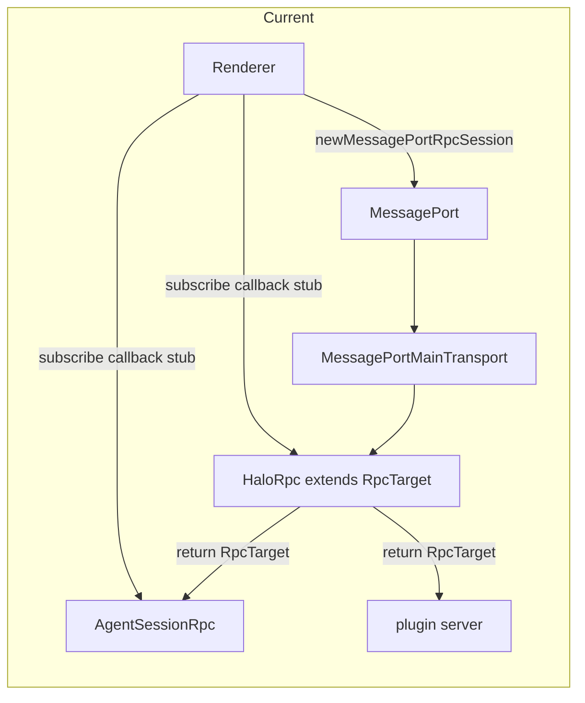
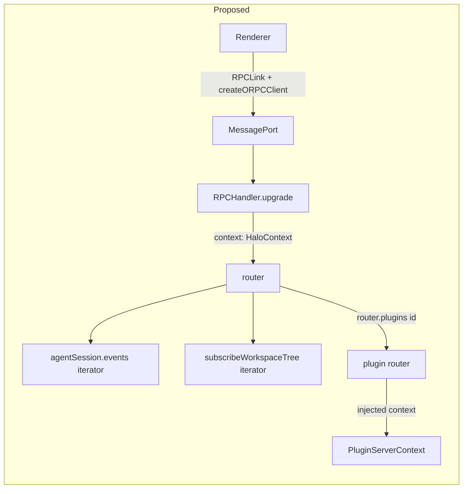
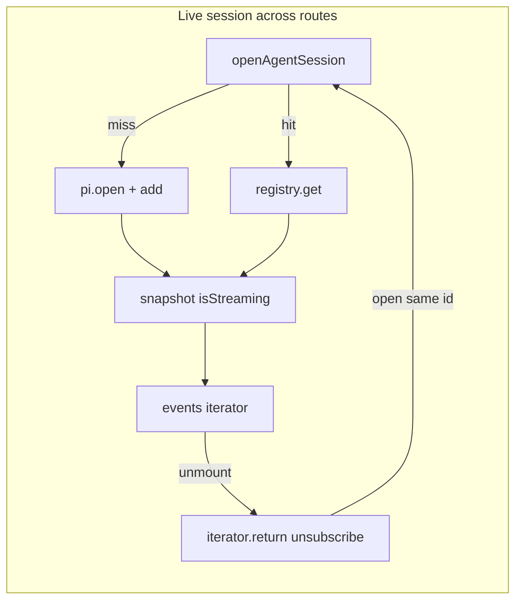

# Replace Cap'n Web with oRPC







## Problem overview

Halo talks between the Electron renderer and main process with Cap'n Web. The API is a tree of `RpcTarget` objects: `HaloRpc` on the port, live `AgentSessionRpc` objects returned from `newAgentSession` / `openAgentSession`, plugin classes nested under `getPlugin`, and renderer callbacks passed into `subscribe`. That model needs a custom `MessagePortMain` transport, `dup()` on callback stubs, and a prototype-copy wrapper so jiti-loaded plugin `RpcTarget` classes match the bundled Cap'n Web copy.

## Solution overview

Replace Cap'n Web with oRPC v2 over the same Electron MessagePort handshake. Main services live in oRPC initial context (`HaloContext`), provided at `RPCHandler.upgrade`. Procedures are a contract in `src/shared` and an implementer in main. Live session objects become `sessionId` plus procedures. The registry keeps one Pi session per id for the life of the RPC connection; route changes attach and detach the events iterator. Callbacks become `AsyncIteratorObject` streams. Plugin servers export an oRPC router; `listPlugins` writes those routers onto a mutable `plugins` map on the host router and middleware injects `PluginServerContext`.

Cap'n Web object capabilities do not carry over. Plugin classes, instances, and parent-class method walking go away. oRPC v2 is the `@beta` line on [v2.orpc.dev](https://v2.orpc.dev).

Assumption: oRPC's RPCMatcher indexes procedures when `RPCHandler` is constructed. Plugin routers live on `HaloContext.pluginRouters` (one map per MessagePort). `listPlugins` writes that map. The matcher cannot read context, so `createRouter(context)` exposes `plugins: os.lazy(() => ({ default: context.pluginRouters }))` and indexes it on the first `/plugins/...` call. Halo calls `listPlugins` before plugin RPCs, so that load sees the filled map. Lazy loads once per handler; a new MessagePort (window reload) builds a new context and handler. If a call lands before `listPlugins`, the procedure is missing and oRPC returns its normal not-found error.

Assumption: the default `RPCSerializer` is enough for Pi `AgentSessionEvent` values and plugin results. Do not turn on `experimental_transfer` unless a payload fails a round-trip.

Assumption: while `AgentSession.isStreaming` is true, `session.messages` holds the in-progress assistant as its last assistant message. Snapshot peels that message into `streamingMessage`. If the turn has started but no assistant message exists yet, `streamingMessage` is undefined and `isWorking` is still true.

## Goals

- Renderer and main keep the same MessagePort request/provide channels. Only the session on the port changes.
- Workspace, sessions list, app update, plugin list, agent prompt, and plugin views keep working through the new client.
- Main handlers read `WorkspaceService`, `PiService`, `PluginService`, `AgentSessionRegistry`, `getWindow`, and `logger` from `HaloContext`.
- Plugin servers are oRPC routers. `usePluginServer` returns a typed `RouterClient`. `PluginServerContext` is injected context.
- Agent session events and workspace tree events stream with `AsyncIteratorObject`. Cancelling the events iterator only unsubscribes. MessagePort close calls `sessions.closeAll()` and drops live Pi sessions. The renderer does not call `close` on route change.
- Opening a session that is already live in the registry reuses that Pi session and snapshots `isWorking` / `streamingMessage` from `session.isStreaming`. Navigating away and back mid-prompt still shows the stream.
- `capnweb` leaves `@halo/desktop` and `@halo/plugin-sdk`. `MessagePortMainTransport` and `HaloRpc` / `AgentSessionRpc` classes go away.

## Non-goals

- No migrations or backfills.
- No Zod. Procedure I/O uses oRPC `type<T>()`. TypeBox stays for JSON documents and the plugin manifest.
- No OpenAPI handler, no TanStack Query oRPC adapter, no `@orpc/publisher`.
- No dual Cap'n Web / oRPC session. No plugin `RpcTarget` class, instance, or superclass-method support.
- No change to Pi, workspace files, or the preload log bridge.
- Do not write in-flight streaming tokens to the session file. Pi already owns durable writes.

## Important files, docs, and websites

- [`apps/electron/src/shared/rpc.ts`](../apps/electron/src/shared/rpc.ts) — `HaloApi` / `AgentSessionApi` `RpcTarget` types and DTOs. Keep DTOs; drop the classes.
- [`apps/electron/src/main/rpc.ts`](../apps/electron/src/main/rpc.ts) — today's `HaloRpc` / `AgentSessionRpc`. Replace with an implementer router.
- [`apps/electron/src/main/MessagePortMainTransport.ts`](../apps/electron/src/main/MessagePortMainTransport.ts) — delete after the switch.
- [`apps/electron/src/main/main.ts`](../apps/electron/src/main/main.ts) — `registerRpcBridge` creates the port and attaches `HaloRpc`.
- [`apps/electron/src/main/preload.ts`](../apps/electron/src/main/preload.ts) — forwards `RPC_CHANNELS`; keep the handshake.
- [`apps/electron/src/renderer/api/HaloRpcClient.ts`](../apps/electron/src/renderer/api/HaloRpcClient.ts) — `newMessagePortRpcSession`.
- [`apps/electron/src/renderer/api/ApiProvider.tsx`](../apps/electron/src/renderer/api/ApiProvider.tsx) — queries call `HaloApi` methods and `getPlugin`.
- [`apps/electron/src/shared/AgentSessionState.ts`](../apps/electron/src/shared/AgentSessionState.ts) — feed projection; today `streamingMessage` is always undefined on open and `isWorking` lives only in React.
- [`apps/electron/src/renderer/agentSession/useAgentSession.ts`](../apps/electron/src/renderer/agentSession/useAgentSession.ts) — live stub, `subscribe`, `Symbol.dispose`. Draft waits for `agent_end` before navigate because reopen cannot show a live stream.
- [`apps/electron/src/renderer/patterns/WorkspaceFilesystem.tsx`](../apps/electron/src/renderer/patterns/WorkspaceFilesystem.tsx) — `subscribeWorkspaceTree` callback.
- [`packages/plugin-sdk/src/server.ts`](../packages/plugin-sdk/src/server.ts) — re-exports `RpcTarget`.
- [`packages/plugin-sdk/src/view.ts`](../packages/plugin-sdk/src/view.ts) — `usePluginServer<S extends RpcTarget>()`.
- [`apps/electron/src/main/plugins/loadPluginServer.ts`](../apps/electron/src/main/plugins/loadPluginServer.ts) — jiti + `instanceof RpcTarget`.
- [`apps/electron/src/main/plugins/PluginService.ts`](../apps/electron/src/main/plugins/PluginService.ts) — `wrapPluginRpc` copies methods onto a host `RpcTarget`.
- [`apps/electron/src/main/plugins/PluginService.test.ts`](../apps/electron/src/main/plugins/PluginService.test.ts) — MessagePort round-trip and loader fixtures.
- [`apps/electron/src/main/plugins/haloPluginSkill.md`](../apps/electron/src/main/plugins/haloPluginSkill.md) — seeded plugin skill.
- [`apps/electron/mainExternals.ts`](../apps/electron/mainExternals.ts) — `pluginSdkJitiDependencies` includes `capnweb`.
- [`apps/electron/src/main/copyMainProcessExternals.test.ts`](../apps/electron/src/main/copyMainProcessExternals.test.ts) — packaged jiti load of `RpcTarget`.
- [oRPC context](https://v2.orpc.dev/docs/context) — `$context` initial context and middleware-injected context.
- [oRPC contract implementation](https://v2.orpc.dev/docs/contract/implementation) — `implement(contract).$context<...>()` then `.handler` / `.router`.
- [oRPC Message Port adapter](https://v2.orpc.dev/docs/adapters/message-port) — `RPCHandler` + `RPCLink`; `upgrade` can take a per-call `context` function.
- [oRPC Electron adapter](https://v2.orpc.dev/docs/adapters/electron) — same MessagePort pieces; Halo already creates the channel in main, keep that direction.
- [AsyncIteratorObject](https://v2.orpc.dev/docs/async-iterator-object) and [client consumption](https://v2.orpc.dev/docs/client/async-iterator-object) — replace Cap'n Web callbacks.
- [oRPC `type` utility](https://v2.orpc.dev/docs/procedure#type-utility) — TypeScript-only schemas, no Zod.
- [oRPC error handling](https://v2.orpc.dev/docs/error-handling) — return `ORPCError` at the handler boundary.
- [oRPC RPC serializer](https://v2.orpc.dev/docs/rpc/serializer) — default codec already carries `Date` and `undefined`.

## Implementation

### Phase 1: Add oRPC packages and the Halo contract

Install the v2 beta packages and write the renderer/main shared contract. The app still uses Cap'n Web.

#### Important types

```ts
// apps/electron/src/shared/contract.ts
import {
  asyncIteratorObject,
  oc,
  type,
  type RouterContractClient,
} from "@orpc/contract";
import type { AgentSessionEvent } from "@mariozechner/pi-coding-agent";
import type { AgentSessionState } from "./AgentSessionState.js";
import type {
  AppInfo,
  PluginList,
  SessionSummary,
  WorkspaceInfo,
  WorkspaceTreeEvent,
} from "./rpc.js";

export const contract = {
  getAppInfo: oc.output(type<AppInfo>()),
  installAppUpdate: oc,
  getWorkspace: oc.output(type<WorkspaceInfo | undefined>()),
  chooseWorkspace: oc.output(type<WorkspaceInfo | undefined>()),
  listSessions: oc.output(type<SessionSummary[]>()),
  listWorkspacePaths: oc.output(type<string[]>()),
  listPlugins: oc.output(type<PluginList>()),
  subscribeWorkspaceTree: oc.output(
    asyncIteratorObject(type<WorkspaceTreeEvent[]>()),
  ),
  newAgentSession: oc.output(type<{ sessionId: string }>()),
  openAgentSession: oc
    .input(type<{ sessionId: string }>())
    .output(type<{ sessionId: string; state: AgentSessionState }>()),
  agentSession: {
    events: oc
      .input(type<{ sessionId: string }>())
      .output(asyncIteratorObject(type<AgentSessionEvent>())),
    prompt: oc.input(type<{ sessionId: string; text: string }>()),
    close: oc.input(type<{ sessionId: string }>()),
  },
};

export type HaloClient = RouterContractClient<typeof contract>;
```

#### Call stack diff

```diff
 renderer tsconfig includes src/shared
 shared/rpc.ts
-└── HaloApi / AgentSessionApi extends RpcTarget
+└── DTO types only
+└── shared/contract.ts
+    └── oc procedure contracts
```

#### Code diff preview

```diff
 // apps/electron/package.json
   "dependencies": {
     "capnweb": "^0.10.0",
     "@halo/plugin-sdk": "workspace:*",
+    "@orpc/client": "beta",
+    "@orpc/contract": "beta",
+    "@orpc/server": "beta",

 // packages/plugin-sdk/package.json
   "dependencies": {
     "capnweb": "^0.10.0",
+    "@orpc/client": "beta",
+    "@orpc/server": "beta",
```

Leave `capnweb` installed until the cutover so the running app still links.

- [x] Add `@orpc/server@beta`, `@orpc/client@beta`, and `@orpc/contract@beta` to `@halo/desktop`. Add `@orpc/server@beta` and `@orpc/client@beta` to `@halo/plugin-sdk`.
- [x] Add `apps/electron/src/shared/contract.ts` with the contract above. Keep DTO types in `rpc.ts`.
- [x] Export `HaloClient` as `RouterContractClient<typeof contract>` from `contract.ts`.
- [x] Run `pnpm --filter @halo/desktop typecheck` and confirm the new file typechecks. Cap'n Web code still compiles.

### Phase 2: HaloContext and data procedures

Implement the query and mutation procedures on an unused router. Handlers read services from initial context. Test them with oRPC `call` and a real `WorkspaceService`.

#### Important types

```ts
// apps/electron/src/main/router.ts
import type { BrowserWindow } from "electron";
import type { Logger } from "@repo/logger";
import type { PluginService } from "./plugins/PluginService.js";
import type { PiService } from "./pi-service.js";
import type { WorkspaceService } from "./workspace-service.js";
import type { AgentSessionRegistry } from "./AgentSessionRegistry.js";

export type HaloContext = {
  workspace: WorkspaceService;
  pi: PiService;
  plugins: PluginService;
  sessions: AgentSessionRegistry;
  getWindow: () => BrowserWindow;
  logger: Logger;
};
```

#### Call stack diff

```diff
 HaloRpc.getAppInfo / getWorkspace / listSessions / ...
-└── this.workspace / this.pi / this.plugins
+implement(contract).$context<HaloContext>()
+└── procedure.handler({ context })
+    └── context.workspace / context.pi / context.plugins
```

#### Code diff preview

```diff
 // apps/electron/src/main/orpcErrors.ts
+export const orpcErrors = {
+  badRequest(error: Error) {
+    return new ORPCError("BAD_REQUEST", {
+      message: error.message,
+      cause: error,
+    });
+  },
+  notImplemented() {
+    return new ORPCError("NOT_IMPLEMENTED");
+  },
+};

 // apps/electron/src/main/router.ts
+import { implement } from "@orpc/server";
+import { getAppInfo, installAppUpdate } from "./AppUpdate.js";
+import { orpcErrors } from "./orpcErrors.js";
+
+const os = implement(contract).$context<HaloContext>();
+
+export const router = os.router({
+  getAppInfo: os.getAppInfo.handler(({ context }) => {
+    context.logger.info({ event: "getAppInfo" });
+    return getAppInfo();
+  }),
+  listSessions: os.listSessions.handler(async ({ context }) => {
+    const sessions = await context.pi.listSessions();
+    if (sessions instanceof Error) return orpcErrors.badRequest(sessions);
+    return sessions;
+  }),
+  subscribeWorkspaceTree: os.subscribeWorkspaceTree.handler(() =>
+    orpcErrors.notImplemented(),
+  ),
+  newAgentSession: os.newAgentSession.handler(() => orpcErrors.notImplemented()),
+  openAgentSession: os.openAgentSession.handler(() =>
+    orpcErrors.notImplemented(),
+  ),
+  agentSession: {
+    events: os.agentSession.events.handler(() => orpcErrors.notImplemented()),
+    prompt: os.agentSession.prompt.handler(() => orpcErrors.notImplemented()),
+    close: os.agentSession.close.handler(() => orpcErrors.notImplemented()),
+  },
+});
```

For this phase, agent-session and tree procedures return `orpcErrors.notImplemented()`. `listPlugins` still calls `PluginService.list` and returns the DTO; it does not yet mount plugin routers.

`chooseWorkspace` keeps `dialog.showOpenDialog(context.getWindow(), ...)`. Convert a returned tagged error with `orpcErrors.badRequest`. Do not add retries or extra guards.

- [x] Add `HaloContext` and a module-level `router` in `apps/electron/src/main/router.ts`. Put `AgentSessionRegistry` in as an empty class with `get` / `add` / `close` / `closeAll` no-ops if the session procedures are stubs.
- [x] Move the bodies of `HaloRpc` data methods into the matching handlers. Keep `HaloRpc` working for the live app.
- [x] Add `apps/electron/src/main/orpcErrors.ts`. Handlers return `orpcErrors.badRequest(error)` or `orpcErrors.notImplemented()`.
- [x] Run `pnpm --filter @halo/desktop typecheck`.

### Phase 3: Agent sessions and workspace tree as iterators

Own live Pi sessions in `AgentSessionRegistry` (one registry per RPC connection). Stream Pi events and tree events as async generators. `PiService` stays the same.

#### Important types

```ts
// apps/electron/src/main/AgentSessionRegistry.ts
import type { AgentSession } from "@mariozechner/pi-coding-agent";

export class SessionNotOpenError extends errore.createTaggedError({
  name: "SessionNotOpenError",
  message: "Agent session '$sessionId' is not open.",
}) {}

export class AgentSessionRegistry {
  private readonly sessions = new Map<string, AgentSession>();

  add(session: AgentSession): void;
  get(sessionId: string): SessionNotOpenError | AgentSession;
  close(sessionId: string): SessionNotOpenError | undefined;
  closeAll(): void;
}
```

#### Call stack diff

```diff
 renderer useAgentSession
-└── api.openAgentSession(id) -> { session: AgentSessionRpc, state }
-    └── session.subscribe(callback.dup())
-    └── session.prompt(text)
-    └── session[Symbol.dispose]()  // aborts the run
+└── client.openAgentSession({ sessionId }) -> { sessionId, state }
+    └── registry hit: snapshot live Pi session (isStreaming)
+    └── registry miss: pi.open + add, then snapshot
+    └── client.agentSession.events({ sessionId })
+        └── for await (event of iterator)
+    └── client.agentSession.prompt({ sessionId, text })
+    └── unmount: iterator.return()  // unsubscribe only
+└── port close: sessions.closeAll()  // abort + dispose

 renderer WorkspaceFilesystem
-└── api.subscribeWorkspaceTree(callback)
+└── for await (events of await client.subscribeWorkspaceTree())
```

#### Code diff preview

```diff
 // apps/electron/src/main/router.ts
   newAgentSession: os.newAgentSession.handler(async ({ context }) => {
     const session = await context.pi.newAgentSession();
     if (session instanceof Error) return orpcErrors.badRequest(session);
+    context.sessions.add(session);
+    return { sessionId: session.sessionId };
   }),

   agentSession: {
     events: os.agentSession.events.handler(async function* ({
       input,
       context,
       signal,
     }) {
+      const session = context.sessions.get(input.sessionId);
+      if (session instanceof Error) return orpcErrors.badRequest(session);
+      const queue = new AsyncEventQueue<AgentSessionEvent>();
+      const unsubscribe = session.subscribe((event) => queue.push(event));
+      try {
+        while (signal === undefined || !signal.aborted) {
+          yield await queue.next(signal);
+        }
+      } finally {
+        unsubscribe();
+      }
     }),
   }

   subscribeWorkspaceTree: os.subscribeWorkspaceTree.handler(
     async function* ({ context, signal }) {
+      const queue = new AsyncEventQueue<WorkspaceTreeEvent[]>();
+      context.workspace.setTreeListener((events) => queue.push(events));
+      try {
+        while (signal === undefined || !signal.aborted) {
+          yield await queue.next(signal);
+        }
+      } finally {
+        context.workspace.setTreeListener(undefined);
+      }
     },
   );
```

Keep one tree listener, matching `HaloRpc` today. The events handler subscribes locally and unsubscribes in `finally`. `AgentSessionRegistry.close` aborts and `dispose`s the Pi session. `prompt` awaits Pi's `prompt()` and rejects empty text with `EmptyPromptError` converted through `orpcErrors.badRequest`.

`newAgentSession` returns `{ sessionId }` immediately. It no longer exposes `getSessionId`. This phase still always `pi.open` / `add` on `openAgentSession`. Reuse of a live registry entry and a streaming snapshot land in phase 4, when the renderer stops disposing on unmount.

- [x] Implement `AgentSessionRegistry` and a small async queue used by both generators. Put cleanup in `finally`.
- [x] Implement `newAgentSession`, `openAgentSession`, `agentSession.events` / `prompt` / `close`, and `subscribeWorkspaceTree`.
- [x] Run `pnpm --filter @halo/desktop typecheck`.

### Phase 4: Cut over MessagePort, plugins, and the renderer

Switch the live session from Cap'n Web to oRPC. Change the plugin SDK and loader in the same commit so the app never runs with mixed RPC models.

Plugin servers export a router. `listPlugins` writes `router.plugins[id]`. Middleware injects `PluginServerContext` and converts a returned `Error` to `ORPCError`.

#### Important types

```ts
// packages/plugin-sdk/src/server.ts
import { os } from "@orpc/server";

export { os, type } from "@orpc/server";

export type PluginServerContext = {
  pluginId: string;
  workspaceRoot: string;
};

export const pluginOs = os.$context<PluginServerContext>();

// packages/plugin-sdk/src/view.ts
import type { RouterClient } from "@orpc/server";

export type PluginRuntimeValue = {
  pluginId: string;
  server?: RouterClient<AnyRouter>;
};

export function usePluginServer<T extends AnyRouter>(): RouterClient<T>;

// apps/electron/src/shared/contract.ts (client widening)
export type HaloClient = RouterContractClient<typeof contract> & {
  plugins: Record<string, RouterClient<AnyRouter>>;
};

// apps/electron/src/shared/AgentSessionState.ts
export type AgentSessionState = {
  messages: AgentMessage[];
  streamingMessage: AgentMessage | undefined;
  error: string | undefined;
  isWorking: boolean;
};

export function agentSessionStateFromSession(session: {
  messages: AgentMessage[];
  isStreaming: boolean;
}): AgentSessionState;
```

#### Call stack diff

```diff
 registerRpcBridge
-└── new MessageChannelMain
-    └── newMessagePortMainRpcSession(port1, new HaloRpc(...))
-    └── frame.postMessage(provideRpc, null, [port2])
+└── new MessageChannelMain
+    └── RPCHandler(router).upgrade(port1, { context })
+    └── frame.postMessage(provideRpc, null, [port2])

 connectHaloRpc
-└── newMessagePortRpcSession<HaloApi>(port)
+└── RPCLink({ port })
+    └── createORPCClient(link) as HaloClient

 PluginService.list
-└── loadPluginServer -> instanceof RpcTarget
-    └── wrapPluginRpc copies methods, throws returned Error
-└── HaloRpc.getPlugin returns RpcTarget
+└── loadPluginServer -> default | router export (plain object)
+    └── mountPluginRouter injects PluginServerContext
+    └── plugins[id] = mounted router
+└── client.plugins[id].ping()

 useAgentSession / WorkspaceFilesystem / ApiProvider
-└── HaloApiStub RpcStub methods
+└── HaloClient procedures and iterators

 openAgentSession
-└── always PiService.openAgentSession + add
-└── state.streamingMessage = undefined, isWorking = false
+└── registry.get(id) if live, else pi.open + add
+└── agentSessionStateFromSession({ messages, isStreaming })

 useAgentSession unmount
-└── session[Symbol.dispose] / close  // aborts Pi
+└── events iterator.return()  // unsubscribe only

 useDraftAgentSession
-└── wait for agent_end, then getSessionId, then navigate
+└── newAgentSession -> { sessionId }, navigate immediately
+└── SavedPane openAgentSession reuses the live registry entry
```

#### Code diff preview

```diff
 // apps/electron/src/main/main.ts
-    newMessagePortMainRpcSession(
-      port1,
-      new HaloRpc(workspaceService, piService, pluginService, getWindow, rpcLogger),
-    );
+    const handler = new RPCHandler(router, {
+      interceptors: [onError((error) => rpcLogger.warn({ event: "orpc", error }))],
+    });
+    const sessions = new AgentSessionRegistry();
+    handler.upgrade(port1, {
+      context: () => ({
+        workspace: workspaceService,
+        pi: piService,
+        plugins: pluginService,
+        sessions,
+        getWindow,
+        logger: rpcLogger,
+      }),
+    });
+    port1.start();
+    port1.on("close", () => sessions.closeAll());

 // apps/electron/src/renderer/api/HaloRpcClient.ts
-import { newMessagePortRpcSession, type RpcStub } from "capnweb";
-export async function connectHaloRpc(): Promise<HaloApiStub> {
-  const port = await requestRpcPort();
-  return newMessagePortRpcSession<HaloApi>(port);
-}
+import { createORPCClient } from "@orpc/client";
+import { RPCLink } from "@orpc/client/message-port";
+import type { HaloClient } from "../../shared/contract.js";
+export async function connectHaloRpc(): Promise<HaloClient> {
+  const port = await requestRpcPort();
+  const link = new RPCLink({ port });
+  port.start();
+  return createORPCClient(link);
+}

 // plugin server (skill + tests)
-export default class PingServer extends RpcTarget {
-  constructor(private readonly ctx: PluginServerContext) { super(); }
-  ping() { return { pluginId: this.ctx.pluginId }; }
-}
+const plugin = pluginOs;
+export default {
+  ping: plugin.handler(async ({ context }) => ({
+    pluginId: context.pluginId,
+  })),
+};

 // apps/electron/src/main/router.ts
   openAgentSession: os.openAgentSession.handler(async ({ input, context }) => {
+    const live = context.sessions.get(input.sessionId);
+    if (live instanceof Error) {
       const session = await context.pi.openAgentSession(input.sessionId);
       if (session instanceof Error) return orpcErrors.badRequest(session);
       context.sessions.add(session);
       return {
         sessionId: session.sessionId,
         state: agentSessionStateFromSession({
           messages: session.messages,
           isStreaming: session.isStreaming,
         }),
       };
+    }
+    return {
+      sessionId: live.sessionId,
+      state: agentSessionStateFromSession({
+        messages: live.messages,
+        isStreaming: live.isStreaming,
+      }),
+    };
   }),

 // apps/electron/src/shared/AgentSessionState.ts
   export function applyAgentSessionEvent(state, event) {
+    case "agent_start":
+      return { ...state, isWorking: true };
+    case "agent_end":
+      return { ...state, isWorking: false };
   }

   export function agentSessionStateFromSession(session) {
+    if (session.isStreaming) {
+      const messages = session.messages.slice();
+      const last = messages.at(-1);
+      if (last !== undefined && last.role === "assistant") {
+        messages.pop();
+        return { messages, streamingMessage: last, error: undefined, isWorking: true };
+      }
+      return { messages, streamingMessage: undefined, error: undefined, isWorking: true };
+    }
     return {
       messages: session.messages,
       streamingMessage: undefined,
       error: errorFromLastAssistantMessage(session.messages),
+      isWorking: false,
     };
   }
```

`createHaloContext` allocates `pluginRouters: {}` on the per-port `HaloContext`. `createRouter(context)` is a plain object of `os.<procedure>.handler(...)` plus `plugins: orpc.lazy(() => ({ default: context.pluginRouters }))`. Do not wrap that object in `os.router()`; that hides extra keys behind the contract. `listPlugins` clears `context.pluginRouters` and assigns `context.pluginRouters[id] = mountPluginRouter(...)`. Do not replace the `pluginRouters` object. Pass the same context object to `createRouter` and `RPCHandler.upgrade`.

`loadPluginServer` accepts `default` or named `router` / `Server` if the value is a plain router object (nested objects of procedures). A function or class is a load error: `server must export an oRPC router`. Drop instance exports and `instanceof RpcTarget`. Detect procedures with oRPC `isProcedure` (or the equivalent public helper in `@orpc/server`).

`mountPluginRouter` wraps with `$context<HaloContext>()`, injects `{ pluginId, workspaceRoot }`, and if `next()` returns an `Error` that is not already an `ORPCError`, returns `new ORPCError("PLUGIN_ERROR", { message, cause })`.

Renderer: `usePluginsQuery` sets `servers[id] = api.plugins[id]` with no await. `useAgentSession` uses `openAgentSession` + `events` + `prompt`. Effect cleanup calls `iterator.return()`, not `close`. `isWorking` comes from `state.isWorking`; drop the parallel React flag. `useDraftAgentSession` calls `newAgentSession`, starts `events` / `prompt`, and navigates with that `sessionId` without waiting for `agent_end`. `WorkspaceFilesystem` consumes the tree iterator and calls `return()` on cleanup. `agentSession.close` stays on the contract for explicit teardown; the renderer does not call it on route change. Port close still runs `sessions.closeAll()`.

Delete `MessagePortMainTransport.ts`, `HaloRpc`, `AgentSessionRpc`, `RpcTarget` exports, and the `capnweb` dependency. Replace `capnweb` in `pluginSdkJitiDependencies` with `@orpc/server` (copy the package closure). Update `haloPluginSkill.md` and the copy-externals test to load `os` / `pluginOs` instead of `RpcTarget`.

Keep `RPC_CHANNELS` and the main-created `MessageChannelMain`. oRPC's Electron doc sends the port from the renderer; Halo already does the reverse and that stays.

- [x] Switch main, preload comment, renderer client, `ApiProvider`, agent-session hooks, filesystem subscribe, `App` / `Sidebar` / `MainPane` plugin server types, plugin SDK, loader, `PluginService`, skill, externals, and tests in this commit.
- [x] Reuse a live registry session in `openAgentSession`. Snapshot with `agentSessionStateFromSession({ messages, isStreaming })`. Put `isWorking` on `AgentSessionState` and fold `agent_start` / `agent_end` in `applyAgentSessionEvent`.
- [x] `useAgentSession` unmount cancels the events iterator only. Draft navigates as soon as it has `sessionId`.
- [x] Rewrite `PluginService.test.ts` fixtures to export oRPC routers. Keep the MessagePort round-trip: `RPCHandler.upgrade(port1)` + `RPCLink` on `port2` + `createORPCClient`. Assert `client.plugins.calendar.ping()` returns `{ pluginId: "calendar" }`, `fail()` rejects, and `client.plugins.missing.ping()` rejects.
- [x] Rewrite loader tests: named `router` / `Server` object exports succeed; a class or function export records a load error matching `must export an oRPC router`.
- [ ] Smoke the running app: `pnpm halo-web status`, then `pnpm halo-web exec` that `sessions-shell` is visible and Calendar is in the snapshot. Prompt, leave the session, return while it is still working, and check the transcript still streams. Do not commit this check.
- [x] Run `pnpm run check-affected`.

Plugin ids must not be oRPC reserved router keys (`then`, `bind`, `valueOf`, `toString`, `toJSON`). Folder names in `.halo/plugins` already avoid those.

## Testing

Until phase 4, checks are typecheck only. Phase 4 commits the MessagePort plugin round-trip (the package-level stand-in for Cap'n Web's current test) and relies on `pnpm run check-affected`.

Do not mock `PiService` or `PluginService`. Do not add `vi.fn`. Drive the live Halo window with `pnpm halo-web` as an uncommitted smoke step after the cutover.

```sh
pnpm --filter @halo/desktop typecheck
pnpm --filter @halo/desktop test
pnpm run check-affected
pnpm halo-web status
pnpm halo-web exec "return await page.getByTestId('sessions-shell').isVisible()"
```
