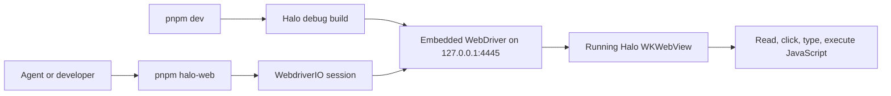
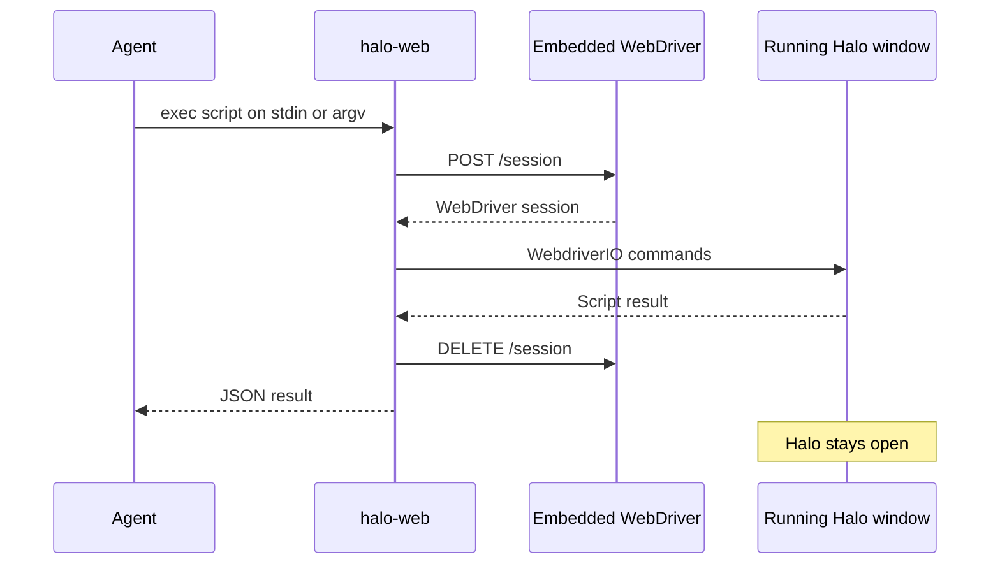

# Running app WebDriver CLI





## Problem overview

An agent can edit Halo's files and start the app, but it cannot inspect or act on the web page inside the running desktop window. Browser tools cannot attach to a macOS `WKWebView`, and Tauri's direct `tauri-driver` path does not support macOS.

Tauri now points to WebdriverIO's embedded WebDriver plugin for this case. The plugin runs a standard WebDriver HTTP server inside a debug build and supports macOS, Windows, and Linux.

## Solution overview

Add `tauri-plugin-wdio-webdriver` to debug builds of Halo and bind its embedded server to `127.0.0.1:4445`. A new `halo-web` workspace CLI will connect to that server with WebdriverIO's standalone `remote()` client. It will attach to Halo after `pnpm dev` has started it; it will not build, launch, restart, or stop the app.

The first CLI surface will stay small: `status` checks that the debug server is ready, and `exec` runs an async JavaScript function body with a WebdriverIO `browser` value in scope. This gives agents the full WebdriverIO element API without adding one CLI command per browser action.

Example use after `pnpm dev`:

```sh
pnpm halo-web status
pnpm halo-web exec 'return await browser.$("body").getText()'
pnpm halo-web exec 'await browser.$("button=New session").click()'
printf 'await browser.$("textarea").setValue("Hello")' | pnpm halo-web exec --stdin
```

## Goals

- Attach to the Halo webview that is already running under `pnpm dev` on macOS.
- Let an agent use WebdriverIO to read the DOM, find elements, click, type, run JavaScript, and take screenshots.
- Accept short scripts as an argument and longer scripts on standard input.
- Print one machine-readable JSON value to standard output and send faults to standard error with a nonzero exit code.
- Close only the WebDriver session after each command and leave the Halo process and window open.
- Keep the WebDriver HTTP server out of release builds and bound to localhost.

## Non-goals

- Do not let the CLI launch, build, restart, or stop Halo.
- Do not ship WebDriver support in release builds.
- Do not add `tauri-plugin-wdio`, command mocking, Tauri IPC execution helpers, or log capture. Basic WebDriver page access does not need them.
- Do not add named `click`, `type`, `text`, or `screenshot` subcommands; `exec` already exposes those WebdriverIO calls.
- Do not add a long-running daemon, stored session IDs, remote hosts, port configuration, multi-app discovery, or support for non-Tauri apps.
- Do not treat WebDriver as an end-user feature or expose it through Halo's UI.

## Important files, docs, and websites

- [`apps/halo/src-tauri/src/lib.rs`](../apps/halo/src-tauri/src/lib.rs) — Builds the Tauri app and is the registration point for the debug-only embedded WebDriver plugin.
- [`apps/halo/src-tauri/Cargo.toml`](../apps/halo/src-tauri/Cargo.toml) — Will hold the debug-only Rust plugin dependency.
- [`apps/halo/src-tauri/capabilities/default.json`](../apps/halo/src-tauri/capabilities/default.json) — Will load the WebDriver plugin ACL manifest for the `main` window.
- [`package.json`](../package.json) — Will expose the root `pnpm halo-web` command.
- `packages/halo-web-cli/package.json` — New private workspace package for the CLI, WebdriverIO, Vitest, and checks.
- `packages/halo-web-cli/src/cli.ts` — New process entry point that parses commands and owns stdout, stderr, and exit codes.
- `packages/halo-web-cli/src/webdriver.ts` — New WebDriver connection and script execution code.
- `packages/halo-web-cli/src/webdriver.test.ts` — New focused tests for results and session cleanup.
- [Tauri WebDriver guide](https://v2.tauri.app/develop/tests/webdriver/) — Recommends WebdriverIO's embedded provider for macOS and notes that direct `tauri-driver` supports only Windows and Linux.
- [Embedded plugin README](https://github.com/webdriverio/desktop-mobile/tree/main/packages/tauri-plugin-webdriver) — Documents standalone `remote()` use, the localhost binding, the default port, supported endpoints, and debug-only setup.
- [WebdriverIO Tauri plugin setup](https://webdriver.io/docs/desktop-testing/tauri/plugin-setup/) — Documents the two distinct Tauri plugins and the embedded server lifecycle.
- [WebdriverIO API](https://webdriver.io/docs/api/) — Defines the `browser`, element, script, action, source, and screenshot calls exposed to `exec` scripts.

## Implementation

### Phase 1: Expose the running debug webview through WebDriver

Register WebdriverIO's embedded server only in debug builds. After this commit, `pnpm dev` will start Halo as it does now and also make the `main` webview available through the W3C WebDriver endpoint at `127.0.0.1:4445`.

#### Important types

```rust
// apps/halo/src-tauri/src/lib.rs
#[cfg(debug_assertions)]
fn add_development_plugins<R: tauri::Runtime>(
    builder: tauri::Builder<R>,
) -> tauri::Builder<R>;
```

The helper name is illustrative; keep the code inline if the generic signature adds more code than the one conditional registration needs.

#### Call stack diff

```diff
 run
-├── tauri::Builder::default
+├── tauri::Builder::default
+├── debug build: tauri_plugin_wdio_webdriver::init
+│   └── listen on 127.0.0.1:4445
 ├── setup HaloState
 ├── register Halo commands
 └── run Tauri event loop
```

#### Code diff preview

```diff
 // apps/halo/src-tauri/src/lib.rs
 pub fn run() {
     load_development_env().expect("could not load Halo's development environment");

-    let app = tauri::Builder::default()
+    let builder = tauri::Builder::default();
+    #[cfg(debug_assertions)]
+    let builder = builder.plugin(tauri_plugin_wdio_webdriver::init());
+
+    let app = builder
         .setup(|app| {
             ...
         })
```

- [ ] Add `tauri-plugin-wdio-webdriver = "1"` under `[target.'cfg(debug_assertions)'.dependencies]` in `apps/halo/src-tauri/Cargo.toml`; do not add `tauri-plugin-wdio`.
- [ ] Register `tauri_plugin_wdio_webdriver::init()` before Halo's existing setup in `apps/halo/src-tauri/src/lib.rs`, guarded by `cfg(debug_assertions)` so release builds contain no HTTP automation server.
- [ ] Add `wdio-webdriver:default` to `apps/halo/src-tauri/capabilities/default.json`; keep the server's documented `127.0.0.1:4445` default and add no app setting or fallback port.
- [ ] Run `cargo check --manifest-path apps/halo/src-tauri/Cargo.toml`, build a release once to prove the plugin is absent there, and start `pnpm dev` to confirm `GET http://127.0.0.1:4445/status` reports ready.

### Phase 2: Add the `halo-web` attach CLI

Add a private Node workspace package that talks straight to the embedded W3C endpoint. After this commit, an agent can run one async WebdriverIO script against the live page and receive a JSON result while Halo keeps running.

#### Important types

```ts
// packages/halo-web-cli/src/webdriver.ts
import type { Browser } from "webdriverio";

type Command =
  | { name: "status" }
  | { name: "exec"; source: string };

type CommandResult =
  | { ok: true; result: unknown }
  | { ok: false; error: string };

type BrowserScript = (browser: Browser) => Promise<unknown>;
```

#### Call stack diff

```diff
+pnpm halo-web
+└── packages/halo-web-cli/src/cli.ts
+    ├── status
+    │   └── GET 127.0.0.1:4445/status
+    └── exec
+        ├── webdriverio.remote
+        │   └── POST 127.0.0.1:4445/session
+        ├── AsyncFunction(browser, source)
+        │   └── WebdriverIO browser and element commands
+        ├── print JSON result
+        └── browser.deleteSession
```

#### Code diff preview

```diff
 // packages/halo-web-cli/src/webdriver.ts
+import { remote } from "webdriverio";
+
+const WEBDRIVER_HOST = "127.0.0.1";
+const WEBDRIVER_PORT = 4445;
+const AsyncFunction = Object.getPrototypeOf(async function () {}).constructor;
+
+export async function execute(source: string): Promise<unknown> {
+  const browser = await remote({
+    hostname: WEBDRIVER_HOST,
+    port: WEBDRIVER_PORT,
+    capabilities: {},
+  });
+  try {
+    const script = new AsyncFunction("browser", source) as BrowserScript;
+    return await script(browser);
+  } finally {
+    await browser.deleteSession();
+  }
+}
```

- [ ] Create `packages/halo-web-cli` with strict Node ESM TypeScript, `webdriverio`, `vitest`, `tsx`, `@types/node`, and the same lint, format, typecheck, and test scripts used by the workspace.
- [ ] Add `status` and `exec` parsing in `src/cli.ts`; require exactly one script argument or `--stdin`, reject empty input, and keep JSON data on stdout while errors go to stderr with a nonzero exit code.
- [ ] Add `src/webdriver.ts` with the fixed localhost endpoint, `remote({ capabilities: {} })`, an async function body with `browser` in scope, JSON-safe result output, and `deleteSession()` in `finally`; do not start or kill the app process.
- [ ] Add Vitest coverage that mocks `remote()`, proves a script can call the supplied browser, checks JSON output, and proves `deleteSession()` runs after both success and a script fault. Add a live smoke script or documented check that runs `status`, reads `body` text, clicks one harmless control, and then confirms Halo is still open.
- [ ] Add the root `halo-web` script and a short README section with the four examples above; run `pnpm --filter @halo/web-cli test`, `pnpm --filter @halo/web-cli typecheck`, and `pnpm run check`.
