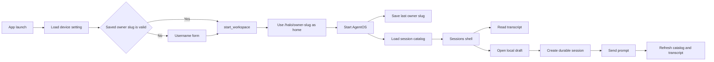
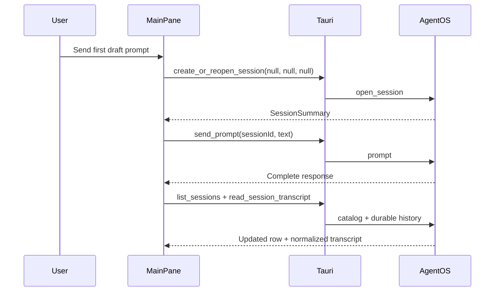

# Sessions UI

## System flow





## Problem overview

Halo now presents AgentOS as a developer dashboard. Saved sessions, raw history, file checks, model settings, and status tools compete for space, and session history appears as JSON instead of a chat.

Halo also starts AgentOS before it knows the username and uses `/home/agentos`. That breaks the workspace rules: Halo must get a valid username first, treat it as the owner slug, and use `/halo/<owner-slug>/` as both the workspace root and the user's home directory.

## Solution overview

Replace the dashboard with a full-height Maui sessions shell. Its sidebar lists durable sessions and opens a local blank draft; its main pane shows a readable transcript and a prompt editor.

Keep a new session local until its first send. That send creates the AgentOS session, waits for the full reply, then reloads the catalog and normalized transcript. Before any session command can run, use the last valid username saved on this device or ask for one, then start AgentOS with its owner-slug workspace path.

## Goals

- Ask for a username before the first workspace start, or when the saved device setting is missing, invalid, or cannot start.
- Reopen the last successful username and workspace after the app restarts.
- Show saved sessions in a Maui sidebar, newest first, with clear selection and run state.
- Let the user select a session and read ordered user and assistant text.
- Let the user open a blank draft and send its first prompt.
- Turn a draft into a selected durable session only when the first prompt is sent.
- Keep loading, empty, sending, partial-history, and error states local to the session pane.
- Keep other session rows usable while a prompt or transcript request runs.
- Use Maui components, tokens, focus styles, and two-pane layout rules.

## Non-goals

- No streamed messages, AgentOS event subscription, or partial reply UI.
- No rename, delete, archive, search, pagination controls, routes, or deep links.
- No rich tool, thought, plan, image, audio, or permission views; show user and assistant text only.
- No provider or model picker in the sessions shell; keep backend default selection.
- No workspace switcher or multi-workspace picker in the sessions shell.
- No file browser, developer proof controls, or saved prompt drafts.
- No migrations or backfills. Do not copy old `/home/agentos` files.

## Important files, docs, and websites

- [`AGENTS.md`](../AGENTS.md) — Defines the username, owner slug, workspace layout, storage, and writing rules.
- [`README.md`](../README.md) — Describes the one-VM, one-database model and project checks.
- [`apps/halo/src/App.tsx`](../apps/halo/src/App.tsx) — Holds the current dashboard, startup polling, session catalog, raw history, and prompt flow that this work replaces.
- [`apps/halo/src/main.tsx`](../apps/halo/src/main.tsx) — Wraps the app in `QueryClientProvider` and `MauiProvider`.
- [`apps/halo/src/styles.css`](../apps/halo/src/styles.css) — Sets root height and base element styles.
- [`apps/halo/src/maui.d.ts`](../apps/halo/src/maui.d.ts) — Shadows Maui types and must cover each new public Maui import.
- [`apps/halo/src-tauri/src/lib.rs`](../apps/halo/src-tauri/src/lib.rs) — Starts AgentOS during Tauri setup and registers the command surface.
- [`apps/halo/src-tauri/src/agentos_service/`](../apps/halo/src-tauri/src/agentos_service/) — Splits AgentOS lifecycle, workspace, provider, session, prompt, transcript, and Rust test code by concern.
- `apps/halo/src-tauri/src/device_settings.rs` — New device-only JSON settings helper for the last successful username, stored as an owner slug; it must not write workspace state or AgentOS tables.
- [`apps/halo/package.json`](../apps/halo/package.json) — Owns frontend build, typecheck, lint, and format commands.
- [`apps/halo/node_modules/maui/src/patterns/Sidebar.tsx`](../apps/halo/node_modules/maui/src/patterns/Sidebar.tsx) — Defines the public `Sidebar`, `SidebarSection`, and `SidebarItem` API and its 240px width.
- [`apps/halo/node_modules/maui/src/pages/SidebarPage.tsx`](../apps/halo/node_modules/maui/src/pages/SidebarPage.tsx) — Shows Maui's two-pane sidebar grid.
- [`apps/halo/node_modules/maui/src/apps/EmailClient/EmailClient.tsx`](../apps/halo/node_modules/maui/src/apps/EmailClient/EmailClient.tsx) — Shows scroll ownership, `minWidth: 0`, and pane overflow rules.
- [`apps/halo/node_modules/maui/src/patterns/MessageList.tsx`](../apps/halo/node_modules/maui/src/patterns/MessageList.tsx) — Supplies message-feed markup and tokens to copy into Halo; Maui does not export it.
- `agentos-client 0.2.15/src/session.rs` in the local Cargo registry — Defines `DurableSessionEvent`, `DurableSessionEventEntry`, `ContentBlock`, and `HistoryPage`.

## Implementation

### Phase 1: Gate AgentOS startup on a valid owner slug

Make the backend idle after Tauri setup and add one command that starts it with a checked workspace layout. After this commit, no workspace command can run before Halo receives a safe username as its owner slug.

#### Important types

```rust
// apps/halo/src-tauri/src/agentos_service/workspace.rs
struct WorkspaceLayout {
    root: String,
    pi_config_dir: String,
    pi_settings_path: String,
}

// apps/halo/src-tauri/src/agentos_service/mod.rs
enum ServiceState {
    NotStarted,
    Starting,
    Ready { os: AgentOs, layout: WorkspaceLayout },
    Failed(String),
    Stopped,
}
```

#### Call stack diff

```diff
 run
 └── Tauri setup
-    ├── AgentOsService::new -> Starting
-    └── spawn AgentOsService::initialize
-        └── AgentOsService::start
+    ├── AgentOsService::new -> NotStarted
+    └── store StartupConfig in HaloState

+start_workspace command
+├── WorkspaceLayout::new(owner_slug)
+└── AgentOsService::initialize(layout, startup)
```

#### Code diff preview

```diff
 // apps/halo/src-tauri/src/lib.rs
 struct HaloState {
     agentos: Arc<AgentOsService>,
+    startup: StartupConfig,
 }

 .setup(|app| {
     let service = AgentOsService::new(&app_data_dir);
-    tauri::async_runtime::spawn(async move {
-        service.initialize(startup).await;
-    });
+    app.manage(HaloState { agentos: service, startup });
     Ok(())
 })
```

- [x] Add `WorkspaceLayout::new(owner_slug)` with a clear length cap and allow only non-empty ASCII letters, numbers, `-`, and `_`; derive `/halo/<owner-slug>/` and Pi settings paths.
- [x] Start `AgentOsService` in `NotStarted`, keep `StartupConfig` in `HaloState`, and remove the background `initialize` call from Tauri `setup`.
- [x] Add and register `start_workspace(owner_slug)` so one caller can move `NotStarted` through `Starting` to `Ready`, while repeat or concurrent starts return a clear error.
- [x] Make `ready()` and every existing workspace command return “start a workspace first” while idle, without reading AgentOS SQLite tables.
- [x] Add Rust tests for idle commands and owner slugs that are empty, non-ASCII, too long, contain a slash, or contain `..`; run `cargo test --manifest-path apps/halo/src-tauri/Cargo.toml`.

### Phase 2: Apply the selected workspace home to files and sessions

Use the chosen root for all VM paths once AgentOS starts. This commit makes the workspace root the Unix home, puts Pi settings and user files there, and proves that the SQLite file restores them.

#### Important types

```rust
// apps/halo/src-tauri/src/agentos_service/mod.rs
#[derive(Serialize)]
#[serde(rename_all = "camelCase")]
struct HealthStatus {
    status: &'static str,
    workspace_root: String,
    database_path: String,
    // existing credential and sidecar fields remain
}
```

#### Call stack diff

```diff
 create_or_reopen_session
-├── write_pi_settings(WORKSPACE_ROOT constants)
-└── open_session(HOME = WORKSPACE_ROOT, cwd = WORKSPACE_ROOT)
+├── ready -> Ready { os, layout }
+├── write_pi_settings(os, layout.pi_settings_path)
+└── open_session(HOME = layout.root, cwd = layout.root)

 write_file | read_file | list_files
-└── validate_workspace_path(path, WORKSPACE_ROOT)
+└── validate_workspace_path(path, ready.layout.root)
```

#### Code diff preview

```diff
 // apps/halo/src-tauri/src/agentos_service/sessions.rs
-const WORKSPACE_ROOT: &str = "/home/agentos";
-const PI_SETTINGS_PATH: &str = "/home/agentos/.pi/agent/settings.json";

 let mut env = BTreeMap::new();
-env.insert("HOME".to_owned(), WORKSPACE_ROOT.to_owned());
+env.insert("HOME".to_owned(), workspace.layout.root.clone());

 os.open_session(OpenSessionInput {
-    cwd: Some(WORKSPACE_ROOT.to_owned()),
+    cwd: Some(workspace.layout.root.clone()),
     ...
 })
```

- [x] After AgentOS starts, create `layout.root` with AgentOS `mkdir`; keep Halo state, user files, and home dotfiles directly in that root, and never create `files/` or `.halo/`.
- [x] Set Pi config paths from `WorkspaceLayout`, set session `HOME` and `cwd` to `layout.root`, and make file path checks use that root.
- [x] Return the selected workspace root in health data, and remove all `/home/agentos` constants and frontend path use.
- [x] Update restart tests to use `/halo/test-owner/` and assert that a VM file and the session catalog survive a service restart with the same SQLite database.
- [x] Run `cargo test --manifest-path apps/halo/src-tauri/Cargo.toml` and ensure the tests make no model call.

### Phase 3: Remember the last successful owner slug on this device

Store only the last owner slug in Tauri's per-device app config directory. The next launch can use it before AgentOS starts, while `StartupConfig` remains process memory that Tauri rebuilds on every launch.

#### Important types

```rust
// apps/halo/src-tauri/src/device_settings.rs
#[derive(Default, Deserialize, Serialize)]
#[serde(rename_all = "camelCase")]
struct DeviceSettings {
    last_owner_slug: Option<String>,
}

#[derive(Serialize)]
#[serde(rename_all = "camelCase")]
struct StartupPreference {
    last_owner_slug: Option<String>,
}

// apps/halo/src-tauri/src/lib.rs
#[derive(Serialize)]
#[serde(rename_all = "camelCase")]
struct StartWorkspaceResult {
    health: HealthStatus,
    preference_saved: bool,
    preference_warning: Option<String>,
}
```

#### Call stack diff

```diff
 Tauri setup
 ├── build StartupConfig in memory
+├── resolved app_data_dir/device-settings.json
+└── store device_settings_path in HaloState

+get_startup_preference
+└── load_device_settings
+    └── validate saved owner slug

 start_workspace(owner_slug)
 └── AgentOsService::initialize
+    └── on success: save_device_settings(last_owner_slug)
```

#### Code diff preview

```diff
 // apps/halo/src-tauri/src/lib.rs
 struct HaloState {
     agentos: Arc<AgentOsService>,
     startup: StartupConfig,
+    device_settings_path: PathBuf,
 }

-async fn start_workspace(...) -> Result<HealthStatus, String> {
+async fn start_workspace(...) -> Result<StartWorkspaceResult, String> {
     let health = state.agentos.initialize(layout, state.startup.clone()).await?;
-    Ok(health)
+    let preference_warning = save_device_settings(
+        &state.device_settings_path,
+        &DeviceSettings { last_owner_slug: Some(owner_slug) },
+    ).err();
+    Ok(StartWorkspaceResult {
+        health,
+        preference_saved: preference_warning.is_none(),
+        preference_warning,
+    })
 }
```

- [x] Resolve `device-settings.json` under the app data directory during Tauri setup and keep that path in `HaloState`; in debug builds, `HALO_APP_DATA_DIR` moves both the database and device settings. Keep `StartupConfig` in Rust memory and rebuild it each launch.
- [x] Add `device_settings.rs` with serde load and atomic save helpers; treat a missing, corrupt, or invalid saved owner slug as no preference and validate it with `WorkspaceLayout::new` before use.
- [x] Register `get_startup_preference` as a device-only command that can run before AgentOS starts and returns only a valid `lastOwnerSlug` or null.
- [x] Save the owner slug only after AgentOS starts; do not write it to `tauri.conf.json`, AgentOS SQLite, or `/halo/<owner-slug>/`, and return a warning instead of undoing a live workspace when the device-setting write fails.
- [x] Test missing, valid, corrupt, and invalid settings, atomic replacement, failed-start retention, and save failure after startup; run `cargo test --manifest-path apps/halo/src-tauri/Cargo.toml`.

### Phase 4: Add the frontend workspace gate and typed Tauri client

Replace startup polling with an explicit frontend state machine and a small typed wrapper around Tauri calls. The app loads the session catalog only after `start_workspace` succeeds.

#### Important types

```tsx
// apps/halo/src/App.tsx
type WorkspaceState =
  | { status: "restoring" }
  | { status: "needs-owner-slug"; ownerSlug: string }
  | { status: "starting"; ownerSlug: string }
  | { status: "error"; ownerSlug: string; message: string }
  | { status: "ready"; health: WorkspaceHealth; preferenceWarning?: string };

type WorkspaceHealth = {
  workspaceRoot: string;
  status: "ready";
};

type StartupPreference = { lastOwnerSlug?: string };
```

#### Call stack diff

```diff
 App mount
-├── refresh
-│   ├── sidecar_health
-│   ├── list_workspace_files
-│   └── list_sessions
-└── start health polling interval
+└── api.getStartupPreference
+    ├── saved owner slug -> api.startWorkspace(ownerSlug)
+    │   ├── success -> api.listSessions
+    │   └── failure -> render WorkspaceStart with error
+    └── no valid owner slug -> render WorkspaceStart
+        └── submit(ownerSlug)
+            └── api.startWorkspace(ownerSlug)
```

#### Code diff preview

```diff
 // apps/halo/src/App.tsx
 export function App() {
-  const [health, setHealth] = useState<HealthStatus>();
-  useEffect(() => void refresh(), [refresh]);
+  const [workspace, setWorkspace] = useState<WorkspaceState>({
+    status: "restoring",
+  });
+  useEffect(() => {
+    void restoreLastWorkspace().then(setWorkspace);
+  }, []);

-  return (
-    <main className={classes.app}>
-      ...
-    </main>
-  );
+  if (workspace.status !== "ready") {
+    return <WorkspaceStart state={workspace} onStart={startWorkspace} />;
+  }
+  return <WorkspaceReady health={workspace.health} sessions={sessions} />;
 }
```

- [x] Keep the frontend dependency set unchanged; smoke-test the workspace gate through the running Tauri app with `halo-web` instead of adding jsdom or browser unit-test packages.
- [x] Put shared Tauri DTOs and the `SystemApi` contract in `apps/halo/src/api/SystemApi.ts`, then implement the commands in `apps/halo/src/api/tauri.ts`.
- [x] Build an accessible Maui `WorkspaceStart` form labeled “Username” that submits on Enter, disables only during startup, keeps the username after failure, and places the error by the field.
- [x] On mount, auto-start a valid saved owner slug; show `WorkspaceStart` when none exists or restore fails, then enter a minimal ready view and load the catalog after success.
- [x] Run `pnpm --filter @halo/desktop typecheck`; use `halo-web` to check that first launch asks for a username, the next launch restores it, and a bad username keeps the form and shows its error by the field.

### Phase 5: Normalize AgentOS history into transcript DTOs

Convert typed AgentOS history in Rust, where the event variants are known, instead of sending raw JSON to React. Keep page flags so the UI can say when the first 500 events do not hold the full transcript.

#### Important types

```rust
// apps/halo/src-tauri/src/agentos_service/sessions.rs
#[derive(Serialize, PartialEq)]
#[serde(rename_all = "lowercase")]
enum MessageRole { User, Assistant }

#[derive(Serialize, PartialEq)]
#[serde(rename_all = "camelCase")]
struct SessionMessage { id: String, role: MessageRole, text: String, timestamp: String }

#[derive(Serialize, PartialEq)]
#[serde(rename_all = "camelCase")]
struct SessionTranscript { messages: Vec<SessionMessage>, has_more_before: bool, has_more_after: bool }
```

#### Call stack diff

```diff
-read_session_history(session_id)
-└── AgentOsService::read_history
-    ├── AgentOs::read_history -> HistoryPage
-    └── serialize each event -> Vec<Value>
+read_session_transcript(session_id)
+└── AgentOsService::read_transcript
+    ├── AgentOs::read_history -> HistoryPage
+    └── build_transcript(page) -> SessionTranscript
```

#### Code diff preview

```diff
 // apps/halo/src-tauri/src/lib.rs
 #[tauri::command]
-async fn read_session_history(
+async fn read_session_transcript(
     state: State<'_, HaloState>,
     session_id: String,
-) -> Result<Vec<Value>, String> {
-    state.agentos.read_history(&session_id).await
+) -> Result<SessionTranscript, String> {
+    state.agentos.read_transcript(&session_id).await
 }
```

- [x] Replace `read_session_history -> Vec<Value>` with `read_session_transcript -> SessionTranscript` and pass `HistoryPage` into a pure `build_transcript` function.
- [x] Accept only `UserMessageChunk` and `AgentMessageChunk` events with `ContentBlock::Text`; key chunks by role plus `messageId`, falling back to event sequence when `messageId` is absent.
- [x] Join text chunks for one message, preserve first-event timestamp and sequence order, and never merge adjacent messages that have distinct IDs.
- [x] Copy `has_more_before` and `has_more_after`; ignore thought, tool, plan, config, usage, permission, image, audio, and resource events.
- [x] Test interleaved ignored events, two adjacent assistant messages, multi-chunk text, missing IDs, non-text blocks, order, and both page flags; run the Rust tests.

### Phase 6: Build the Maui sessions shell and local draft selection

Replace the card dashboard with the two-pane sessions layout. A saved row selects its durable ID, while **New session** selects a local draft without calling Tauri.

#### Important types

```tsx
// apps/halo/src/api/SystemApi.ts
type SessionState = "idle" | "running" | "waiting" | "failed";
type SessionSummary = {
  sessionId: string;
  title?: string;
  state: SessionState;
  updatedAt: string;
};

// apps/halo/src/App.tsx
type SessionSelection =
  | { kind: "draft"; draftId: string }
  | { kind: "saved"; sessionId: string };
```

#### Call stack diff

```diff
 App render
-└── WorkspaceReady
+└── sessions shell
+    ├── Sidebar
+    │   ├── selectSession -> Saved selection
+    │   └── openDraft -> Draft selection
+    └── MainPane(selection)
```

#### Code diff preview

```diff
 // apps/halo/src/App.tsx
-<WorkspaceReady health={workspace.health} sessions={sessions} />
+<Sidebar sessions={sessions} selection={selection} />
+<MainPane sessions={sessions} selection={selection} />
```

- [x] Add `Sidebar` and `MainPane` with a full-height `240px minmax(0, 1fr)` grid in `App`, separate pane overflow, and `minWidth: 0` rules from Maui's sidebar and email examples.
- [x] Use public Maui `Sidebar`, `SidebarSection label="Sessions"`, `SidebarItem`, `Button`, and `Icons.Plus`; update `maui.d.ts` for those exports or remove its path override if the package types pass.
- [x] Sort rows by `updatedAt` newest first, use the session ID when the title is empty, mark the selected row with `active`, and show a short trailing label for running, waiting, or failed state.
- [x] Make **New session** select a fresh local draft and blank pane without a create call; keep it available for an empty catalog and make the sidebar compact but usable at narrow widths.
- [x] Smoke-test newest-first sorting, saved selection markup, an empty catalog, the narrow shell, and fresh local draft selection with no Tauri create call; run frontend checks without adding a DOM test stack.

### Phase 7: Move frontend async state to React Query

Use TanStack Query for Tauri reads and writes so request state, caching, and late responses do not need hand-written effects.

#### Important types

```tsx
// apps/halo/src/api/ApiProvider.tsx
type WorkspaceState =
  | { status: "needs-owner-slug"; ownerSlug: string; message?: string }
  | { status: "ready"; health: ReadyHealthStatus; preferenceWarning?: string };

type WorkspaceQueryKey = readonly ["workspace"];
type SessionsQueryKey = readonly ["sessions", string | null];
```

#### Call stack diff

```diff
 App
-├── useEffect -> restoreWorkspace -> setWorkspace
-└── useEffect -> listSessions -> setSessions
+├── useQuery(["workspace"])
+│   └── getStartupPreference -> startWorkspace
+├── useMutation(startWorkspace)
+│   └── setQueryData(["workspace"])
+└── useQuery(["sessions", workspaceRoot], enabled: workspace ready)
    └── listSessions
```

#### Code diff preview

```diff
 // apps/halo/src/main.tsx
-<MauiProvider><App /></MauiProvider>
+<ApiProvider api={tauriApi}>
+  <MauiProvider><App /></MauiProvider>
+</ApiProvider>

 // apps/halo/src/App.tsx
-useEffect(() => { void restoreWorkspace().then(setWorkspace); }, []);
+const workspace = useWorkspaceQuery();
```

- [x] Add `@tanstack/react-query`; let `ApiProvider` create the app-lifetime `QueryClient` and provide it with `SystemApi` through React context.
- [x] Keep query keys and helper hooks in `ApiProvider` so components do not import Tauri or create queries from transport methods.
- [x] Replace workspace restore state and effects with a no-retry query plus a start mutation that writes the ready result into the workspace cache.
- [x] Replace catalog state and effects with a workspace-keyed query enabled only after startup; derive the initial saved or draft selection from query data.
- [x] Update later phases to use session-keyed transcript queries, prompt mutations, and targeted invalidation; run frontend checks and the startup, restart, catalog, draft, theme, and narrow-shell E2E checks.

### Phase 8: Load and render saved transcripts

Give each selected session its own transcript query and render the normalized messages as a semantic feed. Query keys keep a late response for an old selection out of the current pane.

#### Important types

```tsx
// apps/halo/src/api/SystemApi.ts
type SessionMessage = {
  id: string;
  role: "user" | "assistant";
  text: string;
  timestamp: string;
};
```

#### Call stack diff

```diff
 MainPane(saved selection)
-└── empty transcript state
+└── useQuery(["session-transcript", sessionId])
+    └── api.readSessionTranscript
+        └── MessageFeed
+            └── Message for each SessionMessage
```

#### Code diff preview

```diff
 // apps/halo/src/MainPane.tsx
 function MainPane({ selection }: MainPaneProps) {
+  const sessionId = selection.kind === "saved" ? selection.sessionId : undefined;
+  const transcript = useQuery({
+    queryKey: ["session-transcript", sessionId],
+    queryFn: () => readSessionTranscript(sessionId!),
+    enabled: Boolean(sessionId),
+  });

-  return <TranscriptStatus state={{ status: "idle" }} />;
+  return transcript.data
+    ? <MessageFeed messages={transcript.data.messages} />
+    : <TranscriptStatus state={transcript} />;
 }
```

- [x] Load `readSessionTranscript(sessionId)` with a session-keyed React Query query enabled only for saved selections; let query keys isolate late results instead of copying request state into effects.
- [x] Add local `MessageFeed` and `Message` components based on Maui's unexported message-list pattern, with `role="feed"`, message articles, role labels, timestamps, and preserved text whitespace.
- [x] Give the feed its own scroll area and move to the latest message after the first successful load without moving focus.
- [x] Render pane-local loading, empty, failed, and partial-history states; state when `hasMoreBefore` or `hasMoreAfter` means the 500-event page is incomplete.
- [x] Smoke-test real message order plus empty, partial, failed, loading, stale-response, scroll, and draft states through the running app; run lint, typecheck, and the production build without adding a DOM test stack.

### Phase 9: Send prompts to saved sessions without locking the sidebar

Pin a non-streaming prompt editor below the transcript and support sends to an existing session. Pass the session ID as the mutation input so the user can switch rows while the old session finishes.

#### Important types

```tsx
// apps/halo/src/MainPane.tsx
type PromptDraft = { text: string; error?: string };
```

#### Call stack diff

```diff
 MainPane(saved selection)
-└── MessageFeed
+├── MessageFeed
+└── PromptEditor::submit
+    └── useMutation(sendPrompt)
+        ├── api.sendPrompt
+        └── invalidateQueries
+            ├── ["sessions", workspaceRoot]
+            └── ["session-transcript", sessionId]
```

#### Code diff preview

```diff
 // apps/halo/src/MainPane.tsx
+async function sendSavedPrompt(sessionId: string, text: string) {
+  await sendMutation.mutateAsync({ sessionId, text });
+  await queryClient.invalidateQueries({ queryKey: ["session-transcript", sessionId] });
+}

 return <>
   <MessageFeed messages={messages} />
+  <PromptEditor onSubmit={(text) => sendSavedPrompt(sessionId, text)} />
 </>;
```

- [x] Add a bottom prompt editor styled with Maui text, background, radius, spacing, `shadow.subtle`, and `focusRing`; submit by button or Cmd/Ctrl+Enter and keep Enter for a new line.
- [x] Disable send for blank trimmed text and only for the session now sending; leave the sidebar and other sessions usable.
- [x] Call `send_prompt` through a React Query mutation, wait for the full result, then invalidate that session's catalog row and transcript without adding fake user or assistant messages.
- [x] Clear the prompt and scroll the feed only after success; on failure keep the text and show a retryable pane error, and never pull selection back after the user switches sessions.
- [x] Test blank input, keyboard submit, saved-session success, error retention, session switching during send, and the non-streaming busy state; run frontend tests and typecheck.

### Phase 10: Turn the first draft send into a durable session

Finish the new-session path by creating a durable session only when the user sends the draft. Keep the draft text and error visible if creation or prompt delivery fails.

#### Important types

```tsx
// apps/halo/src/MainPane.tsx
type DraftSession = {
  draftId: string;
  prompt: string;
  status: "editing" | "creating" | "sending" | "failed";
  durableSessionId?: string;
  error?: string;
};

// apps/halo/src/api/SystemApi.ts
type CreateSessionInput = {
  sessionId: null;
  provider: null;
  model: null;
};
```

#### Call stack diff

```diff
 Sidebar::openDraft
-└── MainPane(draft) -> blank pane
+└── MainPane(draft)
+    └── PromptEditor::submit
+        └── useMutation(sendDraft)
+            ├── api.createSession(null, null, null)
+            ├── api.sendPrompt(durableSessionId, text)
+            └── invalidateQueries
+                ├── replace draft selection
+                ├── ["sessions", workspaceRoot]
+                └── ["session-transcript", durableSessionId]
```

#### Code diff preview

```diff
 // apps/halo/src/MainPane.tsx
+async function ensureSession(draft: DraftSession) {
+  if (draft.durableSessionId) return draft.durableSessionId;
+  const session = await createSession({
+    sessionId: null,
+    provider: null,
+    model: null,
+  });
+  rememberDurableId(draft.draftId, session.sessionId);
+  return session.sessionId;
+}

 async function submitDraft(draft: DraftSession) {
-  return;
+  const sessionId = await ensureSession(draft);
+  await sendPrompt(sessionId, draft.prompt);
+  await selectAndRefresh(sessionId);
 }
```

- [x] Focus the editor when a draft opens and keep its prompt state keyed by `draftId` until the first send completes or the user opens another draft.
- [x] On first send, call `create_or_reopen_session` with null session, provider, and model, then send the prompt to the returned ID; do not create a durable session when **New session** is clicked.
- [x] After mutation success, replace that draft selection with the durable session, clear its prompt, invalidate the catalog and transcript queries, and place the new or updated row in newest-first order.
- [x] On create or send failure, keep the draft text, show a retry action, avoid a second durable session when an ID was already returned, and leave other rows usable.
- [x] Test first-send creation, default provider/model input, failure before and after creation, retry without duplicate creation, selection changes, and focus; run all frontend and Rust checks, then check startup, restart persistence, dark theme, keyboard focus, and a narrow Tauri window by hand.
