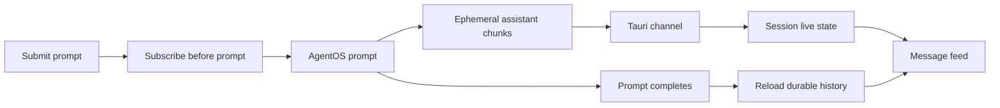
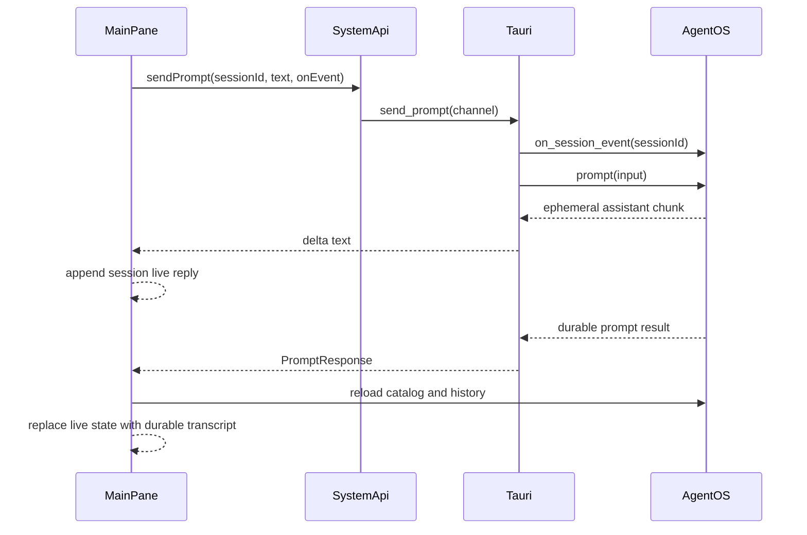

# Streamed responses





## Problem overview

Halo waits for the whole AgentOS prompt before it shows any response. Long replies leave a static sending state even though AgentOS already emits live assistant chunks. The user cannot tell whether useful work has started.

## Solution overview

Subscribe to the target AgentOS session before starting its prompt and pass assistant text chunks to the webview through a Tauri channel. Keep the live prompt and reply in React Query under the session ID so switching rows does not lose them. Once the prompt ends, reload durable history and remove the live copy.

AgentOS history remains the source of truth. The live channel is a short-lived view: a missed or lagged update ends live rendering for that prompt, while prompt completion still reloads the full durable transcript.

## Goals

- Show the submitted user text and assistant text as the response arrives.
- Keep each live response tied to its session when the user switches rows.
- Subscribe before calling `prompt` so the first chunk cannot race the listener.
- Replace live text with AgentOS durable history after success.
- Keep the current retryable editor error on failure and never start a second prompt for one submit.
- Recover the final transcript when a channel closes or falls behind.

## Non-goals

- No stop or cancel control.
- No tool calls, thoughts, plans, permissions, usage, or rich content in the feed.
- No Markdown rendering or syntax highlighting.
- No more than one running prompt per session.
- No replay protocol for ephemeral chunks; durable history handles recovery.

## Important files, docs, and websites

- [`apps/halo/src-tauri/src/agentos_service/sessions.rs`](../apps/halo/src-tauri/src/agentos_service/sessions.rs) — Starts prompts, reads history, and will own the AgentOS event subscription.
- [`apps/halo/src-tauri/src/agentos_service/mod.rs`](../apps/halo/src-tauri/src/agentos_service/mod.rs) — Carries the stream callback through the service boundary.
- [`apps/halo/src-tauri/src/lib.rs`](../apps/halo/src-tauri/src/lib.rs) — Defines the `send_prompt` Tauri command and its channel argument.
- [`apps/halo/src/api/SystemApi.ts`](../apps/halo/src/api/SystemApi.ts) — Defines the transport-neutral prompt stream contract.
- [`apps/halo/src/api/tauri.ts`](../apps/halo/src/api/tauri.ts) — Creates the Tauri `Channel` and forwards its messages.
- [`apps/halo/src/api/ApiProvider.tsx`](../apps/halo/src/api/ApiProvider.tsx) — Owns prompt mutations, per-session live state, and durable query refreshes.
- [`apps/halo/src/MainPane.tsx`](../apps/halo/src/MainPane.tsx) — Renders saved and draft prompt flows and the message feed.
- [Tauri channels](https://v2.tauri.app/develop/calling-rust/#channels) — Documents ordered streaming messages from Rust commands to the frontend.
- `agentos-client 0.2.15/src/session.rs` in the local Cargo registry — Defines `on_session_event`, `SessionStreamEntry`, ephemeral assistant chunks, and lag errors.

## Implementation

### Phase 1: Stream AgentOS assistant chunks through Tauri

Extend the prompt command with an ordered event channel. Subscribe before the prompt starts, forward text from ephemeral assistant chunks, and keep the existing prompt result as the command's final value.

#### Important types

```rust
// apps/halo/src-tauri/src/agentos_service/sessions.rs
#[derive(Clone, Serialize)]
#[serde(tag = "type", rename_all = "camelCase")]
pub enum PromptStreamEvent {
    Delta { session_id: String, text: String },
    ResyncRequired { session_id: String },
}
```

```ts
// apps/halo/src/api/SystemApi.ts
export type PromptStreamEvent =
  | { type: "delta"; sessionId: string; text: string }
  | { type: "resyncRequired"; sessionId: string };

export type PromptEventHandler = (event: PromptStreamEvent) => void;
```

#### Call stack diff

```diff
 MainPane::submit
 └── useSendPromptMutation
-    └── SystemApi.sendPrompt(sessionId, text)
-        └── Tauri send_prompt -> AgentOs::prompt
+    └── SystemApi.sendPrompt(sessionId, text, onEvent)
+        └── Tauri send_prompt(channel)
+            └── AgentOsService::send_prompt(on_event)
+                ├── AgentOs::on_session_event(sessionId)
+                ├── AgentOs::prompt
+                └── Channel::send(delta | resyncRequired)
```

#### Code diff preview

```diff
 // apps/halo/src-tauri/src/agentos_service/sessions.rs
-let result = self.os.prompt(input).await?;
+let (mut events, _subscription) = self.os.on_session_event(Some(session_id));
+let prompt = self.os.prompt(input);
+tokio::pin!(prompt);
+let result = loop {
+    tokio::select! {
+        result = &mut prompt => break result?,
+        event = events.next() => forward_prompt_event(session_id, event, &on_event),
+    }
+};
```

- [ ] Add `futures-util`, `PromptStreamEvent`, and a small event mapper in `apps/halo/src-tauri/src/agentos_service/sessions.rs`; forward only text from ephemeral `AgentMessageChunk` entries and map subscription lag to `ResyncRequired`.
- [ ] Pass `tauri::ipc::Channel<PromptStreamEvent>` from `send_prompt` in `apps/halo/src-tauri/src/lib.rs` through `AgentOsService::send_prompt`, subscribe before `AgentOs::prompt`, and keep prompt completion independent from channel delivery.
- [ ] Add `PromptStreamEvent` and a required event handler to `SystemApi.sendPrompt`; create `Channel<PromptStreamEvent>` in `apps/halo/src/api/tauri.ts` and update controlled browser mocks to accept the serialized channel.
- [ ] Add Rust tests for assistant text filtering, ignored thought/tool/durable entries, and lag mapping; run `cargo test --manifest-path apps/halo/src-tauri/Cargo.toml` and `pnpm check`.

### Phase 2: Render and reconcile each session's live response

Store one live prompt record per session in React Query. Render it after the durable transcript, retain it across row changes, and remove it only after the refreshed transcript contains the completed exchange.

#### Important types

```ts
// apps/halo/src/api/ApiProvider.tsx
export type LivePrompt = {
  sessionId: string;
  userText: string;
  assistantText: string;
  status: "sending" | "resyncRequired" | "failed";
};
```

#### Call stack diff

```diff
 PromptEditor::submit
 └── useSendPromptMutation
+    ├── onMutate -> set LivePrompt(sessionId, userText)
+    ├── onEvent(delta) -> append assistantText
     └── onSuccess
-        ├── invalidate catalog and transcript
-        └── clear editor
+        ├── refetch catalog and transcript
+        ├── remove LivePrompt(sessionId)
+        └── clear editor

 MainPane::render
-└── MessageFeed(transcript)
+├── useLivePrompt(sessionId)
+└── MessageFeed(transcript, livePrompt)
```

#### Code diff preview

```diff
 // apps/halo/src/api/ApiProvider.tsx
 mutationFn: ({ sessionId, text }) =>
-  api.sendPrompt(sessionId, text),
+  api.sendPrompt(sessionId, text, (event) => {
+    queryClient.setQueryData(livePromptKey(sessionId), (current) =>
+      applyPromptStreamEvent(current, event),
+    );
+  }),
 onMutate: ({ sessionId, text }) => {
+  queryClient.setQueryData(livePromptKey(sessionId), {
+    sessionId,
+    userText: text,
+    assistantText: "",
+    status: "sending",
+  });
 },
```

- [ ] Add `LivePrompt`, `livePromptKey`, `useLivePrompt`, and pure stream-update helpers in `apps/halo/src/api/ApiProvider.tsx`; key all state by `sessionId` and append deltas in channel order.
- [ ] Update `MessageFeed` in `apps/halo/src/MainPane.tsx` to show the live user message and assistant text after durable messages, keep the feed pinned as text grows, and show a quiet resync state without rendering thoughts or tools.
- [ ] Use the same live path after `DraftPane` creates its durable ID; keep the stream visible when rows change, refresh catalog and transcript on completion, then remove the live record without duplicating either message.
- [ ] On prompt failure, keep the editor text and error, mark the live record failed, and replace it on retry without creating a second durable draft session.
- [ ] E2E test ordered chunks, a row switch during streaming, draft first-send streaming, lag recovery, failure and retry, empty assistant output, narrow layout, and final transcript deduplication; run `pnpm check`, `cargo test --manifest-path apps/halo/src-tauri/Cargo.toml`, and `pnpm --filter @halo/desktop build`.
