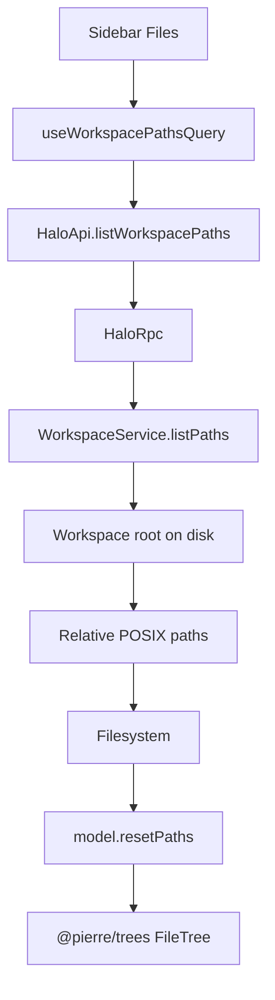
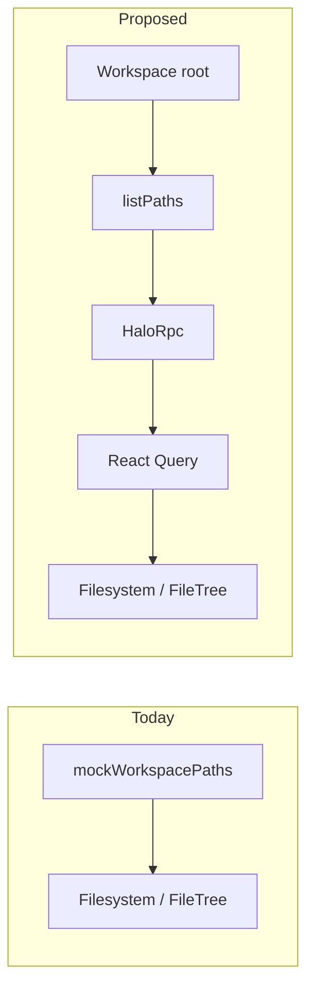

# Workspace filesystem tree

## System flow





## Problem overview

The sidebar Files section and UI kit demo render a hard-coded `mockWorkspacePaths` list through `@pierre/trees`. The renderer is sandboxed and has no Node filesystem access. Halo already knows the chosen workspace root in the main process (`WorkspaceService`), but Cap’n Web exposes no way to list that tree, so the UI cannot show the real project.

## Solution overview

Add a main-process walk under the ready workspace root that returns workspace-relative POSIX path strings for Pierre. Expose it as `HaloApi.listWorkspacePaths()`, load it in the renderer with a React Query hook keyed like `useSessionsQuery`, and pass the result into the existing `Filesystem` component. Because `useFileTree` applies `paths` only once, call `model.resetPaths(paths)` when query data changes.

Assumption: skip directory names `node_modules` and `.git` while walking (no `.gitignore` parsing). Emit files as relative paths and empty directories as paths ending in `/`. Do not follow directory symlinks. Paths use `/` with no leading slash.

## Goals

- After a workspace is ready, the sidebar Files tree shows that workspace’s files and empty folders (minus skipped dirs).
- Paths stay relative to the workspace root in Pierre’s expected form.
- Listing failures use errore tagged errors in the service and throw only at the Cap’n Web edge, matching `listSessions`.
- Switching workspace (choose success) loads paths for the new root.
- The UI kit Filesystem demo can keep mock paths for a stable gallery.

## Non-goals

- No live watch / auto-refresh when files change on disk.
- No open-file, editor, or main-pane navigation from selection.
- No drag-and-drop, rename, create, or delete from the tree.
- No `.gitignore` / ignore-file parsing beyond the fixed skip list.
- No Pi agent tools or AgentOS filesystem APIs driving the sidebar.
- No absolute paths or OS-native separators in the path list sent to Pierre.

## Important files, docs, and websites

- [`apps/electron/src/main/workspace-service.ts`](../apps/electron/src/main/workspace-service.ts) — Owns `getLayout()` / ready root; add `listPaths()` here.
- [`apps/electron/src/main/workspace-service.test.ts`](../apps/electron/src/main/workspace-service.test.ts) — Pattern for temp-dir fixtures; extend for listing.
- [`apps/electron/src/shared/rpc.ts`](../apps/electron/src/shared/rpc.ts) — `HaloApi` contract the renderer stubs against.
- [`apps/electron/src/main/rpc.ts`](../apps/electron/src/main/rpc.ts) — `HaloRpc` throws tagged errors at the Cap’n Web edge.
- [`apps/electron/src/renderer/api/ApiProvider.tsx`](../apps/electron/src/renderer/api/ApiProvider.tsx) — `useSessionsQuery` / workspace ready gating to mirror.
- [`apps/electron/src/renderer/patterns/Filesystem.tsx`](../apps/electron/src/renderer/patterns/Filesystem.tsx) — Presentational Pierre wrapper; needs `resetPaths` when `paths` change.
- [`apps/electron/src/renderer/Sidebar.tsx`](../apps/electron/src/renderer/Sidebar.tsx) — Live Files section still on `mockWorkspacePaths`.
- [`apps/electron/src/renderer/UiKitPage.tsx`](../apps/electron/src/renderer/UiKitPage.tsx) — Gallery demo; keep mock unless you intentionally share the query.
- [trees.software / `@pierre/trees` README](https://trees.software/) — Path-first API; React `useFileTree` ignores later option changes; use `model.resetPaths`.
- [`.agents/skills/errore/SKILL.md`](../.agents/skills/errore/SKILL.md) — Return tagged errors from the service; throw only in `HaloRpc`.

## Implementation

### Phase 1: List relative workspace paths in main

Add `WorkspaceService.listPaths()` that walks the ready layout root and returns relative POSIX paths (or a tagged error). After this commit, main can produce the list Pierre needs without any UI change.

#### Important types

```ts
// apps/electron/src/main/workspace-service.ts
const SKIP_DIR_NAMES = new Set(["node_modules", ".git"]);

// Return: WorkspaceNotReadyError | WorkspaceIoError | string[]
// Each string is workspace-relative, `/`-separated, no leading `/`.
// Empty directories end with `/` (e.g. `empty-dir/`).
```

#### Call stack diff

```diff
 WorkspaceService
-└── getLayout() → WorkspaceLayout | WorkspaceNotReadyError
+└── getLayout() → WorkspaceLayout | WorkspaceNotReadyError
+└── listPaths()
+    └── readdir/stat under layout.root
+        └── relative POSIX path[] | WorkspaceIoError | WorkspaceNotReadyError
```

#### Code diff preview

```diff
 // apps/electron/src/main/workspace-service.ts
 export class WorkspaceService {
   getLayout() {
     if (this.state.status === "notStarted") return new WorkspaceNotReadyError();
     return this.state.layout;
   }

+  async listPaths() {
+    const layout = this.getLayout();
+    if (layout instanceof Error) return layout;
+    // walk layout.root; skip SKIP_DIR_NAMES; no directory symlink follow
+    // return relative `/` paths (files + empty dirs as `name/`)
+  }
 }
```

- [ ] Implement `listPaths()` on `WorkspaceService` with the skip set and POSIX relative paths.
- [ ] Cover nested files, an empty directory, skipped `node_modules`, and not-ready in `workspace-service.test.ts`.
- [ ] Confirm a symlink-to-directory under the fixture is skipped or not escaped outside the root.
- [ ] Run `pnpm --filter @halo/desktop test -- workspace-service` (or the package’s vitest target used today) and confirm green.

### Phase 2: Expose `listWorkspacePaths` on Cap’n Web

Add the method to `HaloApi` and implement it on `HaloRpc` so the renderer stub can call it. After this commit, RPC can return the path list (or throw) with no UI yet.

#### Important types

```ts
// apps/electron/src/shared/rpc.ts
export abstract class HaloApi extends RpcTarget {
  // ...
  abstract listWorkspacePaths(): Promise<string[]>;
}
```

#### Call stack diff

```diff
 HaloRpc.listSessions
 └── pi.listSessions
     └── throw if Error else return

+HaloRpc.listWorkspacePaths
+└── workspace.listPaths
+    └── throw if Error else return string[]
```

#### Code diff preview

```diff
 // apps/electron/src/shared/rpc.ts
 export abstract class HaloApi extends RpcTarget {
   abstract listSessions(): Promise<SessionSummary[]>;
+  abstract listWorkspacePaths(): Promise<string[]>;
   abstract newAgentSession(): Promise<AgentSessionApi>;
 }

 // apps/electron/src/main/rpc.ts
+  async listWorkspacePaths() {
+    this.logger.info({ event: "listWorkspacePaths" });
+    const paths = await this.workspace.listPaths();
+    if (paths instanceof Error) throw paths;
+    return paths;
+  }
```

- [ ] Add `listWorkspacePaths()` to `HaloApi` in `shared/rpc.ts`.
- [ ] Implement it on `HaloRpc` with the same throw-at-edge pattern as `listSessions`.
- [ ] Typecheck the electron package so the abstract method is satisfied.
- [ ] Run `pnpm run check-affected` for the RPC surface change.

### Phase 3: Load paths in the renderer with React Query

Add `useWorkspacePathsQuery` beside `useSessionsQuery`, keyed by ready `workspaceRoot` and disabled until the workspace is ready. After this commit, any caller can read live paths without changing the tree yet.

#### Important types

```ts
// apps/electron/src/renderer/api/ApiProvider.tsx
export function useWorkspacePathsQuery(
  workspace: WorkspaceState | undefined,
) {
  // queryKey: ["workspace-paths", workspaceRoot]
  // queryFn: () => api.listWorkspacePaths()
  // enabled: workspaceRoot !== null
}
```

#### Call stack diff

```diff
 useSessionsQuery(workspace)
 └── api.listSessions()

+useWorkspacePathsQuery(workspace)
+└── api.listWorkspacePaths()
```

#### Code diff preview

```diff
 // apps/electron/src/renderer/api/ApiProvider.tsx
 export function useSessionsQuery(workspace: WorkspaceState | undefined) {
   // ...
 }

+export function useWorkspacePathsQuery(workspace: WorkspaceState | undefined) {
+  const api = useApi();
+  const workspaceRoot =
+    workspace?.status === "ready" ? workspace.workspace.workspaceRoot : null;
+
+  return useQuery({
+    queryKey: ["workspace-paths", workspaceRoot],
+    queryFn: () => api.listWorkspacePaths(),
+    enabled: workspaceRoot !== null,
+  });
+}
```

- [ ] Add `useWorkspacePathsQuery` mirroring sessions gating and `staleTime` defaults.
- [ ] Rely on query-key change when `useChooseWorkspaceMutation` sets a new ready workspace (same as sessions); do not add a separate invalidate unless keys would not change.
- [ ] Keep queryFn free of `||` / `??` fallbacks; let Cap’n Web errors surface as query errors.
- [ ] Run `pnpm run check-affected` for the renderer API package.

### Phase 4: Drive sidebar `Filesystem` from the query

Wire `Sidebar` to `useWorkspacePathsQuery`, teach `Filesystem` to `resetPaths` when `paths` change, and leave the UI kit on mocks. After this commit, the live Files section shows the real workspace.

#### Important types

```ts
// apps/electron/src/renderer/patterns/Filesystem.tsx
// useFileTree({ paths, ... }) creates the model once.
// On paths identity/content change after mount:
//   model.resetPaths([...paths])
```

#### Call stack diff

```diff
 Sidebar
-└── Filesystem paths={mockWorkspacePaths}
+└── useWorkspacePathsQuery(workspace)
+    └── Filesystem paths={data ?? [] while pending/error policy as chosen}
+        └── useFileTree (initial paths)
+            └── useEffect → model.resetPaths(paths)

 UiKitPage
 └── Filesystem paths={mockWorkspacePaths}  (unchanged)
```

#### Code diff preview

```diff
 // apps/electron/src/renderer/patterns/Filesystem.tsx
 const { model } = useFileTree({ paths, /* ... */ });
+useEffect(() => {
+  model.resetPaths([...paths]);
+}, [model, paths]);

 // apps/electron/src/renderer/Sidebar.tsx
-import { Filesystem, mockWorkspacePaths } from "./patterns/Filesystem.tsx";
+import { Filesystem } from "./patterns/Filesystem.tsx";
+import { useWorkspacePathsQuery } from "./api/ApiProvider.tsx";
+
+const pathsQuery = useWorkspacePathsQuery(workspace);
 // ...
 <Filesystem
-  paths={mockWorkspacePaths}
-  initialSelectedPath="src/renderer/App.tsx"
+  paths={pathsQuery.data === undefined ? [] : pathsQuery.data}
 />
```

- [ ] Call `model.resetPaths` when the `paths` prop changes (Pierre ignores later `useFileTree` option updates).
- [ ] Replace mock paths in `Sidebar` with query data; drop the fixed `initialSelectedPath` that only existed for mocks (or select only when that path exists).
- [ ] Keep `UiKitPage` on `mockWorkspacePaths`; update its copy so it no longer claims the sidebar is mock-only.
- [ ] Decide pending/error UI minimally (empty tree while loading; no new card chrome). Prefer showing the query error text only if the sidebar already has a pattern for sessions errors; otherwise leave empty until success.
- [ ] Run `pnpm run check-affected`, then verify in the running app (`pnpm halo-web` / visual) that Files lists real workspace files, and record a short demo for the PR.

## Final check

- Mermaid diagrams sit only under System flow and match list → RPC → query → `resetPaths` → tree.
- Each phase has Important types, call-stack diff, code-diff preview, and a four-to-five step checklist with a real command.
- Goals are covered; watch, open-file, DnD, gitignore, and Pi tooling stay out of scope.
