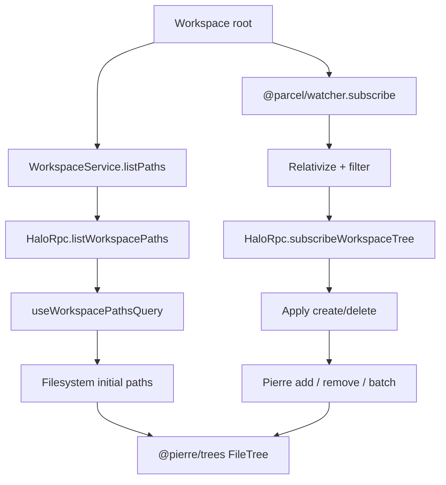
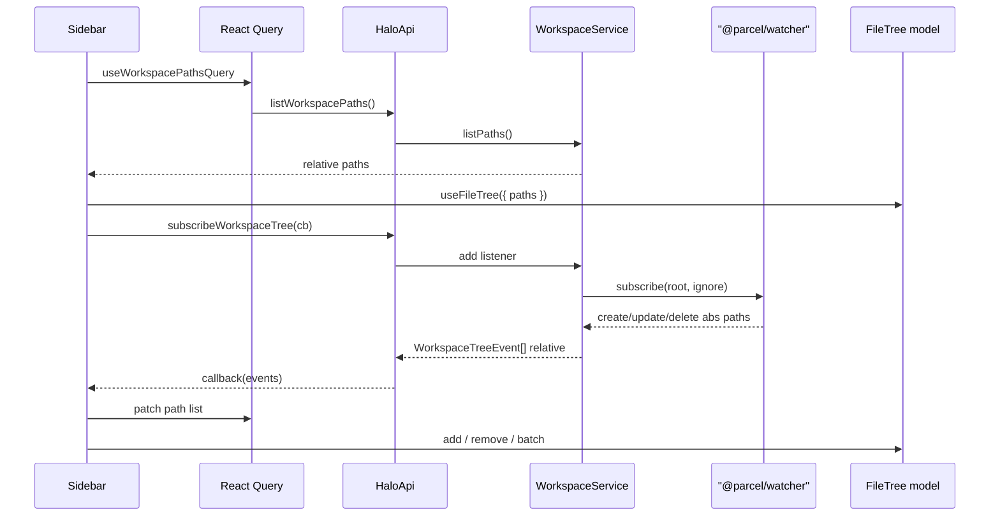

# Workspace filesystem tree

## System flow





## Problem overview

The sidebar Files section renders hard-coded `mockWorkspacePaths` through `@pierre/trees`. The renderer is sandboxed and cannot read or watch the disk. Halo already owns the workspace root in the main process (`WorkspaceService`), but Cap’n Web has no list or change stream for that tree. The tree must show the real project and stay current as files change.

## Solution overview

Main walks the ready workspace once for the initial path list, then watches that root with [`@parcel/watcher`](https://github.com/parcel-bundler/watcher). Parcel emits throttled `create` / `update` / `delete` events with absolute paths. Main turns them into workspace-relative POSIX paths (same shape as the initial list), drops content-only `update` events, and pushes patches to the renderer over Cap’n Web with the same callback + `dup()` pattern as `AgentSessionApi.subscribe`.

The renderer loads the full list with React Query, mounts Pierre once, then applies live patches with `model.add` / `model.remove` / `model.batch` so expansion state survives. Do not call `resetPaths` on every watcher batch.

Assumption: ignore `node_modules` and `.git` for both the walk and Parcel’s `ignore` option (no `.gitignore` parsing). Empty directories use a trailing `/`. Do not follow directory symlinks on the walk. Paths use `/` with no leading slash.

## Goals

- After a workspace is ready, the sidebar Files tree shows that workspace’s files and empty folders (minus skipped dirs).
- The tree updates in realtime when files or folders are created or deleted under the workspace (including renames as delete + create).
- Content-only edits (`update`) do not reshuffle the tree.
- Paths stay relative to the workspace root in Pierre’s expected form.
- Listing and watch start failures use errore tagged errors in the service; Cap’n Web throws only at the RPC edge for request/response methods.
- Switching workspace stops the old Parcel subscription, starts a new one, and reloads the path list.
- The UI kit Filesystem demo can keep mock paths for a stable gallery.

## Non-goals

- No open-file, editor, or main-pane navigation from selection.
- No drag-and-drop, rename, create, or delete from the tree UI itself.
- No `.gitignore` / ignore-file parsing beyond the fixed skip list.
- No Pi agent tools or AgentOS filesystem APIs driving the sidebar.
- No absolute paths or OS-native separators in paths sent to Pierre.
- No Parcel `writeSnapshot` / `getEventsSince` catch-up; a fresh `listPaths` on workspace ready is enough.
- No multi-subscriber fan-out beyond what Cap’n Web needs for one renderer listener (replace the previous callback when `subscribeWorkspaceTree` is called again).

## Important files, docs, and websites

- [`apps/electron/src/main/workspace-service.ts`](../apps/electron/src/main/workspace-service.ts) — Ready root; add `listPaths()`, Parcel subscribe lifecycle on select/restore.
- [`apps/electron/src/main/workspace-service.test.ts`](../apps/electron/src/main/workspace-service.test.ts) — Temp-dir fixtures for list and watch mapping.
- [`apps/electron/src/shared/rpc.ts`](../apps/electron/src/shared/rpc.ts) — `HaloApi` list + subscribe contract.
- [`apps/electron/src/main/rpc.ts`](../apps/electron/src/main/rpc.ts) — `HaloRpc` throw-at-edge for list; `callback.dup()` for subscribe (see `AgentSessionRpc.subscribe`).
- [`apps/electron/src/renderer/api/ApiProvider.tsx`](../apps/electron/src/renderer/api/ApiProvider.tsx) — Sessions query gating to mirror for the initial list.
- [`apps/electron/src/renderer/agentSession/useAgentSession.ts`](../apps/electron/src/renderer/agentSession/useAgentSession.ts) — Cap’n Web subscribe + cleanup pattern to copy.
- [`apps/electron/src/renderer/patterns/Filesystem.tsx`](../apps/electron/src/renderer/patterns/Filesystem.tsx) — Pierre wrapper; expose the model or accept patch helpers for live updates.
- [`apps/electron/src/renderer/Sidebar.tsx`](../apps/electron/src/renderer/Sidebar.tsx) — Live Files section still on mocks.
- [`apps/electron/package.json`](../apps/electron/package.json) — Add `@parcel/watcher`; Forge already uses `auto-unpack-natives`.
- [trees.software / `@pierre/trees`](https://trees.software/) — `add` / `remove` / `batch` / `resetPaths`; React `useFileTree` options are one-shot.
- [`@parcel/watcher` README](https://github.com/parcel-bundler/watcher) — `subscribe`, `ignore`, event types `create` | `update` | `delete`.
- [`.agents/skills/errore/SKILL.md`](../.agents/skills/errore/SKILL.md) — Tagged errors in the service; throw only in `HaloRpc` for promise methods.

## Implementation

### Phase 1: List relative workspace paths in main

Add `WorkspaceService.listPaths()` that walks the ready layout root and returns relative POSIX paths (or a tagged error). After this commit, main can produce the list Pierre needs without any UI change.

#### Important types

```ts
// apps/electron/src/main/workspace-service.ts
const SKIP_DIR_NAMES = new Set(["node_modules", ".git"]);

// Return: WorkspaceNotReadyError | WorkspaceIoError | string[]
// Each string is workspace-relative, `/`-separated, no leading `/`.
// Empty directories end with `/` (e.g. `empty-dir/`).
```

#### Call stack diff

```diff
 WorkspaceService
-└── getLayout() → WorkspaceLayout | WorkspaceNotReadyError
+└── getLayout() → WorkspaceLayout | WorkspaceNotReadyError
+└── listPaths()
+    └── readdir/stat under layout.root
+        └── relative POSIX path[] | WorkspaceIoError | WorkspaceNotReadyError
```

#### Code diff preview

```diff
 // apps/electron/src/main/workspace-service.ts
 export class WorkspaceService {
   getLayout() {
     if (this.state.status === "notStarted") return new WorkspaceNotReadyError();
     return this.state.layout;
   }

+  async listPaths() {
+    const layout = this.getLayout();
+    if (layout instanceof Error) return layout;
+    // walk layout.root; skip SKIP_DIR_NAMES; no directory symlink follow
+    // return relative `/` paths (files + empty dirs as `name/`)
+  }
 }
```

- [ ] Implement `listPaths()` on `WorkspaceService` with the skip set and POSIX relative paths.
- [ ] Cover nested files, an empty directory, skipped `node_modules`, and not-ready in `workspace-service.test.ts`.
- [ ] Confirm a symlink-to-directory under the fixture is skipped or not escaped outside the root.
- [ ] Run `pnpm --filter @halo/desktop test` and confirm the new tests pass.

### Phase 2: Expose `listWorkspacePaths` on Cap’n Web

Add the method to `HaloApi` and implement it on `HaloRpc` so the renderer stub can call it. After this commit, RPC can return the path list (or throw) with no UI yet.

#### Important types

```ts
// apps/electron/src/shared/rpc.ts
export abstract class HaloApi extends RpcTarget {
  // ...
  abstract listWorkspacePaths(): Promise<string[]>;
}
```

#### Call stack diff

```diff
 HaloRpc.listSessions
 └── pi.listSessions
     └── throw if Error else return

+HaloRpc.listWorkspacePaths
+└── workspace.listPaths
+    └── throw if Error else return string[]
```

#### Code diff preview

```diff
 // apps/electron/src/shared/rpc.ts
 export abstract class HaloApi extends RpcTarget {
   abstract listSessions(): Promise<SessionSummary[]>;
+  abstract listWorkspacePaths(): Promise<string[]>;
   abstract newAgentSession(): Promise<AgentSessionApi>;
 }

 // apps/electron/src/main/rpc.ts
+  async listWorkspacePaths() {
+    this.logger.info({ event: "listWorkspacePaths" });
+    const paths = await this.workspace.listPaths();
+    if (paths instanceof Error) throw paths;
+    return paths;
+  }
```

- [ ] Add `listWorkspacePaths()` to `HaloApi` in `shared/rpc.ts`.
- [ ] Implement it on `HaloRpc` with the same throw-at-edge pattern as `listSessions`.
- [ ] Typecheck so the abstract method is satisfied.
- [ ] Run `pnpm run check-affected` for the RPC surface change.

### Phase 3: Initial tree from React Query

Add `useWorkspacePathsQuery`, wire the sidebar `Filesystem` to that data, and call `model.resetPaths` only when the full list is replaced (first load or workspace switch). After this commit, Files shows the real workspace once; it is not live yet.

#### Important types

```ts
// apps/electron/src/renderer/api/ApiProvider.tsx
export function useWorkspacePathsQuery(
  workspace: WorkspaceState | undefined,
) {
  // queryKey: ["workspace-paths", workspaceRoot]
  // queryFn: () => api.listWorkspacePaths()
  // enabled: workspaceRoot !== null
}
```

#### Call stack diff

```diff
 Sidebar
-└── Filesystem paths={mockWorkspacePaths}
+└── useWorkspacePathsQuery(workspace)
+    └── Filesystem paths={query.data}
+        └── useFileTree({ paths })
+            └── useEffect → model.resetPaths(paths) // full replace only
```

#### Code diff preview

```diff
 // apps/electron/src/renderer/api/ApiProvider.tsx
+export function useWorkspacePathsQuery(workspace: WorkspaceState | undefined) {
+  const api = useApi();
+  const workspaceRoot =
+    workspace?.status === "ready" ? workspace.workspace.workspaceRoot : null;
+  return useQuery({
+    queryKey: ["workspace-paths", workspaceRoot],
+    queryFn: () => api.listWorkspacePaths(),
+    enabled: workspaceRoot !== null,
+  });
+}

 // apps/electron/src/renderer/patterns/Filesystem.tsx
 const { model } = useFileTree({ paths, /* ... */ });
+useEffect(() => {
+  model.resetPaths([...paths]);
+}, [model, paths]);
```

- [ ] Add `useWorkspacePathsQuery` mirroring sessions gating.
- [ ] Replace mock paths in `Sidebar`; keep `UiKitPage` on `mockWorkspacePaths`.
- [ ] Use `resetPaths` for full-list replacement only (workspace key change / initial data).
- [ ] Run `pnpm run check-affected` and confirm the sidebar lists real files once.

### Phase 4: Watch the workspace with `@parcel/watcher`

Depend on `@parcel/watcher` in `@halo/desktop`. Start a recursive subscribe when the workspace becomes ready; stop it when the root changes. Map Parcel events to relative tree events inside `WorkspaceService`. After this commit, main can observe disk changes without talking to the renderer yet.

#### Important types

```ts
// apps/electron/src/main/workspace-service.ts
import * as watcher from "@parcel/watcher";

type WorkspaceTreeEvent =
  | { type: "create"; path: string }
  | { type: "delete"; path: string };

// Parcel Event: { type: "create" | "update" | "delete"; path: absolute }
// ignore: ["**/node_modules/**", "**/.git/**"] (align with SKIP_DIR_NAMES)
// Drop type === "update" (content-only).
// On create: stat to decide file vs directory → trailing `/` for dirs.
// On delete: emit relative path; if the path was a dir in the last list, keep trailing `/`.
```

#### Call stack diff

```diff
 WorkspaceService.select / restore
 └── set ready layout
+    └── startWatch(layout.root)
+        └── @parcel/watcher.subscribe(root, onEvents, { ignore })
+            └── map → WorkspaceTreeEvent[]
+                └── notify local listeners

 WorkspaceService.select (new root)
+└── stopWatch() → subscription.unsubscribe()
+└── startWatch(newRoot)
```

#### Code diff preview

```diff
 // apps/electron/src/main/workspace-service.ts
+import * as watcher from "@parcel/watcher";

 // after layout is ready:
+const subscription = await watcher.subscribe(
+  layout.root,
+  (err, events) => {
+    if (err !== null) { /* log / tagged watch error to listeners */ return; }
+    const mapped = mapParcelEvents(layout.root, events);
+    for (const listener of this.treeListeners) listener(mapped);
+  },
+  { ignore: ["**/node_modules/**", "**/.git/**"] },
+);
```

- [ ] Add `@parcel/watcher` to `apps/electron/package.json` and install.
- [ ] Start/stop the subscription with workspace ready transitions; never leave two watches on different roots.
- [ ] Implement mapping: absolute → relative POSIX, skip ignored segments, drop `update`, trailing `/` for directories.
- [ ] Unit-test the mapper with absolute fixture paths (and a small integration test that writes a file under a watched temp dir if that stays reliable in CI).
- [ ] Run `pnpm --filter @halo/desktop test`.

### Phase 5: Push tree events over Cap’n Web

Add `subscribeWorkspaceTree` on `HaloApi` / `HaloRpc`, matching agent-session subscribe: `callback.dup()`, replace the previous listener, forward batches from `WorkspaceService`. After this commit, the renderer can receive live patches.

#### Important types

```ts
// apps/electron/src/shared/rpc.ts
export type WorkspaceTreeEvent =
  | { type: "create"; path: string }
  | { type: "delete"; path: string };

export type WorkspaceTreeEventHandler = (
  events: WorkspaceTreeEvent[],
) => void;

export abstract class HaloApi extends RpcTarget {
  abstract listWorkspacePaths(): Promise<string[]>;
  abstract subscribeWorkspaceTree(
    callback: WorkspaceTreeEventHandler,
  ): void;
}
```

#### Call stack diff

```diff
 AgentSessionRpc.subscribe(callback)
 └── callback.dup() → this.listener
 └── Pi events → listener(event)

+HaloRpc.subscribeWorkspaceTree(callback)
+└── callback.dup() → this.treeListener
+└── workspace.addTreeListener → forward batches
+    └── (replace previous listener; dispose old stub if present)
```

#### Code diff preview

```diff
 // apps/electron/src/main/rpc.ts
+  subscribeWorkspaceTree(callback: WorkspaceTreeEventHandler & { dup?: ... }) {
+    this.logger.info({ event: "subscribeWorkspaceTree" });
+    this.treeListener =
+      typeof callback.dup === "function" ? callback.dup() : callback;
+    this.workspace.setTreeListener((events) => {
+      this.treeListener?.(events);
+    });
+  }
```

- [ ] Add `WorkspaceTreeEvent` and `subscribeWorkspaceTree` to `shared/rpc.ts`.
- [ ] Implement subscribe on `HaloRpc` with `dup()` and listener replacement, same as `AgentSessionRpc.subscribe`.
- [ ] Wire `WorkspaceService` so a single RPC listener receives mapped batches (or no-op if none).
- [ ] Run `pnpm run check-affected`.

### Phase 6: Apply live patches in the sidebar

Subscribe from the renderer when the workspace is ready. Patch the React Query path list and apply the same create/delete ops to the Pierre model with `add` / `remove` / `batch` (not `resetPaths`). After this commit, creating or deleting a file under the workspace updates the Files tree without a full remount.

#### Important types

```ts
// apps/electron/src/renderer — hook e.g. useWorkspaceTreeSubscription
// On events:
//   create → queryClient.setQueryData append path; model.add(path)
//   delete → remove path (and children if dir); model.remove(path, { recursive: true }) for dirs
// Cap’n Web: subscribe callback must stay sync; only schedule React updates (setState / setQueryData).
```

#### Call stack diff

```diff
 Sidebar
 └── useWorkspacePathsQuery → Filesystem initial paths
+└── useEffect
+    └── api.subscribeWorkspaceTree(events => {
+          patchQueryCache(events)
+          model.batch([...adds, ...removes])
+        })
```

#### Code diff preview

```diff
 // apps/electron/src/renderer/Sidebar.tsx (or a small hook)
+useEffect(() => {
+  if (workspace?.status !== "ready") return;
+  void api.subscribeWorkspaceTree((events) => {
+    queryClient.setQueryData(["workspace-paths", root], (current) =>
+      applyTreeEvents(current, events),
+    );
+    for (const event of events) {
+      if (event.type === "create") model.add(event.path);
+      if (event.type === "delete") model.remove(event.path, { recursive: true });
+    }
+  });
+}, [api, workspace, model, queryClient]);
```

Prefer exposing `model` from `Filesystem` via a ref/callback, or keep patch application inside `Filesystem` through an `events` / imperative handle — pick the smaller change that keeps Pierre ownership in one place.

- [ ] Subscribe when workspace is ready; ensure Cap’n Web callback stays synchronous (queue React work only).
- [ ] Patch query cache and Pierre with create/delete; ignore empty batches.
- [ ] Verify rename shows as delete + create; content edit does not flicker the row.
- [ ] Run `pnpm run check-affected`, then a short halo-web / manual demo: create and delete a file under the workspace and record the tree updating for the PR.

## Final check

- Mermaid diagrams sit only under System flow and show list + Parcel watch → Cap’n Web → Pierre incremental updates.
- Each phase has Important types, call-stack diff, code-diff preview, and a four-to-five step checklist with a real command.
- Realtime updates are a goal; open-file, DnD, gitignore, and Pi tooling stay out of scope.
- `@parcel/watcher` is the only watch dependency named in this plan.
