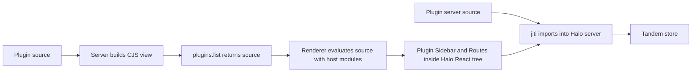
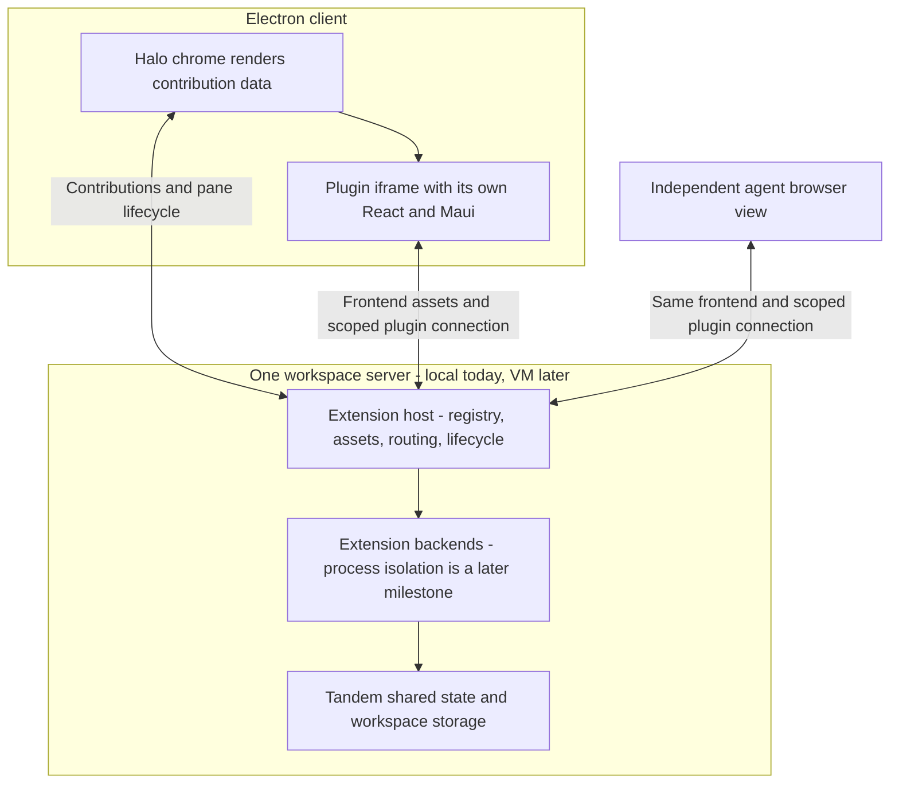

# Workspace plugin panes

**Status: Phases 1–2 are implemented and verified. Phases 3–8 are not started.** Electron still uses the current plugin loader. The iframe architecture below remains a target, not current app behavior.

| Area                   | Current implementation                                                  | Agreed direction — still to build                                                             |
| ---------------------- | ----------------------------------------------------------------------- | --------------------------------------------------------------------------------------------- |
| Plugin frontend        | `Sidebar` and `Routes` React components execute inside Halo's renderer. | Halo renders sidebar contribution data; plugin content runs in an iframe.                     |
| Dependencies           | Halo injects its live React, Maui, and SDK modules into plugin views.   | The workspace server builds self-contained frontends. Electron's Maui version can differ.     |
| Independent agent view | The existing E2E test opens a second full Halo window.                  | An agent opens only the plugin frontend in its own browser view.                              |
| Collaboration          | Tandem storage and two-client synchronization already work.             | Preserve shared committed data while keeping each pane's navigation, focus, and drafts local. |
| Backend loading        | jiti imports plugin servers into Halo's server process.                 | Move execution behind a serialized boundary in a later milestone; the runtime is undecided.   |
| Deployment             | The current desktop app starts the local workspace server.              | The same frontend can connect to the workspace server on the user's VM.                       |

**Already completed before this plan:** read-only plugin discovery, shared pending Tandem initialization, and the two-window synchronization regression test. These are foundations we will preserve, not new work claimed by this plan.

**Implemented for review:** the approved manifest contribution fields and parameterized targets are implemented in Phase 2. Default-exported pane rendering, the bootstrap API, and subsequent phases remain proposed. The iframe/server ownership and Tandem collaboration direction are agreed.

**Still to decide:** the authenticated browser bootstrap and origin configuration before exposing plugin documents; the backend runtime and process policy before backend isolation. One child process per extension remains a recommendation.

## System flow

### Current — what runs today



### Proposed — frontend milestone, not implemented

The backend remains in the existing Halo server process during this frontend milestone. The diagram does not imply that backend process isolation or VM deployment is already implemented.



### Proposed — independent views sharing Tandem data

```mermaid
sequenceDiagram
  participant U as User client
  participant H as Workspace extension host
  participant A as Agent view
  participant T as Plugin Tandem backend
  U->>H: Discover contributions and open pane
  H-->>U: Built frontend and scoped connection
  A->>H: Open independent view of the same pane
  H-->>A: Same frontend, separate view instance
  A->>T: Commit through normal plugin storage hooks
  T-->>U: Synchronize committed data
  Note over U,A: Focus, navigation, scroll and drafts stay local
  A->>H: Close agent view
  Note over H,T: Cancel that view's subscriptions; keep backend alive
  H-->>U: Plugin build or connection error stays scoped to the pane
```

## Current implementation and its limitations

Plugin views currently execute inside Halo's renderer. `compilePluginView` emits CJS and externalizes React, Maui, the router, and the SDK; `evaluatePluginView` executes that source with `new Function` and supplies Halo's live modules through `requireHost`. CJS serves this custom loader today. Loading the replacement frontend as a browser module removes the need for that format and loader. The published plugin SDK contract contains declarations without runtime exports. Backend loading uses jiti aliases and imports real oRPC routers into Halo's server process.

This couples plugin dependencies to the app, makes ordinary plugin builds difficult to reproduce, and lets plugin frontend code interfere with the shell. It also prevents an ordinary browser on another machine from opening the same frontend independently.

The backend lifecycle regression is already fixed: `PluginService.list()` returns a snapshot, explicit reload performs mounting, and `syncRoutes()` shares its pending initialization. Preserve that behavior.

## Events and call stacks — actual behavior after Phase 1

Only the SDK build/package event changes in Phase 1. Events 2–8 describe the existing app flow and remain unchanged. The later iframe flow is described separately in the implementation phases.

### 1. Build and package the SDK — developer/release event, changed in Phase 1

```text
pnpm --filter @halo/plugin-sdk pack:contract <version>
├── pnpm run build
│   └── tsc -p tsconfig.build.json (TypeScript 7.0.2)
│       └── src/*.ts → dist/*.js (ESM) + dist/*.d.ts
└── scripts/packContract.ts
    └── writeContractPackage
        ├── copy dist into contract/dist
        └── write package.json with types and runtime exports

npm pack (inside contract/) → installable .tgz
npm publish is a separate release operation; it is not run in this task
```

This builds the SDK library, not a user's plugin. Dependencies such as React and Maui remain normal imports in the SDK output. Two other entry points also produce the generated SDK files before consuming them:

```text
Electron dev / package / make
└── Forge generateAssets
    └── buildPluginSdk
        └── TypeScript 7 CLI → SDK dist

pnpm --filter @get-halo/server test
├── SDK build
└── Vitest
    └── fixture installPluginSdkContract → writeContractPackage
```

### 2. Create a plugin — workspace event, unchanged

```text
client.plugins.create({ id, storage })
└── pluginsRouter.create
    └── PluginService.create
        └── writePluginScaffold
            ├── write package.json, view.tsx, server.ts, optional storage.ts
            ├── installPluginDependencies → npm install
            └── writePluginTsconfig
```

This creates source files and installs packages. It does not compile the view or mount the backend. Tests substitute the installation source with locally prepared real packages; production uses npm.

### 3. Build a plugin — workspace event, unchanged

```text
client.plugins.build()
└── pluginsRouter.build
    └── PluginService.build
        ├── readPluginManifest + assert SDK pin
        ├── compilePluginView
        │   └── esbuild → plugin/dist/view.js (CJS, host modules external)
        └── PluginService.reload (event 4)
```

Phase 1 makes an ESM SDK package available. The production plugin compiler still produces CJS for the existing desktop loader. The later frontend build replaces this event with HTML/assets and ESM output. Currently an explicit build also reloads plugin backends; client discovery never does.

### 4. Start or reload plugin backends — workspace event, unchanged

```text
HaloServer.listen → workspace.restore
HaloServer.selectWorkspace → workspace.select
PluginService.build → explicit reload
└── PluginService.reload
    ├── list directories + read manifests + validate SDK pins
    ├── readPluginViewDist → read existing compiled view source
    ├── loadPluginServer → jiti import server.ts with host aliases
    └── replace routers map and loaded plugin snapshot
```

Reload reads existing view artifacts; it does not build them. Server code is imported into the Halo server process. A plugin declaring a view needs a valid built view before it is included in the loaded snapshot.

### 5. Discover plugins in a client — client/server event, unchanged

```text
usePluginsQuery
├── client.plugins.list()
│   └── pluginsRouter.list → PluginService.list → cached loaded snapshot
├── loadPluginViews
│   └── evaluatePluginView
│       └── new Function + requireHost → plugin component exports
└── pluginApiFacade → per-plugin client RPC facade
```

The server side is read-only. The client still evaluates the compiled code to obtain React components. This is the frontend loader that the iframe milestone will remove.

### 6. Open a plugin route — client UI event, unchanged

```text
plugin sidebar link changes the client's route
└── MainPane matches /plugins/:pluginId/...
    └── PluginPane
        └── PluginServerProvider
            └── plugin.Routes inside Halo's React tree
```

Opening a view does not build a plugin or re-import its backend. If the component uses storage, its provider obtains the local Tandem client and connects to the existing backend.

### 7. Invoke a plugin procedure or synchronize data — unchanged

```text
plugin uses its server client
└── pluginApiFacade
    └── client.plugins.invoke({ pluginId, path, input })
        └── pluginsRouter.invoke
            ├── construct capability-checked tools facade
            └── PluginService.invoke → oRPC call on the mounted router

plugin Add/checkbox UI
└── usePluginTransaction → TandemClient.transact + commit
    └── orpcSyncRemote → same plugins.invoke path
        └── syncRoutes.push / pull / connect
            └── shared initialization promise → FileRemoteStore + RemoteServer
                └── other connected clients receive updates
                    └── usePluginQuery subscription → React rerender
```

The store opens on first sync use, not on every view opening or plugin list. Concurrent sync calls await the same initialization. The SDK already implements these hooks; Phase 1 ships their JavaScript through package exports instead of requiring every consumer to borrow Halo's runtime.

### 8. Check types, edit files, or close a view — unchanged

```text
client.plugins.types()
└── PluginService.types → validate pin → write tsconfig → typecheckPlugin

edit a plugin source file
└── no automatic rebuild; explicitly call plugins.build to apply code

leave a plugin route / close a window
└── React unmounts the view and its query subscriptions
    └── backend remains mounted
```

The current SDK caches Tandem clients by plugin ID; full per-pane client disposal is future work. Checking types does not compile or load the plugin. Reloading the app renderer causes discovery again, not a server-side backend reload.

## Agreed target architecture — not implemented

In the target architecture, Halo will render its chrome from validated contribution data. The workspace server will install and build plugins and serve their browser artifacts. Each pane will execute in an iframe with its own runtime, using a scoped SDK connection to the plugin backend. A standalone browser view will load the same frontend for agent testing. Existing Tandem synchronization will connect those views.

The contribution schema and discovery descriptors below are implemented in Phase 2. Pane rendering, browser connections, and shell bridge contracts remain proposed. Stop after each phase with changes uncommitted for review.

This plan supersedes the frontend loading and dependency decisions in [Plugin host runtime](./plugin-host-runtime.md) and [Plugin system](./plugin-system.md). Other local historical plans may describe host-provided React, SDK peers, QuickJS sidecars, Turso Cloud credentials, or VM-stored provider secrets. None of those descriptions overrides the decisions here. Backend runtime selection is explicitly outside the first frontend milestone.

## Frontend milestone acceptance criteria — not yet met

- One plugin adds declarative sidebar entities that open named webview panes.
- The same built frontend runs inside Electron and in an independent browser view.
- Plugin builds need no modules, filesystem paths, preload globals, or credentials from an Electron installation.
- One workspace-managed dependency policy selects Maui for plugin builds. Electron may use a different Maui version.
- Two views use normal plugin APIs and Tandem hooks; committed data synchronizes without sharing app navigation.
- Build errors, invalid contributions, and view disconnection have a visible per-plugin outcome.
- Preserve read-only discovery and one backend/store initialization per loaded plugin.

## Outside this frontend milestone

- Full cloud deployment, multiple workspaces per server, or the database migration in this milestone.
- Turso Cloud at any stage: database storage remains self-hosted on the workspace VM. The later metadata migration uses local libSQL and Drizzle; workspace files and Pi files remain on disk.
- A persistent QuickJS REPL. Host-owned browser sessions can outlive individual exec calls.
- A native UI schema, React Native renderer, streamed shared browser, or shared mouse/focus state.
- Header actions, hover actions, a general menu system, dynamic sidebar providers, or marketplace packaging in the first slice.
- Replacing TanStack Query or building a second collaboration engine.
- Choosing the backend execution runtime or claiming that iframe isolation protects against arbitrary VM code.

## API contracts — contribution discovery implemented; rendering proposed

The manifest contribution types below are accepted and returned by `plugins.list().contributions`. Existing plugin rendering still uses the current `view` entry and named `Sidebar`/`Routes` exports. The default-export component and connection examples describe later phases.

### Contributions and pane identity

Own the author-facing schema in `packages/plugin-sdk/src/schema.ts`. Halo's internal manifest wraps this with workspace-resolved paths; clients receive public descriptors rather than server filesystem paths. The first slice has static sidebar entities. A later backend provider can return the same entity shape without injecting React into the shell. A pane definition identifies a kind of view, such as a session or file; each sidebar target selects an instance using string parameters such as `sessionId` or `path`. Creating a session or file will not require a new pane definition. Dynamic providers and lazy tree children are later steps; Halo will own rendering and interaction of those sidebar structures.

```ts
type PaneTarget = {
  paneId: string;
  params: Record<string, string>;
};

type SidebarEntity = {
  id: string;
  title: string;
  target: PaneTarget;
};

type PaneDefinition = {
  id: string;
  title: string;
  content: { kind: "webview"; entry: string };
};

type PluginContributions = {
  sidebar: SidebarEntity[];
  panes: PaneDefinition[];
};
```

Example fields within the plugin's `halo` manifest:

```json
{
  "contributes": {
    "sidebar": [
      {
        "id": "home",
        "title": "Home",
        "target": { "paneId": "items", "params": {} }
      }
    ],
    "panes": [
      {
        "id": "items",
        "title": "Items",
        "content": { "kind": "webview", "entry": "./view.tsx" }
      }
    ]
  }
}
```

`entry` is a build input inside the plugin directory, not a client URL. The server produces a browser document and resolves its assets. Identity is `(pluginId, paneId)` plus target parameters; each opening also receives a separate ephemeral `instanceId`. Neither identity nor parameters contain authentication credentials. The first route parameters are strings; introduce a richer validated parameter schema when an actual pane needs it.

In the later rendering phase, each frontend entry default-exports a React component. The host-generated document bootstrap establishes the scoped SDK connection, creates a React root inside that document, and mounts the component under the pane SDK provider. Plugins can add their own storage provider and router within it. There are no `Sidebar` or `Routes` named exports in the new author contract.

```tsx
// Plugin-owned view.tsx
import { H1 } from "maui";

export default function ItemsPane() {
  return <H1>Items</H1>;
}
```

The server validates unique entity/pane IDs, target references, and entry paths. An invalid plugin reports an error without preventing discovery of valid plugins. Titles are text rendered by Halo. There are no functions, JSX, raw HTML, arbitrary URLs, or Maui icon objects in contribution data. Icons can be added later as host-defined identifiers.

### View connection and shell bridge

Own the pane wire contract alongside its implementation in the SDK's new `src/pane.ts`; import its types into the server and Electron. Do not create another package solely to hold these types.

```ts
type PaneIdentity = {
  instanceId: string;
  pluginId: string;
  paneId: string;
  params: Record<string, string>;
};

type PaneTheme = {
  colorScheme: "light" | "dark";
  tokens: Record<string, string>;
};

type PaneInitialization = {
  protocolVersion: 1;
  pane: PaneIdentity;
  theme: PaneTheme;
};

type PaneShellRequest = {
  type: "openPane";
  target: PaneTarget;
};
```

The theme's token names belong to Halo's pane contract, not Maui's private variable names. Both sides adapt these tokens to their own Maui version. Transmit only supported theme tokens, not arbitrary CSS. Maui versions do not participate in the protocol handshake.

The connection has two responsibilities:

| Responsibility                  | Boundary                                                                                                                                                                                                                                                                        |
| ------------------------------- | ------------------------------------------------------------------------------------------------------------------------------------------------------------------------------------------------------------------------------------------------------------------------------- |
| Backend calls and subscriptions | A view can invoke only its bound plugin through the workspace gateway. Reuse oRPC transport, cancellation, and stream semantics rather than inventing a parallel RPC protocol.                                                                                                  |
| Shell operations                | Initialization, theme updates, and `openPane` are the initial messages. Bind the source to its view instance. `openPane` targets a declared pane of the same plugin on the initiating client only. A standalone host opens within its own view, never a user's Electron window. |

The trusted opener establishes a view session; plugin code does not select its own authorization scope by sending a `pluginId`. Bootstrap must bind the browser connection to that session. Use a dedicated pane origin, separate from the shell, and a scoped bootstrap/connection. Never give a pane the existing full renderer/CLI bearer token, Electron preload, or grant-changing APIs. Account for document and asset authentication as well as RPC: iframe navigation cannot attach the current custom Authorization header. Resolve this HTTP bootstrap in phase 4 before exposing any plugin document; do not temporarily make private plugin assets public.

For Electron, validate the iframe message source and origin before establishing its channel. Sandbox and CSP must prevent access to shell DOM and top-level navigation. Different plugins must also be unable to read each other's documents, bootstrap credentials, or browser storage when open simultaneously. A shared pane origin by itself does not satisfy that requirement; the phase 4 bootstrap design must establish isolation between plugins as well as from Halo. A standalone browser must retain the same scoped API authority without relying on the presence of an Electron parent. Protocol mismatch reports an unavailable pane; no compatibility layer is required for the unreleased format.

### Dependency and state ownership

The workspace build environment owns regular dependencies and the SDK runtime artifacts. Plugin authors use normal imports. Build tooling resolves the managed React, React DOM, Maui, and SDK packages and bundles them into each frontend. Other declared plugin dependencies are bundled normally. Keep React and its consumers consistent within each bundle; there is no cross-frame singleton.

Build the SDK with one TypeScript 7 compiler invocation that emits ESM JavaScript and matching declarations. SDK modules retain normal imports; they are not bundled at this stage. The later plugin frontend build uses esbuild `format: "esm"`, `platform: "browser"`, and `bundle: true`. The generated HTML loads the entry with `<script type="module" src="./entry.js"></script>`. Regular CJS npm dependencies can still be bundled and converted by esbuild. The first slice has no dual CJS/ESM publishing target or code-splitting work. This frontend format decision does not choose the backend runtime.

Remove types-only runtime substitution, renderer `requireHost`, and frontend host aliases when their replacement reaches the production path. An actual local package artifact may be installed in tests; a fake module or a runtime substituted from the test process is not the consumer experience. Updating managed dependencies requires explicit rebuilding, not changing the meaning of a previously built asset URL.

The frontend's queries and mutations continue through `PluginStorageProvider`, `usePluginQuery`, and `usePluginTransaction`. Each browser view owns its client connection. A view's close cancels its streams and disposes its client. The backend and persisted data survive. Discovery does not rebuild or remount. Explicit successful builds publish a new frontend artifact; failed builds report errors and leave the previous successful artifact usable. Loading a new frontend does not promise preservation of unsaved local drafts.

Frontend isolation does not isolate backend crashes or guarantee a separate OS renderer process for every iframe. One supervised child process per extension is the recommended later failure boundary; Node versus QuickJS, process limits, and storage access need a separate design review before that work. Regardless of runtime, provider secrets and integration authorization remain in the control plane; the VM receives no authority-changing credential.

## Current code and reference documentation

- [`packages/server/src/plugins/PluginService.ts`](../packages/server/src/plugins/PluginService.ts) — create/build, read-only discovery, and explicit backend reload.
- [`packages/server/src/plugins/compilePluginView.ts`](../packages/server/src/plugins/compilePluginView.ts) — current CJS artifact and host externals.
- [`packages/server/src/plugins/scaffoldPlugin.ts`](../packages/server/src/plugins/scaffoldPlugin.ts) — real consumer fixture and generated plugin source.
- [`packages/plugin-sdk/src/contractPackage.ts`](../packages/plugin-sdk/src/contractPackage.ts) — current types-only package and peer dependency policy.
- [`packages/plugin-sdk/src/schema.ts`](../packages/plugin-sdk/src/schema.ts) — author-facing manifest validation.
- [`packages/plugin-sdk/src/PluginServerProvider.ts`](../packages/plugin-sdk/src/PluginServerProvider.ts) — current injected RPC client.
- [`packages/plugin-sdk/src/PluginStorage.ts`](../packages/plugin-sdk/src/PluginStorage.ts) — frontend Tandem clients and transaction hooks.
- [`packages/server/src/http.ts`](../packages/server/src/http.ts) — existing authenticated oRPC server; no plugin document route today.
- [`apps/electron/src/renderer/api/ApiProvider.tsx`](../apps/electron/src/renderer/api/ApiProvider.tsx) — plugin discovery, evaluation, and RPC facade.
- [`apps/electron/src/renderer/main/PluginPane.tsx`](../apps/electron/src/renderer/main/PluginPane.tsx) and [`sidebar/Sidebar.tsx`](../apps/electron/src/renderer/sidebar/Sidebar.tsx) — current injected React surfaces.
- [`apps/electron/e2e/plugins.e2e.test.ts`](../apps/electron/e2e/plugins.e2e.test.ts) — real two-client synchronization regression test.
- [`packages/server/test/plugins.test.ts`](../packages/server/test/plugins.test.ts) — public server lifecycle and build tests.
- [VS Code webviews](https://code.visualstudio.com/api/extension-guides/webview) — isolated documents, message passing, themes, and lifecycle.
- [VS Code remote extensions](https://code.visualstudio.com/api/advanced-topics/remote-extensions) — remote backend/local UI distinction and host-resolved resource URLs.
- [MDN iframe](https://developer.mozilla.org/en-US/docs/Web/HTML/Reference/Elements/iframe) — origin, sandbox, and navigation behavior; an iframe alone is not a complete security boundary.
- [esbuild output format](https://esbuild.github.io/api/#format) — ESM browser output and conversion of bundled CommonJS dependencies.

## Implementation sequence — Phases 1–2 complete

The code phases below are review-sized changes, each targeting about 200 handwritten changed lines including tests. Generated-output deletions are separate. Split a phase before implementation if its patch exceeds that scale. During construction, the existing desktop path remains operational until the explicit cutover; this is sequencing, not permanent support for the old plugin format. At cutover update the scaffold, fixtures, and examples and remove the old format without migration machinery.

**How to read the previews:** `-` marks removed behavior; `+` marks its replacement. Phases 1–2 show the completed changes. Phases 3–8 are future previews whose starting points include earlier planned phases. The event call stacks above describe actual behavior after Phase 1 separately from those future previews.

### Phase 1: Build usable ESM SDK artifacts — implemented and verified

```callstack
 SDK packaging
-├── buildBundledDts.mjs uses TypeScript 5.9 to emit declarations
-└── writeContractPackage exports point only to declarations
+├── tsc -p tsconfig.build.json uses TypeScript 7 to emit JS and declarations
+└── writeContractPackage exposes browser ESM exports alongside types
```

`packages/plugin-sdk/tsconfig.build.json` emits JavaScript and declarations together using the same TypeScript 7.0.2 dependency as the rest of the project. The old TypeScript 5.9 API script is removed. No separate SDK bundler or runtime compiler is needed. Browser entry modules import only browser code at runtime; the backend export remains types-only for this phase.

`dist` is generated and ignored by Git. `pack:contract` builds before creating the package. Electron's `generateAssets` hook builds before both development startup and packaging. The server test command builds before fixture SDK installation. The compiler emits directly to `dist` without deleting a shared temporary declarations directory, so builds do not remove another consumer's artifacts.

```ts
// packages/plugin-sdk/src/contractPackage.ts — implemented export shape
"./view": { types: "./dist/view.d.ts", default: "./dist/view.js" }
```

- [x] Add `tsconfig.build.json` and make `package.json` build ESM and declarations with TypeScript 7; remove the TypeScript 5.9 alias and old build script.
- [x] Add browser runtime exports and the required React Aria dependency in `contractPackage.ts`; limit package contents to `dist`.
- [x] Stop tracking generated `dist`; build before packaging, Electron startup/package, and server fixture installation.
- [x] Verify a real packed SDK in `tmp/plugin-panes/consumer` using normal dependency installation, a browser bundle with no Halo aliases, and execution of public SDK APIs.
- [x] Run SDK typechecking through `pnpm run check-affected`.

### Phase 2: Expose declarative contributions through discovery — implemented and verified

```callstack
 readPluginManifest
-└── view entry identifies exported Sidebar / Routes
+└── validate contributes.sidebar and contributes.panes
 PluginService.list
+└── return validated public contribution data
```

Add the initial schema above and consume it in discovery. Test the externally observable manifest errors through the server API. No UI switch yet.

```ts
// packages/shared/src/plugin.ts — additional discovery data during construction
type PluginContributionDescriptor = {
  pluginId: string;
  contributes: PluginContributions;
};
```

- [x] Define contribution schemas in `packages/plugin-sdk/src/schema.ts` and validate references in `readPluginManifest.ts`.
- [x] Expose descriptors from `PluginService.list()` through `packages/shared/src/plugin.ts` and the plugins contract.
- [x] Extend `packages/server/test/plugins.test.ts` using real manifests for valid discovery and invalid target references; retain the no-remount regression.
- [x] Run the focused plugin API tests and `pnpm run check-affected`.

### Phase 3: Build a self-contained pane document

```callstack
 PluginService.build
 └── compilePluginView
-    └── CJS with host externals
+    └── browser document, ESM script and style artifacts with managed dependencies
```

Introduce the document build as a callable path exercised by the existing server test. Use esbuild `format: "esm"`, `platform: "browser"`, and `bundle: true`; the generated HTML loads `<script type="module" src="./entry.js"></script>`. Keep the production desktop consumer on its current artifact until cutover; do not use this as a reason to build a permanent dual-format loader. Host-generated mounting code calls `createRoot` inside the pane's document and initializes the SDK there. Code splitting is outside this slice.

```ts
// packages/server/src/plugins/compilePluginView.ts — proposed build result
type BuiltPane = { pluginId: string; paneId: string; buildId: string };
```

- [ ] Resolve the workspace-managed regular dependency set through `installPluginDependencies.ts`; stop using frontend peers as runtime injection.
- [ ] Build an HTML document and its assets from the pane entry in `compilePluginView.ts`, using a new build identity only after success.
- [ ] Exercise real SDK and Maui imports from the consumer fixture in `packages/server/test/plugins.test.ts`; a failed build must retain the previous usable artifact.
- [ ] Run `pnpm --filter @get-halo/server exec vitest run test/plugins.test.ts` and `pnpm run check-affected`.

### Phase 4: Establish a scoped browser connection

```callstack
 authenticated client opens pane
-└── full Halo client facade passed to renderer component
+└── create view session bound to plugin and pane
+    └── authenticated document/assets bootstrap and scoped oRPC connection
```

Implement the view session through `pluginsRouter.ts` and `http.ts`. Keep it as a private session record owned by the workspace host; opening a session does not mount or reload a backend. Before writing this patch, trace the existing oRPC stream transport and settle the exact document bootstrap and origin configuration against the constraints above. This is an implementation design task for the primary agent, not delegated discretion.

```ts
// packages/server/src/plugins/PluginPaneSessions.ts — proposed owner
type OpenPaneInput = { pluginId: string; target: PaneTarget };
```

- [ ] Add `PluginPaneSessions` and bind every request to its server-owned plugin scope in `pluginsRouter.ts`.
- [ ] Wire authenticated document/assets and plugin RPC routing into `http.ts`; credentials must not grant access to the full Halo router.
- [ ] Extend `packages/server/test/plugins.test.ts` through actual HTTP requests to cover cross-plugin denial, document authentication, and stream cancellation on close. Record the browser-origin configuration for the phase 7 isolation test.
- [ ] Run `pnpm --filter @get-halo/server exec vitest run test/plugins.test.ts` and `pnpm run check-affected`.

### Phase 5: Open the real frontend in a standalone browser

```callstack
 browser opens a pane
-└── requires Halo renderer modules and preload
+└── document bootstrap initializes pane SDK
+    └── local React root and Tandem client use scoped connection
```

Add the browser pane initialization in `packages/plugin-sdk/src/pane.ts`. Reuse normal query and transaction hooks. A standalone view has its own local shell adapter; it cannot send commands to another client's window.

```ts
// packages/plugin-sdk/src/pane.ts — proposed public browser API
initializePane(): Promise<PaneInitialization>;
```

- [ ] Initialize the real browser RPC client in `PluginServerProvider.ts` and connect it to the scoped session; keep public consumer hooks recognizable.
- [ ] Add the pane-only document mount and local shell request handling; clean up the Tandem connection on disposal.
- [ ] Extend `apps/electron/e2e/e2eTest.ts` with a fixture-owned independent browser context and open the built pane through the real API in `plugins.e2e.test.ts`.
- [ ] Run `pnpm --filter @halo/desktop test:e2e -- plugins.e2e.test.ts` and `pnpm run check-affected`.

### Phase 6: Render Halo chrome from contributions

```callstack
 Sidebar
-└── render plugin.Sidebar inside PluginServerProvider
+└── render validated sidebar entities with Halo components
 sidebar click
+└── select pluginId, paneId and params on this client
```

Replace plugin sidebar component execution with host rendering. Preserve Sessions and Files behavior. Wire the pane selection to the existing view during this intermediate patch, then replace the pane body in phase 7.

```ts
// apps/electron/src/renderer/sidebar/Sidebar.tsx — proposed click intent
openPane({ pluginId, target: entity.target });
```

- [ ] Update `Sidebar.tsx` and `ApiProvider.tsx` to consume descriptors and host-owned navigation.
- [ ] Update `scaffoldPlugin.ts` and its examples to declare sidebar entities and pane identity.
- [ ] Extend the existing plugin E2E test to observe host-rendered links and local pane selection through visible UI.
- [ ] Run `pnpm --filter @halo/desktop test:e2e -- plugins.e2e.test.ts` and `pnpm run check-affected`.

### Phase 7: Embed the pane and prove independent collaboration

```callstack
 PluginPane
-└── PluginServerProvider -> plugin.Routes in Halo's React tree
+└── scoped pane document iframe
+    └── source-bound initialization, theme and shell messages
 independent browser
+└── same document and backend; separate client UI state
```

Switch the pane body to the browser artifact, retaining the host-owned header. Exercise the real storage plugin through UI in both views. This is the first complete frontend milestone.

```tsx
// apps/electron/src/renderer/main/PluginPane.tsx — shape, not final sandbox settings
<PluginPaneFrame pane={selectedPane} />
```

- [ ] Add `PluginPaneFrame.tsx` next to `PluginPane.tsx`; resolve the document through the server and implement the validated bridge and theme adapter.
- [ ] Update `plugins.e2e.test.ts` to use the iframe and independent browser, adding data through Add/checkbox UI and verifying synchronization without reload.
- [ ] Verify agent view navigation leaves the user's selected session and draft intact; return to the plugin and observe committed changes. Closing the agent view must leave the user's pane usable. With two different plugins open, verify one cannot access the other's document or connection.
- [ ] Run `pnpm --filter @halo/desktop test:e2e -- plugins.e2e.test.ts` and `pnpm run check-affected`.

### Phase 8: Remove the obsolete frontend loader and fixture plumbing

```callstack
 ApiProvider plugin discovery
-└── loadPluginViews -> evaluatePluginView -> requireHost
+└── contribution descriptors and pane references
 test fixture plugin install
-└── types-only package plus host module copying
+└── actual packaged SDK and regular managed dependencies
```

Complete the cutover in the SDK, scaffold, and author guidance. Remove only frontend substitutions here; backend jiti aliases remain until backend isolation replaces that path. A broken frontend build must not break Halo's shell or another plugin.

```diff:apps/electron/src/renderer/api/ApiProvider.tsx
-import { loadPluginViews } from "../evaluatePluginView.ts";
```

- [ ] Delete `evaluatePluginView.ts` and remove `LoadedPluginView`/compiled-source discovery fields from `packages/shared/src/plugin.ts` and their consumers.
- [ ] Remove obsolete Sidebar/Routes author exports, frontend externalization, and test-only frontend module copying; update `haloPluginSkill.md` and `haloPluginReferences/`.
- [ ] Exercise a broken plugin alongside a working plugin in the existing E2E file; verify the packaged app uses the same real SDK artifact as the consumer build.
- [ ] Run `pnpm --filter @halo/desktop test:e2e -- plugins.e2e.test.ts` and `pnpm run check-affected`.

## Later direction — outside the implementation sequence above

1. **Backend isolation:** separately specify a supervised process lifecycle and serialized calls/streams before replacing `loadPluginServer.ts`. Choose the runtime then. Require a crashing backend to leave Halo and other extensions usable.
2. **Agent automation:** a workspace-owned browser service opens the same pane document and keeps sessions alive between exec calls. `packages/halo-web-cli/src/cli.ts` becomes a client of that service; app-chrome automation stays a development tool.
3. **Workspace database and remote client:** resume local libSQL/Drizzle work and standalone VM hosting with one workspace per server. Keep provider credentials and integration authority in the control plane. No dependency on matching client/server Maui versions.
4. **Broader contributions and native rendering:** add concrete sidebar providers/actions as needed. A future trusted native renderer consumes a validated schema; React Native alone does not make arbitrary extension code trusted.

## Phase 1 validation

`pnpm run check-affected` passed all 24 tasks, including lint, formatting, typechecking, 19 server tests, 12 SDK tests, and 15 Electron end-to-end tests. Generated SDK artifacts were rebuilt from an empty `dist` directory.

The packed `0.0.0-phase1` SDK was installed with npm in `tmp/plugin-panes/consumer`. That consumer typechecked with TypeScript 7.0.2 and bundled for the browser without aliases; all 4,875 bundle inputs resolved inside its installation. The bundled output rendered React with the SDK sidebar context, exercised schema APIs, and verified storage hook exports and the Maui component import. This smoke check verifies package consumption; it does not exercise Maui rendering in a browser. The assertion process was stopped after it reported success because imported runtime dependencies kept it alive.

Phase 1 was committed as `7e56361`. Phase 2 is complete. Phase 3 is the next implementation step.

## Phase 2 validation

Four positive contribution workflows lead the suite: multiple targets of one pane, publishing sidebar edits after a rebuild, multiple panes in one plugin, and multiple plugins sharing local IDs. Each runs through real plugin files, the build API, and RPC discovery. Pane rendering remains a later phase. The existing rejection and failure-isolation cases are retained separately under manifest validation.

`pnpm run check-affected` passed all 24 tasks, including 33 server tests (21 in the plugin suite) and SDK/server/client typechecking. The 15 Electron E2E tests passed in the preceding helper change and were cached for these API test changes.

Both test harnesses expose relative file maps and manifest patches through `PluginFiles`; creation and building still use the Halo client API. The existing no-remount regression passed. Validation used the committed dependency lockfile; the unrelated working-tree lockfile was restored afterward.
