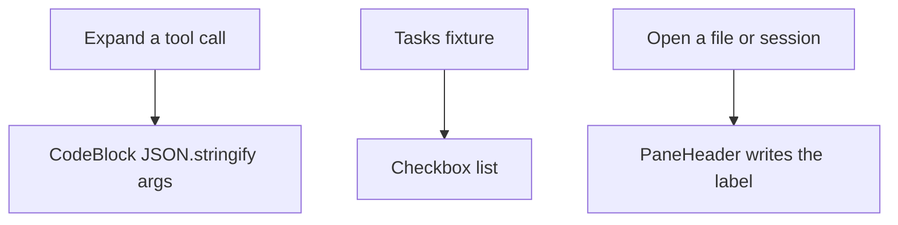
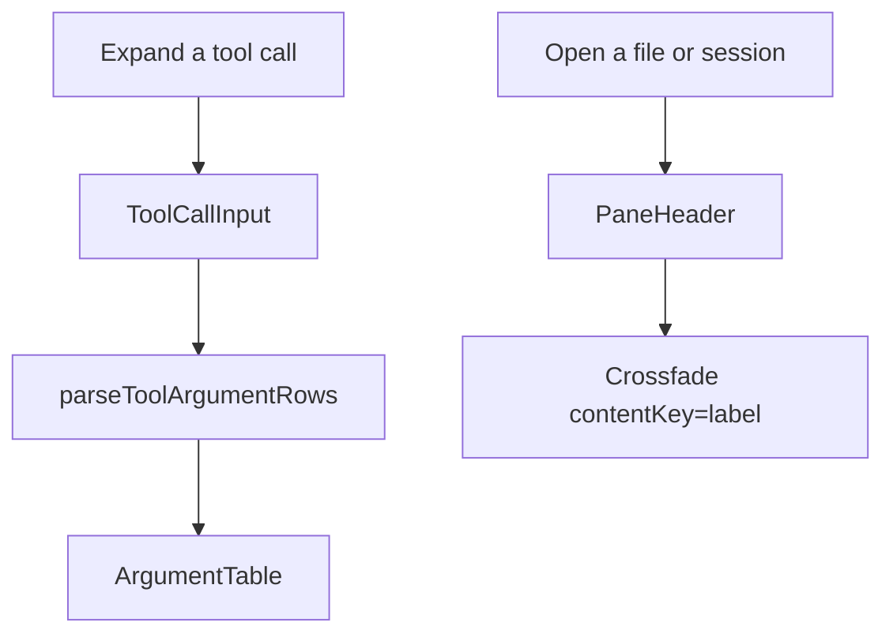
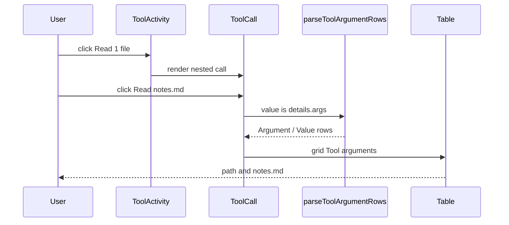
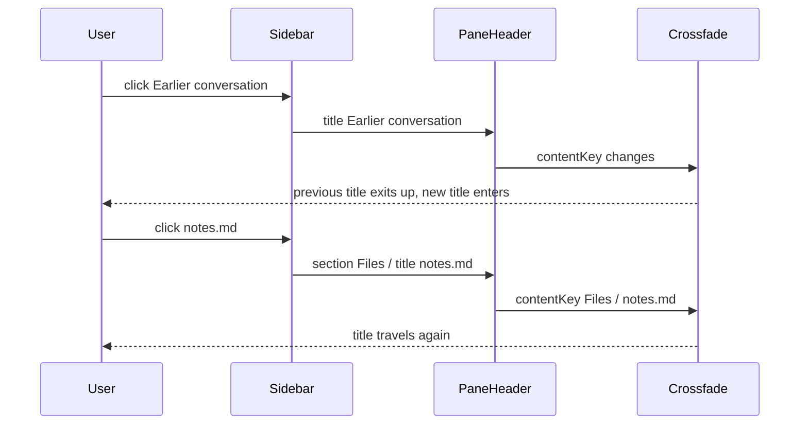
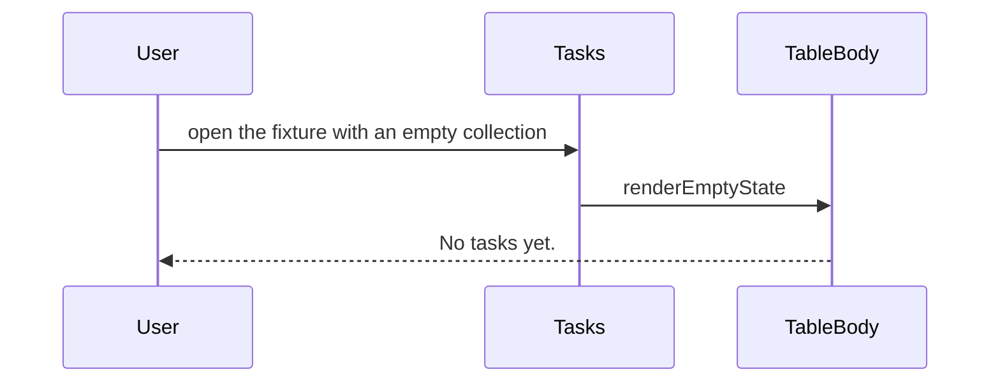

# Maui 0.0.19 in Halo

Compared **main (`a86ad6b`) → `cursor/maui-latest-table-11c4` (`0929384`)**. The change is committed on that branch. These are condensed, source-checked call flows, not recorded runtime traces. `-` marks removed steps; `+` marks added steps; unmarked lines provide unchanged context.

`calldiff` was not installed in this workspace. Stacks were checked against `git diff origin/main` and the files on the branch.

## Problem

Halo pinned Maui **0.0.16**. Tool-call arguments rendered as JSON in `CodeBlock`. The tasks extension fixture listed checkboxes with no table and no empty state. Pane titles swapped in place. App icons came from the `Icons` namespace, which pulls the full set.



## Solution

The branch pinned published Maui **0.0.19** and adopted the components that pin adds. Object tool arguments now go through Maui `Table`. Nested `exec` JS still uses `CodeBlock`. Pane titles crossfade when the label changes; the route `Switch` in `MainPane` is unchanged, because wrapping that switch remounted the composer. Named icons import from `maui/icons`. The tasks fixture is a Table with `renderEmptyState`.



External docs used: the Maui 0.0.19 skill shipped as `maui/skills/maui` and the [0.0.19 package](https://www.npmjs.com/package/@tanishqkancharla/maui/v/0.0.19). Maui Crossfade requires `contentKey` and must not receive a React `key` on the wrapper, or the exit animation is skipped. Walkthrough markup follows the [TK Stack README](https://github.com/tanishqkancharla/tkstack#link-call-stacks-to-source-changes).

## User flows

### Expand a saved file tool



### Switch session then file



### Open the tasks extension with no rows



## Goals

- Halo desktop, workspace-server, and new extensions resolve Maui 0.0.19.
- Expanding a direct file tool shows an Argument / Value table, not pretty-printed JSON.
- Nested exec tools still show the JavaScript source in `CodeBlock`.
- Pane titles crossfade when the label changes.
- The tasks fixture is a table with a written empty state.
- Icons used in the sidebar and composer tree-shake from `maui/icons`.

Out of scope:

- Control-plane auth.
- Wrapping `MainPane` route changes in Crossfade.
- Table `selectionMode` checkboxes (the 0.0.19 API exists; Halo does not select tool-argument rows).

## Object tool arguments render as a Table

```callstack
 ToolActivity [[apps/electron/src/renderer/main/agent/ToolActivity.tsx#ToolActivity]]
 └── AnimatedToolCalls [[apps/electron/src/renderer/main/agent/ToolActivity.tsx#AnimatedToolCalls]]
     └── ToolCall [[apps/electron/src/renderer/main/agent/ToolCall.tsx#ToolCall]] [[toolcall:new:66]]
-        └── CodeBlock  # JSON.stringify(details.args) or exec JS [[toolcall:old:59-69]]
+        └── ToolCallInput [[apps/electron/src/renderer/main/agent/ToolCall.tsx#ToolCallInput]] [[toolcall:new:76-87]]
+            ├── execJsSource  # CodeBlock javascript when toolPath is exec
+            ├── parseToolArgumentRows [[apps/electron/src/renderer/main/agent/toolArgumentRows.ts#parseToolArgumentRows]] [[parser:new:6-13]]
+            └── ArgumentTable [[apps/electron/src/renderer/main/agent/ToolCall.tsx#ArgumentTable]] [[toolcall:new:90-110]]
+                └── Table  # aria-label Tool arguments; Argument is isRowHeader
```

Expanding a tool still lives in `ToolCall`. The body used to stringify every argument bag. `ToolCallInput` now branches: exec JS stays a code block so nested executor scripts stay copyable; a TypeBox record becomes table rows; anything else still stringifies as JSON.

`parseToolArgumentRows` lives in a `.ts` module because `Value.Check` in the `.tsx` file hit `react(capitalized-calls)`, and a `typeof`/`unknown` guard hit anti-slop. String values stay as written. Other JSON values encode with `JSON.stringify`. If that encode is not a string, the cell is the text `null` (JSON `null` is the only value `JSON.stringify` returns as the null token).

The table marks Argument with `isRowHeader`. Playwright asserts `grid` “Tool arguments” and each argument name as `rowheader`. Nested exec scenarios still assert the javascript `code` role.

## Pane titles crossfade; the route Switch does not

```callstack
 AgentPane / FilePane / ExtensionPane
 └── PaneHeader [[apps/electron/src/renderer/main/PaneHeader.tsx#PaneHeader]]
-    └── title div  # label replaced in place
+    └── Crossfade [[pane:new:26-33]]
+        └── title div  # contentKey is the label; no key on Crossfade
```

`paneLabel` still joins `section` and `title` (`Files / notes.md`). Crossfade uses `direction="up"` and `contentKey={label}`. Maui’s wrapper holds `AnimatePresence mode="wait"` internally; putting `key` on `Crossfade` remounts that wrapper and skips the exit.

An earlier revision wrapped `MainPane`’s wouter `Switch`. That remounted the composer on every navigation, dropped drafts, and hid sidebar file-name inputs. The Switch is back to the previous path. Only the header label animates.

## Tasks fixture uses Table and an empty state

```callstack
 Tasks [[packages/extension-tools/test/fixtures/tasks/view.tsx#Tasks]]
-└── Checkbox  # one per stored task
+└── Table  # aria-label Tasks [[tasks:new:81-107]]
+    └── TableBody
+        ├── renderEmptyState  # No tasks yet.
+        └── TableRow
+            ├── Checkbox  # still named with the task label
+            └── Status cell  # Done or Open
```

The checkbox control stays so existing tests can find `getByRole("checkbox", { name })`. Empty collections no longer render a blank list; Maui’s body calls `renderEmptyState`.

## Named icons replace the Icons namespace

```callstack
 NewSessionButton [[apps/electron/src/renderer/sidebar/Sidebar.tsx#NewSessionButton]]
-└── Icons.Plus
+└── Plus  # maui/icons [[sidebar:new:54-58]]

 Composer [[apps/electron/src/renderer/main/agent/AgentPane.tsx#Composer]]
-├── Icons.Stop
-└── Icons.ArrowUp
+├── Stop [[composer:new:166-170]]
+└── ArrowUp
```

Maui 0.0.19’s skill says to import named icon modules so unused SVGs tree-shake. The `Icons` namespace is gone from these two call sites. `FilesystemSection` already imported named icons.

## Pins and skill

Desktop, workspace-server, and `scaffoldExtension` depend on `maui: npm:@tanishqkancharla/maui@0.0.19`. `pnpm-workspace.yaml` `minimumReleaseAgeExclude` matches that version so the install is allowed. `.agents/skills/maui/SKILL.md` is the 0.0.19 copy: Table `selectionMode="multiple"` checkbox column, and Crossfade. `tkstack` still depends on Maui 0.0.16; this branch does not bump that package.

## Verification

- `pnpm run check-affected`: 39 tasks successful, 0 failed (typecheck, lint, format, tests for affected packages, including `@halo/desktop` e2e).
- E2E `expands saved direct file tool details after reload` now asserts `grid` “Tool arguments” and `rowheader` cells; nested exec still asserts javascript `code`.
- Manual Halo window: expand `Read 1 file` → `Read notes.md` shows Argument / Value with `path` / `notes.md` and result “The project mascot is a blue bicycle.” Switching to “Earlier conversation” then `notes.md` changes the pane title (`Expandable tools` → `Earlier conversation` → `Files / notes.md`).
- `calldiff` CLI was not present; stacks were checked from the git patches and current sources.

```source-diff:toolcall:apps/electron/src/renderer/main/agent/ToolCall.tsx
diff --git a/apps/electron/src/renderer/main/agent/ToolCall.tsx b/apps/electron/src/renderer/main/agent/ToolCall.tsx
index 3996cfa..c626e60 100644
--- a/apps/electron/src/renderer/main/agent/ToolCall.tsx
+++ b/apps/electron/src/renderer/main/agent/ToolCall.tsx
@@ -1,6 +1,12 @@
 import { useId, useState } from "react";
 import {
   CodeBlock,
+  Table,
+  TableBody,
+  TableCell,
+  TableHead,
+  TableHeader,
+  TableRow,
   colors,
   flex,
   monospace,
@@ -10,6 +16,7 @@ import {
 } from "maui";
 import { style, useStyles } from "purse-styles";
 import { execJsSource, toolPartLabel, type ToolPart } from "./sessionView.ts";
+import { parseToolArgumentRows } from "./toolArgumentRows.ts";
 import { useWorkspaceQuery } from "../../api/ApiProvider.tsx";
 
 export function ToolCall({ part }: { part: ToolPart }) {
@@ -26,9 +33,6 @@ export function ToolCall({ part }: { part: ToolPart }) {
   const shellClassName = useStyles(styles.shell);
   const bodyClassName = useStyles(styles.body);
   const { details } = part;
-  const js = details.toolPath === "exec" ? execJsSource(details) : undefined;
-  const input =
-    js === undefined ? JSON.stringify(details.args, undefined, 2) : js;
 
   const summary =
     label.kind === "shell" ? (
@@ -59,11 +63,7 @@ export function ToolCall({ part }: { part: ToolPart }) {
           role="region"
           aria-label={part.tool.path}
         >
-          {input !== undefined ? (
-            <CodeBlock lang={js === undefined ? "json" : "javascript"}>
-              {input}
-            </CodeBlock>
-          ) : undefined}
+          <ToolCallInput details={details} />
           {details.resultText !== undefined ? (
             <CodeBlock lang="text">{details.resultText}</CodeBlock>
           ) : undefined}
@@ -73,6 +73,43 @@ export function ToolCall({ part }: { part: ToolPart }) {
   );
 }
 
+function ToolCallInput({ details }: { details: ToolPart["details"] }) {
+  const js = details.toolPath === "exec" ? execJsSource(details) : undefined;
+  if (js !== undefined) return <CodeBlock lang="javascript">{js}</CodeBlock>;
+  const rows = parseToolArgumentRows({ value: details.args });
+  if (rows === undefined) {
+    return (
+      <CodeBlock lang="json">
+        {JSON.stringify(details.args, undefined, 2)}
+      </CodeBlock>
+    );
+  }
+  return <ArgumentTable rows={rows} />;
+}
+
+function ArgumentTable({
+  rows,
+}: {
+  rows: ReadonlyArray<{ name: string; value: string }>;
+}) {
+  return (
+    <Table aria-label="Tool arguments">
+      <TableHeader>
+        <TableHead isRowHeader>Argument</TableHead>
+        <TableHead>Value</TableHead>
+      </TableHeader>
+      <TableBody>
+        {rows.map((row) => (
+          <TableRow key={row.name} id={row.name}>
+            <TableCell>{row.name}</TableCell>
+            <TableCell>{row.value}</TableCell>
+          </TableRow>
+        ))}
+      </TableBody>
+    </Table>
+  );
+}
+
 const labelStyle = style(prose("sm").paragraph, {
   color: colors.gray[11],
   minWidth: 0,
```

```source-diff:parser:apps/electron/src/renderer/main/agent/toolArgumentRows.ts
diff --git a/apps/electron/src/renderer/main/agent/toolArgumentRows.ts b/apps/electron/src/renderer/main/agent/toolArgumentRows.ts
new file mode 100644
index 0000000..26751d0
--- /dev/null
+++ b/apps/electron/src/renderer/main/agent/toolArgumentRows.ts
@@ -0,0 +1,14 @@
+import { Type } from "@sinclair/typebox";
+import { Value } from "@sinclair/typebox/value";
+
+const argumentRecordSchema = Type.Record(Type.String(), Type.Unknown());
+
+export function parseToolArgumentRows(args: { value: unknown }) {
+  if (!Value.Check(argumentRecordSchema, args.value)) return undefined;
+  return Object.entries(args.value).map(([name, value]) => {
+    if (Value.Check(Type.String(), value)) return { name, value };
+    const encoded = JSON.stringify(value);
+    if (Value.Check(Type.String(), encoded)) return { name, value: encoded };
+    return { name, value: "null" };
+  });
+}
```

```source-diff:pane:apps/electron/src/renderer/main/PaneHeader.tsx
diff --git a/apps/electron/src/renderer/main/PaneHeader.tsx b/apps/electron/src/renderer/main/PaneHeader.tsx
index 1d70470..ed96026 100644
--- a/apps/electron/src/renderer/main/PaneHeader.tsx
+++ b/apps/electron/src/renderer/main/PaneHeader.tsx
@@ -1,5 +1,5 @@
 import type { ReactNode } from "react";
-import { border, flex, flexItem, spacing, text } from "maui";
+import { Crossfade, border, flex, flexItem, spacing, text } from "maui";
 import { style, useStyles } from "purse-styles";
 
 export function PaneHeader({
@@ -12,6 +12,7 @@ export function PaneHeader({
   actions?: ReactNode;
 }) {
   const header = useStyles(headerClass);
+  const titleWrapClassName = useStyles(titleWrapClass);
   const actionsClassName = useStyles(actionsClass);
   const titleClassName = useStyles(titleClass);
   const label = paneLabel(section, title);
@@ -22,7 +23,15 @@ export function PaneHeader({
 
   return (
     <header className={header} aria-label={label}>
-      <div className={titleClassName}>{label}</div>
+      {label === undefined ? undefined : (
+        <Crossfade
+          direction="up"
+          contentKey={label}
+          className={titleWrapClassName}
+        >
+          <div className={titleClassName}>{label}</div>
+        </Crossfade>
+      )}
       {actions === undefined ? undefined : (
         <div className={actionsClassName}>{actions}</div>
       )}
@@ -50,6 +59,11 @@ const headerClass = style(
   },
 );
 
+const titleWrapClass = style({
+  minWidth: 0,
+  flex: "1 1 auto",
+});
+
 const titleClass = style(
   text({ size: "sm", fontWeight: 400, color: "lowContrast" }),
   {
```

```source-diff:sidebar:apps/electron/src/renderer/sidebar/Sidebar.tsx
diff --git a/apps/electron/src/renderer/sidebar/Sidebar.tsx b/apps/electron/src/renderer/sidebar/Sidebar.tsx
index c8faf4d..f0aa451 100644
--- a/apps/electron/src/renderer/sidebar/Sidebar.tsx
+++ b/apps/electron/src/renderer/sidebar/Sidebar.tsx
@@ -1,13 +1,5 @@
-import {
-  Button,
-  Icons,
-  colors,
-  flex,
-  flexItem,
-  shadow,
-  spacing,
-  text,
-} from "maui";
+import { Button, colors, flex, flexItem, shadow, spacing, text } from "maui";
+import { Plus } from "maui/icons";
 import { style, useStyles } from "purse-styles";
 import { useLocation } from "wouter";
 import type { SessionSummary } from "@get-halo/shared/rpc";
@@ -62,7 +54,7 @@ function NewSessionButton({ className }: { className: string }) {
       className={className}
       onClick={() => navigate(`/draft/${crypto.randomUUID()}`)}
     >
-      <Icons.Plus size="sm" aria-hidden="true" />
+      <Plus size="sm" aria-hidden="true" />
       New session
     </Button>
   );
```

```source-diff:composer:apps/electron/src/renderer/main/agent/AgentPane.tsx
diff --git a/apps/electron/src/renderer/main/agent/AgentPane.tsx b/apps/electron/src/renderer/main/agent/AgentPane.tsx
index 4fb79b3..116e716 100644
--- a/apps/electron/src/renderer/main/agent/AgentPane.tsx
+++ b/apps/electron/src/renderer/main/agent/AgentPane.tsx
@@ -4,7 +4,6 @@ import { skipToken, useQuery } from "@tanstack/react-query";
 import { useLocation } from "wouter";
 import {
   Button,
-  Icons,
   backgroundColor,
   colors,
   flex,
@@ -14,6 +13,7 @@ import {
   spacing,
   text,
 } from "maui";
+import { ArrowUp, Stop } from "maui/icons";
 import { style, useStyles } from "purse-styles";
 import {
   sessionTitleQueryKey,
@@ -164,9 +164,9 @@ function Composer({
           onClick={showStop ? onStop : submit}
         >
           {showStop ? (
-            <Icons.Stop size="sm" />
+            <Stop size="sm" />
           ) : (
-            <Icons.ArrowUp size="sm" aria-hidden="true" />
+            <ArrowUp size="sm" aria-hidden="true" />
           )}
         </Button>
       }
```

```source-diff:tasks:packages/extension-tools/test/fixtures/tasks/view.tsx
diff --git a/packages/extension-tools/test/fixtures/tasks/view.tsx b/packages/extension-tools/test/fixtures/tasks/view.tsx
index 81103d6..4003165 100644
--- a/packages/extension-tools/test/fixtures/tasks/view.tsx
+++ b/packages/extension-tools/test/fixtures/tasks/view.tsx
@@ -6,6 +6,12 @@ import {
   H1,
   MauiProvider,
   Padding,
+  Table,
+  TableBody,
+  TableCell,
+  TableHead,
+  TableHeader,
+  TableRow,
   Text,
   TextField,
 } from "maui";
@@ -72,16 +78,32 @@ export default function Tasks({
               Add task
             </Button>
           </Flex>
-          {tasks.map((task) => (
-            <Checkbox
-              key={task.id}
-              label={task.label}
-              checked={task.done}
-              setChecked={async (done) => {
-                await save({ ...task, done });
-              }}
-            />
-          ))}
+          <Table aria-label="Tasks">
+            <TableHeader>
+              <TableHead isRowHeader>Task</TableHead>
+              <TableHead>Status</TableHead>
+            </TableHeader>
+            <TableBody
+              renderEmptyState={() => (
+                <Text color="lowContrast">No tasks yet.</Text>
+              )}
+            >
+              {tasks.map((task) => (
+                <TableRow key={task.id} id={task.id}>
+                  <TableCell>
+                    <Checkbox
+                      label={task.label}
+                      checked={task.done}
+                      setChecked={async (done) => {
+                        await save({ ...task, done });
+                      }}
+                    />
+                  </TableCell>
+                  <TableCell>{task.done ? "Done" : "Open"}</TableCell>
+                </TableRow>
+              ))}
+            </TableBody>
+          </Table>
           {error === undefined ? undefined : <Text role="alert">{error}</Text>}
         </Flex>
       </Padding>
```

```source-diff:e2e:apps/electron/e2e/sessionView.e2e.test.ts
diff --git a/apps/electron/e2e/sessionView.e2e.test.ts b/apps/electron/e2e/sessionView.e2e.test.ts
index 446a700..2973c84 100644
--- a/apps/electron/e2e/sessionView.e2e.test.ts
+++ b/apps/electron/e2e/sessionView.e2e.test.ts
@@ -640,9 +640,19 @@ for (const scenario of expansionScenarios) {
         name: scenario.path,
         exact: true,
       });
-      await expect(details.getByRole("code").first()).toHaveText(
-        scenario.nested ? js : JSON.stringify(scenario.args, undefined, 2),
-      );
+      if (scenario.nested) {
+        await expect(details.getByRole("code").first()).toHaveText(js);
+      } else {
+        await expect(
+          details.getByRole("grid", { name: "Tool arguments" }),
+        ).toBeVisible();
+        for (const [name, value] of Object.entries(scenario.args)) {
+          await expect(
+            details.getByRole("rowheader", { name, exact: true }),
+          ).toBeVisible();
+          await expect(details.getByText(value, { exact: true })).toBeVisible();
+        }
+      }
       await expect(
         details.getByText(scenario.result, { exact: true }),
       ).toBeVisible();
```
