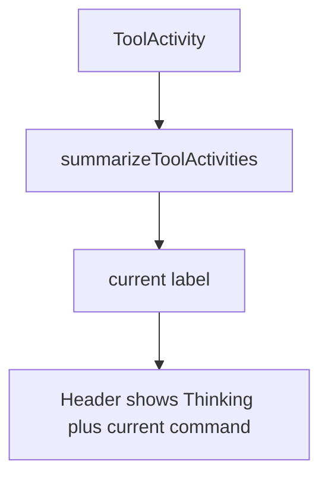
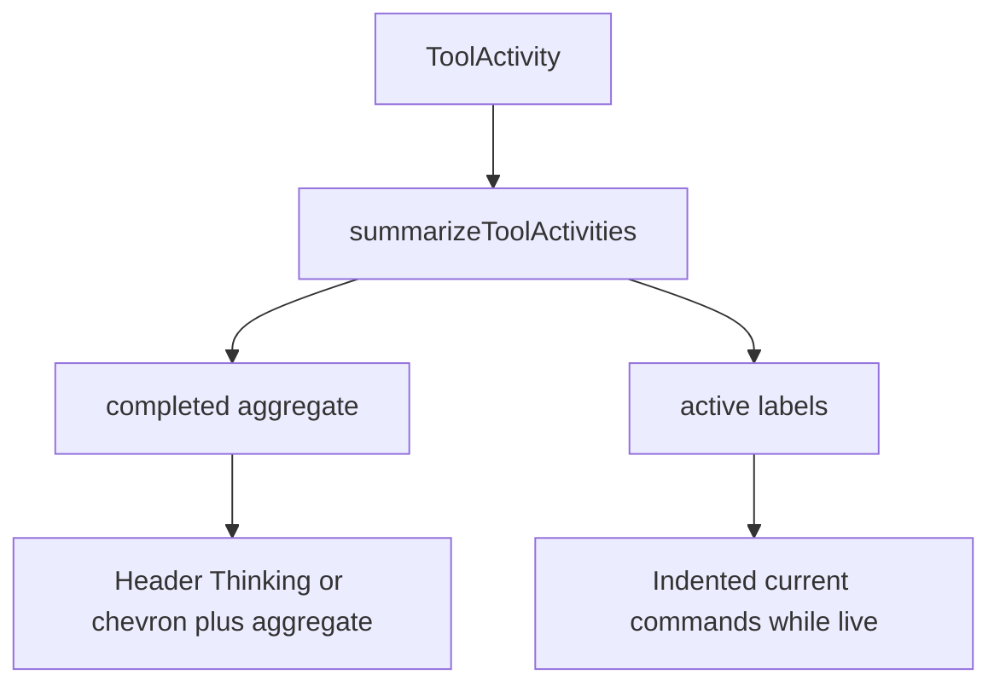
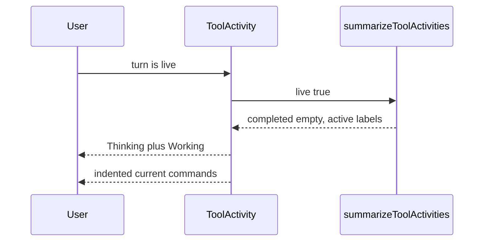
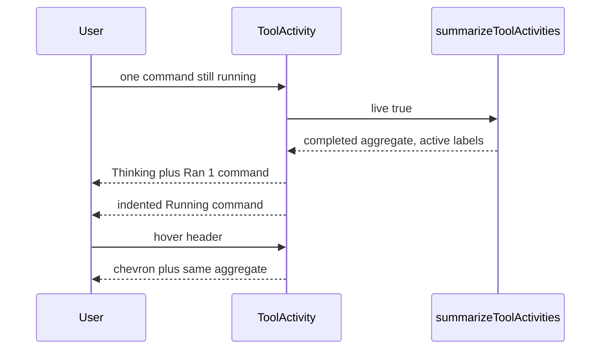
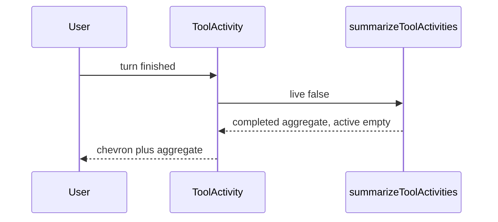

# Live tool activity shows the aggregate plus current commands

Compared **main → cursor/streaming-loading-state-6087** (`4144c35`). The change is committed. These are condensed, source-checked call flows, not recorded runtime traces. `-` marks removed steps; `+` marks added steps; unmarked lines provide unchanged context.

## Problem

While a turn was live, the tool-activity header replaced the completed command aggregate with the latest current command. Hover swapped the Thinking mark for a chevron but still showed that current command. After the turn settled, the header showed the aggregate. Users could not see finished work and current work at the same time.



## Solution

The header now always shows the completed aggregate, or Working when nothing has finished. Current command labels render on an indented row only while those commands are still active. Hover still swaps Thinking for the expand chevron. After the turn settles, the indented row is gone.



## User flows

### Live tools with nothing finished



### Live tools after some work finished



### Settled turn



## Goals

- While tools run, the header shows the completed aggregate (or Working) with Thinking, and current commands sit on an indented row.
- Hover while live shows the expand chevron instead of Thinking, with the same aggregate and indented current commands.
- After the turn settles, only the chevron and aggregate remain.

Out of scope:

- Maui version bump.
- Control-plane sign-in.

## The header keeps the completed aggregate while work is live

```callstack
 AgentPane.SessionViewRow
 └── ToolActivity
     ├── summarizeToolActivities  [[apps/electron/src/renderer/main/agent/sessionView.ts#summarizeToolActivities]] [[id:summarize:old:432-453]] [[id:summarize:new:435-449]]
     │   ├── completedSummary  # unchanged presenter sentences
     │   - └── latest activeLabel as current  # also reused the last settled tool while the turn stayed live
     │   + └── unique activeLabel for each running tool
     ├── joinSummary  # still builds the header sentence from completed chunks
     - └── primaryLabel is current or Working
     + └── headerLabel is the aggregate, or Working when none exists [[id:header:new:46-49]]
     └── summary button  # Thinking while live, chevron on hover or when inactive
```

`summarizeToolActivities` no longer promotes a settled tool into a present-tense current label. The header stays on the completed sentence for as long as the turn is live.

## Current commands render on an indented row

```callstack
 ToolActivity
 ├── summary button  # aggregate only
 +└── Active commands  # omitted when active is empty [[id:active-rows:new:90-98]]
     └── active label  # one row per unique running presenter sentence
 └── AnimatedToolCalls  # still the expanded tool-call details
```

The indented row uses the same inset as expanded tool calls. It is a labeled group, not a button, so expand still happens from the header.

## Verification

`pnpm run check-affected` completed with 26 tasks successful, including `@halo/desktop` lint, typecheck, format, and 39 Electron e2e tests. The session-view cases now assert the live header aggregate, the indented current-command row, hover still expanding from that header, and the missing current-command row after restore or settlement.

A headed demo of parallel bash work recorded the live Working plus indented Running command row, the hover chevron, the Ran 1 command header while the second command stayed active, and the settled Ran 2 commands header with no current-command row.

```source-diff:header:apps/electron/src/renderer/main/agent/ToolActivity.tsx
diff --git a/apps/electron/src/renderer/main/agent/ToolActivity.tsx b/apps/electron/src/renderer/main/agent/ToolActivity.tsx
index a357ff3..5ff1854 100644
--- a/apps/electron/src/renderer/main/agent/ToolActivity.tsx
+++ b/apps/electron/src/renderer/main/agent/ToolActivity.tsx
@@ -39,14 +39,14 @@ export function ToolActivity({ part }: { part: ToolActivityPart }) {
   const summaryClassName = useStyles(styles.summary);
   const thinkingClassName = useStyles(styles.thinking);
   const markClassName = useStyles(styles.mark);
+  const activeCommandsClassName = useStyles(styles.activeCommands);
+  const activeCommandClassName = useStyles(styles.activeCommand);
   const interactive = calls.length > 0;
   const visibleCalls = expanded ? calls : [];
   const completedLabel = joinSummary(summary.completed);
-  const primaryLabel = part.live
-    ? (summary.current ?? "Working")
-    : completedLabel;
-
-  if (primaryLabel === undefined) return undefined;
+  if (completedLabel === undefined && !part.live) return undefined;
+  const headerLabel = completedLabel === undefined ? "Working" : completedLabel;
+  const activeLabels = summary.active;
```

```source-diff:active-rows:apps/electron/src/renderer/main/agent/ToolActivity.tsx
diff --git a/apps/electron/src/renderer/main/agent/ToolActivity.tsx b/apps/electron/src/renderer/main/agent/ToolActivity.tsx
index a357ff3..5ff1854 100644
--- a/apps/electron/src/renderer/main/agent/ToolActivity.tsx
+++ b/apps/electron/src/renderer/main/agent/ToolActivity.tsx
@@ -84,7 +84,16 @@ export function ToolActivity({ part }: { part: ToolActivityPart }) {
               />
             </span>
           ) : undefined}
-          {primaryLabel}
+          {headerLabel}
+        </div>
+      )}
+      {activeLabels.length === 0 ? undefined : (
+        <div className={activeCommandsClassName} aria-label="Active commands">
+          {activeLabels.map((label) => (
+            <div key={label} className={activeCommandClassName}>
+              {label}
+            </div>
+          ))}
         </div>
       )}
       <AnimatedToolCalls calls={visibleCalls} />
```

```source-diff:summarize:apps/electron/src/renderer/main/agent/sessionView.ts
diff --git a/apps/electron/src/renderer/main/agent/sessionView.ts b/apps/electron/src/renderer/main/agent/sessionView.ts
index 196b407..71366b1 100644
--- a/apps/electron/src/renderer/main/agent/sessionView.ts
+++ b/apps/electron/src/renderer/main/agent/sessionView.ts
@@ -50,7 +50,7 @@ export type SessionViewPart =
 
 type ToolActivitySummary = {
   completed: string[];
-  current: string | undefined;
+  active: string[];
 };
 
 type ReducedToolInvocation = Pick<
@@ -432,23 +432,20 @@ export function summarizeToolActivities(args: {
     const summary = presenter.completedSummary(summarizedCalls);
     return summary === undefined ? [] : [summary];
   });
-  let latestActive: ToolPart | undefined;
-  for (let index = summarizedCalls.length - 1; index >= 0; index -= 1) {
-    const call = summarizedCalls[index];
-    if (call?.status !== "active") continue;
-    latestActive = call;
-    break;
+  const active: string[] = [];
+  if (live) {
+    const seen = new Set<string>();
+    for (const call of summarizedCalls) {
+      if (call.status !== "active") continue;
+      const presenter = presenters.find((candidate) => candidate.matches(call));
+      if (presenter === undefined) continue;
+      const label = presenter.activeLabel(call);
+      if (seen.has(label)) continue;
+      seen.add(label);
+      active.push(label);
+    }
   }
-  const latestActivity = latestActive ?? summarizedCalls.at(-1);
-  const presenter =
-    latestActivity === undefined
-      ? undefined
-      : presenters.find((candidate) => candidate.matches(latestActivity));
-  const current =
-    live && latestActivity !== undefined && presenter !== undefined
-      ? presenter.activeLabel(latestActivity)
-      : undefined;
-  return { completed, current };
+  return { completed, active };
 }
```
